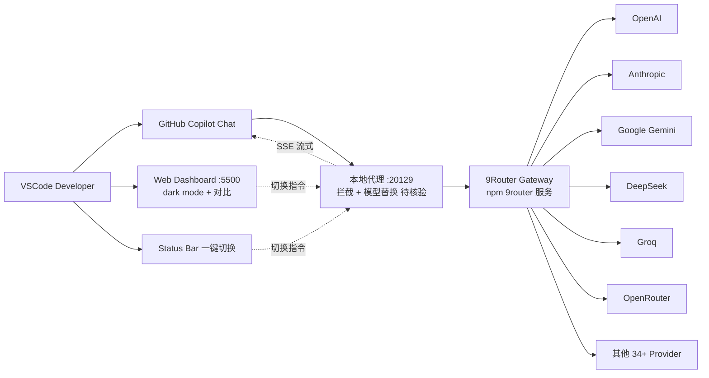

# yudaprasetya007/routeVSCODE

## 一句话定位
9Router Model Connector——VSCode Copilot Chat 零重启（Zero-Reload）动态切换 AI 模型的本地代理 + Web Dashboard + Status Bar 集成；通过 9Router Gateway 支持 40+ AI Provider。

## 它解决的问题
GitHub Copilot Chat 在 VSCode 中切换 AI 模型需要：(1) 修改配置文件 JSON；(2) 重启 VSCode 窗口；(3) 重新打开 Chat 会话——这是非常笨重的体验，开发者常常因为"切换成本太高"而停留在默认模型上。routeVSCODE 直击这个痛点：通过本地代理 Port 20129 拦截 Copilot Chat 请求，把模型名替换为用户当前选择的模型，实现"一键切换，零重启"。

## 为什么值得关注（2026-09-11）
- **Stars:** 326（截至 2026-09-11），1 天即达 326⭐，处于"首发即高增长"阶段
- **Forks:** 0 / 1 天 = 0 forks/日，**0% fork/star 极低**，说明分发主路径是 VSCode Marketplace 而非 GitHub fork
- **License:** MIT
- **语言:** JavaScript
- **活跃度:** created 2026-09-10，pushed_at 2026-09-10，1 天内完成发布
- **规模:** 748KB——扩展本体 + Dashboard 前端

## 热度来源判断
routeVSCODE 的热度是 **"Copilot Chat 用户高频痛点 × 零重启技术演示 × 9Router 配套 Gateway"** 的组合。Copilot 用户量大但切换模型成本高，routeVSCODE 直接展示"一键切换 + Dashboard 对比"的演示视频/截图，对那些想用不同模型对比效果的开发者吸引力强。0 forks 但 326⭐ 反映其分发主路径是 VSCode Marketplace 商店而非 GitHub fork——这是 VSCode 扩展的典型分发模式。README 全印尼语（Bahasa）说明作者在印尼开发者社区有强传播渠道。热度**真实但有分发路径偏置**——本简报记录的 GitHub 元数据无法反映 Marketplace 下载量。

## 关键技术亮点
1. **Zero-Reload 模型切换**——Local Proxy Port 20129 + SSE 流式注入 + 头部认证自动管理；用户无需重启 VSCode
2. **40+ Provider 通用接入**——OpenAI / Anthropic / Gemini / DeepSeek / Groq / OpenRouter 等
3. **Live Model Comparison & Benchmark**——Dashboard 内对 prompt 响应做侧边对比，测 latency
4. **Status Bar 集成**——右下角一键切换模型
5. **Web Dashboard :5500**——dark mode + neon accents + provider 过滤
6. **配套 9Router Gateway**——npm 包 `9router`（同一作者），本扩展是客户端 + Gateway 是服务端

## 架构师速览

| 决策问题 | 研究判断 | 证据边界 |
|---|---|---|
| 系统边界 | VSCode 扩展 + 本地代理（Port 20129）+ Web Dashboard（:5500）+ 配套 9Router Gateway；客户端拦截 Copilot Chat 请求并替换模型 | 仅基于 README 明示的端口、Provider 数量、Dashboard 功能；本地代理实现细节（HTTP/HTTPS 中间人、SSE 处理）未在档案中给出 |
| 主路径 | Copilot Chat 发起请求 → 本地代理拦截 → 9Router Gateway 转发到目标 Provider → 流式响应回注 → Status Bar / Dashboard 反馈 | 主路径为 README 序列图语义抽象；具体代理协议（CONNECT / MITM）、TLS 终止方式待核验 |
| 关键权衡 | 零重启 UX vs TLS 中间人复杂度 vs 9Router Gateway 上游依赖 vs Provider API 兼容性维护 | 档案明示零重启是核心卖点；TLS 中间人实现风险、9Router 是否开源 / 是否闭源服务待核验 |
| 最小 PoC | 安装扩展 + 9Router Gateway，在 Copilot Chat 中发起一次请求，从 Status Bar 切换模型，验证响应内容来自新 Provider | PoC 范围由 README "1-click switch" 语义推导；具体切换延迟（毫秒级）、TLS 证书信任链需自行验证 |
| 风险 | 9Router 上游服务可用性、TLS 中间人安全风险、Provider API 变更需要扩展同步更新 | 档案明示三项风险 |

## 架构启发
routeVSCODE 的核心启发是 **"本地代理 + UX 优化可以绕过 IDE 自身的硬限制"**。VSCode Copilot Chat 的"切换模型需要重启"看似是 IDE 设计选择，实际上是产品层的硬限制——本地代理层可以在不动 IDE 的情况下打破这个限制。**更深层的启发是：AI 模型路由正在变成"基础设施层"——无论是 LiteLLM（服务端）、OpenRouter（云端）、还是 routeVSCODE（客户端），都在解决同一个问题："让用户在不同模型之间自由切换"。** 客户端（routeVSCODE）+ 服务端（LiteLLM）+ 云端聚合（OpenRouter）构成模型路由的三层栈。

## 架构图（MMD）

> 证据边界：此图只采用本档案已有可核验描述；"待核验"节点不应视为项目实现事实。

## 定位判断
**工具型项目（VSCode Copilot Chat 模型路由器）。** routeVSCODE 是"AI 模型路由"赛道的客户端代表——它不替代 Copilot Chat 本身，而是在其上叠加"零重启切换"能力。它的价值与 Copilot Chat 用户数 × 多模型需求正相关。**值得持续跟踪**工具型定位。

## 风险 / 局限 / 泡沫点
- **9Router 上游依赖**——如果 9Router 是闭源服务且服务端故障，本扩展失效；如果它本身开源，扩展价值会更高（README 未明示 9Router 仓库地址）
- **TLS 中间人安全风险**——本地代理需要拦截 HTTPS 流量，证书信任链管理是难点
- **Provider API 变更需要扩展同步更新**——40+ Provider 任一 API 变化都可能让本扩展失效
- **README 全印尼语**——对中文 / 英文用户的入门门槛略高
- **0 fork 反映非典型分发**——无法通过 fork 数量判断真实采用度
- **VSCode Marketplace 政策风险**——如果 Microsoft 限制类似本地代理扩展，本扩展可能被下架

## 与同类项目的关系
- **vs LiteLLM：** 服务端 Python 库，统一多 Provider API；routeVSCODE 是客户端 VSCode 扩展
- **vs OpenRouter：** 云端聚合服务，按 token 计费；routeVSCODE 是本地代理 + 走 9Router Gateway
- **vs Continue.dev：** VSCode AI 编程扩展，自带多模型切换；routeVSCODE 是 Copilot Chat 的"外挂"
- **vs Cursor 模型切换：** Cursor 内置多模型；routeVSCODE 是给 Copilot Chat 用户的非 Cursor 替代
- **vs 多模型 CLI（llm、mods）：** 终端多模型工具；routeVSCODE 是 IDE 侧的多模型工具

## 是否值得持续跟踪
**值得跟踪（VSCode Copilot Chat 模型路由）。** routeVSCODE 解决了 Copilot Chat 用户的明确痛点，且 9Router Gateway 配套生态完整。建议关注：(1) 9Router 是否开源、是否长期维护；(2) 是否被 VSCode Marketplace 下架；(3) 是否扩展到 Cursor / Windsurf 等其他 IDE。对 VSCode Copilot 重度用户，本扩展直接提升日常体验；对 AI 基础设施观察者，它是"客户端模型路由"的代表样本。

## 后续观察点
- 9Router Gateway 是否开源、长期维护状态
- VSCode Marketplace 下载量（间接反映真实采用度）
- 是否扩展到 Cursor / Windsurf / JetBrains 等其他 IDE
- Provider API 变更的同步维护频率
- TLS 中间人实现是否被社区审计
- 是否出现竞品（如 Microsoft 官方推出类似功能）

---
*首次记录：2026-09-11*
> 数据来源: GitHub API (2026-09-11) | Stars: 326 | Forks: 0 | License: MIT | 语言: JavaScript | 创建: 2026-09-10
