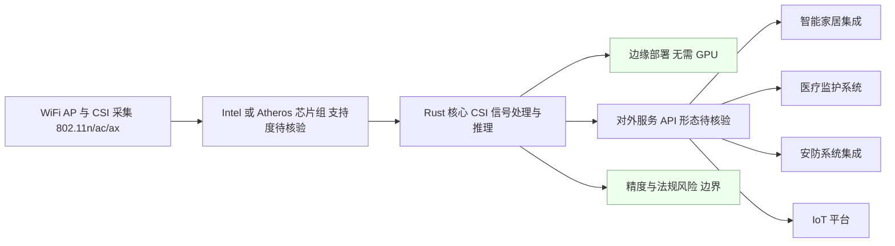

# RuView

## 一句话定位
将普通 WiFi 信号转化为实时空间智能，实现生命体征监测、存在检测和空间感知，零视频零摄像头。

## 它解决的问题
传统空间感知依赖摄像头或专用传感器，存在隐私侵犯、成本高、部署复杂等问题。RuView 利用已有 WiFi 基础设施（路由器/AP），通过 CSI（Channel State Information）信号处理实现非视觉感知，让环境感知像「听」一样自然。

目标用户：智能家居开发者、医疗监护系统、安防系统集成商、IoT 平台工程师。

## 为什么值得关注（2026-05-19）

59.8K⭐，7.8K forks，GitHub Trending 多日霸榜。这是 WiFi CSI 信号处理领域首次出现生产级开源实现。Rust 语言保证了性能和内存安全。非视觉感知 + 隐私优先的叙事击中了当前智能空间的核心矛盾。

## 热度来源判断
热度 70% 真实需求 + 30% 猎奇驱动。「WiFi 能看穿墙壁」的叙事极具传播力，但底层技术（WiFi CSI 信道状态信息处理）是真实的学术前沿成果。关键看实际部署案例能否跟上 Star 增速。

## 关键技术亮点亮点
1. **WiFi CSI 信号处理**：利用 802.11n/ac/ax 的 Channel State Information 进行人体活动检测，不依赖视频
2. **Rust 全栈实现**：信号采集、处理、推理全链路 Rust，保证实时性和安全性
3. **边缘部署友好**：无需 GPU，普通 WiFi 硬件即可运行，适合嵌入式和边缘场景

## 架构师速览

| 决策问题 | 研究判断 | 证据边界 |
|---|---|---|
| 系统边界 | 边界落在「WiFi AP（CSI 采集）→ Rust 信号处理/推理 → 应用服务接口」，消费级路由器/特定芯片组（Intel/Atheros）支持度未在档案中实证 | 仅依档案明示的 CSI、802.11n/ac/ax、Rust 全栈、边缘部署等描述，不含实测兼容清单 |
| 主路径 | WiFi AP 采集 CSI → Rust 端做信号处理与生命体征/存在/活动推理 → 对外暴露服务 API 给智能家居/医疗/安防/IoT 集成方 | 主路径来自「关键技术亮点」与「目标用户」描述，具体协议、API 形态、持久化方式须核源码 |
| 关键权衡 | 隐私与成本优势 vs 精度上限受 WiFi 带宽/环境干扰限制，且硬件兼容性是隐性门槛 | 权衡判断基于档案「风险/局限」与「vs 毫米波雷达/蓝牙/摄像头」对比节，未含量化指标 |
| 最小 PoC | 用一台档案点名支持的 WiFi AP（如 Intel/Atheros）跑生命体征监测 demo，验证 CSI 采集、推理实时性、与至少一个下游应用（智能家居或监护）的 API 对接 | PoC 范围限于档案描述的能力子集；真实部署 SLO、合规、安全验收项未在档案中给出 |

## 架构启发
- **感知范式转变**：从「看见」到「感知」，非视觉传感是未来智能空间的底层范式
- **复用现有基础设施**：不增加新硬件，利用已有 WiFi AP 实现感知，部署成本趋近于零
- **隐私 by design**：零摄像头 = 零隐私争议，天然适合医疗、养老、儿童场景

## 架构图（MMD）

> 证据边界：此图只采用本档案已有可核验描述；“待核验”节点不应视为项目实现事实。

## 定位判断
在 IoT/智能空间生态中定位为「感知基础设施层」，类似于计算机视觉领域的 OpenCV，但面向非视觉信号。如果成功，会成为智能空间应用的标配感知组件。

## 风险 / 局限 / 泡沫点
1. **硬件兼容性**：WiFi CSI 数据采集需要特定芯片组支持（如 Intel/Atheros），消费级路由器兼容性存疑
2. **精度边界**：非视觉感知的精度上限受限于 WiFi 带宽和环境干扰，复杂场景可能不够准确
3. **法规灰色地带**：虽然不采集视频，但通过 WiFi 信号推断人体活动在部分地区可能面临法律审查

## 与同类项目的关系
- **vs 毫米波雷达**：精度更高但成本也更高，RuView 成本优势明显
- **vs 蓝牙信标**：蓝牙仅能定位，RuView 能做生命体征监测
- **vs 传统摄像头**：隐私完全无争议，但空间分辨率远低于视觉方案

## 是否值得持续跟踪
**是。** 非视觉感知是 IoT/边缘计算的中期趋势，RuView 是该方向目前最成熟的开源实现。

## 后续观察点
1. 实际部署案例是否从 demo 走向生产（智能家居/医疗场景）
2. WiFi 芯片厂商是否跟进提供更好的 CSI 接口支持
3. 是否形成标准化的「WiFi 感知 API」层

---
*首次记录：2026-05-19*
