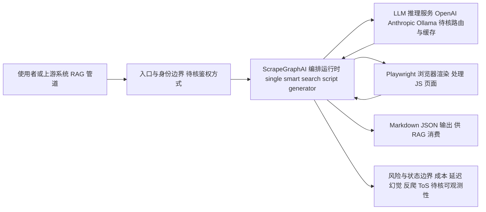

# ScrapeGraphAI/Scrapegraph-ai

## 一句话定位
基于 LLM 的 AI 网页爬虫框架——用自然语言描述需要提取的数据，AI 自动构建爬虫并解析页面，无需手写 CSS/XPath 选择器。

## 它解决的问题
传统爬虫开发面临三大痛点：(1) 每个网站的页面结构不同，需要为每个站点编写专用的解析规则；(2) 网站改版时选择器失效，维护成本高；(3) 非结构化数据（如评论、产品描述）难以用规则精确提取。ScrapeGraphAI 用 LLM 替代手工选择器编写——开发者只需描述"我需要产品名称、价格、评分"，LLM 自动理解页面结构并提取数据，大幅降低爬虫开发门槛和维护成本。

## 为什么值得关注
- **29,166 stars:** AI 爬虫赛道的热门项目
- **LLM 原生设计:** 从架构层面将 LLM 作为解析引擎，而非附加功能
- **多种爬取模式:** 单页、多页、搜索、深度爬取
- **MIT 许可证:** 利于商业使用
- **自定义为 Firecrawl 的开源替代品:** topics 中明确标注 "firecrawl-alternative"

## 热度来源判断
热度来自数据采集需求与 AI 降本增效叙事的结合。RAG 应用需要大量网页数据 → 传统爬虫太贵太慢 → AI 爬虫承诺"一句话搞定"的叙事极具吸引力。开发者社区（尤其是 AI 应用开发者）将 ScrapeGraphAI 视为快速获取训练/RAG 数据的工具。与 Firecrawl 的开源 vs 商业对比也推动了讨论。

## 关键技术亮点亮点
- 基于图的爬取架构：将爬取任务建模为有向图（节点=页面，边=链接），LLM 在图上执行提取
- 多 LLM 支持：OpenAI、Anthropic、Ollama 本地模型
- 智能选择器：LLM 理解页面语义，自动定位数据位置
- Markdown 输出：提取结果自动格式化为 Markdown/JSON，适合 RAG 消费
- 反爬应对：内置 Playwright 支持，处理 JavaScript 渲染页面
- 管道化设计：single scrape / smart scraper / search scraper / script generator

## 架构师速览

| 决策问题 | 研究判断 | 证据边界 |
|---|---|---|
| 系统边界 | ScrapeGraphAI 是位于"入口请求↔外部模型/工具"之间的编排层，向上承接使用者或上游管道（API/CLI），向下对接 LLM 提供商与 Playwright 等渲染/抓取工具，不自建采集端到端基础设施 | 入口与边界由标签 ai-crawler/ai-scraping/data-extraction 与 Firecrawl 替代物定位推断；具体鉴权、部署形态未在档案中证实 |
| 主路径 | 请求 → 入口与身份 → 编排/运行时（含 single/smart/search/script 模式）→ LLM 语义解析 + Playwright 渲染 → Markdown/JSON 输出落回调用方 | 图式爬取与管道化模式来自档案描述；图节点数据结构、会话状态、并发模型未在档案中证实，标"待核验" |
| 关键权衡 | 扩展性与抗页面变更能力（LLM 替代 CSS/XPath）vs LLM 调用成本、推理延迟、幻觉风险与 ToS/反爬对抗——本质是用算力换脆弱规则的维护成本 | 档案明确列出成本、速度、准确性、反爬、法律五项风险；具体的速率限制、缓存、重试策略未在档案中证实 |
| 最小 PoC | 在单页/单一模型供应商（如 OpenAI 或本地 Ollama）下，对一个静态站点跑 smart scraper，验收：抽取准确率、成本/页、延迟、Playwright 是否必需、可观测日志 | 档案给出管道模式与多 LLM、Playwright 支持；但 token 用量基准、模型路由策略、并发上限未在档案中证实 |

## 架构启发
ScrapeGraphAI 的核心启发是"用 AI 替代脆弱的规则系统"。传统爬虫用 CSS 选择器/XPath 定义数据位置——这些规则对页面变化极度敏感。LLM 理解页面语义后，数据提取从"位置匹配"升级为"语义理解"，鲁棒性大幅提升。对架构师的启发是：**当规则系统的维护成本超过其执行成本时，应该用 AI 替代规则层**。

## 架构图（MMD）

> 证据边界：此图只采用本档案已有可核验描述；“待核验”节点不应视为项目实现事实。

## 定位判断
**工具型（数据采集基础设施）。** 精准定位为"AI 驱动的爬虫框架"，处于数据管道的采集端。不是平台，但作为 RAG/数据团队的核心工具有长期价值。定位为"开源版 Firecrawl"。

## 风险/局限/泡沫点
- **LLM 成本:** 每次爬取都调用 LLM，大规模数据采集的成本远高于传统爬虫
- **速度瓶颈:** LLM 推理延迟导致爬取速度慢于传统方案
- **准确性:** LLM 可能遗漏数据或产生幻觉提取
- **反爬升级:** 网站反爬措施（Cloudflare、验证码）是所有爬虫的共同挑战
- **法律风险:** 网页爬取涉及 ToS 违规和版权风险
- **竞争激烈:** Firecrawl、Crawl4AI、Spider 等竞品众多

## 与同类项目的关系
- 与 **Firecrawl** 是最直接的开源 vs 商业竞品（topics 中明确标注 "firecrawl-alternative"）
- 与 **Crawl4AI**（开源 AI 爬虫）在开源赛道直接竞争
- 与 **gpt-researcher** 互补——gpt-researcher 做研究，ScrapeGraphAI 做数据采集
- 与 **n8n** 集成——作为 n8n 工作流中的数据采集节点
- 与 Playwright、BeautifulSoup 形成"AI 增强 vs 传统工具"的对比

## 是否值得持续跟踪
**推荐跟踪。** 数据采集是 AI 应用的核心需求，ScrapeGraphAI 作为 AI 爬虫的代表项目值得持续关注。建议关注其成本优化和准确性提升。

## 后续观察点
- LLM 成本优化（本地模型支持、缓存机制）
- 与 RAG 框架的集成深度
- 大规模爬取场景的性能表现
- 反爬技术的应对策略
- 是否从工具型进化为数据平台

---
> 数据来源: GitHub API (ScrapeGraphAI/Scrapegraph-ai) | 星标: 29,166 | 语言: Python | 许可证: MIT
