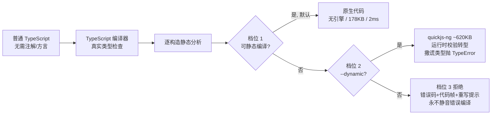

# vercel-labs/scriptc

## 一句话定位
TypeScript→原生二进制编译器——把普通 TypeScript 编译成小型、快速的原生可执行文件，**二进制里没有 Node、没有 V8、没有任何 JS 引擎**（除非显式 opt-in 动态模式）。

## 它解决的问题
目标用户是把 TypeScript 脚本/工具/服务部署到对启动时间和体积敏感的场景（Edge/Serverless/CLI 工具/嵌入式）。痛点是：TS 必须跑在 Node/V8 上，冷启动慢（百毫秒级）、二进制大（几十 MB）、资源占用高。

scriptc 让 TS 像 Rust/Go 一样编译成独立原生二进制（实测 `fib.ts` → 178KB、2ms 启动），无需修改代码、无需注解。

## 为什么值得关注（2026-07-29）
- Vercel Labs 出品（Vercel 是 Edge/Serverless 的领导者），瞄准冷启动优化的意图明确。
- 实测覆盖率高：一个 4481 语句的 app，4451（99%）可静态编译，仅 3 处阻断（2 个 optional 参数值函数 + 1 个 Promise.reject）。
- 设计哲学独特：**三档静态度显式化**（静态编译 / 动态运行 / 拒绝），永不静默错误编译。

## 热度来源判断
热度来自**真实工程痛点**（Serverless 冷启动）+ Vercel 品牌背书 + 「TS 终于可以原生编译」的技术新鲜感。不是泡沫——冷启动是 Serverless 的硬约束，TS 原生编译是合理解法。但 Star 数受限于「需要 clang + macOS arm64 为主平台」的采用门槛。

## 关键技术亮点
1. **零运行时静态编译**：原生代码，无引擎。覆盖类（单继承 + 动态分派 + 安全时去虚化）、闭包（JS 捕获语义）、泛型（单态化）、判别联合（TypeScript 自身 narrowing 驱动的 tagged values）、async/await（栈式协程 + JS 精确调度）、异常（含 finally）、解构、spread、迭代器、模板字符串、正则（与 QuickJS 相同的 ECMAScript 精确字节码解释器）。
2. **标准库 + Node API 表面完整**：字符串（UTF-16 精确语义）、数组/Map/Set（JS 精确顺序与 identity）、JSON（运行时校验转型）、Math、typed arrays、Buffer、Error 层级；Node 的 fs（sync+promises）、path（字节精确移植）、process、child_process、os、crypto、url、zlib、定时器与信号；以及服务端栈 net/http/https/tls（内置 mbedTLS）、dgram、dns、fs.watch、readline。
3. **WHATWG fetch 子集**：streams、Headers、AbortSignal 基于同一原生 net/TLS 栈——重定向、gzip、AbortSignal.timeout、Node 形态错误原因；无 libcurl、无系统 HTTP 依赖。
4. **动态模式的安全边界**：嵌入式 quickjs-ng（~620KB）执行无法静态化的代码（npm 依赖 JS、any 类型）。跨回静态代码的每个值运行时校验——撒谎的类型抛可捕获 TypeError 而非损坏内存。

## 架构启发
核心启发是**「显式静态度（explicit staticness）」优于「隐式假设」**。scriptc 不假装所有 TS 都能静态编译，而是逐构造决定并明确告诉你：`scriptc coverage` 报告哪些静态、哪些动态、哪些拒绝。这种**「可观测的编译边界」**思想对 Agent 生成代码尤其重要——Agent 生成的代码可静态化部分直接编译，不可静态化部分降级到动态引擎，边界清晰可审计。

## 定位判断
定位为**工具型**，但有演化为「TS 原生编译基础设施」的潜力。对 Agent 生成代码的部署成本是降维打击——Agent 生成的 TS 工具可直接编译成小二进制分发。

## 风险 / 局限 / 泡沫点
1. **macOS arm64 为主平台**：Linux/Windows 靠交叉编译，需 clang（Xcode CLT 预装），采用门槛存在。
2. **「99% 静态」在大型动态项目下可能退化**：重度依赖动态 npm 包的项目，动态部分性能受 quickjs-ng 制约，需实测边界。
3. **生态早期**：作为 Vercel Labs 实验项目，生产案例和长期维护承诺待验证。
4. **不是全功能 Node 替代**：某些 Node API（如部分原生模块、复杂的 stream 背压语义）可能未完全覆盖。

## 与同类项目的关系
- **vs Bun/Deno**：Bun/Deno 是「更快的 JS 运行时」，仍内嵌 JS 引擎；scriptc 是「去掉 JS 引擎」，目标更激进（AOT 编译）。层次不同。
- **vs Deno compile / Node SEA**：Deno compile 和 Node SEA 把运行时打包进二进制（仍含 V8），体积大；scriptc 真正编译为原生代码，体积小两个数量级。
- **vs Rust/Go**：scriptc 让 TS 达到接近 Rust/Go 的二进制体积和启动速度，但保留了 TS 的开发体验。

## 是否值得持续跟踪
**是，持续跟踪。** 对 Edge/Serverless 冷启动优化、Agent 生成代码分发有直接价值。建议在 CLI 工具/轻量服务场景做小规模验证。

## 后续观察点
1. 大型真实项目（含动态 npm 依赖）的静态覆盖率退化情况与 quickjs-ng 兜底性能边界。
2. 是否从 Vercel Labs 实验项目转为正式维护、生产案例积累。
3. 与 Edge Runtime（Vercel/Cloudflare Workers）的集成——是否成为 Edge 函数的编译后端。

---
*首次记录：2026-07-29* · *数据来源: GitHub Search API (gh CLI) + README*
