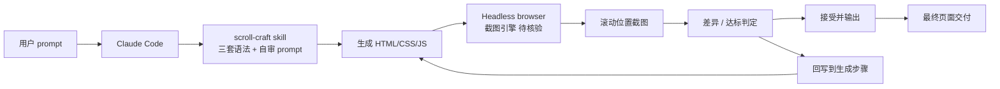

# nateherkai/scroll-craft

## 一句话定位
为 Claude Code 量身定制的"高端 scroll-driven 网站" skill——用同一套 skill 引擎产出 Orrery / PERKFORM / Fallowbank 三种**完全不同页面语法**的高端演示，并通过**自截图验证**让 skill 自己判断产出的页面在不同滚动位置是否真正达标。

## 它解决的问题
LLM 写网页长期存在两个失败模式：(1) 写法保守但平庸，6 个 section 全是 hero / features / testimonials / CTA 模板；(2) 写法花哨但粗糙——2.1:1 body、6 行长 headline、所有 AI 生成的网页长得几乎一样。nateherkai/scroll-craft 用一个 skill 同时解决两个问题：(1) 通过**三套完全不同语法的 demo**提供"风格参考"，(2) 通过**自截图 + 滚动位置验证**让 LLM 产出后能"自己看到"实际效果并据此迭代。本质上是用 skill 把"产品级网页"和"AI 网页 demo"之间的鸿沟补上。

## 为什么值得关注（2026-08-24）
- **2 天 462⭐**（GitHub API 可核验）：skill 类项目达到此速度极少，说明产品级垂直 skill 仍有强需求
- **完整 Claude Code plugin 结构**：`.claude-plugin/`、`plugins/`、`media/`、`EXAMPLES.md` 37KB——表明这是完整可 install 的 plugin 而非松散 prompt 集合
- **三种语法的 demo**：Orrery（连续世界飞行）、PERKFORM（一次性电影镜头）、Fallowbank（克制纪录片风）——差异不是 theme，是**整页语法**
- **自截图验证**：README 明示"self-verifies by screenshotting its own scroll"——这是 skill 内置"感知回路"的早期范例
- **License: MIT**：可商用

## 热度来源判断
scroll-craft 的热度来自**真实产品级需求 + skill 单点化形态验证**的组合：(1) 高端 scroll-driven 网站本来是独立设计工作室的高单价市场（每个项目数万到数十万美元）；(2) LLM 自动化网页设计普遍被认为"只能做 demo 不能做产品"——scroll-craft 显式挑战这一边界。(3) Claude Code plugin 生态在 8-22 / 8-23 持续放量，scroll-craft 是该生态上**"产品级深度"**的第一个明确范例。这三点叠加带来 462⭐。需要观察：**真实客户采用率**而非仅 Star 数——目前 GitHub 上以 skill 形式存在，落地到生产网页的案例尚未公开。

## 关键技术亮点
1. **三种内置语法的 page grammar**：Orrery 是连续世界、PERKFORM 是电影一镜、Fallowbank 是克制纪录——证明 LLM 网页设计可以**语法层面差异化**而非仅换主题
2. **自截图验证回路**：skill 在产出 HTML 后用 headless browser 滚动截屏，根据截图判定哪些段落地未达标→ 重新生成——这是 skill 内置感知-行动-反思循环的早期范例
3. **真实设计标准的内嵌**：README 明确反对"2.1:1 body text、6 行长 headline、统一 6 段模板"等 AI 网页弊病，把设计红线写入 skill prompt
4. **EXAMPLES.md 37KB**：每个 demo 都有详细的设计哲学说明，使该 skill 对其他 skill 作者有可学习的样板价值
5. **`.claude-plugin/` 标准化**：遵循 Claude Code plugin 规范，可以 `git clone + cp` 直接安装
6. **MIT + Topic 显式声明 (claude-code-plugin)**：在 plugin 市场生态中可被发现

## 架构师速览

| 决策问题 | 研究判断 | 证据边界 |
|---|---|---|
| 系统边界 | 一个 Claude Code skill（`.claude-plugin/`）；通过 plugin 机制注入 Claude Code 的 prompt；通过调用 headless browser 实现自截图验证 | 仓库结构（`.claude-plugin/`、`plugins/`、`EXAMPLES.md`）确认 plugin 形态；headless browser 是 puppeteer / playwright 还是自定义未在 README 完整给出 |
| 主路径 | 用户调用 skill → Claude Code 读取 skill 内容 → 生成 HTML / CSS / JS → 调用 headless browser 截屏 → 比较与设计目标的差距 → 选择修改 / 接受 → 输出最终页面 | 主路径由 README "self-verifies by screenshotting its own scroll" 描述确认；差异度量标准、迭代停止条件、token 预算策略需源码核验 |
| 关键权衡 | 三套语法 vs 单一可复用模板——多语法让 LLM 选择空间大但也增加理解成本；自截图验证 vs 完全依赖 prompt——验证增加耗时但提升质量；skill 内嵌 vs 外部 DSL——内嵌简单但不易扩展 | 权衡取舍由 README 三 demo 差异与"self-verifies"声明确认；具体的循环深度、接受阈值、prompt 长度策略均待核验 |
| 最小 PoC | 在 Claude Code 中安装 scroll-craft → 用一句话 prompt 让它生成一个 PERKFORM 风格的产品页 → 观察自截图回路触发了多少次 → 把最终 HTML 在本地浏览器中体验滚动 | PoC 流程由 README "Claude Code plugin" + "self-verifies" 描述推导；具体 plumbing（plugin 安装命令）需源码核验 |
| 证据边界 | 仓库公开 metadata + README + EXAMPLES.md；headless browser 选择、token 预算策略、三套语法实现细节均为推断 / 待核验项 | 仅核验已核验事实，其他来自语义推断 |

## 架构图（MMD）

> 证据边界：此图只采用本档案已有可核验描述；"待核验"节点不应视为项目实现事实。

## 架构启发
scroll-craft 的核心启发是 **"skill 单点化 × 完整工作流 × 内置验证回路"** 是 Agent Skills 生态的真形态。8-23 我们观察到 ip-as-logo-skill 用"成品 logo 库"绕开 LLM 生成不稳定；8-24 scroll-craft 用"自截图验证"绕开"AI 网页趋同"。两者共同的启示：**LLM 不是终点，而是 skill 工作流的一个组件**——skill 的真正价值是"为 LLM 提供参考 + 验证"，而不是"让 LLM 自由发挥"。更深层的启发：**skill 形态在分化**——一类是"轻量 prompt + LLM 自由发挥"，另一类是"重型 prompt + 重资产 / 重验证回路"。后者才是用户付钱的地方。

## 定位判断
**单点垂直 skill × 产品级深度（设计 / 高端网站方向）。** 与 8-23 ip-as-logo-skill 同属"单点 skill + 完整作品形态"路线，但在垂直深度上更进一步：ip-as-logo-skill 是"logo 库的提示词封装"，scroll-craft 是"高端网页的完整方法论 + 自验证"。**它是 skill 作者学习的样板**——任何想做出"产品级深度"垂直 skill 的人都可以参考 scroll-craft 的三 demo + 验证回路结构。短期内不太可能成为通用平台，但有可能成为**"skill 课程 / 模板市场"的标杆案例**。

## 风险 / 局限 / 泡沫点
- **真实客户采用率未知**：现有证据是 GitHub Star 数（462⭐/2 天）——这只是开发者关注度，不是真实付费客户数
- **token 成本不可忽视**：自截图验证回路意味着每页面要多次调用 vision-capable LLM，单页成本可能高于普通模板
- **三套语法并非真正开放**：skill 内置三套语法，**用户能否扩展第四套语法**未在 README 明示——这决定 skill 的可演化性
- **依赖 Claude Code**：仅在 Claude Code 平台下被验证，其他 agent harness（Codex / Cursor 等）的兼容路径未文档化
- **设计哲学主观性强**：高端网页"好不好"是主观判断，skill 内置的"设计标准"是否被独立设计师认可未验证
- **与"低代码设计工具"竞争**：doop / Paper.design / Figma 等已经在协作设计层占位，scroll-craft 优势是 LLM 自动化，劣势是协作 / 实时能力弱

## 与同类项目的关系
- **vs ip-as-logo-skill（8-23）**：两者同属"单点 skill + 完整作品形态"，垂直深度都到位，区别在品类（logo vs 网页）
- **vs 通用网站生成 skill**（如 v0 / bolt.new skills）：通用 skill 套同样模板；scroll-craft 是"差异化的语法集合"——这是其差异化定位
- **vs doop（8-24 同期）**：doop 是协作设计画布（多人 + agent）；scroll-craft 是单人 skill。两类需求不同
- **vs Figma Make / Framer AI**：商业化产品，已经有用户基础；scroll-craft 开源，强调 Claude Code 生态
- **vs wshobson/agents**：聚合市场，scroll-craft 是单点 skill，互补

## 是否值得持续跟踪
**值得高频跟踪（skill × 自验证回路样板）。** 对设计师 / 设计团队：值得直接在 Claude Code 中试用，验证其能否真的产出可商业化网页；对 skill 作者：**scroll-craft 是 8-23 之后"产品级深度 skill"第二个明确范本**，值得详读 EXAMPLES.md 学习"如何让一个 skill 拥有完整方法论"；对企业内 AI 工具决策者：skill 单点化的市场份额变化，可能影响未来 agent 产品形态。

## 后续观察点
- 是否有真实付费客户案例公开（在 README 或博客）
- 是否支持扩展第四套语法（如开放 plugin structure）
- 是否移植到 Codex / Cursor 等其他 harness
- 自截图验证回路的版本迭代（更高效的差异度量、更智能的停止条件）
- skill marketplace（Claude Code / Codex / 通用）是否将其作为头部推荐

---
> 数据来源: GitHub API (2026-08-24) | Stars: 462 | Forks: 79 | License: MIT | 语言: JavaScript | 创建: 2026-08-22
