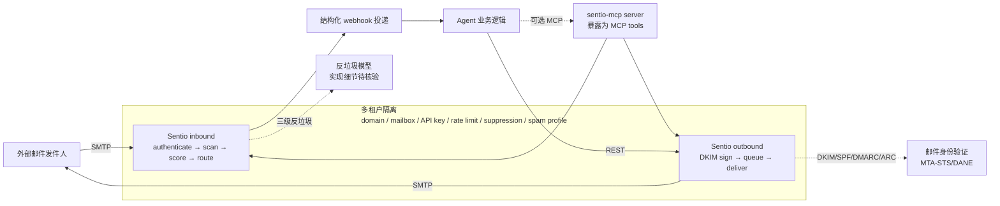

# truespar/sentio

## 一句话定位
**邮件作为 agent 原生能力**——把 SMTP 完整协议栈（inbound + outbound、DKIM/SPF/DMARC/ARC、MTA-STS、DANE、三级反垃圾）做成 multi-tenant mail server（Rust），并提供 webhook + REST 双接口：每个 agent 一个真实邮箱地址 → 入站邮件以结构化 webhook 投递 → agent 通过 REST 同线程回复。

## 它解决的问题
2026 年 agent 处理邮件的方案普遍有 3 个痛点：(1) **底层是 wrapper**——LangChain Email Toolkit / imap-smtp 桥接都是"调用第三方邮件 API"，无法控制协议层；(2) **多租户缺失**——平台方无法给每个客户提供独立 inbox / 域名 / 速率限制 / 反垃圾 profile；(3) **agent 邮件不隔离**——所有 agent 共享同一邮箱身份，无法做"agent-as-邮件实体"的产品形态（每个 agent 自己的真实邮箱）。Sentio 把邮件做成**完整 multi-tenant mail server + agent-ready API**，并提供 `sentio-mcp` server 把这层能力暴露为 MCP tools。

## 为什么值得关注（2026-08-25）
- **2 天 141⭐**（GitHub API 可核验）：邮件基础设施赛道短期增速突出
- **License: MIT OR Apache-2.0**：双许可友好，企业内分发 / 商用皆可
- **Rust 实现 + 完整 SMTP 协议栈**：DKIM/SPF/DMARC/ARC/MTA-STS/DANE/三级反垃圾——这不是 wrapper，是完整邮件 server
- **README 自带 mermaid 主路径图**：customer → SMTP → inbound (authenticate/scan/score/route) → webhook → agent → REST → outbound (DKIM/queue/deliver) → customer
- **"Built for platforms" 段**：每 tenant 隔离 domain / mailbox / API key / rate limit / suppression / spam profile
- **提供 sentio-mcp server**：把邮件能力暴露为 MCP tools，可直接被 Claude Code / Codex 等 harness 集成
- **明确"complete mail server" 定位**：agent inbox rests on real mail infrastructure rather than a wrapper around someone else's API

## 热度来源判断
Sentio 的热度来自 **"邮件是 agent 时代被忽视的基础设施 × 多租户稀缺供给 × MCP 集成"** 的组合：(1) 邮件自动化是过去 20 年 SaaS 核心场景（客服 / CRM / 自动外联），但 agent 化形态从未有过严肃开源实现；(2) 多租户邮件 server 在开源侧稀缺（Postal / Stalwart / Mailcow 多为单租户导向）；(3) `sentio-mcp` 把这套能力直接对齐 agent harness。三点叠加在 2 天内拿到 141⭐。**主要风险：** Rust 实现是新代码，CVE 历史需要时间积累；与 Postmark / SendGrid 等大厂的 agent 化路径竞争可能在 6-12 月内出现。

## 关键技术亮点
1. **完整 SMTP 协议栈（inbound + outbound）+ DKIM/SPF/DMARC/ARC + MTA-STS/DANE + 三级反垃圾**：不是 wrapper，是 real mail server
2. **Multi-tenant by design**：domain / mailbox / API key / rate limit / suppression / spam profile 都按 tenant 隔离——可作为平台基础设施
3. **Webhook + REST 双接口**：入站邮件以结构化 webhook 投递，agent 通过 REST 同线程回复
4. **MCP 原生集成**：附带 `sentio-mcp` server，把邮件能力暴露为 MCP tools
5. **Rust 实现**：性能 + 协议正确性 + 内存安全——与 Weaviate / SurrealDB 的"系统级基础设施用 Rust"路径一致
6. **Docker quickstart + 无 Docker 安装指南 + API reference + 测试 UI**：完整产品化工程模板

## 架构师速览

| 决策问题 | 研究判断 | 证据边界 |
|---|---|---|
| 系统边界 | 完整 mail server（inbound + outbound + 反垃圾）+ REST API + MCP server；multi-tenant 设计；Docker 或裸金属部署 | 边界由 README "complete mail server" + "Built for platforms" 描述确认；具体 tenant 隔离的物理边界（进程 / 容器 / 配置隔离）需源码核验 |
| 主路径 | customer SMTP → inbound (authenticate → scan → score → route) → webhook → agent → REST → outbound (DKIM sign → queue → deliver) → customer | 主路径由 README mermaid 图描述确认；具体每阶段的实现（反垃圾模型 / DKIM 私钥管理 / queue 持久化）需源码核验 |
| 关键权衡 | 完整自研 vs 复用现成 SMTP 库（README 强调"不是 wrapper"——意味着大部分协议层自研）；多租户共享 vs 隔离（每 tenant 自己的 domain / reputation）；MCP 暴露 vs 私有 API（`sentio-mcp` 是公开配套，但用户也可直接 REST） | 取舍由 README "real mail infrastructure rather than a wrapper around someone else's API" + "Built for platforms" 描述确认；具体多租户隔离粒度与 MCP server 安全策略需源码核验 |
| 最小 PoC | 用 Docker 启动 Sentio → 注册一个 tenant + 一个测试 mailbox → 通过 REST 发送一封测试邮件到该 mailbox → 验证 webhook 收到结构化事件 → 通过 REST 同线程回复 → 验证邮件可达外部收件人 | PoC 流程由 README "Quick start with Docker" 描述推导；具体 tenant 注册 / API key 管理流程需 README / 文档进一步核验 |
| 证据边界 | README + mermaid 图 + topics；具体性能基准、DKIM 私钥管理、tenant 隔离粒度、与现有邮件平台差异均未公开 | 已核验事实来自 README 与 API；其他来自语义推断 |

## 架构图（MMD）

> 证据边界：此图只采用本档案已有可核验描述；"待核验"节点不应视为项目实现事实。

## 架构启发
Sentio 的核心启发是 **"邮件作为 agent 原生能力"**——过去 30 年邮件一直是"应用层协议"，从未被设计为"agent 基础设施"。Sentio 把"每个 agent 一个真实邮箱"作为 first-class abstraction，这意味着 **agent 自动化处理客户邮件 / 自动外联 / 自动签收 / 自动 KYC 等场景的产品形态将完全改变**。更深层的启发：**多租户 + agent-ready 的组合**——平台方可以基于 Sentio 给每个客户提供独立 inboxes / 域名 / 反垃圾 profile，而无需从头搭建邮件基础设施。这与"agent 时代基础设施需要重新设计"的判断一致——过去 SaaS 时代的 IMAP/SMTP wrapper 不足以支撑 agent 时代的需求。

## 定位判断
**基础设施候选（agent 时代邮件基础设施）。** Sentio 在"agent + 邮件"交叉赛道是当前最完整的开源实现，2 天 141⭐ / 10 forks 已显示早期关注度。**主要竞争威胁：** Postmark / SendGrid / Amazon SES 等大厂的 agent 化路径——一旦大厂推出 "agent-ready email API"，Sentio 需在性能 / 价格 / 协议完整性上证明差异化。**值得 6-12 月高频跟踪**，特别是关注是否被任何一家 agent 平台默认集成。

## 风险 / 局限 / 泡沫点
- **Rust 实现是新代码**：协议层安全审计 / CVE 历史需要时间积累；任何协议 bug 都可能导致 DKIM 签名失败 / DMARC 对齐问题
- **与现成邮件平台的功能差异未对照**：与 Postal / Stalwart / Mailcow / Maddy 的功能差异、性能差异未在 README 中对照
- **大厂反向整合风险**：Postmark / SendGrid / SES 在 6-12 月内可能推出 agent-ready 版本，Sentio 需快速建立护城河
- **合规责任归属模糊**：当 agent 自动外联 / 自动签合同时，CAN-SPAM / GDPR 等法规责任归属需明确（README 未涉及）
- **多租户隔离粒度未公开**：tenant 共享进程还是独立进程 / 容器？影响 SLA 与故障爆炸半径
- **sentio-mcp 安全边界未细化**：MCP server 暴露邮件能力的最小权限、审计策略需源码核验

## 与同类项目的关系
- **vs LangChain Email Toolkit / smolagents email tool**：这些是 wrapper（基于第三方邮件 API），Sentio 是底层完整实现
- **vs Postal / Stalwart / Mailcow / Maddy**：这些是单租户导向的邮件 server，Sentio 是 multi-tenant-by-design
- **vs Amazon SES / Postmark / SendGrid**：这些是大厂 SaaS，Sentio 是开源 + 自托管；价格 vs 运维成本 trade-off
- **vs Cloudflare Email Routing / Workers Email**：这些是 serverless 邮件处理，Sentio 是完整 mail server（自有 reputation / DKIM 签名）
- **vs MCP 生态**：MCP 是协议，Sentio 是基于 MCP 的具体应用（agent email as native tools）

## 是否值得持续跟踪
**值得高频跟踪（agent 时代邮件基础设施）。** 对所有做 agent 自动化的团队：**建议立即在 Docker 上跑 Sentio，给一个测试 agent 配一个真实 mailbox，观察 webhook → agent → REST 回复闭环**；对做 agent 平台的产品经理：**这是判断"邮件作为 agent 原生能力"是否会被大厂官方化的早期信号**；对 SaaS 自动化公司：潜在颠覆点——6-12 月内评估是否需要构建反向能力。

## 后续观察点
- 性能基准公开化（每 tenant QPS / webhook 延迟分布）
- DKIM 私钥管理 / tenant 隔离粒度（共享进程 vs 独立）
- 大厂（Postmark / SendGrid / SES）是否推出 agent-ready 版本
- 是否被 Anthropic / OpenAI / Cursor / Codex 任何一家默认集成
- 合规责任归属文档（CAN-SPAM / GDPR / 行业邮件规范）
- Rust 实现的 CVE 历史与安全审计报告

---
> 数据来源: GitHub API (2026-08-25) | Stars: 141 | Forks: 10 | License: MIT OR Apache-2.0 | 语言: Rust | 创建: 2026-08-23
