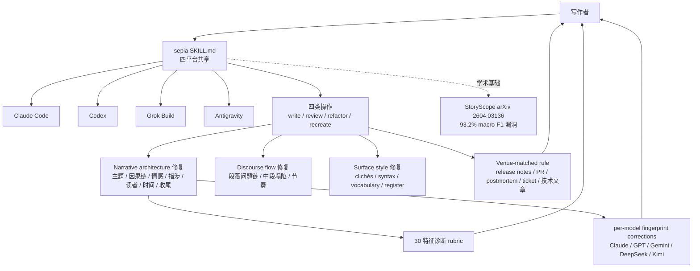

# Nanako0129/sepia

## 一句话定位
从 narrative architecture 层面去 AI 化的小说与专业写作 skill——单一 SKILL.md 同时被 Claude Code / Codex / Grok Build / Antigravity 四平台加载，针对 LLM 写作七类叙事架构指纹做反向修复，学术基础为 StoryScope（Russell et al. 2026, arXiv 2604.03136）测得的 93.2% 分类器漏洞。

## 它解决的问题
当前主流 humanizer 工具（GPTZero / Originality.ai 等的绕过器）集中在"改词改句、改 surface style"，但 StoryScope 论文（61,608 故事 / human + 5 frontier LLMs）证明：narrative-structure features 单独分类可达 93.2% macro-F1；改 surface style 仅从 95.5% 降到 93.9%——**"the tells that survive are architectural"**（README 自述）。这意味着真正决定"AI 味"的是叙事架构层（主题被叙述者解释 / 单线因果 / 情感只以躯体呈现 / 没有真实指涉 / 没有读者 / 线性时间 / 主角成长收尾），而非表面润色。sepia 把 StoryScope + 11 个相关研究消化成可操作的三遍写作/修订协议。

## 为什么值得关注（2026-08-29）
- **Stars:** 245（截至 2026-08-29），**1 天起步**，处于"极早期爆发"阶段
- **Forks:** 待核验（API 检索未单独返回）
- **License:** MIT
- **语言:** Shell 仓库主体（README 自述 "A portable Agent Skill for Claude Code, Codex, Grok Build, and Antigravity. One canonical SKILL.md, no per-platform forks"）
- **活跃度:** created 2026-08-28，pushed_at 2026-08-29
- **跨平台:** 单一 SKILL.md 同时被 Claude Code / Codex / Grok Build / Antigravity 加载
- **学术基础:** StoryScope 论文（Russell et al. 2026, arXiv 2604.03136）测得的 93.2% macro-F1

## 热度来源判断
sepia 的热度是 **"humanizer 表面润色被证伪 × narrative architecture 是真实决胜战场 × 跨四平台单一 SKILL.md × MIT 许可证"** 的组合。StoryScope 论文测得的"改 surface style 仅 95.5% → 93.9%"是"为什么需要 narrative 修复"的硬证据，让 sepia 站在学术前沿。245⭐/1 天说明 academic 圈 + creative writing 圈的双向关注。但需警惕：humanizer 赛道的"绕过 AI 检测"定位可能引发学校 / 新闻 / 出版的合规反扑；StoryScope 数据集公开也可能被攻击者用于训练新一代绕过检测器。

## 关键技术亮点
1. **三遍写作 / 修订协议**（README 表格明示）：① narrative architecture（fiction）—— stop explaining the theme / loosen causal chain / back-load revelations / mix emotion modes / sparse character networks / name real things；② discourse flow —— de-template paragraph-question sequence / fix mid-story sag / vary rhythm and positions；③ surface style —— clichés / syntax templates / vocabulary / register
2. **四类操作原语**：`write` / `review` (diagnose only) / `refactor` (minimal edits) / `recreate` (full rewrite)
3. **30 特征诊断 rubric**（README 自述）+ **per-model fingerprint corrections**（Claude / GPT / Gemini / DeepSeek / Kimi 五大模型的写作指纹反向调整）
4. **venue-matched rule**（README 表格明示）：release notes / PR replies / postmortems / tickets / 技术文章各设专属规则——filler 剔除 / hedging 改写 / chatbot 残留去除 / register 与 venue 对齐 / formatting 去模板化
5. **设计哲学"calibrate to the human distribution, don't invert the AI one"**（README 自述）："Humans sit at moderate values; a story with every rule applied is a new fingerprint. The skill selects 3–5 moves per story and leaves slack."——节制式修复比"全规则全打"更稳
6. **跨四平台单一 SKILL.md**："One canonical SKILL.md, no per-platform forks"（README 自述）

## 架构师速览

| 决策问题 | 研究判断 | 证据边界 |
|---|---|---|
| 系统边界 | 跨四平台的 Agent Skill（Claude Code / Codex / Grok Build / Antigravity）+ 三遍写作/修订协议（narrative / discourse / surface）+ venue-matched rule | 四平台兼容性是 README 明示；具体平台适配层（每个平台的 skill 加载机制）未公开 |
| 主路径 | 用户写小说/专业文 → sepia `write` 生成 → `review` 诊断 narrative 指纹 → `refactor` 局部修复 / `recreate` 全重写 | 四类操作是 README 明示；与每个 platform 的 CLI 集成命令（`/skill sepia` 等）需平台文档独立核验 |
| 关键权衡 | narrative 修复 vs "过度编辑失去 AI 指纹反被新指纹替换" 的概率 vs 跨平台语义一致性 vs StoryScope 数据集是否可下载 | StoryScope 论文 ID 与 93.2% 数字在 README 自述；研究/ 目录下 11 个相关研究是否齐全需核验；"calibrate to the human distribution, don't invert the AI one" 是 README 中明示的设计哲学 |
| 最小 PoC | 在 Claude Code 上加载 sepia skill，写 800 字虚构故事 → 跑 `review` 拿诊断 → 跑 `refactor` 修复叙事指纹 → 拿 StoryScope 分类器或等价检测工具独立复核 | Skill 安装命令是 README 明示；StoryScope 复现需另算（数据集 / 模型可获得性） |

## 架构启发
sepia 的核心启发是 **"humanizer 的下一战场是 narrative architecture，不是 surface style"**。StoryScope 论文以 61,608 故事 / human + 5 frontier LLMs 的硬数据证明：单纯改 surface style 几乎没用（95.5% → 93.9%），真正决定"AI 味"的是叙事架构层的七类指纹。这一发现把整个 humanizer 赛道的产品形态从"改词改句工具"推向"叙事架构修复协议"。更深层的启发是 **"calibrate to the human distribution, don't invert the AI one" 的设计哲学**——节制式修复比"全规则全打"更稳，因为人类分布是"中间值"，每个故事选 3-5 个 move 才不会留下新的"AI 反向指纹"。这与软件工程中"less is more"的减法美学一脉相承。最深层的启发是 **"per-model fingerprint corrections" 的设计**——针对不同模型的写作指纹做反向调整，是 niche 但极有商业价值的方向（尤其是平台方对 AI 生成内容的标识要求越来越强时）。

## 架构图（MMD）

> 证据边界：此图只采用本档案已有可核验描述；"待核验"节点不应视为项目实现事实。

## 定位判断
**工具型项目（narrative architecture 级 humanizer skill）**。sepia 不是 GPTZero / Originality.ai 的绕过器，而是"从 narrative architecture 层面反向修复 LLM 写作"的协议级 skill。245⭐/1 天说明 academic 圈 + creative writing 圈对"next-gen humanizer"的关注。是否能进入主流，取决于：(1) StoryScope 数据集的可下载性（用于复现 93.2% 漏洞）；(2) 跨四平台适配稳定性；(3) 平台方对 AI 生成内容标识合规的态度（SynthID / C2PA）。

## 风险 / 局限 / 泡沫点
- **合规反扑风险**：humanizer 赛道被学校 / 新闻 / 出版视为"绕过 AI 检测"，可能引发监管反扑（特别是 EU AI Act / 中国生成式 AI 服务管理办法对"AI 生成内容标识"的强制要求）
- **StoryScope 数据集可获得性**：93.2% 漏洞数字基于论文，分类器模型与数据集是否对外可下载未在 README 明示
- **"per-model fingerprint"漂移**：Claude / GPT / Gemini / DeepSeek / Kimi 的写作指纹会随版本变化，per-model correction 需持续更新
- **过度编辑反被新指纹替换**：若不遵守"3-5 moves per story and leaves slack"原则，会留下新的"AI 反向指纹"
- **跨四平台适配风险**：单一 SKILL.md 在四个平台的加载机制差异需独立验证

## 与同类项目的关系
- **vs 主流 humanizer 工具（GPTZero 绕过器等）**：主流工具改 surface style，几乎没用；sepia 改 narrative architecture
- **vs StoryScope 论文本身**：论文是 academic 学术发现；sepia 是把论文发现形式化为可操作 skill
- **vs wshobson/agents（8-22 跨平台 skill 仓库）**：wshobson 是 skill 聚合市场；sepia 是单点深度 skill（专注 narrative architecture 修复）
- **vs fire-your-seo-agency（8-28 SEO skill）**：两者都是"专业领域知识 × Claude Code skill"模式，但面向 SEO vs narrative writing
- **vs 中文写作助手 / 笔神等**：国内产品是 SaaS；sepia 是 open source skill

## 是否值得持续跟踪
**值得跟踪（narrative architecture 级 humanizer 代表）**。sepia 代表了"humanizer 从 surface style 升级到 narrative architecture"的赛道转向，是 StoryScope 论文的形式化产品化。对学术写作 / 创意写作 / 内容运营团队，这是值得试验的工具；对 humanizer 赛道，这是 next-gen 范式。建议关注：StoryScope 数据集公开、跨四平台适配稳定性、平台方对 AI 生成内容标识的政策、per-model fingerprint 更新频率。

## 后续观察点
- 30/60/90 天 stars / forks 曲线（1 天 245⭐ 是极高起点）
- StoryScope 论文数据集 / 分类器模型是否对外公开
- 跨四平台（Claude Code / Codex / Grok Build / Antigravity）适配稳定性
- "per-model fingerprint corrections" 是否随模型版本持续更新
- 平台方（学校 / 新闻 / 出版）对 narrative architecture 级 humanizer 的政策
- 与 SynthID / C2PA 等 AI 生成内容标识标准的冲突 / 协同

---
*首次记录：2026-08-29*
