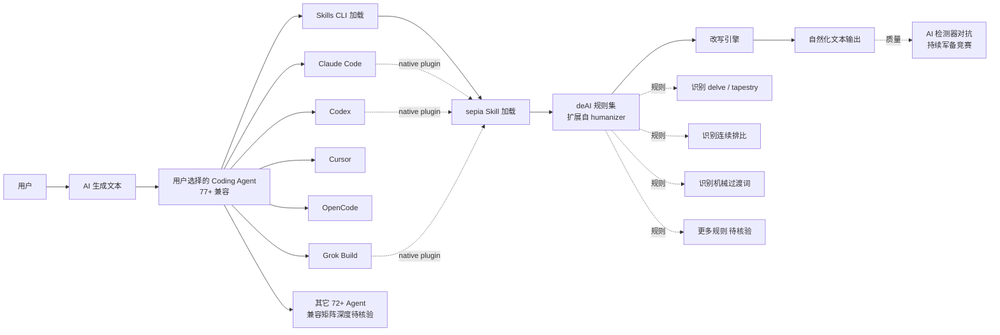

# Nanako0129/sepia

## 一句话定位
跨 77+ Agent 兼容的去 AI 化 Skill CLI——De-AI writing skill for any Agent Skills-compatible agent (77+ via the Skills CLI), with native plugins for Claude Code, Codex, Grok Build...，Python，是 9-06 上榜的 blader/humanizer 的多 Agent 升级版，验证 "Skill CLI" 分发模式。

## 它解决的问题
2026 年 Agent Skill 内容生态爆发，但绝大多数 Skill 仅兼容少数 Coding Agent（如 blader/humanizer 兼容 Claude Code / Codex / Cursor / OpenCode）。用户同时使用 7-8 个 Coding Agent 时，需要为每个 Agent 安装 / 配置不同的 Skill。Nanako0129/sepia 直击这一痛点：(a) **77+ Agent 兼容**——通过 Skills CLI 单一安装命令支持 77+ Coding Agent；(b) **native plugins**——Claude Code / Codex / Grok Build 等主流 Agent 原生插件；(c) **deAI 纵深**——在 9-06 humanizer 基础上扩展 deAI 规则（识别 delve / tapestry / 连续排比等）。这是 Skill 模式从"单 Agent Skill"升级到"跨 Agent Skill CLI"的关键样本。

## 为什么值得关注
- **Stars:** 2,324（截至 2026-09-07），10 天净增，单日均速 ~232⭐/day
- **Forks:** 141（fork/star **6.1%**，**显著低于** mattpocock/skills 8.4% / ECC 15.1%——反映"围观但不动手"特征）
- **语言:** Python 主导
- **77+ Agent 兼容:** Skill CLI 分发模式验证，比单 Agent Skill 的兼容矩阵广度优势
- **deAI 纵深:** 在 humanizer 基础上扩展规则集
- **Grok Build 集成:** xAI 的 Grok Build Coding Agent 是 2026 年新平台，sepia 把其纳入兼容矩阵

## 热度来源判断
sepia 的热度来自三个趋势的交汇：(1) **Agent Skill 内容生态成熟**——9-06 trending 总榜前 16 名中 9 个 Skill 类项目已验证生态规模；(2) **跨 Agent 兼容刚需**——开发者同时使用 Claude Code / Cursor / Codex 等多 Agent，需要统一的 Skill 安装方式；(3) **deAI 持续热度**——AI 文本检测与对抗是 2026 年持续热点，humanizer 988⭐ 验证 deAI 是高频用例。

10 天 2,324⭐ / fork/star 6.1% 与"早期传播期"特征一致。**提示：** fork 率 6.1% 显著低于 mattpocock 8.4% / ECC 15.1%——可能反映"围观但不动手"特征，或 Skill CLI 安装门槛较高；"77+" 兼容矩阵的实际深度需要核验（哪些 Agent 完全兼容 / 哪些仅部分兼容）。

## 关键技术亮点
1. **Skills CLI 安装:** `npx skills add Nanako0129/sepia --global`（推测）——单一命令支持 77+ Agent
2. **77+ Agent 兼容矩阵:** 覆盖 Claude Code / Codex / Cursor / OpenCode / Grok Build 等 77+ Coding Agent
3. **deAI 规则扩展:** 在 humanizer 基础上扩展规则（识别更多 AI 写作模式 / 调整更精细的改写策略）
4. **Python 实现:** SKILL.md 指令文档 + Python 辅助脚本
5. **native plugins:** Claude Code / Codex / Grok Build 的原生插件集成
6. **跨 Agent 一致性:** 同一段文本在不同 Agent 中执行 deAI 后的输出质量差异需要核验

## 架构师速览

| 决策问题 | 研究判断 | 证据边界 |
|---|---|---|
| 系统边界 | 跨 77+ Agent 兼容的 deAI Skill CLI——通过 Skills CLI 单一命令支持 77+ Coding Agent，扩展 deAI 规则集 | 边界由 trending 描述明示；"77+" 兼容矩阵的实际深度（每个 Agent 的兼容程度）需 README 核验 |
| 主路径 | 用户输入文本 → Coding Agent（Claude Code / Codex / Grok Build 等 77+）→ 加载 sepia Skill → deAI 改写 → 输出自然化文本 | 主路径为描述语义抽象；不同 Agent 加载 Skill 的具体机制（plugin / settings / prompt）未在 trending 中可见 |
| 关键权衡 | 77+ Agent 兼容广度 vs 每个 Agent 的适配深度（浅兼容易但深兼容难）；deAI 规则扩展 vs 维护成本；Python 实现 vs 纯 Markdown 指令的分发差异 | Python 主导（来自 trending）；具体规则扩展数量与质量需 README 核验 |
| 最小 PoC | 在 Claude Code / Codex / Grok Build 各安装 sepia Skill → 给同一段 AI 文本 → 对比三个 Agent 的 deAI 输出质量与一致性 | 安装命令需 README 独立核验；deAI 质量评估需人工或 AI 检测器对比 |

## 架构启发
sepia 的核心启发是 **"Agent Skill 应该跨 Coding Agent 兼容"**。当前 Skill 生态的痛点是"一个 Skill 只能在一个 Agent 中用"——开发者同时使用 Claude Code + Cursor + Codex 时需要为每个 Agent 安装不同 Skill。sepia 通过 Skills CLI 抽象层解决这一问题，把 Skill 从"Agent 专属"升级为"跨 Agent 通用"。更深层的启发是：**Skill 分发模式可能从"npm 包 + 单独安装"升级到"CLI 集中分发"**——类似 Homebrew 之于 macOS 包管理，Skills CLI 可能成为 Skill 时代的 Homebrew。

风险提示：**"77+ 兼容"是营销数字 vs 实际深度**——浅兼容（仅在 prompt 中加载规则）vs 深兼容（plugin 原生集成）的差异需要核验；与 humanizer 的差异化（仅在兼容性扩展，无质量提升）需要独立 benchmark；与 Skills CLI 标准（mattpocock/anthropics 等是否使用同一 CLI）的关系需要核验。

## 架构图（MMD）

> 证据边界：此图只采用本档案已有可核验描述；"待核验"节点不应视为项目实现事实。

## 定位判断
**工具型项目（跨 Agent deAI Skill CLI）。** Nanako0129/sepia 是 9-06 humanizer 的多 Agent 升级版，验证 "Skill CLI" 分发模式。10 天 2,324⭐ / fork/star 6.1% 显示该中介环节有真实需求。但作为独立产品的天花板：(a) Skill CLI 标准未定型（mattpocock/anthropics 等是否使用同一 CLI）；(b) humanizer 等可能跟进多 Agent 兼容；(c) deAI 规则易被 AI 检测器反制。当前定位是"跨 Agent deAI Skill 头部样本"，与 Skills CLI 标准绑定是演进路径。

## 风险/局限/泡沫点
- **"77+ 兼容"是营销数字 vs 实际深度:** 浅兼容（仅在 prompt 中加载规则）vs 深兼容（plugin 原生集成）的差异需要核验
- **deAI 规则易被反制:** 与 AI 检测器的对抗是持续军备竞赛，今日生效的规则可能 1-2 个月后失效
- **与 humanizer 差异化:** 仅在兼容性扩展（77+ Agent），无显著质量提升——可能被 humanizer 跟进兼容矩阵挤压
- **fork/star 6.1% 偏低:** 显著低于 mattpocock 8.4% / ECC 15.1%——反映"围观但不动手"特征
- **Skills CLI 标准未定型:** 与 mattpocock / anthropics 的 Skills CLI 是否同一标准需要核验
- **Nanako0129 个人项目:** 长期可持续性 / 治理结构未验证

## 与同类项目的关系
- **vs blader/humanizer:** humanizer 是单 Agent deAI Skill（Claude Code / Codex / Cursor / OpenCode）；sepia 是跨 77+ Agent deAI Skill CLI
- **vs mattpocock/skills:** mattpocock 是 TypeScript Educator 个人 Agent Skills 集合（252K⭐）；sepia 是单一 deAI Skill
- **vs anthropics/skills:** Anthropic 官方 Skills 规范 + 模板 + 示例（174K⭐）；sepia 是具体的 deAI Skill 实现
- **vs affaan-m/ECC:** ECC 是 Agent Harness 性能优化系统（249K⭐）；sepia 是具体 Skill CLI 工具
- **vs NVIDIA/SkillSpector:** SkillSpector 是 AI Agent Skills 安全扫描器；sepia 是 deAI Skill 实现

## 是否值得持续跟踪
**值得跟踪（跨 Agent deAI Skill CLI）。** sepia 代表了 Skill 模式从"单 Agent"升级到"跨 Agent"的诉求，与 Skills CLI 标准绑定是其演进路径。建议关注：(a) "77+ 兼容"矩阵的实际深度；(b) Skills CLI 标准的统一化进程；(c) deAI 规则与 AI 检测器的对抗；(d) humanizer 等是否跟进跨 Agent 兼容。对 Skill 重度用户，sepia 是值得尝试的 deAI Skill CLI。

## 后续观察点
- "77+ 兼容"矩阵的实际深度（哪些 Agent 完全兼容 / 哪些仅部分）
- Skills CLI 标准的统一化（mattpocock / anthropics / sepia 是否使用同一 CLI）
- deAI 规则与 AI 检测器的对抗演化
- humanizer 等是否跟进跨 Agent 兼容
- 与 NVIDIA/SkillSpector 等 Skill 治理工具的关系
- Nanako0129 个人项目的可持续性 / 治理结构

---
> 数据来源: GitHub API (2026-09-07) | Stars: 2,324 | Forks: 141 | License: 待核验 | 语言: Python | 创建: 2026-08-28
