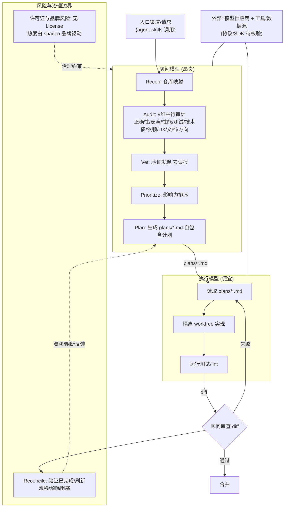

# shadcn/improve

## 一句话定位
Agent Skill 代码审计+计划编排：昂贵模型审计写计划，便宜模型执行，顾问模式定义 Agent 协作新范式。

## 它解决的问题
Coding Agent 直接让模型写代码有两个问题：(1) 最贵模型做所有事成本高；(2) 没有系统化的审计流程，质量靠运气。improve 解决的是「如何让 Agent 工作流既省钱又高质量」。

## 为什么值得关注（2026-06-11）

1. **shadcn 品牌背书** — shadcn/ui 的作者，在开发者社区有极高声誉
2. **首日 745⭐** — 1 天内获得极高关注度
3. **概念突破** — 「计划是产品」的哲学改变了对 Agent 产出的认知
4. **模型分层编排** — 顾问-执行者模式可能是 Agent 成本优化的关键范式

## 热度来源判断
- shadcn 个人品牌效应 + Agent Skill 生态正当热 + 模型分层概念切中痛点
- 技术含量高，不是蹭热度

## 关键技术亮点亮点
- **并行子 Agent 审计** — 9 个维度（正确性、安全、性能、测试覆盖、技术债、依赖、DX、文档、方向）
- **证据级发现** — 每个 finding 都有 `file:line` 级证据，不是泛泛而谈
- **顾问验证** — 昂贵模型重新验证子 Agent 发现，剔除误报
- **自包含计划** — 计划文件包含当前代码片段、精确步骤、验证门禁、停止条件
- **隔离执行** — `execute` 模式在 worktree 隔离中派发便宜模型，审查 diff 后报告
- **对账机制** — `reconcile` 命令验证已完成、刷新漂移、解除阻塞

## 架构师速览

| 决策问题 | 研究判断 | 证据边界 |
|---|---|---|
| 系统边界 | shadcn/improve 是位于入口渠道、模型供应商、工具/数据源之间的 Markdown/Skill 类编排层：文档化"顾问模型（昂贵）"与"执行模型（便宜）"分层，并经 plans/*.md 计划文件做交接 | 仅基于档案中语言/标签/架构启发图与文本描述，具体协议、运行时、部署形态"待核验" |
| 主路径 | 顾问模型串联 Recon→Audit（9 维并行）→Vet→Prioritize→Plan；执行模型读取 plans/*.md，在 worktree 隔离中实现并跑测试/lint；最后由顾问审查 diff，通过则合并，失败回退到执行 | 主路径由档案"关键技术亮点"与"架构启发"图明示，但子 Agent 并发调度器、测试/lint 命令集、worktree 持久化"待核验" |
| 关键权衡 | 计划质量与模型能力耦合（昂贵模型审计 + 便宜模型执行） vs. 误报剔除与对账成本；自包含计划提升可审计性 vs. 计划漂移风险（reconcile 仅作缓解） | 权衡由档案"风险/局限"与亮点推断；具体错误率、模型成本、吞吐数据"待核验" |
| 最小 PoC | 单一代码库 + 单一执行渠道 + 最少工具权限；仅启用 Recon→Audit→Plan→execute→reconcile 主链；关键验收：审计 finding 带 file:line、计划可独立执行、worktree 隔离可回退、停止条件与对账生效 | 验证门禁取自档案"自包含计划/对账机制"；许可证缺位、缺乏大规模使用数据须在 PoC 前澄清 |

## 架构启发

## 架构图（MMD）

> 证据边界：此图只采用本档案已有可核验描述；“待核验”节点不应视为项目实现事实。

**启发 1：** Agent 工作流应该区分「需要智能的环节」和「需要执行的环节」，用不同模型处理。
**启发 2：** 「计划是产品」的哲学意味着 Agent 的产出不一定都是代码，高质量的规格说明本身就是价值。
**启发 3：** 验证门禁和对账机制是保证 Agent 工作流可靠性的关键。

## 定位判断
**平台候选。** 这不仅是一个工具，而是一个编排模式的参考实现。如果「顾问-执行者」模式成为 Agent 工作流标准，improve 就是这个标准的基础。

## 风险/局限/泡沫点
1. **品牌驱动 > 技术验证** — 首日热度很大程度来自 shadcn 品牌，缺乏大规模使用验证
2. **计划质量依赖模型** — 如果模型能力不足，审计和计划质量会严重下降
3. **Agent Skill 生态碎片化** — 目前各项目各自为战，缺乏统一标准
4. **无 License** — 目前没有明确开源协议

## 与同类项目的关系
- **guard-skills** — 互补关系，guard-skills 做质量门禁，improve 做审计编排
- **ECC** — 竞争/互补，ECC 是完整的 Agent Harness，improve 聚焦审计-计划环节
- **superpowers** — 互补，superpowers 是方法论框架，improve 是具体工作流实现

## 是否值得持续跟踪
✅ 是。这是 Agent 编排范式的重要实验。

## 后续观察点
1. 是否形成 agent-skills.io 生态的标准模式
2. 计划质量在不同类型项目上的表现
3. 社区是否基于此模式构建更多编排工具
4. 是否出现企业级使用案例
