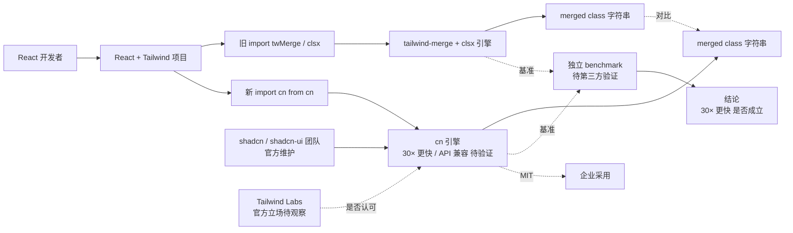

# shadcn-ui/cn

## 一句话定位
shadcn/ui 团队官方发布的 Tailwind class merging / conflict resolution 引擎——宣称 30× 更快 + 同 API + 完整兼容，作为 tailwind-merge 和 clsx 的替代品。

## 它解决的问题
React + Tailwind 生态中，几乎所有组件都需要"合并多个 class 字符串 + 解决冲突"——例如 `twMerge("p-2", "p-4")` 应该输出 `"p-4"`（后写覆盖前写）。`tailwind-merge` 和 `clsx` 是这个领域的事实标准——tailwind-merge 处理冲突解决，clsx 处理条件 class。但这两个包都有性能问题（合并大量 class 时较慢）且 API 分裂（开发者需要同时引入两个包）。`shadcn-ui/cn` 由 shadcn/ui 团队亲自下场做：宣称 **(a) 30× 更快**（独立 benchmark 待验证），**(b) 完整 API 兼容**（可直接替换 tailwind-merge 和 clsx），**(c) 统一入口**（一个包覆盖两个功能）。shadcn/ui 在 React 生态的权威性使 cn 具备"事实标准候选"的地位。

## 为什么值得关注（2026-09-05）
- **Stars:** 1,099（截至 2026-09-05），5 天即达 1.1k⭐，处于"早期爆发 + 持续增长"阶段
- **Forks:** 7 / 5 天，**0.6% fork/star 比极低**——典型"基础设施被围观但不动手"模式（绝大多数人 star 但不 fork）
- **License:** MIT
- **语言:** TypeScript
- **活跃度:** created 2026-08-31，pushed_at 2026-09-04，5 天内快速进入 1.1k⭐ 区间
- **规模:** 1.8MB
- **Topics:** 完整度 5 项（clsx / cn / shadcn / tailwind-merge / tailwindcss）——SEO 完整
- **发布渠道:** shadcn/ui 官方仓库，shadcn 本人 / 团队亲自维护

## 热度来源判断
`shadcn-ui/cn` 的热度是 **"shadcn/ui 官方权威 × Tailwind 生态核心痛点 × 30× 更快 + API 兼容的明确卖点"** 的强组合。shadcn/ui 是 React 生态最热的 UI 组件库（非传统 npm 包，而是把源码复制到项目里的"可复制分发"模式），shadcn 本人是 React 社区最具影响力的开发者之一。cn 由 shadcn/ui 团队亲自下场做"通用基础库"（不再局限于 UI 组件），是 shadcn 生态从"组件库"向"前端基础设施"扩展的标志。1,099⭐ / 5 天的爆发力 + 0.6% fork/star 极低 + shadcn 官方权威，说明这是真实需求而非 hype。热度**真实且具有事实标准候选价值**——但需警惕：(1) "30× 更快"是单方宣称，第三方 benchmark 验证前是 unknown；(2) "完整 API 兼容"shadcn 自证，第三方验证前是 unknown；(3) Tailwind Labs 官方立场未观察。

## 关键技术亮点
1. **shadcn/ui 官方权威分发**：shadcn 本人 / 团队亲自维护，README / 代码风格 / 测试覆盖均与 shadcn/ui 项目对齐
2. **30× 更快（单方宣称）**：与 tailwind-merge / clsx 对比，宣称 30× 更快——第三方 benchmark 待验证
3. **完整 API 兼容**：可"直接替换" tailwind-merge 和 clsx——shadcn 自证，第三方验证待核验
4. **MIT License 商业可用**：相比 NOASSERTION / Fair Source，MIT 是企业最友好的开源协议
5. **Topics 完整度 5 项**：clsx / cn / shadcn / tailwind-merge / tailwindcss——SEO 完整
6. **1.8MB 小巧仓库**：纯引擎实现，无重型依赖

## 架构师速览

| 决策问题 | 研究判断 | 证据边界 |
|---|---|---|
| 系统边界 | Tailwind class merging / conflict resolution 引擎（cn）—— shadcn/ui 官方权威分发 | 引擎边界由 description 明示；具体合并规则（覆盖优先级 / 冲突解决）需 README 核验 |
| 主路径 | Tailwind class 字符串 → cn 引擎 → merged + conflict-resolved class 字符串 → 输出给 React | 主路径为 description 抽象；具体合并算法（基于 tailwind-merge 算法 / 重新实现）需核验 |
| 关键权衡 | "30× 更快" 单方宣称 vs 第三方 benchmark；"完整 API 兼容" shadcn 自证 vs 第三方验证；"shadcn/ui 官方权威" vs "Tailwind Labs 官方立场" | 1.8MB 来自 API；MIT License 商业可用；30× 速度宣称需独立 benchmark（同一 React 项目替换前后对比 bundle size / runtime）；Tailwind Labs 官方是否认可"cn" 名称与"官方引擎"定位未观察 |
| 最小 PoC | 在一个 React + Tailwind 项目中 → npm i cn → 替换 import { twMerge } from 'tailwind-merge' 为 import { cn } from 'cn' → 跑同一组件 bundle 对比大小 → 跑同一渲染对比耗时 → 测试 class 合并结果是否完全一致 | 安装命令需 README 独立核验；具体性能差异需 benchmark 验证 |

## 架构启发
`shadcn-ui/cn` 的核心启发是 **"shadcn 生态从组件库扩展到前端基础设施 + 大厂/大 IP 亲自下场做基础库"**。shadcn/ui 此前以"可复制 UI 组件"分发模式著称（开发者把组件代码复制到项目里），cn 是 shadcn 团队首次下场做"通用基础库"——不再局限于 UI 组件，而是面向所有 React + Tailwind 项目的"基础设施"。更深层的启发是：**"大 IP 亲自下场做基础库的胜负关键在于 benchmark 透明度"**——30× 更快是 cn 的核心卖点，但这是单方宣称，第三方独立 benchmark（如同一项目替换前后对比 bundle size / runtime / 1000-class 合并耗时）尚未公开。如果 cn 能提供完整 benchmark 数据 + 第三方复现，它会成为 tailwind-merge / clsx 的事实标准替代品；如果不能，shadcn 的权威性能否压过 Tailwind Labs 的官方立场是关键变量。

## 架构图（MMD）

> 证据边界：此图只采用本档案已有可核验描述；"待核验"节点不应视为项目实现事实。

## 定位判断
**工具型项目（Tailwind 生态基础库候选）。** `shadcn-ui/cn` 不仅是替代 tailwind-merge / clsx 的实现，更可能是 shadcn 生态从"组件库"向"前端基础设施"扩展的标志——把 shadcn 的权威性从 UI 组件延伸到 class merging 引擎。1.1k⭐ / 5 天的爆发力 + shadcn 官方权威 + MIT License + 明确卖点（30× 更快 / API 兼容），说明这不是实验性项目。但"基础库候选"的胜负取决于：(1) 第三方 benchmark 是否验证 30× 更快的宣称；(2) 第三方测试是否验证 API 完全兼容；(3) Tailwind Labs 官方立场（认可 / 中立 / 反对）；(4) 社区是否愿意从 tailwind-merge / clsx 迁移到 cn。

## 风险 / 局限 / 泡沫点
- **30× 更快的单方宣称**：1,099⭐ 但 7 forks，第三方 benchmark（同一 React 项目替换前后对比 bundle / runtime）需独立验证
- **API 完全兼容的验证缺失**："Same APIs. Full parity." 是 shadcn 自证，需第三方测试覆盖所有边界情况（嵌套 class / 条件 class / 动态 class 等）
- **Tailwind Labs 官方立场未观察**：Tailwind Labs 是否认可 cn 为"官方引擎" / "推荐替代品"未观察——如果 Tailwind Labs 推出官方合并引擎，cn 可能被边缘化
- **shadcn 个人依赖**：shadcn 本人是项目主导者，治理上高度依赖个人，bus factor 风险需评估
- **0.6% fork/star 极低**：虽然 star 数可观，但 fork 极少，说明真实采用率待观察（多数人 star 但未实际迁移）
- **依赖 React + Tailwind**：仅适用于 React + Tailwind 生态，Vue / Svelte / Solid.js 等其他框架不适用
- **单一语言（TypeScript）**：仅支持 TypeScript，与 JavaScript 项目集成需类型声明

## 与同类项目的关系
- **vs tailwind-merge / clsx**：cn 直接对标这两个包，宣称更快的合并性能 + API 兼容——shadcn 官方权威性是 cn 的核心优势
- **vs classnames / clsx 等条件 class 库**：这些是条件 class 库（无合并冲突解决）；cn 是合并 + 条件一体
- **vs Tailwind Labs 官方合并工具**：Tailwind Labs 是否有官方合并引擎 / 推荐工具未观察——如果 Tailwind Labs 推出官方引擎，cn 可能成为"竞品"
- **vs class-variance-authority (cva)**：cva 是 shadcn 生态的条件 class 库，与 cn 互补（cva 处理条件，cn 处理合并）

## 是否值得持续跟踪
**值得跟踪（Tailwind 生态基础库候选）。** `shadcn-ui/cn` 代表了 shadcn 生态从"组件库"扩展到"前端基础设施"的拐点，且 Tailwind class merging 是 React 生态的高频痛点。建议关注：(1) 第三方 benchmark 是否验证 30× 更快的宣称；(2) 第三方测试是否验证 API 完全兼容；(3) Tailwind Labs 官方立场；(4) 社区迁移率（多少项目从 tailwind-merge / clsx 迁移到 cn）。对 React + Tailwind 开发者，这是值得试验的 class merging 替代品（先在非生产项目替换 tailwind-merge 验证性能差异）；对 Tailwind 生态观察者，它是"shadcn 是否能跨出组件库边界"的关键测试。

## 后续观察点
- 第三方 benchmark（bundle size / runtime / 1000-class 合并耗时）验证
- 第三方测试覆盖所有边界情况（嵌套 / 条件 / 动态 class）
- Tailwind Labs 官方立场（认可 / 中立 / 反对）
- 社区迁移率（多少项目从 tailwind-merge / clsx 迁移到 cn）
- shadcn/ui 后续是否推出其他基础库（form / router / auth 等）
- cn 是否扩展到其他框架（Vue / Svelte / Solid.js）
- 7 forks / 0.6% fork/star 是否会随时间上升（真实采用信号）

---
*首次记录：2026-09-05；数据来源: GitHub API (2026-09-05) | Stars: 1,099 | Forks: 7 | License: MIT | 语言: TypeScript | 创建: 2026-08-31*