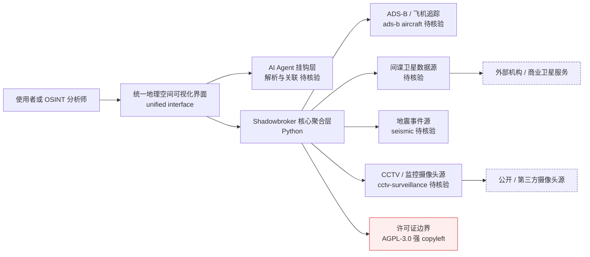

# BigBodyCobain/Shadowbroker — Open-source intelligence for the global theater. Track everything from the corpo

## 一句话定位

Open-source intelligence for the global theater. Track everything from the corporate/private jets of the wealthy, and spy satellites, to seismic events in one unified interface. Hook an AI agent up to have it parse through data and find previously unseen correlations. The knowledge is available to all but rarely aggregated in the open, until now.。主要使用 Python 编写，当前 10,735 stars / 1,708 forks / 89 subscribers。

## 它解决的问题

**目标用户**：使用 python 生态的开发者、AI Agent 构建者。

**痛点**：该项目解决的核心问题是 Open-source intelligence for the global theater. Track everything from the corporate/private jets of the wealthy, and spy satellites, to seismic events in one unified interface. Hook an AI agent up to have it parse through data and find previously unseen correlations. The knowledge is available to all but rarely aggregated in the open, until now.。从 README 来看，项目提供了 
 <h1 align="center">🛰️ S H A D O W B R O K E R</h1> 
<strong>Global Threat Intercept — Real-Time Geospatial Intelligence Platform</strong>
 
 </p。

**场景**：适用于需要 ads-b, adsb, aircraft 的开发场景。

## 为什么值得关注（2026-05-19）

1. **Stars 增长**：10,735 stars，1,708 forks——fork/star 比为 15.9% （高 fork 比例说明部署/集成意愿强）
2. **活跃度**：创建于 2026-03-05，最后更新 2026-08-10，无 open issues
3. **技术栈**：Python，License: AGPL-3.0
4. **生态定位**：Topics: ads-b, adsb, aircraft, aircraft-tracking, asdb

## 热度来源判断

**真实需求信号**：forks 1708（高部署意愿），subscribers 89（深度关注）。

**品类时机**：从 topics 来看，ads-b, adsb, aircraft 是当前社区关注的方向。

## 关键技术亮点

1. **
**
2. **<h1 align="center">🛰️ S H A D O W B R O K E R</h1>**
3. **
<strong>Global Threat Intercept — Real-Time Geospatial Intelligence Platform</stro**
4. **
**

## 架构师速览

| 决策问题 | 研究判断 | 证据边界 |
|---|---|---|
| 系统边界 | 项目以 Python 构建统一地理空间 OSINT 前端，档案明确覆盖 ADS-B 飞机、私人/企业公务机、间谍卫星、地震事件、CCTV 五类情报域，定位为面向全局态势的聚合与可视化层，而非单一数据源。 | 仅基于 README 一句话定位、tags（ads-b、adsb、aircraft、aircraft-tracking、asdb、cctv、cctv-cameras、cctv-surveillance）与"Global Threat Intercept — Real-Time Geospatial Intelligence Platform"标题；具体数据接入协议、卫星接口、震源 API 未经源码核实。 |
| 主路径 | 数据采集（多源 ADS-B/卫星/地震/CCTV）→ 统一聚合层 → 实时地理空间可视化界面 → 可选 AI Agent 挂钩用于关联解析。 | 路径由定位描述与"unified interface"措辞推导；ADS-B 接收链路、地震事件源、CCTV 来源、Agent 接入方式在档案中均无实现细节。 |
| 关键权衡 | 跨域数据汇聚带来的合规与版权风险（AGPL-3.0 强 copyleft、私人飞行数据与 CCTV 数据的采集合法性），以及多源异构数据实时性与覆盖广度之间的取舍。 | License (AGPL-3.0) 与多类敏感数据源已确认；具体合规策略、数据更新频率、延迟指标档案未给出。 |
| 最小 PoC | 克隆仓库 → 启动 Python 入口 → 接通单一 ADS-B 数据源（如 dump1090）→ 验证飞机轨迹在地图界面实时呈现 → 再逐步接入地震/CCTV/卫星任一异构源验证聚合层。 | 部署形态（CLI/服务/Docker）、依赖清单、地图组件、配置文件结构档案未列出，均需源码核验；以下步骤属"待核验"。 |

## 架构启发

从 BigBodyCobain/Shadowbroker 的设计来看，核心思路是 **"Open-source intelligence for the global theater. Track every"**。这反映了 Python 生态中 Agent / AI 工具链 的演进方向——降低集成复杂度、提供开箱即用的能力。开源 License (AGPL-3.0) 降低了采用门槛。

## 架构图（MMD）

> 证据边界：此图只采用本档案已有可核验描述；“待核验”节点不应视为项目实现事实。

## 定位判断

**工具型**。在生态中定位为Open-source intelligence for the global 方向的工具。Stars 10735 说明已有一定社区基础。

## 风险 / 局限 / 泡沫点

1. **规模风险**：10,735 stars，但 fork 1708 说明有实际部署
2. **维护风险**：最后 push 时间 2026-08-10，活跃维护中
3. **Open Issues**：无 open issues
4. **License**：AGPL-3.0

## 与同类项目的关系

- 与同 Python 生态的同类工具形成竞争/互补关系。具体竞品对比需参考社区讨论。
- 从 topics (ads-b, adsb, aircraft) 来看，与关注 ads-b 的其他项目有交叉。

## 是否值得持续跟踪

**是。** 10735 stars + 活跃更新说明项目有持续价值。建议关注后续版本迭代和社区增长。

## 后续观察点

1. Star 增速是否可持续（当前 10,735）
2. Fork 增长趋势（当前 1,708）
3. 功能迭代频率（最后更新 2026-08-10）
4. 社区活跃度（subscribers 89, open issues 0）

---
> 数据来源: GitHub API (2026-08-10) | Stars: 10,735 | Forks: 1,708 | License: AGPL-3.0 | 语言: Python | 创建: 2026-03-05
