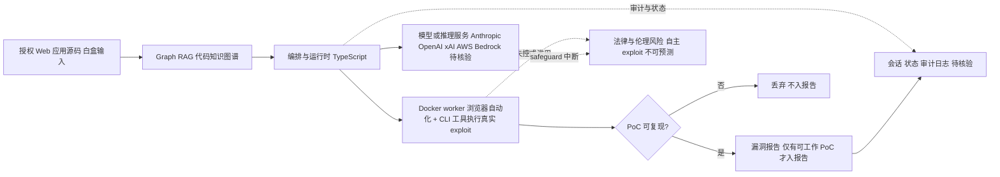

# Shannon — 自主式 AI 渗透测试工具

## 一句话定位

Keygraph 出品的自主式 AI 渗透测试工具（Shannon 2.0），分析 Web 应用源码识别攻击向量，然后**真实执行漏洞利用**来证明漏洞存在。区别于传统 SAST 的静态分析，定位是"白盒 + 真实攻击"。

## 它解决的问题

渗透测试通常一年只做一次，而代码每天都在部署 — 形成"持续部署 vs 年度渗透测试"的安全缺口。Shannon 提供按需自动化渗透测试，可以对每次构建/发布运行。只有存在可工作的 PoC 的漏洞才进入最终报告。

## 为什么值得关注

- **46,504 stars / 5,372 forks**，AGPL-3.0，Trendshift 认证
- **Shannon 2.0 已发布**，支持 Web 应用和 API 安全测试
- **真实攻击执行**：不是只报告漏洞，而是用浏览器自动化和 CLI 工具执行真实 exploit
- 有 sample report（OWASP Juice Shop 20+ 漏洞、c{api}tal 15+ API 漏洞、crAPI 15+ 漏洞）
- 双版本：Shannon Open Source（本仓库，本地运行）+ Keygraph 平台（商业版）
- 支持 Anthropic/OpenAI/xAI/AWS Bedrock 多家 AI provider

## 热度来源判断

- **泡沫指数：高。** 46K stars 主要来自"AI + 安全"的热点效应
- star-to-fork 比（8.6:1）偏低，说明实际使用和深度参与的比例较低
- 争议性（"自主执行攻击"）带来的话题关注度
- 但 sample report 的质量说明技术上有实际产出

## 关键技术亮点亮点

1. **Graph RAG 架构**：基于代码知识图谱理解代码结构和依赖关系
2. **源码级别分析**：白盒分析，理解代码语义而非黑盒扫描
3. **真实攻击执行**：浏览器自动化 + CLI 工具执行真实 exploit，只有 PoC 可复现才报告
4. **多 AI provider 支持**：Anthropic（推荐）、OpenAI、xAI、AWS Bedrock
5. **Worker 容器化**：Docker worker 隔离执行环境
6. **Cyber safeguards 适配**：需先完成 Anthropic/OpenAI 的安全研究者认证流程

## 架构师速览

| 决策问题 | 研究判断 | 证据边界 |
|---|---|---|
| 系统边界 | Shannon 是一个本地运行的 TypeScript 编排层，把白盒源码接入 Graph RAG、浏览器自动化与 CLI 工具，对外调用 Anthropic/OpenAI/xAI/AWS Bedrock 等模型；AGPL-3.0 约束商业集成边界。 | 基于 tags（AI-pentester、Graph-RAG、automated-exploitation、white-box）、license 与档案正文，未引用具体源码模块路径。 |
| 主路径 | 源码输入 → Graph RAG 代码知识图谱 → 模型推理攻击向量 → Docker worker 隔离的浏览器/CLI 工具执行真实 exploit → 仅当 PoC 可复现才写入报告（OWASP Juice Shop、c{api}tal、crAPI 三类样本报告佐证）。 | 主路径由"白盒 + 真实攻击 + worker 容器化"等档案要点拼接；具体协议、状态机、持久化方式未在档案中给出。 |
| 关键权衡 | 真实 exploit 执行 vs 法律/伦理与 AI provider safeguard 中断风险；Graph RAG 语义深度 vs 需完整源码访问带来的适用面收窄；AGPL-3.0 vs 商业平台（Keygraph SaaS）双轨。 | 取自档案"风险/局限/泡沫点"小节；性能与检出指标档案未给出。 |
| 最小 PoC | 在授权靶场（OWASP Juice Shop 或 crAPI 之类开源易受攻击应用）上以单一 AI provider、关闭对外网络广播的 Docker worker 配置跑通端到端 PoC 生成；将"cyber safeguards 认证完成、可审计日志、可回滚 worker 镜像"列为验收项。 | PoC 选型来自档案"sample report"小节；具体执行命令、worker 镜像标签、provider 认证流程档案未细化，须读 README/源码核验。 |

## 架构启发

Graph RAG 在代码安全分析中的应用值得研究 — 将代码结构化为知识图谱，然后基于图谱推理攻击路径。但从工程角度看，Shannon 更像是"AI Code Review + 攻击性输出"的组合，而非真正的渗透测试自动化。

## 架构图（MMD）

> 证据边界：此图只采用本档案已有可核验描述；“待核验”节点不应视为项目实现事实。

## 定位判断

**泡沫型/学习型。** 不建议企业落地，技术思路（Graph RAG + 自主攻击）有参考价值，但 46K stars 中泡沫成分大。

## 风险 / 局限 / 泡沫点

1. **"真实执行漏洞利用"面临巨大法律和伦理风险** — 即使在授权环境中，自主攻击链的行为不可预测
2. 46K stars 的增长主要来自"AI + 安全"的热点效应，大量是看热闹的开发者
3. star-to-fork 比低（8.6:1），实际使用比例低
4. 自动化漏洞利用在实践中面临社会责任压力
5. AI provider 的 cyber safeguards 可能中断扫描
6. AGPL-3.0 限制商业集成
7. 需要完整源码访问（白盒），适用场景受限

## 与同类项目的关系

- **传统 SAST（SonarQube / Semgrep）**：静态分析，Shannon 在其上增加动态攻击
- **传统 DAST（Burp Suite / OWASP ZAP）**：黑盒扫描，Shannon 结合白盒源码分析
- **AI Code Review 工具**：Shannon 是"AI Code Review + 攻击性输出"
- **Keygraph 平台**：Shannon 的商业 SaaS 版本

## 是否值得持续跟踪

**不建议持续跟踪。** 但作为安全态势感知（了解 AI 渗透测试的演进）可以偶尔关注。Graph RAG 在代码分析中的应用思路有技术参考价值。

## 后续观察点

1. 法律监管对自动化渗透测试工具的态度
2. AI provider 对 cyber security workload 的 safeguard 策略变化
3. Shannon 2.0 的实际采用案例（企业安全团队）
4. Keygraph 商业平台的增长情况
5. 是否有竞品采用类似 Graph RAG + 自主攻击架构
