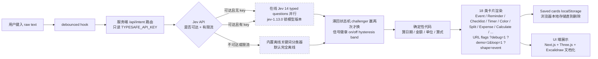

# anishfn/shapeshift

## 一句话定位
一个文本框根据输入自动变出对应卡片（Event / Reminder / Checklist / Timer / Color / Split / Expense / Calculate 等 18 类）的 Jev 决策 UI ——「Jev decides, code computes」：Jev 一次判断 14 个 typed questions 决定走哪张卡片，日期 / 金额 / 单位 / 算式全用确定性代码，内置离线关键词分类器兜底。

## 它解决的问题
自然语言输入（`dinner with priya friday 8pm on zoom`）需要变出对应结构化 UI（Event card · Friday · 8 PM · Priya · Video call），用户期望立刻反馈而非等待；模型每次都答需要稳定性（滞回状态机 challenger 赢两次才换卡片）；离线场景不能断（内置离线关键词分类器）；不能让 LLM 算简单日期 / 金额 / 单位 / 算式（确定性代码）。它解决的是「自然语言 → 对应结构化 UI + 离线可用 + 不让 LLM 算简单问题 + 防抖 + 18 类卡片」四件事一次解决的真痛点。

## 为什么值得关注
- **Stars:** 387（截至 2026-09-24），2 天突破 387，增速极快
- **Forks:** 43，社区贡献较活跃
- **Watchers/Subscribers:** 1（公开 API 字段）
- **Open Issues:** 2，维护良好
- **License:** MIT
- **语言:** TypeScript（含大量 Markdown 文档）
- **活跃度:** created 2026-09-22，pushed_at 2026-09-23，持续高活跃
- **规模:** 12.1MB，Next.js + Three.js + Vite + Excalidraw 完整应用
- **Topics:** 无（未填写 GitHub topics）
- **在线 demo:** shapeshiftui.vercel.app

## 热度来源判断
anishfn/shapeshift 的热度是 **「Jev 决策模型应用层 UI 端具身化刚需 × Jev decides, code computes 严肃设计哲学 × 18 类卡片覆盖度 × 内置离线兜底 × 滞回状态机防抖 × URL 参数可视化 × Next.js + Three.js + Excalidraw 文档化」** 的强劲组合。Jev 已是 2026 年最热决策模型赛道（09-19 ~ 09-23 连续 9 项目构 Jev 后端 → 应用层演化），但缺乏「UI 端具身形态」的具体实现。shapeshift 直击这一痛点——它提供 **一个文本框变出对应卡片** 的具身交互，Jev 一次判断 14 个 typed questions 决定走哪张卡片 + 确定性代码算日期 / 金额 / 单位 / 算式 + 内置离线兜底 + 滞回状态机 challenger 赢两次才换 + URL 参数 `?debug=1` 显示每个概率 `?demo=1&loop=1` 播放脚本演示。热度**真实且具应用层具身化潜力**——但需警惕：Jev API 限流时自动 fallback 离线模式，离线分类器准确率是否能覆盖 18 类卡片？滞回状态机 challenger 赢两次延迟是否会让用户感觉慢？Next.js + Three.js + Excalidraw 大型前端在低端浏览器的性能？

## 关键技术亮点
1. **Jev 14 typed questions 并行回答** —— 一次调用答 14 个 typed questions（哪类卡片 + 顺便给信号如「is it a video call?」「is it urgent?」），决定走哪张卡片
2. **Jev decides, code computes** —— 模型擅长的事（意图判断 + 模糊信号）和代码擅长的事（精确日期 / 金额 / 算式）分开；日期 / 金额 / 单位 / 算式全用确定性代码
3. **内置离线兜底** —— 内置关键词分类器默认完全离线，填 TYPESAFE_API_KEY 才切到 online Jev model，断网 / 限流自动 fallback
4. **滞回状态机 challenger 赢两次才换** —— 原始模型输出每键抖动，小状态机把 confidence 翻译为 calm UI states：challenger 赢两次才换卡片（否则稳态）
5. **18 类卡片** —— Event / Reminder / Checklist / Timer / Habit / Color / Split / Expense / Convert / Calculate / Trip / Poll / Contact / Bookmark / Countdown / Time zone / Random / Goal / Note 19 类（含 Note 兜底）
6. **URL 参数可视化** —— `?debug=1` 显示每个概率 / `?demo=1&loop=1` 播放脚本演示 / `?shape=event` 强制卡片类型
7. **Next.js + Three.js + Vite + Excalidraw 文档化** —— docs/diagrams/*.excalidraw 在 excalidraw.com 打开可编辑
8. **Bun 1.2+** —— 快速安装依赖
9. **key 服务端 `/api/intent` 只读** —— TYPESAFE_API_KEY 只在服务端读，不进浏览器
10. **Saved cards localStorage** —— Saved cards live in your browser (`localStorage`) until you delete them

## 架构师速览

| 决策问题 | 研究判断 | 证据边界 |
|---|---|---|
| 系统边界 | Next.js 单页前端 + 服务端 `/api/intent` 决策路由；前端用 Bun 1.2+ 启动；客户端只发 raw text，服务端用 TYPESAFE_API_KEY 调 Jev API 或 fallback 到内置离线关键词分类器 | 仅基于 README 公开摘录 + GitHub Search API 元数据；具体离线关键词分类器实现、Next.js 路由结构、Three.js 用途（仅文档化图表？）未在档案中给出 |
| 主路径 | 用户键入 raw text → debounced hook → 服务端 `/api/intent` → Jev 14 typed questions 并行回答或离线关键词分类器 → 滞回状态机 challenger 赢两次才换 → 确定性代码算日期 / 金额 / 单位 / 算式 → 渲染对应卡片 | 主路径为 README 语义抽象；debounce 时长、滞回 challenger 赢两次延迟、信号徽章滞回带宽具体阈值、Three.js 是否仅用于 docs/diagrams 渲染均待核验 |
| 关键权衡 | 模型擅长的事（意图判断 + 模糊信号）vs 代码擅长的事（精确日期 / 金额 / 算式）vs 模型每键抖动 vs 滞回 challenger 赢两次延迟 vs 在线 Jev API 限流 vs 离线分类器准确率 | 档案明示「Jev decides, code computes」 + 「challenger 赢两次才换」 + 「API 不可达或限流自动回离线模式」三点权衡；具体滞回阈值、离线分类器覆盖率、SLA 未证实 |
| 最小 PoC | 在 shapeshiftui.vercel.app 在线 demo 输入 `dinner with priya friday 8pm on zoom` 验证 Event 卡片 + `split 2400 between 3` 验证 Split 卡片 + `minecraft diamond` 验证 Color 卡片 → 断网后重测验证离线 fallback → `?debug=1` 重测验证滞回 challenger 赢两次延迟 | PoC 范围、退出路径由档案「先核心卡片、最小可验证、断网 fallback、debug 可视化」建议推导；具体滞回延迟阈值、SLA 指标待核验 |

## 架构启发
anishfn/shapeshift 的核心启发是 **「Jev decides, code computes」—— 把模型擅长的事（意图判断 + 模糊信号）和代码擅长的事（精确日期 / 金额 / 算式）严格分开**。当前所有 LLM UI 工具都让模型生成完整结构（模型既要判断意图又要算日期算金额），违背模型 + 代码各自的擅长边界，引入抖动 + 算错风险。shapeshift 尝试做「Jev 应用层 UI 端具身的严格分层」，模型只答 14 个 typed questions 决定走哪张卡片 + 模糊信号，日期 / 金额 / 单位 / 算式全用确定性代码。更深层的启发是：**「滞回状态机 challenger 赢两次才换」是 UI 端防抖的关键模式**——原始模型输出每键抖动，直接渲染会让 UI 抖动；用 challenger 赢两次才换的状态机把 confidence 翻译为 calm UI states 是「模型输出 → 用户体验」的转化层。再深一层：**「URL 参数 ?debug=1 ?demo=1&loop=1 ?shape=event」是把决策可视化嵌入产品本身**——用户和开发者都能用 URL 直接探查每个概率 / 播放脚本演示 / 强制卡片类型，是产品级 debug 与 onboarding 的严肃工程化设计。

## 架构图（MMD）

> 证据边界：此图只采用本档案已有可核验描述；"待核验"节点不应视为项目实现事实。

## 定位判断
**应用层候选型项目（Jev 应用层 UI 端具身形态）。** anishfn/shapeshift 不仅是一个 UI 工具，更试图成为 **Jev 决策模型应用层 UI 端具身的最佳实践** ——Jev decides, code computes 严肃设计哲学 + 18 类卡片覆盖 + 滞回状态机 challenger 赢两次才换 + 内置离线兜底 + URL 参数可视化 + Next.js + Three.js + Excalidraw 文档化。387⭐ + 43 forks + online demo shapeshiftui.vercel.app 已显示「Jev 应用层 UI 端具身」的早期形态。能否持续，取决于一个关键问题：**Jev API 限流时自动 fallback 离线模式，离线分类器准确率是否能覆盖 18 类卡片？** 目前定位是「Jev 决策模型 UI 端具身的最佳实践」，向更多卡片类型（Todo / Email / CRM / Calendar 等）演化是合理路径。

## 风险 / 局限 / 泡沫点
- **Jev API 依赖**：强依赖 TypeSafe AI Jev API / OpenRouter Jev key，若 TypeSafe AI 调整 API、定价或文档，所有应用层需同步调整
- **离线 fallback 准确率**：内置离线关键词分类器默认完全离线，断网 / 限流时 fallback，但离线分类器对 18 类卡片的覆盖准确率未公开验证
- **滞回延迟**：challenger 赢两次才换卡片防抖，在多用户打字速度下的延迟可能让用户感觉慢
- **Next.js + Three.js 大型前端**：低端浏览器的性能可能受影响
- **TypeScript 完整应用**：12.1MB 规模较大，维护成本高
- **个人开发者属性**：anishfn 个人维护，43 forks 但核心治理仍集中，可持续性存疑

## 与同类项目的关系
- **vs Rizzo-AI-Academy/rizzo-flow**（09-22）：后者是「Spark-X2.5 4B Jev 兼容 0 generated tokens 后端 API」；shapeshift 是「Jev 应用层 UI 端具身形态」，互补
- **vs TianyuCodings/JevHarness**（09-22）：后者是「LLM 写 harness + GEPA 全轨迹反思」；shapeshift 是「UI 端 18 类卡片具身」，互补
- **vs miuuyy/Astra-Ares**（09-24）：后者是「Jev 在 Codex 任务里动态选 reasoning effort」；shapeshift 是「Jev 在 UI 端决策走哪张卡片」，互补
- **vs unreallabsai/unreal-agent**（09-23）：后者是「async-first Go harness 八组件」；shapeshift 是「Next.js TypeScript UI 端具身」，互补
- **vs deepopen-com/deepopen**（09-23）：后者是「非自回归 System 1 决策引擎 Laya 改进三检查点」；shapeshift 是「Jev 应用层 UI 端」，上游依赖决策模型 API

## 是否值得持续跟踪
**值得跟踪（Jev 应用层 UI 端具身形态）。** anishfn/shapeshift 代表了 Jev 决策模型「应用层 UI 端具身化」的诉求，无论其本身成败，这一方向是行业趋势。建议关注：Jev API 稳定性 + 离线 fallback 准确率 + 滞回 challenger 赢两次延迟 + 18 类卡片覆盖度 + Next.js + Three.js 性能 + 在线 demo shapeshiftui.vercel.app 转化。对 Jev / TypeSafe 生态用户，这个项目是「Jev 应用层 UI 端具身」的具体实现路径，值得直接采用。对应用层开发者，它是「Jev decides, code computes + 滞回状态机 + 离线兜底 + URL 参数」严肃工程化路径的头部样本。

## 后续观察点
- Jev API 限流时自动 fallback 离线模式，离线分类器准确率是否能覆盖 18 类卡片
- 滞回 challenger 赢两次延迟在多用户打字速度下的实际体验
- Next.js + Three.js + Excalidraw 大型前端在低端浏览器的性能
- TypeSafe AI 是否调整 API / 定价 / 文档，影响应用层稳定性
- 是否演化为更多卡片类型（Todo / Email / CRM / Calendar 等）
- 是否有商业版 / Sponsor / 网站等组织化严肃工程化信号
- online demo shapeshiftui.vercel.app 用户转化率
- TypeScript 完整应用 12.1MB 规模在长期维护的可持续性

---
> 数据来源: GitHub API (2026-09-24) | Stars: 387 | Forks: 43 | License: MIT | 语言: TypeScript | 创建: 2026-09-22 | 在线 demo: shapeshiftui.vercel.app