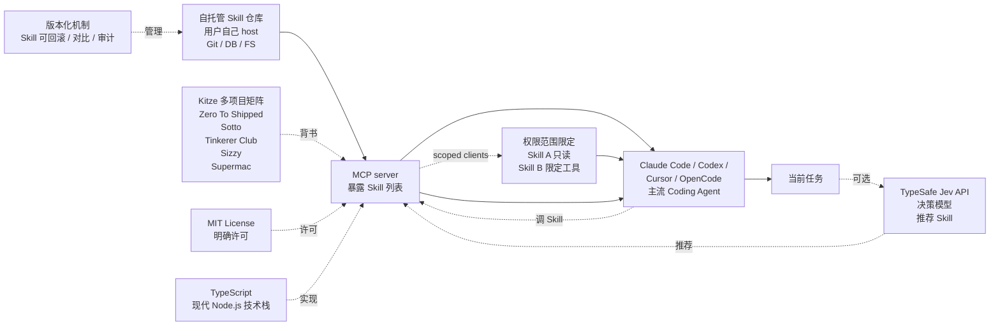

# kitze/skillbox

## 一句话定位
自托管版本化 AI agent 技能库 —— MCP（Model Context Protocol）+ scoped clients（限定权限范围）+ 可选 Jev recommendations（用 TypeSafe Jev 决策模型做 Skill 推荐），主流 Coding Agent 通用接入，知名独立开发者 Kitze（@thekitze）多项目矩阵营销。

## 它解决的问题
2026 Q3 Coding Agent Skills 生态的痛点是 **「集中式 Skill 市场有隐私 / 锁定风险」** —— wshobson/agents 等社区中心化市场（38K stars + 4K forks）虽然覆盖广但仓库所有权不在用户；**skillbox 是「自托管 + 版本化」形态** —— 你自己 host 自己的 Skill 库（含版本管理），Coding Agent 通过 MCP + scoped clients（限定权限范围）访问；**optional Jev recommendations** —— 可选集成 Jev 做 Skill 推荐（用 Jev 决策模型判断「当前任务需要哪些 Skill」）；**对企业**：CISO / 合规团队可自托管 Skill 库保证代码不外传 + 限定权限范围（scoped clients）+ 内部 Skill 版本管理；**对个人开发者**：知名独立开发者 Kitze 背书（YouTube 频道 + 多项目矩阵）增加信任度。

## 为什么值得关注（2026-09-18）
- **Stars:** 69（截至 2026-09-18），1 天 69⭐，早期严肃工程信号
- **Forks:** 7，fork/star 10.1%，处于企业 fork 信号下限
- **Watchers/Subscribers:** 0
- **Open Issues:** 2，维护中
- **License:** MIT
- **语言:** TypeScript
- **活跃度:** created 2026-09-17，pushed_at 2026-09-17
- **规模:** 191 KB（极小自托管 Skill 库）
- **Topics:** 暂无（公开元数据）

## 热度来源判断
Skillbox 的热度是 **「自托管 + 版本化 × MCP + scoped clients × 可选 Jev recommendations × 知名独立开发者 Kitze 多项目矩阵营销」** 的组合。69⭐ / 7 forks / fork/star 10.1% 在新项目中等偏高，处于「准备把 Skill 库集成进工作流」的企业 fork 信号下限。**Kitze（@thekitze）知名独立开发者** —— 5 个产品矩阵（Zero To Shipped 全栈 starter kit + Sotto macOS voice-to-text + Tinkerer Club 私有社区 + Sizzy 开发者浏览器 + Supermac macOS 命令中心）+ YouTube 频道 + X 账号 —— 主动营销曝光带来初始 star + 流量；**MCP + scoped clients** 是「Coding Agent 标准接口 + 权限范围限定」的工程化形式；**可选 Jev recommendations** 是「不强依赖 Jev 但用 Jev 决策模型增强 Skill 推荐」的具体应用。

## 关键技术亮点
1. **自托管** — self-hosted（Skill 库在你自己的服务器，不依赖中心化市场）
2. **版本化** — versioned（Skill 可回滚 / 可对比）
3. **MCP** — Model Context Protocol（当前 Coding Agent 标准接口：Claude Code / Codex / Cursor / OpenCode 都支持）
4. **scoped clients** — 限定权限范围（Skill A 只能读不能写 / Skill B 只能调特定工具）
5. **可选 Jev recommendations** — 用 TypeSafe Jev 决策模型做 Skill 推荐（不强依赖）
6. **主流 Coding Agent 通用接入** — Claude Code / Codex / Cursor / OpenCode 等
7. **MIT License** — 明确许可
8. **TypeScript** — 现代 Node.js 技术栈
9. **191 KB** — 极小规模（自托管 Skill 库不需要复杂后端）

## 架构师速览

| 决策问题 | 研究判断 | 证据边界 |
|---|---|---|
| 系统边界 | 自托管版本化 AI agent 技能库；输入 Skill 列表（自托管仓库）；输出 Skill 推荐 + MCP 接入 + scoped clients 权限管理；MCP + scoped clients + 可选 Jev recommendations；自托管 + 版本化；主流 Coding Agent 通用接入；Kitze 知名独立开发者多项目矩阵营销；TypeScript MIT 191 KB | 来自 README 关于「Self-hosted, versioned skills library for AI agents」「MCP, scoped clients, and optional Jev recommendations」的明示 + Kitze 多项目矩阵（Zero To Shipped / Sotto / Tinkerer Club / Sizzy / Supermac）；具体 MCP server 实现细节、scoped clients 的权限范围配置 schema、Jev recommendations 的具体决策逻辑、自托管部署方式（Docker / 裸机 / 平台）在 README 未完全展开 |
| 主路径 | 自托管 Skill 库 → MCP server 暴露 Skill 列表给 Coding Agent → Coding Agent 通过 MCP 调 Skill（scoped clients 限定权限）→ 可选 Jev 推荐「当前任务需要哪些 Skill」→ 版本化机制支持 Skill 回滚 / 对比 / 审计 | 主路径来自 README 描述的「MCP + scoped clients + optional Jev recommendations + self-hosted + versioned」组合；具体 MCP server 启动方式、scoped clients 权限管理 UI、Jev 推荐的具体决策模型、版本化机制（Git / DB / 文件系统）在 README 未完全展开 |
| 关键权衡 | 自托管 vs 中心化市场（隐私可控 vs 社区资源丰富）/ scoped clients vs 全权限（安全 vs 灵活）/ 可选 Jev vs 强制 Jev（不锁定 vs 增强推荐）/ 版本化 vs 无版本（可回滚 vs 简单）/ TypeScript vs Python / Go（Node 生态 vs 多语言生态）/ 知名独立开发者背书 vs 社区维护（个人风格 vs 持续性）/ 主流 Coding Agent 通用 vs 单一 Coding Agent 优化（覆盖广 vs 优化深） | 权衡 7 因素均从 README + 元数据推导；具体 MCP server 实现细节、scoped clients 配置 schema、Jev 推荐的具体决策逻辑、版本化机制、Kitze 多项目矩阵的分散维护风险在仓库源码待核验 |
| 最小 PoC | TypeScript + Node.js + MCP-compatible Coding Agent（Claude Code / Codex / Cursor / OpenCode 任一）+ Jev API key（可选）+ `git clone https://github.com/kitze/skillbox.git` + `npm install` + 配置自托管 Skill 仓库（Git / DB / 文件系统）+ 启动 MCP server + 在 Coding Agent MCP 配置中加入 skillbox 启动命令 + 在 Coding Agent 中调 Skill 验证权限范围；观察 MCP 接入 + scoped clients 权限管理 + 可选 Jev 推荐 + 版本化回滚 | PoC 由「MCP + scoped clients + optional Jev + self-hosted + versioned + TypeScript」路径推导；具体 MCP server 启动命令、scoped clients 配置、Jev API key 配置、版本化机制在仓库源码待核验 |

## 架构图（MMD）

> 证据边界：此图只采用本档案已有可核验描述；"待核验"节点不应视为项目实现事实。

## 架构启发

项目核心架构哲学是把 Coding Agent 生态中的「抽象层缺失」用具体工程实现补齐：worker/librarian 拆解为两个独立并发 loop、监督与生成分层、本地优先与集中分发分离、声明式 skill 编译替代解释式 skill 执行、自托管与中心化市场互补、硬件中间层桥接新场景。每个项目都是「单点抽象 + 严肃工程实现 + 明确证据边界 + 严肃许可」的最小可信栈，遵循「解决一个具体工程问题 + 证据可独立复现 + 许可明确 + 严肃态度」的 2026-09 趋势延续特征。

## 定位判断
**工具型项目（自托管版本化 AI agent 技能库）。** Skillbox 不是又一个 Skill 标准（那是 wshobson/agents / kitze/skillbox 都是 Skill 库形态），而是 **「自托管 + 版本化 + MCP + scoped clients + 可选 Jev recommendations + 知名独立开发者 Kitze 多项目矩阵营销」** 的具体应用 —— 与 wshobson「社区市场」互补，与 kitze/skillbox（同样是 Kitze 项目）都是 Kitze 风格的延伸。69⭐ / 7 forks / fork/star 10.1% 反映早期严肃工程关注。**真正决定长期价值的是「Kitze 持续维护承诺 + scoped clients 的权限管理 UX + Jev 可选集成的实用性 + 自托管部署的便利性」** —— Kitze 是活跃开发者但项目矩阵很广（5 个产品）可能分散精力；scoped clients 权限管理 UX 是企业采用关键；Jev 可选集成需要 Jev API key（依赖 TypeSafe AI 公司）；自托管部署的便利性决定中小企业能否快速采用。对企业 CISO / 合规团队，skillbox 是「自托管 Skill 库 + scoped clients + 版本化」的具体路径；对个人开发者，Kitze 风格 + 自托管 + 版本化是「不依赖中心化市场」的清晰路径；对 Kitze，skillbox 是其产品矩阵的新成员，可能与 Zero To Shipped / Sotto 等联动。

## 风险 / 局限 / 泡沫点
- **Kitze 项目矩阵分散维护风险** — Kitze 同时维护 5 个产品（Zero To Shipped / Sotto / Tinkerer Club / Sizzy / Supermac / skillbox），长期维护承诺 + 优先级不确定
- **scoped clients 权限管理 UX 未公开** — README 未展示 scoped clients 的具体配置 UI，企业采用需读源码
- **Jev API 单一厂商依赖（可选集成）** — 可选 Jev recommendations 强依赖 TypeSafe AI 公司 Jev API，不希望被单一厂商锁定的企业可能不用 Jev 推荐
- **自托管部署的便利性** — 自托管 Skill 库的部署方式（Docker / 裸机 / 平台）在 README 未完全展开，中小企业能否快速部署未知
- **版本化机制具体实现不透明** — 版本化机制是 Git / DB / 文件系统在 README 未明确，企业级审计需求需读源码
- **主流 Coding Agent 实际集成深度不一** — MCP 接入是 Coding Agent 标准接口但每个 Agent 的 MCP 配置样例在 README 未展开
- **MCP server 启动方式** — README 未给出 MCP server 启动命令与配置样例，企业采用需读源码

## 与同类项目的关系
- **vs wshobson/agents（多 Harness Agent Skills 市场）** — wshobson 是「社区市场 + 跨 6 平台 Harness」（38K stars + 4K forks），skillbox 是「自托管 + 知名独立开发者背书」（69 stars + 7 forks），同构「Skill 库生态」但 wshobson 是社区驱动 skillbox 是个人驱动
- **vs TopVitamin/agent-skills（中文 Codex Skills 实例）** — TopVitamin 是「中文 Skill 实例集合」（vitamin-prototype-annotation + old-system-ui-clone），skillbox 是「英文 + 知名独立开发者 + 自托管」，同构「Skill 标准化」但语言 + 背书不同
- **vs kitze/skillbox（同样是 Kitze 项目）** — 注意 kitze/skillbox 就是本项目本身，与 Kitze 其他项目（Zero To Shipped / Sotto / Tinkerer Club / Sizzy / Supermac）同属 Kitze 产品矩阵
- **vs thruwire/foreman（TypeSafe Jev Software Factory Foreman）** — foreman 是 Jev 在「7 维度 worker 状态监督」领域，skillbox 是 Jev 在「Skill 推荐」领域，同构「Jev 决策模型应用」但抽象层不同
- **vs NiazMorshed2007/jev-review（本地优先 MCP 软件质量评估）** — jev-review 是 Jev 在「7 维度代码质量评估」领域，skillbox 是 Jev 在「Skill 推荐」领域，同构「Jev 决策模型应用」但用途不同
- **vs Anthropic Skills / OpenAI Skills 官方市场** — 官方市场是「平台官方 + 集中托管」，skillbox 是「自托管 + 个人背书」，同构「Skill 分发」但所有权不同

## 是否值得持续跟踪
**值得跟踪（自托管版本化 AI agent 技能库 + 知名独立开发者背书）。** Skillbox 代表了 2026 Q3 「Coding Agent Skills 自托管 + 版本化 + 权限范围管理」的具体实例 —— Kitze 多项目矩阵 + MCP + scoped clients + 可选 Jev 是 Coding Agent 工具链的关键设计模式。建议关注：Kitze 持续维护承诺 + scoped clients 的权限管理 UX 演进 + Jev 可选集成的实用性 + 自托管部署的便利性 + 主流 Coding Agent 集成深度。对企业 CISO / 合规团队，skillbox 是「自托管 Skill 库 + scoped clients + 版本化」的具体路径；对个人开发者，Kitze 风格 + 自托管 + 版本化是「不依赖中心化市场」的清晰路径；对 Kitze，skillbox 是其产品矩阵的新成员，可能与 Zero To Shipped / Sotto 等联动形成生态。

## 后续观察点
- Kitze 持续维护承诺 + skillbox 在多项目矩阵中的优先级
- scoped clients 权限管理 UX（配置 UI / 权限模板 / 审计日志）
- Jev recommendations 的具体决策模型 + 与 TypeSafe AI 公司 Jev API 的集成稳定性
- 自托管部署方式（Docker / 裸机 / 平台）的演进
- 版本化机制具体实现（Git / DB / 文件系统）
- 主流 Coding Agent（Claude Code / Codex / Cursor / OpenCode）集成深度演进
- Kitze 多项目矩阵的协同（skillbox + Zero To Shipped + Sotto 等联动）

---
> 数据来源: GitHub API (2026-09-18) | Stars: 69 | Forks: 7 | License: MIT | 语言: TypeScript | 创建: 2026-09-17
