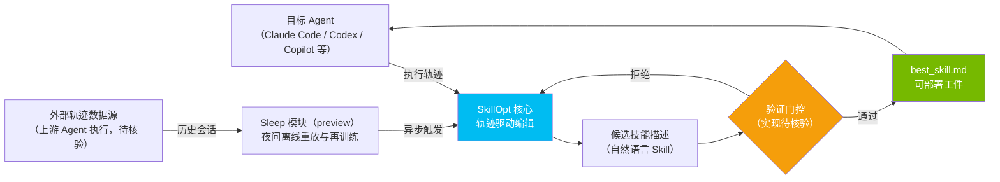

# Microsoft SkillOpt

## 一句话定位
文本空间技能优化器——为冻结的 LLM Agent 训练可复用的自然语言技能，产出可部署的 best_skill.md 工件。

## 它解决的问题
Agent Skill（如 Claude Code Skills、Codex Skills）目前完全依赖手工编写和人工调优。当 Skill 数量增长、复杂度提升时，手工迭代效率极低，且缺乏系统化的质量保障方法。SkillOpt 把「prompt engineering」升级为「prompt training」。

## 为什么值得关注（2026-06-21 更新）
Microsoft 官方出品，MIT 协议，第一个提出系统化 Agent Skill 训练方法的开源项目。6月21日已达 8,448 stars + 816 forks。**v0.1.0 已发布 PyPI**，可 `pip install skillopt`。新增 **Sleep 模块（preview）**——夜间离线审查历史会话、重放循环任务、验证 skill 更新。在 6 benchmark × 7 model × 3 harness = 52 个评估单元中**全部排名第一**。GPT-5.5 上平均提升 +23.5（直接 chat）、+24.8（Codex）、+19.1（Claude Code）。

gbrain、gbrain-evals、darwin-skill 已宣布集成 SkillOpt。

## 热度来源判断
- 真实需求：Agent Skill 生态爆发（html-anything 75 种 Skill、9arm-skills、gsd-core 等），但 Skill 质量参差不齐
- Microsoft 背书增加了信任度
- 487 forks 反映开发者不只是收藏，在积极实验
- MIT 协议消除了商用障碍

## 关键技术亮点亮点
1. **文本空间优化**：不修改 LLM 权重，只优化自然语言技能描述。这意味着任何冻结的 LLM 都可以使用
2. **轨迹驱动编辑（Trajectory-Driven Edits）**：从 Agent 执行轨迹中提取优化信号，自动编辑技能描述
3. **验证门控更新（Validation-Gated Updates）**：每次技能修改必须通过验证才能合并，防止优化方向跑偏
4. **可部署工件**：产出 best_skill.md，直接可部署到 Claude Code / Codex / Copilot 等 Agent

## 架构师速览

| 决策问题 | 研究判断 | 证据边界 |
|---|---|---|
| 系统边界 | SkillOpt 是位于「冻结 LLM Agent」与「Skill 工件（best_skill.md）」之间的离线优化器，外部边界为 Claude Code / Codex / Copilot 等目标 Agent 运行时及上游 Agent 轨迹数据源。 | 基于 README/档案标签（agent-skills、self-evolving-agents、text-space-optimization、skill-training）与定位句推断；输入数据 schema、目标 Agent 适配层接口未在档案中证实。 |
| 主路径 | Agent 执行产出轨迹 → SkillOpt 轨迹驱动编辑 → 候选技能描述 → 验证门控（通过/拒绝回退） → 产出 best_skill.md → 部署至冻结 LLM Agent；Sleep 模块（preview）承担夜间离线重放与再训练旁路。 | 主路径仅描述到「门控」与「best_skill.md 工件」级别；门控具体实现（规则/模型/人工）、轨迹格式、Sleep 模块触发条件与持久化均未在档案中证实。 |
| 关键权衡 | 文本空间优化（不改权重）换取冻结 LLM 可用性与低接入成本，代价是依赖高质量轨迹数据与门控有效性；Sleep 自动进化带来可用性增益，但引入 skill 被静默改写的安全风险。 | 「不改权重」「轨迹驱动」「验证门控」「Sleep preview」来自档案明确描述；冷启动门槛、Sleep 安全机制、自动修改的副作用面档案未提供量化证据。 |
| 最小 PoC | 在单一目标 Agent（如 Claude Code）上固定 prompt/工具子集，用最小轨迹集触发 SkillOpt 训练，跑通「轨迹 → best_skill.md → 同一 Agent 回放」闭环，并独立审计 Sleep 模块在受控环境下的 skill 变更。 | PoC 形态与验收项由档案「采用建议」与「风险/局限」推导；具体 benchmark 选型、轨迹采集方式、回放指标需以源码与官方文档核验。 |

## 架构启发
- Skill = 文本空间的「模型参数」。SkillOpt = 文本空间的「训练器」
- 验证门控是关键设计：等同于 ML 训练中的 evaluation set
- 轨迹数据 = 训练数据。谁掌握了 Agent 执行轨迹，谁就能训练更好的 Skill
- 启发：未来可能出现「Skill 训练数据市场」和「Skill 评估基准」

## 架构图（MMD）

> 证据边界：此图只采用本档案已有可核验描述；“待核验”节点不应视为项目实现事实。

## 定位判断
**平台候选。** 如果 Skill 训练范式成立，SkillOpt 将成为 Agent Skill 生命周期的核心工具——从编写、训练、验证到部署的基础设施。

## 风险 / 局限 / 泡沫点
1. ~~**实验性项目**~~：已发布 v0.1.0 到 PyPI，但 Sleep 模块仍是 preview
2. **52 cell 全第一的泛化性**：benchmark 覆盖面虽广但仍有领域局限，真实生产场景效果待验证
3. **轨迹数据依赖**：需要大量高质量的 Agent 执行轨迹，冷启动困难
4. **Sleep 模块安全风险**：夜间自动进化 Agent skill 的安全性需要独立验证——自动修改 skill 可能引入意外行为
5. **评估标准缺失**：什么是「更好的 Skill」？缺乏行业统一评估基准

## 与同类项目的关系
- **html-anything (6.1K)**：Skill 的消费者/应用层（75 种 Skill 的 agentic HTML 编辑器），与 SkillOpt 是上下游关系
- **gsd-core (2.7K)**：Spec-driven Agent 开发流程，关注 Skill 的组织和管理，与 SkillOpt 的训练能力互补
- **9arm-skills (2.7K)**：Shell 技能集合，SkillOpt 可以用来训练优化这些 Skill

## 是否值得持续跟踪
**强烈建议持续跟踪。** Agent Skill 训练是 Agent 自主演化能力的基础设施级能力。如果 SkillOpt 的方法论成立，将深刻影响整个 Agent Skill 生态。

## 后续观察点
1. 验证门控的具体实现：是基于规则、模型评估、还是人工审查？
2. 社区是否开始贡献轨迹数据集
3. Microsoft 是否将 SkillOpt 集成到 Copilot 产品线
4. 出现基于 SkillOpt 训练的高质量 Skill 发布

---
*首次记录：2026-06-05*
