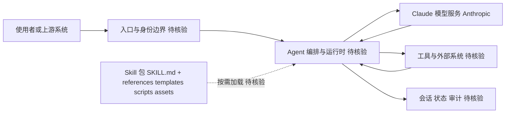

# anthropics/skills

## 一句话定位
Anthropic 官方维护的 Agent Skills 公共仓库，为 Claude 及其他 AI Agent 提供可复用的、声明式的"技能包"——让 Agent 通过加载 Markdown 指令文件获得特定领域能力（写代码、做设计、操作工具等）。

## 它解决的问题
AI Agent 的能力边界长期受限于"训练时知识"和"通用 Prompt"。要让 Agent 做特定任务（如"审查 PR"、"生成 SVG 图"、"部署 K8s"），需要大量领域知识、工作流步骤、工具调用约定。传统做法是塞进 System Prompt，但 Prompt 过长导致成本增加和注意力分散。Skills 提供了一种**模块化、按需加载的能力扩展机制**——每个 Skill 是一个独立目录（含 SKILL.md 指令 + 模板/脚本/参考文档），Agent 根据任务自动选择并加载相关 Skill。

## 为什么值得关注
- **Stars:** 166,828（截至 2026-08-07），Anthropic 官方仓库级别
- **Forks:** 19,874，社区贡献 Skill 数量庞大
- **Watchers:** 1,087，行业关注度极高
- **活跃度:** pushed_at 2026-07-24
- **创建时间:** 2025-09-22，不到一年达到 16 万 stars
- **生态地位:** Claude Code、Claude Desktop、第三方 Agent 平台的"技能市场"基础

## 热度来源判断
Skills 的热度是**Anthropic 官方背书 + Agent 生态刚需 + Claude 爆发**三重驱动。2025 年 Claude Code 和 Claude Desktop 火爆，Skills 作为"扩展 Claude 能力的标准方式"自然成为生态焦点。16 万 stars 中包含大量企业用户和开发者。这是**真实生态价值**，但也存在 Anthropic 品牌效应带来的"光环加成"。

## 关键技术亮点亮点
1. **声明式 Skill 定义:** 每个 Skill 是 `SKILL.md`（YAML frontmatter + Markdown 指令），Agent 读即会
2. **按需加载:** Agent 根据任务匹配 Skill 描述（trigger），自动加载对应指令和资源
3. **资源丰富:** 每个 Skill 目录可含 `references/`（参考文档）、`templates/`（模板）、`scripts/`（脚本）、`assets/`（资源）
4. **组合性:** 多个 Skill 可同时激活，Agent 自主编排
5. **跨平台:** 同一 Skill 可用于 Claude Code、Claude Desktop、API 调用、第三方 Agent
6. **社区驱动:** 任何人可贡献 Skill，形成"技能市场"

## 架构师速览

| 决策问题 | 研究判断 | 证据边界 |
|---|---|---|
| 系统边界 | Skills 是 Claude Code/Claude Desktop/API 与第三方 Agent 之上、能力之下的"声明式技能分发层"，由 SKILL.md（YAML frontmatter + Markdown 指令）+ 可选 references/templates/scripts/assets 目录构成 | 档案明确 SKILL.md 结构与四种资源目录；具体加载触发器（trigger）匹配机制、版本化方式、签名机制均未描述 |
| 主路径 | 任务进入 → Agent 按 Skill 描述匹配 → 加载 SKILL.md 指令与对应资源 → 调用模型/工具 → 输出或会话回写；多 Skill 可同时激活并由 Agent 编排 | 档案描述"按需加载""组合性""Agent 自主编排"；编排算法、并发控制、回滚机制未给出 |
| 关键权衡 | 模块化复用与 Anthropic 生态锁定、Skill 质量长尾、Prompt Injection 类安全风险之间的平衡；跨厂商兼容尚不明确 | 档案列出锁定、质量参差、安全与替代方案四项风险；未给出具体权限模型、沙箱边界、审计机制 |
| 最小 PoC | 选一个低风险场景（如代码审查或 SVG 生成），在 Claude Code/Desktop 单渠道内加载单一官方 Skill，开启结构化日志，验证加载条件、组合行为与回退路径后再扩面 | 档案只承诺"声明式、按需加载、跨平台、社区驱动"；性能、token 成本、PoC 验收指标均未提供 |

## 架构启发
Skills 的核心启发是 **"Agent 能力应该模块化，而非巨型 Prompt"**。这是对"Prompt Engineering 走向极限"的反思——当 Prompt 长到数万 token，成本、注意力、维护都成问题。Skills 提供了"Prompt 即代码"的范式：每个能力是独立、版本化、可测试的单元。这类似于软件工程从"单体脚本"走向"模块化库"的进化，AI Agent 领域正在重演这一进程。

## 架构图（MMD）

> 证据边界：此图只采用本档案已有可核验描述；“待核验”节点不应视为项目实现事实。

## 定位判断
**平台型基础设施。** Skills 正在成为 AI Agent 生态的"包管理"层——类似 npm 之于 Node.js、PyPI 之于 Python。它的战略价值不在于单个 Skill，而在于"标准化能力分发"这一平台位置。Anthropic 通过 Skills 锁定了 Agent 生态的一个关键节点。

## 风险/局限/泡沫点
- **Anthropic 锁定:** Skills 标准由 Anthropic 主导，跨厂商兼容性存疑
- **质量参差:** 16 万 stars + 2 万 forks 意味着 Skill 质量极度不均
- **安全风险:** 恶意 Skill 可能包含误导性指令（Prompt Injection 类风险）
- **替代方案:** OpenAI、Google 都可能推出自己的"Skills"标准，导致碎片化
- **依赖 Claude:** Skills 当前主要为 Claude 服务，跨 Agent 兼容性是推广瓶颈

## 与同类项目的关系
- **vs OpenAI Custom GPTs/Instructions:** 类似理念但更结构化；GPTs 更偏消费端，Skills 更偏开发者
- **vs MCP (Model Context Protocol):** MCP 是"工具连接"标准，Skills 是"知识/工作流"标准，互补
- **vs Cursor Rules (.cursorrules):** Cursor Rules 是项目级指令；Skills 是可分发的模块化能力包
- **vs Plugin（ChatGPT Plugins，已停用）:** OpenAI 插件已下线；Skills 是更轻量、更声明式的方案
- **vs Hermes Agent Skills:** Hermes Agent 等第三方平台也采用类似 Skills 架构，形成多生态

## 是否值得持续跟踪
**必须跟踪。** Skills 代表了 AI Agent 能力分发的标准化方向。无论最终标准由谁主导，"模块化 Skill"这一范式已被验证。建议关注跨厂商标准化进展、Skill 质量评估机制、以及恶意 Skill 防御。

## 后续观察点
- 是否出现跨厂商 Skill 标准（OpenAI/Google 是否跟进）
- Skill 质量评估和认证机制（避免劣质/恶意 Skill）
- Skill 数量增长曲线（是否达到"长尾覆盖")
- 与 MCP 的整合深度（Skill + MCP = 完整 Agent 能力栈）
- 是否出现独立的"Skill 市场"（脱离 Anthropic 控制）

---
> 数据来源: GitHub API (2026-08-07) | Stars: 166,828 | Forks: 19,874 | License: 待确认
