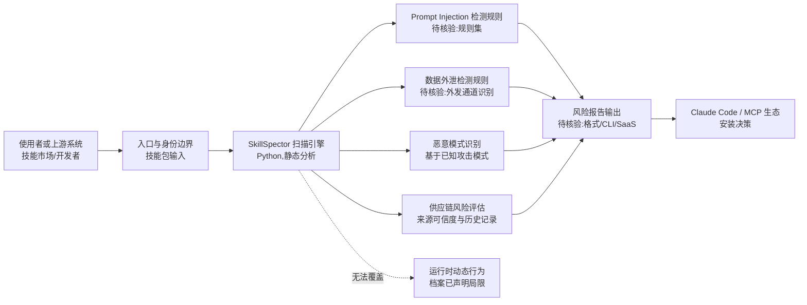

# NVIDIA/SkillSpector

## 一句话定位
AI Agent 技能安全扫描器——检测 agent 技能中的漏洞、恶意模式、安全风险、提示注入、数据外泄和供应链威胁。

## 它解决的问题
随着 AI agent 技能（Skills/MCP servers/插件）生态爆发，用户大量安装第三方技能扩展 agent 能力。但这些技能可能含恶意代码——prompt injection（劫持 agent 行为）、数据外泄（窃取上下文中的敏感信息）、供应链攻击（伪装成热门技能）。SkillSpector 提供自动化安全扫描，在安装/使用技能前检测潜在风险。

## 为什么值得关注
- **Stars:** 14,326 stars，agent 安全赛道头部
- **Forks:** 1,198
- **NVIDIA 出品**：AI 安全有专业团队背书
- **Python 实现**，易于集成
- **持续活跃**（2026-08-07 更新）
- 覆盖 agent 安全所有关键威胁：prompt injection、数据外泄、供应链
- 针对 Claude Code/MCP 生态设计

## 热度来源判断
- **Agent 安全焦虑（极高）**：第三方技能的安全风险被广泛讨论
- **NVIDIA 品牌（高）**：AI 领域权威
- **MCP/Claude Code 生态扩张（高）**：技能越多越需要安全检查
- **供应链安全意识（中高）**：npm/PyPI 供应链攻击前科让用户警惕

## 关键技术亮点亮点
1. **Prompt Injection 检测**：识别技能中的提示注入攻击模式
2. **数据外泄检测**：检测技能是否尝试向外部发送敏感数据
3. **恶意模式识别**：基于已知攻击模式的规则引擎
4. **供应链风险**：检测技能来源可信度、历史记录
5. **静态分析**：无需运行即可分析技能代码/配置
6. **Claude Code/MCP 适配**：专门针对 agent 技能格式优化

## 架构师速览

| 决策问题 | 研究判断 | 证据边界 |
|---|---|---|
| 系统边界 | SkillSpector 是一个面向 Agent 技能（Skills / MCP servers / 插件）的离线式安全扫描器，介于技能市场/用户安装前环节与运行时 Agent 平台之间，向上对接 Claude Code / MCP 生态的技能包格式，向下不替代运行时防护 | 档案仅声明"安装/使用前扫描 + 静态分析"，未给出 CLI/库/SaaS 形态、CI 集成方式、与技能注册中心的对接协议 |
| 主路径 | 技能包输入 → Prompt Injection / 数据外泄 / 恶意模式 / 供应链四类规则引擎并行扫描 → 风险报告与命中证据输出，不触达 LLM 推理与工具调用 | "Python 实现""静态分析""规则引擎"已确认；是否含 AST/sandbox 预执行、报告 schema、CI 接入点未在档案中给出 |
| 关键权衡 | 静态扫描覆盖面 vs 新型混淆/动态注入逃逸的检测率，以及跨平台技能格式适配成本 vs 单一生态（Claude Code/MCP）深度 | 档案明确指出"新型攻击可能逃逸静态分析""运行时行为无法覆盖""不同 agent 平台格式碎片化"为已知局限，但未提供基准测试数据 |
| 最小 PoC | 取一个公开第三方 MCP server 技能包与一个已知含 prompt injection 的对照样本，分别跑扫描器，比对四类规则的命中率、误报率与报告可机读性；不做生产接入 | 档案未给出 CLI 命令、规则集版本号、输出格式与阈值参数，PoC 步骤须先核验安装与调用方式 |

## 架构启发
- **Agent 安全是新赛道**：传统应用安全不覆盖 agent 特有威胁
- **静态分析 for Skills**：将 SAST 理念应用到 agent 技能
- **安全左移**：在技能安装前扫描，而非运行后检测

## 架构图（MMD）

> 证据边界：此图只采用本档案已有可核验描述；“待核验”节点不应视为项目实现事实。

## 定位判断
**关键安全工具型项目**。在 agent 生态爆发期，安全扫描是刚需。NVIDIA 出品增加了可信度，有成为 agent 安全标准工具的潜力。

## 风险/局限/泡沫点
- **检测率有限**：新型攻击可能逃逸静态分析
- **误报率**：正常技能可能被标记为有风险
- **NVIDIA 项目维护**：大厂项目有被砍风险
- **生态碎片化**：不同 agent 平台的技能格式不同，需适配
- **攻击者进化**：安全工具和攻击者持续对抗
- **运行时安全**：静态分析无法覆盖运行时行为

## 与同类项目的关系
- **vs garak/PyRIT**：通用 LLM 安全测试 vs 专项技能扫描
- **vs Snyk/Dependabot**：传统依赖安全 vs Agent 技能安全
- **vs Rebuff/LLM Guard**：运行时防护 vs 安装前扫描
- **vs Semgrep**：通用代码静态分析 vs Agent 技能专用

## 是否值得持续跟踪
**强烈推荐跟踪。** Agent 安全是新兴关键领域，SkillSpector 是目前最专业的 agent 技能安全扫描工具。所有使用第三方技能的开发者都应关注。

## 后续观察点
- 检测规则的更新频率和新攻击覆盖
- 是否成为 agent 平台（Claude Code/MCP）的官方推荐工具
- 误报率和检测率的实际表现
- 是否支持运行时动态分析
- 社区贡献的新检测规则
- 是否有 SaaS 版本（API 形式集成到技能市场）

---
> 数据来源: GitHub API (2026-08-07) | Stars: 14,326 | Forks: 1,198 | 语言: Python
