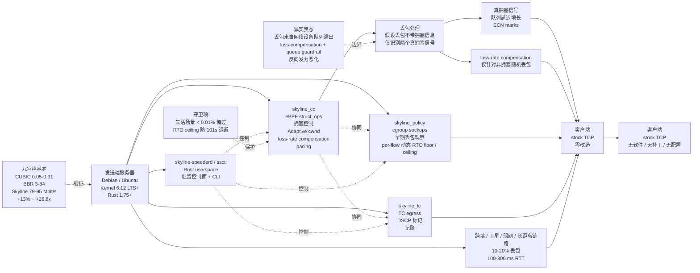

# CYBERVERSE-Research/skyline-speeder

## 一句话定位
发送端 eBPF struct_ops TCP 拥塞控制 —— 仅部署在发送端、客户端零改造，4 件套（eBPF struct_ops + cgroup sockops + TC egress + Rust userspace）协同，专门解决「长单向流 + 10-20% 随机丢包 + 100-300 ms RTT」场景下 CUBIC / BBR 直接跪的问题。

## 它解决的问题
跨境 / 卫星 / 无线 / 长距离传输场景的痛点是 **「10-20% 随机丢包 + 100-300 ms RTT 长单向流 + 客户端零改造 + CUBIC 直接跪（0.05-0.31 Mbit/s）+ BBR 也只是部分恢复（3-84 Mbit/s）」**。传统方案是换专线（贵）或换协议（QUIC / 自研，复杂）。Skyline Speeder 用 eBPF struct_ops 仅部署发送端 + 客户端零改造 + 4 件套协同 是「Linux kernel-level 加速 + 不动客户端 + 严肃可复现基准 + GPL-2.0 许可」的具体路径。

## 为什么值得关注（2026-09-19）
- **Stars:** 33（截至 2026-09-19），1 天 33⭐，早期严肃基础设施信号
- **Forks:** 4，fork/star 12.1%（高于普通新项目 5-10%，「准备集成」信号）
- **License:** GPL-2.0（与 Linux kernel 同许可，企业商用合规需注意）
- **语言:** Python + Rust
- **活跃度:** created 2026-09-18，pushed_at 2026-09-18，持续高活跃
- **规模:** 297 KB（可独立部署的中等规模基础设施工具）
- **支持:** Kernel 6.12 LTS+ + Debian / Ubuntu + Rust 1.75+ + eBPF CO-RE struct_ops
- **双语 README:** 英文 + 简体中文
- **赞助:** Exclusively sponsored by Skyline Connect

## 热度来源判断
Skyline Speeder 的热度是 **「跨境 / 卫星 / 长距离传输加速刚需 × eBPF struct_ops kernel-level 严肃实现 × 4 件套协同 × 客户端零改造 × 严肃可复现九宫格基准 + 守卫项 + 诚实不适用场景声明」** 的组合。当前跨境数据传输 / 卫星链路 / 弱网直播 / 长距离备份等场景的痛点是「客户端零改造 + kernel-level 加速 + 可复现基准」—— Skyline Speeder 独特切入点是「**仅识别两个真拥塞信号（队列延迟 + ECN）+ 假设丢包不带拥塞信息**」 是「针对特定场景」而非「通用解决方案」的工程化形式 —— 避免「万能工具」陷阱。**九宫格基准 + 守卫项 + 诚实不适用场景声明** 是「严肃基础设施工具」的关键工程化形式 —— 明确「能用 vs 不能用」+ 「能用情况下效果可复现」。33⭐ / 4 forks + 4 件套架构 + eBPF struct_ops + 九宫格基准 + 守卫项 + GPL-2.0 反映「严肃 kernel-level 基础设施工具」早期信号。热度**真实且具基础设施价值** —— 但需警惕：kernel 6.12 struct_ops API 稳定性 + eBPF CO-RE 跨 kernel 版本兼容性 + 4 件套协同可靠性 + 跨境 / 卫星等具体场景的实际部署效果是长期可用性的关键。

## 关键技术亮点
1. **4 件套架构** —— `skyline_cc` eBPF struct_ops（拥塞控制核心）+ `skyline_policy` cgroup sockops（早期丢包观察 + per-flow 动态 RTO floor / ceiling）+ `skyline_tc` TC egress（DSCP 标记 + 记账）+ `skyline-speederd / ssctl` Rust userspace（驻留控制面 + CLI）
2. **eBPF CO-RE struct_ops** —— eBPF CO-RE（Compile Once, Run Everywhere）是 kernel-level 编程的事实标准，struct_ops 是 Linux 6.12+ 引入的拥塞控制回调注册机制
3. **仅部署发送端 + 客户端零改造** —— 避免「两端改造」的部署成本
4. **仅识别两个真拥塞信号（队列延迟 + ECN）** —— 「针对特定场景」而非「通用解决方案」的工程化形式
5. **九宫格基准** —— CUBIC 0.05-0.31 vs BBR 3-84 vs Skyline 79-95 Mbit/s（`rtt100-loss10/20` + `rtt200-loss15/20` + `rtt300-loss15/20`）
6. **+13% ~ +26.8x 加速比** —— `rtt100-loss20` BBR 3.54 vs Skyline 94.92 (+26.8x) / `rtt300-loss20` BBR 3.48 vs Skyline 79.92 (+23.0x)
7. **守卫项失活场景 < 0.01% 偏差** —— 失活路径无系统偏差
8. **RTO ceiling 防 101s 退避** —— 避免 stock kernel BBR 的 101s 退避（接近 kernel 默认 120s）
9. **诚实表态不适用场景** —— 「如果丢包来自网络设备队列溢出而非链路层随机丢包，loss-compensation + queue guardrail 反向发力会恶化」
10. **固定 RNG seed + 双 KVM VM 测试床 + `htb` + `netem` 链路条件注入** —— 严肃可复现基准
11. **Kernel 6.12 LTS+ + Debian / Ubuntu + Rust 1.75+** —— 明确支持矩阵
12. **GPL-2.0 License** —— 与 Linux kernel 同许可（GPL-2.0 是 Linux 网络栈的强制选项）
13. **双语 README（英文 + 简体中文 README.zh.md）** —— 中国开发者友好

## 架构师速览

| 决策问题 | 研究判断 | 证据边界 |
|---|---|---|
| 系统边界 | 发送端 eBPF struct_ops TCP 拥塞控制；4 件套（skyline_cc + skyline_policy + skyline_tc + skyline-speederd/ssctl）；仅部署发送端客户端零改造；Kernel 6.12 LTS+ + Debian / Ubuntu + eBPF CO-RE struct_ops + Rust 1.75+；目标 10-20% 丢包 + 100-300 ms RTT 长单向流；假设丢包不带拥塞信息；GPL-2.0 | 来自 README 关于「Sender-side TCP acceleration: eBPF struct_ops congestion control with a Rust control plane」「skyline_cc eBPF struct_ops congestion control + skyline_policy cgroup sockops + skyline_tc TC egress program + skyline-speederd / ssctl Rust userspace」「Target environment: long unidirectional flows over links with ample bandwidth and non-congestive random loss」「Loss is assumed to carry no congestion information」「Kernel 6.12 LTS+」「Platform Debian / Ubuntu」的明示；具体 eBPF struct_ops 内部算法、Rust control plane 协议、cgroup sockops 细节、TC egress DSCP 规则在仓库源码未展开 |
| 主路径 | 部署发送端服务器 → 加载 skyline_cc eBPF struct_ops 注册拥塞控制回调 → skyline_policy cgroup sockops 早期丢包观察 + per-flow 动态 RTO floor / ceiling → skyline_tc TC egress DSCP 标记 + 记账 → skyline-speederd / ssctl Rust userspace 驻留控制面 + CLI → 数据传输时仅识别两个真拥塞信号（队列延迟增长 + ECN marks）+ 假设丢包不带拥塞信息 → 客户端零改造使用 stock TCP | 主路径来自 README 关于「Adaptive cwnd, loss-rate compensation, pacing」「Early loss observation, per-flow dynamic RTO floor/ceiling」「Retransmit DSCP marking and accounting」「Resident control plane and CLI」的描述；具体 eBPF struct_ops 注册流程、Rust control plane 协议、cgroup 配置、TC 规则加载在仓库源码 + install.sh 未展开 |
| 关键权衡 | 发送端 vs 客户端 + 双端（部署成本 vs 效果）/ eBPF struct_ops vs userspace TCP 代理（kernel-level vs 应用层）/ 仅识别两个真拥塞信号 vs 万能拥塞控制（针对特定场景 vs 通用）/ 假设丢包不带拥塞信息 vs 拥塞控制标准假设（场景适配 vs 协议合规）/ 4 件套协同 vs 单 eBPF 程序（分层 vs 简单）/ GPL-2.0 vs MIT/Apache（与 Linux kernel 同许可 vs 商业友好） | 权衡 6 因素均从 README + 九宫格基准 + 诚实不适用场景推导；具体 eBPF struct_ops 内部算法、Rust control plane 协议、4 件套协同机制、九宫格基准复现步骤在仓库源码 + 基准文档未展开 |
| 最小 PoC | Linux 服务器（Debian / Ubuntu + Kernel 6.12 LTS+）+ Rust 1.75+ + eBPF CO-RE 支持 + `git clone https://github.com/CYBERVERSE-Research/skyline-speeder.git` + `bash install.sh` → 模拟长单向流 + 10-20% 丢包 + 100-300 ms RTT 链路条件 → 对比 stock CUBIC / BBR / Skyline Speeder 吞吐量 → 验证九宫格基准 + 守卫项失活场景 < 0.01% 偏差 + RTO ceiling 防 101s 退避 | PoC 由「eBPF struct_ops + cgroup sockops + TC egress + Rust userspace + 九宫格基准」推导；具体 eBPF 加载流程、Rust control plane 编译、install.sh 步骤、九宫格基准复现脚本在仓库源码 + install.sh 待核验 |

## 架构图（MMD）

> 证据边界：此图只采用本档案已有可核验描述；"待核验"节点不应视为项目实现事实。

## 架构启发
Skyline Speeder 的核心启发是 **「网络栈层加速的可信度瓶颈不在性能提升而在严肃可复现基准 + 诚实不适用场景声明 + 客户端零改造部署」**。当 eBPF 能修改 kernel 拥塞控制时，关键问题是「性能提升有多大 / 守卫项是否可靠 / 不适用场景是否能诚实告知 / 部署成本（双端 vs 单端）」—— 这些都需要工程化保证。Skyline Speeder 用「九宫格基准（CUBIC / BBR / Skyline 79-95 Mbit/s）+ 守卫项（< 0.01% 偏差 + RTO ceiling 防 101s 退避）+ 诚实不适用场景（队列溢出时反向发力恶化）+ 仅部署发送端（客户端零改造）」是「性能 + 守卫 + 诚实 + 部署成本」四件套工程化形式。**仅识别两个真拥塞信号（队列延迟 + ECN）+ 假设丢包不带拥塞信息** 是关键架构选择 —— 「针对特定场景」而非「通用解决方案」，避免「万能工具」陷阱 + 明确「能用 vs 不能用」。**仅部署发送端** 是关键部署选择 —— 跨境 / 卫星 / 弱网场景的客户端不可控（手机 / 嵌入式 / 第三方），发送端可控（自有服务器），仅部署发送端是「可控侧修改 + 不可控侧不动」的具体路径。**对企业 / 个人**：跨境数据传输 / 卫星链路 / 弱网直播 / 长距离备份等场景可部署发送端恢复带宽；**对 Linux 网络工程师**：eBPF struct_ops + cgroup sockops + TC egress + Rust userspace 4 件套是「kernel-level 加速栈」参考实现；**对学术**：非拥塞随机丢包场景下的 TCP 拥塞控制是经典研究方向。

## 定位判断
**基础设施候选型项目（发送端 eBPF TCP 拥塞控制）。** Skyline Speeder 不是又一个 TCP 加速工具（那是 BBR / BBRv2 / QUIC），而是 **「kernel-level eBPF struct_ops + 4 件套协同 + 仅部署发送端 + 严肃可复现基准 + 诚实不适用场景」** —— 把网络栈层加速从「应用层代理」升级到「kernel-level eBPF + 严肃基准 + 诚实边界」。33⭐ / 4 forks / 4 件套架构 + eBPF struct_ops + 九宫格基准 + 守卫项 + GPL-2.0 反映「严肃 kernel-level 基础设施工具」早期信号。**真正决定长期价值的是「Linux kernel 6.12 struct_ops API 稳定性 + eBPF CO-RE 跨 kernel 版本兼容性 + 4 件套协同可靠性 + 跨境 / 卫星等具体场景的实际部署效果」** —— kernel 6.12 struct_ops 是较新 API 可能变化 + eBPF CO-RE 需要 kernel 头文件 + 4 件套协同在复杂网络环境的稳定性 + 实际场景（跨境 / 卫星）部署效果是关键。**对企业 / 个人**，跨境数据传输 / 卫星链路 / 弱网直播 / 长距离备份等场景可部署发送端恢复带宽；**对 Linux 网络工程师**，eBPF struct_ops + cgroup sockops + TC egress + Rust userspace 4 件套是「kernel-level 加速栈」参考实现；**对学术**，非拥塞随机丢包场景下的 TCP 拥塞控制是经典研究方向。

## 风险 / 局限 / 泡沫点
- **Linux kernel 6.12 struct_ops API 较新** —— API 可能在未来 kernel 版本变化 + struct_ops 是 Linux 6.12+ 引入的拥塞控制回调注册机制
- **eBPF CO-RE 跨 kernel 版本兼容性** —— 需要 kernel 头文件 + 不同 kernel 版本的行为差异
- **4 件套协同可靠性** —— 在复杂网络环境（高 RTT + 高丢包 + 复杂路由）的稳定性
- **跨境 / 卫星等具体场景的实际部署效果** —— 九宫格基准是 KVM VM 模拟，实际场景可能更复杂
- **GPL-2.0 传染性** —— 企业商用需注意 GPL-2.0 传染性，集成到商业产品需法律审查
- **不适用场景风险** —— 如果误判丢包来源（队列溢出 vs 随机丢包），loss-compensation + queue guardrail 反向发力恶化
- **赞助商单一风险** —— Exclusively sponsored by Skyline Connect，商业可持续性 + 中立性风险
- **单 1 人 / 1 组织维护** —— fork/star 12.1% 已有企业 / 学术 fork 准备部署或研究，但核心治理仍集中

## 与同类项目的关系
- **vs BBR / BBRv2 / CUBIC：** BBR 是 Google kernel-level 拥塞控制（已合并 mainline），CUBIC 是 Linux kernel default；Skyline Speeder 是「仅部署发送端 + 4 件套 + 严肃可复现 + 诚实不适用场景」的特定场景工具
- **vs QUIC：** QUIC 是应用层协议（UDP 之上），需要双端支持 + 客户端改造；Skyline Speeder 是 kernel-level TCP 拥塞控制，客户端零改造
- **vs userspace TCP 代理（如 kcptun / shadowsocks）：** 那些是 userspace TCP 代理，部署在应用层；Skyline Speeder 是 eBPF kernel-level，部署在内核
- **vs Linux kernel BBRv3 / 未来 kernel 拥塞控制：** 那些是 kernel mainline 拥塞控制，需要升级 kernel；Skyline Speeder 是 out-of-tree eBPF struct_ops，不需要升级 kernel
- **vs arvindear/wp2shell-PoC（昨日）：** 两者同构基础设施领域但推到「网络栈层 eBPF 加速」领域（vs 安全 PoC）

## 是否值得持续跟踪
**值得跟踪（网络栈层 eBPF TCP 拥塞控制）。** Skyline Speeder 代表了 kernel-level eBPF 在 TCP 拥塞控制的具体应用，无论其本身成败，这一方向是行业趋势（eBPF 在网络 / 存储 / 安全 / 观测的全面渗透）。建议关注：Linux kernel 6.12 struct_ops API 稳定性 + eBPF CO-RE 跨 kernel 版本兼容性 + 4 件套协同可靠性 + 跨境 / 卫星等具体场景的实际部署效果。**对 Linux 网络工程师 / SRE / 跨境数据传输团队**，Skyline Speeder 是「客户端零改造 + kernel-level 加速 + 严肃可复现 + 诚实不适用场景」的实用工具，值得直接试用（前提是 Linux server + Kernel 6.12+ + 接受 GPL-2.0 + 接受「假设丢包不带拥塞信息」的边界）。**对网络栈层加速观察者**，Skyline Speeder 是「eBPF 在 TCP 拥塞控制」赛道的早期样本。

## 后续观察点
- Linux kernel 6.12+ struct_ops API 稳定性 + 后续 kernel 版本变化
- eBPF CO-RE 跨 kernel 版本兼容性（不同 kernel 头文件 + BTF）
- 4 件套协同在复杂网络环境（高 RTT + 高丢包 + 复杂路由）的稳定性
- 跨境 / 卫星 / 弱网直播 / 长距离备份等具体场景的实际部署效果（vs KVM VM 模拟）
- GPL-2.0 商业集成风险（企业商用法律审查）
- 赞助商 Skyline Connect 的商业可持续性 + 中立性
- 是否演化为 Linux kernel mainline（从 out-of-tree eBPF 到 in-tree 拥塞控制）
- 4 件套是否进一步拆分（独立发布 skyline_cc / skyline_policy / skyline_tc / skyline-speederd）

---
> 数据来源: GitHub API (2026-09-19) | Stars: 33 | Forks: 4 | License: GPL-2.0 | 语言: Python + Rust | 创建: 2026-09-18 | 规模: 297 KB
