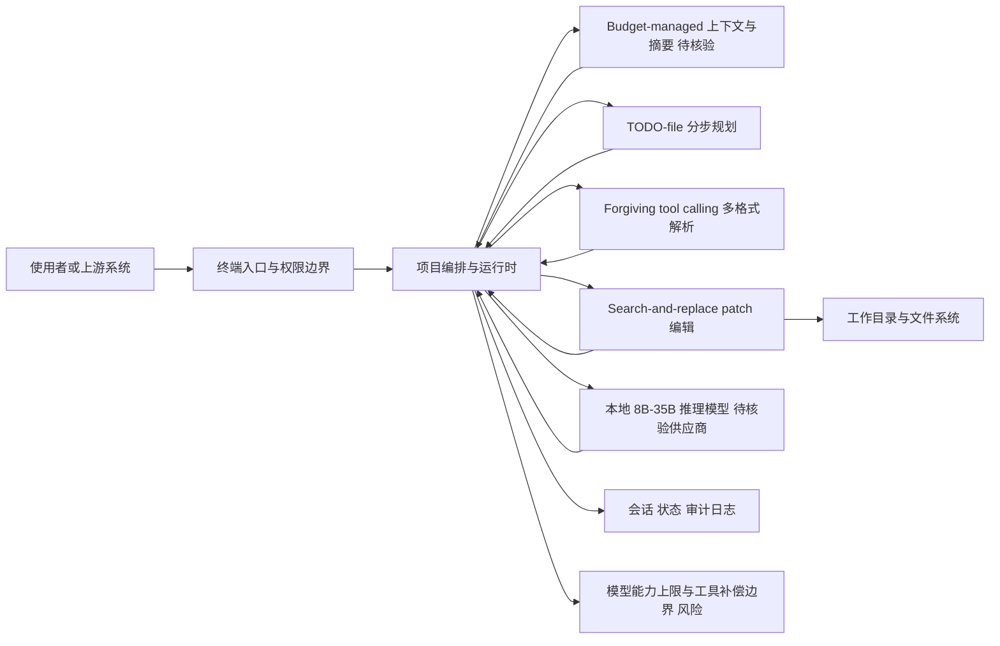

# SmallCode

## 一句话定位
专为 8B-35B 参数小模型优化的终端编码 Agent，让消费级硬件上的本地模型也能做有意义的编码工作。

## 它解决的问题
目标用户：拥有消费级 GPU、希望在本地运行编码 Agent 的开发者。

痛点：
- 当前所有主流编码 Agent（Claude Code、OpenCode、Codex）都假设用户有前沿大模型（128K+ 上下文、可靠 tool calling）
- 8B-35B 模型在消费硬件上完全可运行，但缺乏配套工具
- 小模型无法可靠输出 JSON tool calling 格式，上下文窗口有限，多步推理容易丢失

## 为什么值得关注（2026-05-23）
填补了 Agent 工具链的巨大空白。当所有人都在为前沿模型优化 Agent 时，SmallCode 反向思考：如何让小模型也能做有用的工作？这是一个被忽视的蓝海市场。

## 热度来源判断
1.2K stars / 5 天，增速尚可。热度来自：
- **差异化定位**：唯一明确针对小模型的编码 Agent
- **对比营销**：直接与 OpenCode 做功能对比表格，传播效果好
- **实用需求**：本地化、隐私优先、无网络依赖的开发者群体庞大

不是泡沫 — 解决了真实存在的需求。

## 关键技术亮点亮点

### 1. Budget-managed 上下文
不把所有代码灌入上下文窗口，而是按需加载并自动摘要。这对小模型的有限上下文窗口至关重要。

### 2. Forgiving multi-format tool calling
小模型不总能输出合法 JSON。SmallCode 用多格式解析器容错，接受多种 tool calling 格式。

### 3. TODO-file 分步规划
将大任务分解为 TODO 文件中的小步骤，每次只处理一步。避免小模型在多步推理中丢失上下文。

### 4. Search-and-replace patch editing
不做全文件重写（小模型容易出错），用精确搜索替换方式编辑代码。

## 架构师速览

| 决策问题 | 研究判断 | 证据边界 |
|---|---|---|
| 系统边界 | SmallCode 是面向 8B-35B 本地小模型的终端编码 Agent 编排层，承担"工具补偿模型"职责 | 边界来自档案"关键技术亮点"四条；项目体量仅 1.2K stars/5 天、JavaScript 实现，组件稳定性未审计 |
| 主路径 | 终端输入 → Budget-managed 上下文加载与摘要 → TODO-file 拆步 → 多格式 tool calling 解析 → search-and-replace patch 回写 | 路径仅基于档案四条亮点串联，缺少 LLM 推理后端、持久化、协议细节描述 |
| 关键权衡 | 在"小模型能力上限 vs 工具补偿力度"与"多格式 tool calling 容错度 vs 输出可审计性"之间取舍；另需权衡 TODO 文件化分步 vs 单步内上下文利用率 | 权衡为档案"风险/局限"项 #1、#3 的直接推论，benchmark 87 分可信度未独立验证 |
| 最小 PoC | 在本地 8B 模型 + 受限工作目录 + 单文件 patch 场景下，验证 TODO-file 拆步、搜索替换编辑、多格式 tool calling 三条主路径能否闭环；评估上下文摘要触发频次与多步丢失率 | 档案未给出基准测试集、失败率、上下文窗口默认值等可测量阈值，PoC 需自行设定验收指标 |

## 架构启发
SmallCode 展示了一个重要的设计哲学：**工具应该适应模型，而不是要求模型适应工具**。

- 前沿模型 Agent 的设计假设：模型能力强 → 工具可以做更复杂的事
- SmallCode 的设计假设：模型能力有限 → 工具必须补偿模型弱点

这种「工具补偿模型」的思路对架构师有启发 — 在企业内部署 Agent 时，不一定需要最贵的模型，好的工具链可以让小模型也做有用的事。

## 架构图（MMD）

> 证据边界：此图只采用本档案已有可核验描述；“待核验”节点不应视为项目实现事实。

## 定位判断
当前是**工具型**，但如果小模型 Agent 生态爆发，有可能演化为**平台候选** — 成为小模型 Agent 的标准工具层。

## 风险 / 局限 / 泡沫点

1. **小模型能力上限**：8B-35B 模型在复杂推理上仍有明显局限，工具补偿不能突破模型天花板
2. **87% benchmark 声称值待验证**：可能存在 cherry-picking 或特定场景优化
3. **生态碎片化风险**：如果每个模型规模都需要专门的 Agent 工具，工具链会极度碎片化
4. **与大模型 Agent 的体验差距**：无论如何优化，小模型 Agent 的体验仍与大模型有差距

## 与同类项目的关系
| 项目 | 目标模型 | 核心差异 |
|------|---------|---------|
| OpenCode | 前沿模型（Claude、GPT-5） | 全量上下文，假设可靠 tool calling |
| Claude Code | Claude 系列 | Anthropic 官方，深度绑定 Claude |
| Codex | OpenAI 模型 | 轻量级，Rust 实现 |
| SmallCode | 8B-35B 本地模型 | budget-managed 上下文，forgiving tool calling |

## 是否值得持续跟踪
**是，建议持续跟踪。** 小模型 Agent 工具链是当前被严重忽视的方向。如果 SmallCode 能持续迭代并建立社区，可能成为小模型 Agent 生态的关键工具。

## 后续观察点
1. SmallCode 在真实项目中的表现（非 benchmark 场景）
2. 社区是否出现更多针对小模型的 Agent 工具
3. 小模型（如 Qwen3-8B、Llama-4-8B）能力提升后 SmallCode 的适配情况

---
*首次记录：2026-05-23*
