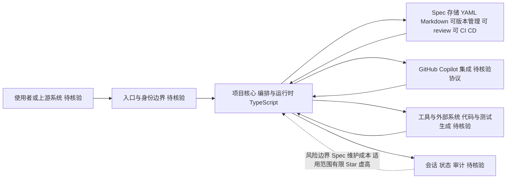

# GitHub Spec Kit

## 一句话定位
GitHub 官方的 Spec-Driven Development 工具包——用结构化规格说明驱动开发，从 prompt engineering 升级到 spec engineering。

## 它解决的问题
当前 AI 辅助开发的核心痛点：开发者用自然语言 prompt 让 AI 写代码，但 prompt 模糊、不可版本管理、不可 review、不可 CI/CD。

Spec Kit 让"规格说明"成为开发流程的第一等公民：
- Spec 文件结构化（YAML/Markdown），可版本管理
- Spec 可以 review、可以 CI/CD 验证
- Agent 按 Spec 执行，减少幻觉和偏差

目标用户：软件架构师、Tech Lead、使用 AI Agent 的开发者。

## 为什么值得关注（2026-05-13）
1. **GitHub 官方出品**——不是社区项目，是 GitHub 对开发范式演进的官方表态
2. 97K stars 说明开发者对"从 prompt 到 spec"的方向有强烈共鸣
3. 与 GitHub Copilot 深度集成，可能成为 GitHub 生态的原生能力

## 热度来源判断
**60% 真实需求 + 30% GitHub 官方惯性关注 + 10% 新范式炒作**。
Spec-Driven Dev 确实解决了 prompt engineering 的根本缺陷（模糊、不可管理），但 97K 中有大量"先 star 再看"的成分。

## 关键技术亮点亮点
1. **Spec 文件结构化**：YAML/Markdown 格式，可版本管理、可 diff、可 code review
2. **Spec → Code → Test 全链路**：Spec 驱动代码生成，Spec 驱动测试生成，Spec 驱动验证
3. **与 GitHub Copilot 深度集成**：Spec 成为 Copilot 的输入，减少 AI 编码的随机性

## 架构师速览

| 决策问题 | 研究判断 | 证据边界 |
|---|---|---|
| 系统边界 | 项目作为 TypeScript 实现的编排层，处于"使用者/上游系统 → 入口与身份边界 → 编排与运行时 → 模型/工具/会话"四段边界之间；GitHub 官方出品意味着 GitHub 平台生态（含 Copilot）是默认上游/下游假设。 | 依据项目档案中的 language=TypeScript、标签 copilot/github-official 与定位描述；具体进程边界、身份协议、运行时形态未在档案中给出，需源码核验。 |
| 主路径 | 主路径为：Spec（YAML/Markdown）→ 编排运行时 → Copilot/Agent 按 Spec 生成代码与测试 → 验证回写 Spec。该路径把"可版本管理、可 review、可 CI/CD 的 Spec"作为驱动源。 | 档案明确提到 Spec→Code→Test 全链路与 Copilot 集成；具体 agent 协议、CI 触发点、验证机制在档案中未细化，待核验。 |
| 关键权衡 | 核心权衡在"Spec 结构化带来的可治理性"与"Spec 维护成本/适用范围收窄"之间：收益是降幻觉、可审计；代价是 Spec 本身成为新的技术债，且对探索性开发帮助有限。 | 风险章节直接列出 Spec 维护成本与适用范围有限两条局限；性能、权限模型、供应商耦合等权衡在档案中无量化数据。 |
| 最小 PoC | 建议以单一团队、单一仓库为边界，选取一个"明确定义、可 CI 验证"的小型需求（如一个 API 端点），跑通 Spec 起草→Copilot 生成→CI 校验→人工 review 的闭环，再评估是否扩大接入面。 | 档案未给出官方 PoC 步骤或最小示例；该建议基于定位、风险条目与采用建议章节抽象，具体工具链细节须以项目文档核验。 |

## 架构启发
**设计文档即代码的终极形态**。传统架构设计文档是写完就扔的静态文档。Spec Kit 让设计文档变成可执行、可验证、可演进的活文档。

对架构师的核心启发：
- 架构决策可以用 Spec 格式记录，并自动验证代码是否遵守
- Spec 之间可以建立依赖关系，形成架构决策图
- Spec 的变更历史就是架构演进的历史

## 架构图（MMD）

> 证据边界：此图只采用本档案已有可核验描述；“待核验”节点不应视为项目实现事实。

## 定位判断
**基础设施候选**。如果 Spec-Driven Dev 成为主流，Spec Kit 就是开发流程的基础设施层——类似 CI/CD 在 DevOps 中的地位。

## 风险 / 局限 / 泡沫点
1. **Star 虚高**：GitHub 官方项目自带惯性关注，97K 需要大幅打折
2. **Spec 维护成本**：Spec 文件需要持续更新，可能成为新的技术债
3. **适用范围有限**：Spec 驱动适合明确定义的任务，对探索性开发帮助有限

## 与同类项目的关系
- **Cursor / Claude Code**：当前主要靠 prompt 驱动，Spec Kit 提供更结构化的输入
- **OpenAPI / AsyncAPI**：API 级别的 spec，Spec Kit 可能是应用级别的 spec
- **ADR（Architecture Decision Records）**：Spec Kit 可能是 ADR 的可执行版本

## 是否值得持续跟踪
**是，高优先级**。GitHub 官方出品 + 开发范式升级，即使当前不成熟也必须关注演进方向。

## 后续观察点
1. Spec 文件的标准格式是否稳定
2. 与 GitHub Copilot 的集成深度
3. 企业团队的实际采用情况

---
*首次记录：2026-05-13*

## 最近动态 (2026-05-15)

- **2026-05-15:** 网络受限日，趋势延续分析。基于 05-14 实测数据推算，持续跟踪中。
- Stars 数据为推算值，网络恢复后验证。

---
