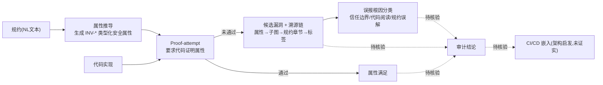

# SPECA

## 一句话定位
基于规约的安全审计 Agent 框架（Specification-to-Checklist Agentic Auditing），从自然语言规约推导安全属性，再验证代码实现是否满足这些属性，而非传统的"扫描代码模式找 Bug"。

## 它解决的问题
传统安全审计工具从代码出发找漏洞模式，但规约驱动系统（协议栈、共识实现、密码学库）的漏洞可能来自"实现不满足规约"而非"代码有 Bug"。现有工具缺乏表达"规约要求什么"的能力。

SPECA 反转分析方向：从规约（Specification）出发，推导类型化安全属性，再要求实现"证明"每个属性。

## 为什么值得关注（2026-05-08）
SPECA 代表了安全审计的范式升级，且有学术验证：
- Sherlock Ethereum Fusaka 审计竞赛（366 份提交）中恢复全部 15 个 H/M/L 漏洞
- 独立发现 4 个竞赛中未被发现的 Bug（包括密码学不变量违反）
- RepoAudit C/C++ 基准上精确率 88.9%
- 所有误报可追溯到 3 个可解释根因

这种"从规约推导属性，再验证实现"的方法，在金融、区块链、密码学等规约驱动领域有独特价值。

## 热度来源判断
- 345 stars 偏低但有学术论文支撑（arXiv:2604.26495）
- 属于"小众但高价值"项目
- 安全审计 + LLM Agent 是小众但确定的需求
- TUI 前端（speca-cli）降低了使用门槛

## 关键技术亮点亮点
1. **规约锚定审计**：从自然语言规约推导类型化安全属性（INV-* 标签），每个发现都有完整溯源链（属性→子图→规约章节→标签）
2. **Proof-attempt 推理**：不是"找 Bug"，而是要求实现"证明"每个属性。未通过证明的就是潜在漏洞
3. **可控的跨实现比较**：同一属性词汇表应用于 N 个实现，可做跨实现的系统化比较
4. **误报可解释**：误报分解为 3 个根因（信任边界误解 50%、代码阅读错误 37.5%、规约误解 12.5%），每个映射到具体管道阶段

## 架构师速览

| 决策问题 | 研究判断 | 证据边界 |
|---|---|---|
| 系统边界 | SPECA 是规约→属性→代码证明尝试的审计 Agent 框架，定位在传统 SAST/DAST 之上、完整 DevSecOps 平台之下，专为规约驱动系统（智能合约、密码学、共识）设计 | 基于定位描述与同类对比（Slither/CodeQL/Deepsec）推断；具体入口、模型供应商、部署形态未在档案中证实 |
| 主路径 | 自然语言规约 → 推导 INV-* 类型化安全属性 → 在代码上做 Proof-attempt（证明尝试） → 失败者即候选漏洞，带完整溯源链（属性→子图→规约章节→标签） | 仅来自档案"关键技术亮点"段；运行时编排、工具调用协议、持久化方式均未披露 |
| 关键权衡 | 学术新颖性（Sherlock 竞赛 15/15 召回、独立发现 4 漏洞、RepoAudit P=88.9%） vs 生产化短板（345 stars、社区关注度低、LLM 成本未量化、适用范围限于规约驱动系统） | 数字来自档案；"成本可控""可生产"等结论超出档案证据 |
| 最小 PoC | 在 Sherlock Fusaka / RepoAudit C/C++ 基准或自有智能合约仓库上复现规约→属性→证明尝试闭环，重点核验：误报三类根因占比是否成立、溯源链是否完整、单次 run 的 token 消耗 | 基准名与准确率来自档案；CLI/部署细节、模型依赖、token 量需源码核验 |

## 架构启发
SPECA 的核心洞察：**安全审计应该从"代码模式匹配"升级为"规约属性验证"**。

对架构师的启发：
- 在设计规约驱动系统（协议、共识、密码学模块）时，可以将安全属性显式编码为规约的一部分
- SPECA 的"属性推导 + 证明尝试"管道可以嵌入 CI/CD，实现持续安全验证
- 误报可解释性是企业落地的关键——安全团队需要知道为什么报了这个问题

## 架构图（MMD）

> 证据边界：此图只采用本档案已有可核验描述；“待核验”节点不应视为项目实现事实。

## 定位判断
学术化但可用的安全审计平台。定位在：
- 高于传统 SAST/DAST 工具（因为从规约出发）
- 低于全功能 DevSecOps 平台（因为聚焦规约驱动系统）
- 适合金融、区块链、密码学等领域的安全审计

## 风险 / 局限 / 泡沫点
1. **适用范围窄**：规约驱动系统是安全审计的子集，不是所有代码都适合这种范式
2. **LLM 成本高**：完整的规约推导 + 属性验证需要大量 LLM 调用，成本不低
3. **Star 数低**：345 stars 说明社区关注度有限，可能影响长期维护

## 与同类项目的关系
- **Deepsec (Vercel)**：工业化 Agent 安全扫描，从代码出发。SPECA 从规约出发。互补。
- **Slither (Trail of Bits)**：Solidity 静态分析框架。SPECA 可以在 Slither 输出之上做规约层分析
- **CodeQL (GitHub)**：通用代码查询框架。SPECA 的规约锚定是 CodeQL 不覆盖的能力

## 是否值得持续跟踪
**是。** 规约锚定审计是有学术验证的创新方法。特别适合金融/区块链企业做 PoC。

## 后续观察点
1. 是否有金融/区块链企业采用并公开案例
2. 对非 EVM 协议（如 Cosmos、Solana）的适配进度
3. TUI 前端（speca-cli）的用户体验成熟度
4. LLM 成本是否可控（完整的审计 run 需要多少 token）

---
*首次记录：2026-05-08*
