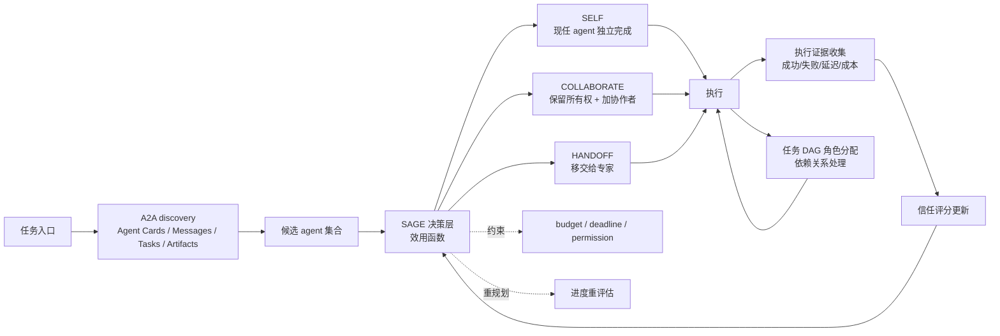

# wang2122/sprix-sage-router

## 一句话定位
Sprix AI 屿智同行出品的"状态感知 A2A 路由决策层"——在 SELF（独立完成）/ COLLABORATE（招募协作者）/ HANDOFF（移交给专家）三种模式间做效用最优选择，并基于执行证据持续学习；位于 Agent2Agent (A2A) 协议之上，作为"决策层"补充 A2A 的"发现层"。

## 它解决的问题
A2A（Agent2Agent）协议只解决"哪些 agent 存在"（discovery），但不回答运行时难题——**执行已开始后，谁该与谁协作？** 传统做法依赖启发式规则（如"超时就重试"），缺乏可审计的效用函数。SAGE（State-Aware Graph Exchange）把"决策"做实：用一个统一效用函数比较 SELF / COLLABORATE / HANDOFF 三种模式，让选择有据可查；执行后用证据更新信任评分，实现"边做边学"。

## 为什么值得关注（2026-08-23）
- **5 天 1,243⭐**（GitHub API 可核验）：在 research-preview 阶段已有此增速，说明 multi-agent 路由是公认难点
- **明确的研究产物定位：** README 顶部即声明"An open-source research output of Sprix AI at 屿智同行"，降低"生产可用性"误判风险
- **完整的文档体系：** README + ALGORITHM.md + 基准测试 + CONTRIBUTING.md + SECURITY.md
- **协议层定位清晰：** 明确"SAGE 位于 A2A 协议之上"，不抢 A2A 风头

## 热度来源判断
**"A2A 协议层不完整 × multi-agent 协同是公认难点"双重驱动。** A2A 协议 2025-2026 年快速发展，但 discovery 之后缺决策层是公认空白；SAGE Router 抢占了这个空白。**1.2k⭐的增速含研究圈关注**——multi-agent 协调是学术热点，README 提及"state-aware"+"trust from execution evidence"等学术概念吸引研究者关注。需注意：research-preview 状态明确，不应直接用于生产。

## 关键技术亮点
1. **三模式效用函数：** SELF（现任 agent 继续）/ COLLABORATE（保留所有权，加协作者）/ HANDOFF（移交给专家）——统一比较
2. **Progress-aware 重规划：** 执行过程中根据进度重新评估决策
3. **Execution-evidence 更新信任：** 用实际执行结果（成功/失败/延迟/成本）更新 agent 信任评分
4. **A2A 协议层定位：** 明确"SAGE 位于 A2A 之上"，不替代 A2A
5. **任务 DAG 角色分配：** 把任务拆为 DAG 并分配角色，处理依赖关系
6. **预算与权限约束：** 在 permission、budget、deadline 约束下做决策

## 架构师速览

| 决策问题 | 研究判断 | 证据边界 |
|---|---|---|
| 系统边界 | SAGE Router 是 A2A 协议之上的决策层，承担"执行中路由决策 + 信任评分更新"；不替代 A2A 的 discovery 与 transport | README 与 ALGORITHM.md 明确描述；具体效用函数参数、信任评分算法、A2A 协议细节依赖版本均待核验 |
| 主路径 | A2A discovery → 候选 agent 集合 → SAGE 三模式效用评估 → 选择 SELF/COLLABORATE/HANDOFF → 执行 → 收集 evidence → 更新信任 → 进度重评估 | 主路径为 README 描述；具体效用函数公式、证据收集粒度、A2A 版本兼容性均待代码核验 |
| 关键权衡 | "统一效用函数"vs"任务特征差异（实时 vs 批量、IO vs 计算）"；"信任评分"vs"评分冷启动与恶意刷分"；"research-preview"vs"生产可用性" | 均为推断；具体效用函数、信任评分抗攻击性、生产化路径均待核验 |
| 最小 PoC | 在研究预览模式下配置 3 个 mock agent（快/慢/贵），跑一个"先快后转慢"的混合任务，观察 SAGE 是否真能在 progress-aware 阶段把 HANDOFF 触发；记录证据日志验证 trust 评分是否更新 | PoC 范围与退出路径由"研究模式、可观察、可审计"原则推导；具体命令、版本兼容、SLO 指标待核验 |

## 架构启发
SAGE Router 的核心启发是 **"multi-agent 协议应分层"**——A2A 解决 discovery，transport，task artifacts；SAGE 解决决策与信任。**"统一效用函数"是把 multi-agent 协调从艺术变为工程的关键**——传统启发式难调试、难审计，统一效用函数让每一步决策都有依据。另一启发：**信任评分必须基于 execution evidence 而非静态 metadata**——只有"做过什么"的证据才能让 agent 之间的协作持续优化，但需要防范恶意刷分。

## 架构图（MMD）

> 证据边界：此图只采用本档案已有可核验描述；"待核验"节点不应视为项目实现事实。

## 定位判断
**观察型项目（A2A 决策层 research-preview）。** SAGE Router 在生产可用性上仍是研究阶段，但它精准定位"A2A 之上的决策层"空白，是 multi-agent 协议栈演进的"探针"。短期看，仅供研究参考；中期看，若 A2A 协议广泛采纳，SAGE 可能成为 multi-agent 协作的"标准决策层"。对企业：当前不建议生产采用，但可作为架构演进参考；对研究者：这是 multi-agent 协调的明确研究方向。

## 风险 / 局限 / 泡沫点
- **research-preview 状态：** 明确为研究输出，不应直接用于生产
- **效用函数的主观性：** "统一效用函数"看似客观，但参数（延迟权重 / 成本权重 / 信任权重）的选择本身是主观决策
- **信任评分的冷启动：** 新 agent 无证据时如何评分？默认分 vs 零信任 vs 随机分？冷启动策略未在档案中明示
- **恶意刷分风险：** agent 可能通过"故意完成简单任务"刷高信任评分，然后承接高价值任务后失败；评分鲁棒性需深入研究
- **A2A 协议版本依赖：** SAGE 紧贴 A2A，A2A 协议变更可能让 SAGE 同步升级
- **学术热度 vs 工业可用性的差距：** 1.2k⭐含学术社区关注，工业场景的实际收益待长周期验证

## 与同类项目的关系
- **vs LangChain Multi-Agent / AutoGen：** 那些是 SDK / orchestration 框架；SAGE 是协议层之上的决策层
- **vs Anthropic A2A / Google A2A：** 那些是 discovery / transport 协议；SAGE 是其上的决策层
- **vs CrewAI / Mastra：** 那些是 agent 编排框架；SAGE 是"该不该把任务给某个 agent"的决策层
- **vs joe960913/Jixu（单 agent harness）：** Jixu 主张单 agent + 强韧 runtime；SAGE 主张 multi-agent 决策——两种路线并存
- **vs academic papers on multi-agent coordination：** SAGE 是把学术研究工程化的产物，对研究者是参考实现

## 是否值得持续跟踪
**值得持续跟踪（A2A 决策层 research-preview 的早期样本）。** 1.2k⭐的增速说明 multi-agent 协调是公认热点。建议关注：① research-preview → production-ready 的节奏；② A2A 协议标准化进展；③ 信任评分鲁棒性的研究输出；④ 是否被主流 agent 框架（LangGraph / CrewAI）整合。对研究者：这是 multi-agent 协调的明确信号；对企业架构师：当前不建议生产采用，但应作为长期演进参考。

## 后续观察点
- research-preview → production-ready 的时间表（与 A2A 协议稳定度相关）
- 信任评分的鲁棒性研究（恶意刷分防御、冷启动策略）
- 主流 agent 框架是否整合 SAGE 思想
- 学术论文与基准测试（Benchmark）的进展
- 与 LangGraph / CrewAI / ADK 等框架的协同或竞争关系

---
> 数据来源: GitHub API (2026-08-23) | Stars: 1,243 | License: MIT | 语言: Python | 创建: 2026-08-18 | 推送到 main: 2026-08-21
