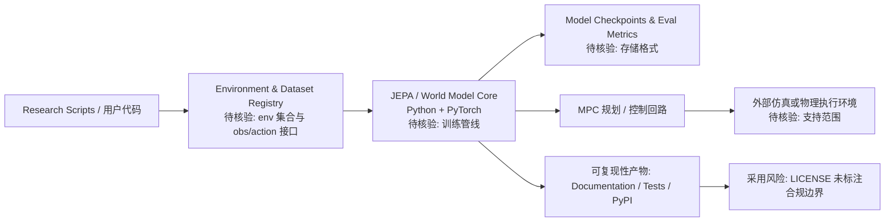

# galilai-group/stable-worldmodel — A platform for reproducible world model research and evaluation

## 一句话定位

A platform for reproducible world model research and evaluation。主要使用 Python 编写，当前 2,110 stars / 255 forks / 17 subscribers。

## 它解决的问题

**目标用户**：使用 python 生态的开发者、工程师。

**痛点**：该项目解决的核心问题是 A platform for reproducible world model research and evaluation。从 README 来看，项目提供了 <h1 align="center">stable-worldmodel</h1> 
<i>A platform for reproducible world model research and evaluation.</i>
 
 <a href="https://galilai-group.github.io/stab。

**场景**：适用于需要 deep-learning, jepa, model-predictive-control 的开发场景。

## 为什么值得关注（2026-05-31）

1. **Stars 增长**：2,110 stars，255 forks——fork/star 比为 12.1% （高 fork 比例说明部署/集成意愿强）
2. **活跃度**：创建于 2025-06-27，最后更新 2026-08-10，17 open issues
3. **技术栈**：Python，License: 未标注
4. **生态定位**：Topics: deep-learning, jepa, model-predictive-control, pytorch, world-model

## 热度来源判断

**真实需求信号**：forks 255（高部署意愿），subscribers 17（尚在早期）。

**品类时机**：从 topics 来看，deep-learning, jepa, model-predictive-control 是当前社区关注的方向。

## 关键技术亮点

1. **<h1 align="center">stable-worldmodel</h1>**
2. **
<i>A platform for reproducible world model research and evaluation.</i>
**
3. **
**
4. **<a href="https://galilai-group.github.io/stable-worldmodel/"> 证据边界：此图只采用本档案已有可核验描述；“待核验”节点不应视为项目实现事实。

## 定位判断

**学习型**。在生态中定位为A platform for reproducible world model 方向的工具。Stars 2110 说明已有一定社区基础。

## 风险 / 局限 / 泡沫点

1. **规模风险**：2,110 stars，但 fork 255 说明有实际部署
2. **维护风险**：最后 push 时间 2026-08-10，活跃维护中
3. **Open Issues**：17 个 open issues，问题量可控
4. **License**：未标注

## 与同类项目的关系

- 与同 Python 生态的同类工具形成竞争/互补关系。具体竞品对比需参考社区讨论。
- 从 topics (deep-learning, jepa, model-predictive-control) 来看，与关注 deep-learning 的其他项目有交叉。

## 是否值得持续跟踪

**是。** 2110 stars + 活跃更新说明项目有持续价值。建议关注后续版本迭代和社区增长。

## 后续观察点

1. Star 增速是否可持续（当前 2,110）
2. Fork 增长趋势（当前 255）
3. 功能迭代频率（最后更新 2026-08-10）
4. 社区活跃度（subscribers 17, open issues 17）

---
> 数据来源: GitHub API (2026-08-10) | Stars: 2,110 | Forks: 255 | License: 未标注 | 语言: Python | 创建: 2025-06-27
