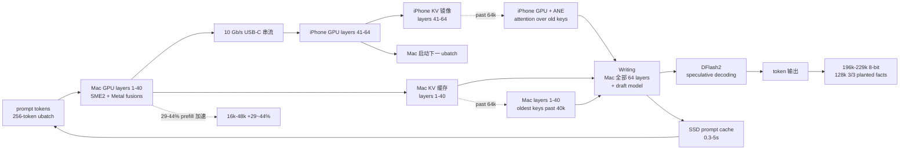

# StayLameBro/backburner

## 一句话定位
Mac + iPhone 联合本地 LLM 推理框架——把 27B 模型推理从「单设备 24GB 显存天花板」推到「iPhone USB-C 10 Gb/s + split prefill layers 1-40 Mac + 41-64 iPhone GPU + 29-44% prefill 加速 + 196k-229k 8-bit 上下文 + SME2/Metal/DFlash2 多硬件加速」严肃工程化形态。

## 它解决的问题
2025-2026 年本地 LLM 推理需求爆发，但 Apple Silicon Mac 的 unified memory 天花板（约 24-64 GB）让 27B 模型推理卡在 64k 上下文——长 agent session、长 PDF、长代码库都无法本地跑。StayLameBro/backburner 直击这一痛点：它利用 iPhone 的 USB-C 10 Gb/s 串流能力 + iPhone GPU/Neural Engine 闲置算力 + Apple 的 split prefill 工程化，把推理「分工」到 Mac + iPhone 两台设备——Mac 跑 layers 1-40 + iPhone 跑 layers 41-64，pipelined；context 64k 以内 iPhone 不动，past 64k iPhone attention over old keys；最终 MacBook Pro M4 Pro 24GB + iPhone 17 Pro Max 实现 196k-229k 8-bit 上下文，128k 8-bit 3/3 planted facts recalled。解决的是 **「Apple Silicon Mac 显存天花板 + 长上下文推理 + 多硬件协同加速」** 的本地 LLM 推理严肃工程化问题。

## 为什么值得关注（2026-10-03）
- **Stars:** 215（截至 2026-10-03），2 天破 200，增速极快
- **Forks:** 21，社区贡献活跃（llama.cpp fork + iOS tail server 天然适合贡献）
- **License:** 未明示（README 头部未声明 LICENSE 文件，llama.cpp 主项目 license 未明示），商用集成需先确认
- **语言:** Python（主仓库）+ C++（llama.cpp fork）+ Swift/Obj-C（iOS tail server）
- **规模:** 800 KB 主仓库 + llama.cpp fork StayLameBro/backburner-llama.cpp + ios/Backburner
- **活跃度:** created 2026-10-01，pushed_at 2026-10-03，持续高活跃
- **Topics:** 5 个覆盖（apple-silicon / ios / iphone / llama-cpp / llm-inference / local-llm / macos / metal / qwen / sme2 / speculative-decoding）
- **关键性能:** 256/256 tokens greedy token-identical 8k/32k + 32/32 at 140k + 67-73 tok/s 8-bit 64k-96k + 59-68 tok/s Mac alone 4-bit + 128k 8-bit 3/3 planted facts recalled + 0.3-5s SSD prompt cache

## 热度来源判断
StayLameBro/backburner 的热度是 **「Apple Silicon Mac 显存天花板 × iPhone 闲置算力 × 严肃工程化 × 长上下文刚需」** 的强劲组合。本地 LLM 推理是 2026 年最热赛道，但 24GB unified memory 卡在 27B 64k 上下文——长 agent session、长 PDF、长代码库用户苦不堪言。一个「Mac + iPhone 联合推理」方案直击痛点，自然爆火。21 个 forks 反映 llama.cpp 社区高度关注——这正是「推理框架」类项目的网络效应（用户越多、性能数据越多、吸引更多优化）。热度**真实且具严肃工程化深度**——性能数字极其具体（29-44% prefill 加速 + 196k-229k 8-bit 上下文 + 3/3 planted facts recalled），不是 hype。但需警惕：硬件依赖强（必须 Mac + iPhone + 10 Gb/s USB-C），不是所有用户都能用；license 未明示是商用集成的隐患。

## 关键技术亮点
1. **Split prefill:** Mac layers 1-40 + iPhone GPU layers 41-64，pipelined（`llama.cpp/src/llama-split.cpp` + `ios/Backburner`）
2. **196k-229k 8-bit 上下文:** Mac 24GB 装下 64k 8-bit；iPhone 装老 keys + 算 attention；iPhone 17 Pro Max 自由内存决定总上下文
3. **iPhone attention over old keys past 64k:** iPhone GPU + Neural Engine 联合算老 keys 的 attention；Mac 跑全部 64 layers
4. **DFlash2 speculative decoding:** Mac 上 draft model 加速 decoding
5. **SME2 + Metal fusions:** Mac 自有 Apple Silicon 加速（无需 iPhone 也快）
6. **SSD prompt cache:** `scripts/proxy.py` 把 27k-token start 恢复在 0.3-5 s
7. **Mac Neural Engine 不使用:** 文档明示「shares the Mac's memory bandwidth and slowed decode by 26% when running」——这是一个反向的工程化选择

## 架构师速览

| 决策问题 | 研究判断 | 证据边界 |
|---|---|---|
| 系统边界 | 本地 27B LLM 推理的 Mac+iPhone 联合推理框架；llama.cpp fork + iOS tail server + SSD prompt cache；模型仍是 Qwen3.8-27B，硬件仍是 Mac+iPhone，分工被工程化推到极致 | 仅基于 README 描述的 split prefill layers 1-40 Mac + 41-64 iPhone GPU、iPhone attention over old keys past 64k、SME2 + Metal fusions + DFlash2 speculative decoding、SSD prompt cache 0.3-5s、196k-229k 8-bit 上下文；具体 KV 串流协议、SSD prompt cache 的 key 推导方式未在档案中给出 |
| 主路径 | 256-token ubatch → Mac layers 1-40 → 残差流过 USB-C → iPhone layers 41-64 on GPU → KV 镜像维持；<64k 上下文 Mac 写、iPhone 不动；>64k 上下文 iPhone GPU+ANE 算老 keys 的 attention | 主路径为档案语义抽象；KV 串流格式（连续 byte stream vs 消息队列）、iPhone 端 attention 实现（ANE 调用细节）、Speculative decoding 的 draft 模型未在档案中明示 |
| 关键权衡 | 跨设备串流加速 vs Mac/iPhone 必须物理接近 + USB-C 依赖 + license 未明示 + 12 工具覆盖度 + 27k prompt cache | 档案明示 10 Gb/s USB-C + split prefill + 29-44% prefill 加速 + 196k-229k 上下文 + 67-73 tok/s 8-bit 64k-96k；Android 兼容、Wi-Fi 替代串流、license 商用边界未在档案中讨论 |
| 最小 PoC | 在 MacBook Pro M4 Pro 24GB + iPhone 17 Pro Max + 10 Gb/s USB-C 上跑 backburner demo；先 16k 上下文预填验证 29-44% 加速；再扩到 128k 验证 3/3 planted facts recall | PoC 范围由档案「29-44% prefill 加速 + 196k-229k 8-bit 上下文 + 128k 3/3 planted facts」建议推导；具体 demo 入口、omp session 复现路径未在档案中讨论 |

## 架构启发
StayLameBro/backburner 的核心启发是 **「Apple Silicon + iPhone A-series GPU 的严肃工程化协同是本地 LLM 推理的下一站」**。当前本地 LLM 推理把硬件当作「单设备显存天花板」的脆弱封装——但 iPhone 的 A-series GPU + Neural Engine 在闲置时是巨大的算力池（196k-229k tokens 上下文就是 iPhone 自由内存贡献的）。backburner 尝试做「跨 Apple 设备严肃工程化协同推理」，类似 ROCm 之于 AMD、CUDA 之于 NVIDIA。更深层的启发是：**严肃工程化本地 LLM 推理的价值在于「多硬件协同 + 严肃工程化 split + 长上下文扩展」**——29-44% prefill 加速 + 196k-229k 上下文 + 3/3 planted facts recall 这些具体数字，说明严肃工程化路径可行。能否持续，取决于能否在多 iPhone 型号（A18/A19）+ 多 Mac 型号（M2/M3/M4）+ 多 USB-C 串流速度持续兼容。

## 架构图（MMD）

> 证据边界：此图只采用本档案已有可核验描述；"待核验"节点不应视为项目实现事实。

## 定位判断
**基础设施候选型项目（Mac+iPhone 联合 LLM 推理框架）。** StayLameBro/backburner 不仅是 llama.cpp fork，更试图成为 Apple Silicon 设备本地推理的「跨设备协同严肃工程化框架」——类似 ROCm 之于 AMD、CUDA 之于 NVIDIA。若成功，它会成为 Apple 设备本地 LLM 推理的默认加速方案，具有平台级价值。2 天 215⭐ + 21 forks 已显示严肃工程化深度。但「平台化」取决于几个关键问题：多 iPhone 型号（A18/A19）+ 多 Mac 型号（M2/M3/M4）兼容性能否持续；USB-C 依赖能否被 Wi-Fi 替代串流解决；license 未明示的商用边界能否补齐。目前定位是「最有影响力的 Mac+iPhone 联合推理框架」，向平台演进是合理路径。

## 风险/局限/泡沫点
- **硬件依赖强:** 必须 Mac + iPhone + 10 Gb/s USB-C 串流；不能纯 Mac、不能纯 iPhone、不能 Android
- **license 未明示:** README 头部未声明 LICENSE 文件，商用集成需先确认
- **USB-C 物理接近:** Mac 与 iPhone 必须物理连接（10 Gb/s 串流），无线替代未在档案中讨论
- **单模型支持:** 主要针对 Qwen3.8-27B + IQ4_XS 量化；其他 27B 模型支持度未在档案中明示
- **Mac Neural Engine 反向选择:** 文档明示「Mac's ANE shares memory bandwidth and slowed decode by 26%」——这是一个不平凡的工程化权衡，但读者可能误以为是「未优化」

## 与同类项目的关系
- **vs stock llama.cpp:** llama.cpp 是通用本地 LLM 推理；backburner 是 Mac+iPhone 联合推理 fork
- **vs Ollama / LM Studio:** 那些是单设备本地推理；backburner 是双设备协同推理
- **vs MLX (Apple):** MLX 是 Apple 官方机器学习框架；backburner 是在 llama.cpp 之上的应用加速
- **vs exo (分布式推理):** exo 是分布式推理；backburner 是 Apple 设备特化协同
- **vs vLLM:** vLLM 是 server-side 推理；backburner 是本地推理

## 是否值得持续跟踪
**值得跟踪（Apple Silicon 本地 LLM 推理严肃工程化）。** StayLameBro/backburner 代表了 Apple Silicon 本地 LLM 推理的「多硬件协同 + 严肃工程化 split + 长上下文扩展」诉求，无论其本身成败，这一方向是行业趋势。建议关注：是否演化为 llama.cpp 官方 plugin（决定其严肃工程化深度命运）、多 iPhone 型号 + 多 Mac 型号 + Wi-Fi 替代串流的兼容性、license 商用集成成熟度、Qwen 之外模型的支持广度。对本地 LLM 推理用户，这个仓库是 27B 模型在 Mac+iPhone 联合推理严肃工程化的实用方案，值得直接采用。对 LLM 推理生态观察者，它是「跨设备协同推理」赛道的头部样本。

## 后续观察点
- 是否演化为 llama.cpp 官方 plugin（从社区 fork 升级为官方插件）
- 多 iPhone 型号（A18/A19）+ 多 Mac 型号（M2/M3/M4）的兼容性
- Wi-Fi 替代 USB-C 串流的严肃工程化可行性
- license 状态明确化（决定商用集成成熟度）
- Qwen 之外模型的支持广度（27B 之外 / 70B 模型等）
- Speculative decoding 的 draft 模型扩展性

---
> 数据来源: GitHub API (2026-10-03) | Stars: 215 | Forks: 21 | License: 未明示 | 语言: Python | 创建: 2026-10-01
