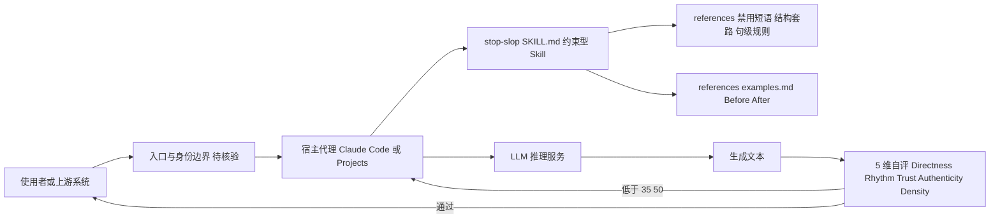

# hardikpandya/stop-slop

## 一句话定位
一个 Agent Skill 文件，专门教会 AI 识别和去除写作中的"AI 味"（slop）——预测性短语、结构套路、节奏模式，让 AI 生成的文本读起来更像人写的。

## 它解决的问题
随着 LLM 的普及，AI 生成的文本形成了可预测的模式——堆砌形容词、滥用 em dash（破折号）、"not just... but also..."的二元对比句式、"In today's fast-paced world..."式的废话开头。这些"AI 味"让读者一眼就能识别出"这是 AI 写的"，降低了内容的可信度和阅读体验。stop-slop 通过一组结构化的规则和参考文件，教会 AI 自我检测并消除这些痕迹。

## 为什么值得关注（2026-05-24）
- 15,301 stars，1,092 forks——创建于 2026-01-11，半年内达到 15K+ stars
- MIT 许可证，纯 Markdown 内容（Skill 文件 + 参考文件），无代码依赖
- 标准的 Agent Skill 结构（SKILL.md + references/ 目录），兼容 Claude Code、Claude Projects、自定义指令、API 系统提示等多种使用方式
- 与 taste-skill（73K stars）共同定义了"AI 输出质量控制"这个微赛道

## 热度来源判断
**真实需求 + Skills 生态爆发**。stop-slop 的热度来自两个驱动力：(1) AI 写作去味是真实痛点——随着 AI 生成内容泛滥，"去 AI 味"成为内容创作者、营销人员、开发者的共同需求；(2) Agent Skills 生态的爆发——2026 年初 Claude Code Skills、Cursor Plugins 等机制普及后，Skill 文件成为新的"prompt 工程"载体，stop-slop 恰好乘上了这波浪潮。但需注意，15K stars 对于一个纯 Markdown 文件来说有泡沫成分——使用价值取决于用户是否真正将其集成到工作流中。

## 关键技术亮点亮点
1. **三层检测框架**：将"AI 味"分解为三个维度——(a) Banned phrases（禁用短语：废话开头、强调填充词、商业术语）；(b) Structural clichés（结构套路：二元对比、否定列举、戏剧性碎片化）；(c) Sentence-level rules（句子级规则：禁止 Wh- 句首、禁止 em dash、要求主动语态）。这种分层设计让 AI 能从词汇、句式到段落结构全方位自检。
2. **量化评分系统**：设计了 5 维评分（Directness 直接性、Rhythm 节奏、Trust 信任读者智慧、Authenticity 人味、Density 信息密度），每维 1-10 分，总分低于 35/50 则需要重写。这提供了可量化的质量标准，而非模糊的"写得更好"。
3. **Before/After 示例库**：references/examples.md 提供了改造前后的对比示例，让 AI 通过 few-shot learning 理解什么是"slop"以及如何改写。这种基于示例的教学方式比纯规则更有效。

## 架构师速览

| 决策问题 | 研究判断 | 证据边界 |
|---|---|---|
| 系统边界 | stop-slop 本身是一个纯 Markdown 资产（SKILL.md + references/），无自有运行时；系统边界由宿主 Claude/Claude Code 或自定义指令环境划定，stop-slop 仅作为约束型 Skill 文件被加载 | 未在档案中给出宿主侧 API、权限模型或部署方式；具体加载机制以 Anthropic Skills 文档为准 |
| 主路径 | 文本生成请求 → 宿主代理加载 Skill → 在系统提示层应用禁用短语/结构/句级规则与 5 维评分 → 生成结果与 Before/After 示例参考回灌 | 5 维评分（Directness/Rhythm/Trust/Authenticity/Density，1-10，总分 35/50 阈值）见档案；实际注入顺序与 token 消耗未披露 |
| 关键权衡 | 规则刚性 vs 写作多样性：禁副词、禁 em dash、禁 Wh- 句首等硬规则在新闻/技术写作中收益显著，但在文学创作、学术论文等场景可能压制风格 | "规则主观性、时效性"已列在档案风险段；具体跨场景失效数据未给出 |
| 最小 PoC | 在 Claude Projects 或 Claude Code 中挂载 SKILL.md，向其提交已知含 slop 的段落，验证 (1) 是否检出 banned phrases/structural clichés；(2) 5 维自评是否触发低于 35/50 的重写；(3) Before/After 示例是否被 few-shot 引用 | 档案未提供具体 prompt 模板、token 成本或评分重现性数据，验证指标须自行定义 |

## 架构启发
stop-slop 代表了 Agent Skills 的一种重要形态——"约束型 Skill"。它不教 AI 做新事情，而是教 AI 不要做某些事情（不要使用特定短语、不要使用特定结构）。这种"减法设计"在 prompt 工程中非常实用。其 SKILL.md + references/ 的目录结构也成为了 Agent Skill 的标准格式——核心指令在 SKILL.md 中，详细的短语列表和示例放在 references/ 子目录中按需加载。

## 架构图（MMD）

> 证据边界：此图只采用本档案已有可核验描述；“待核验”节点不应视为项目实现事实。

## 定位判断
stop-slop 定位为**AI 写作质量优化的工具型 Skill**。它不解决"写什么"的问题（那是创作），只解决"怎么写得更不像 AI"的问题（那是风格优化）。在 Skills 生态中，它属于"输出质量控制"类别，与 taste-skill（前端设计质量）形成互补。

## 风险 / 局限 / 泡沫点
1. **规则刚性 vs 写作多样性**：stop-slop 的规则相当严格（禁止所有副词、禁止 em dash、禁止 Wh- 句首），这些规则在新闻写作中可能适用，但在文学创作、学术论文等场景中可能过于限制。好文章不一定要遵循这些规则。
2. **"去 AI 味"的定义主观性**：什么是"slop"、什么是"人味"本质上是主观判断。stop-slop 的规则反映了作者个人的写作审美偏好，不一定普适。
3. **LLM 能力的自然演进**：随着新一代 LLM（如 GPT-5、Claude 4.x）自身的写作风格改善，stop-slop 中的某些规则可能变得不再必要。Skill 的时效性是一个风险。
4. **15K stars 的泡沫评估**：作为纯内容文件，15K stars 中多少来自"收藏备用"而非实际集成使用，值得谨慎评估。

## 与同类项目的关系
- **Leonxlnx/taste-skill**：73K stars，同属 Skills 生态。taste-skill 侧重于前端 UI 设计质量（布局、排版、动效），stop-slop 侧重于文本写作质量。两者互补。
- **EveryInc/compound-engineering-plugin**：24K stars，复合工程方法论插件。更侧重于代码工程方法论而非写作风格。
- **Anthropic 官方 Skills**：Anthropic 提供的官方 Claude Code Skills，其中可能包含类似的写作优化指令，但 stop-slop 是社区驱动的更细化版本。

## 是否值得持续跟踪
**值得关注，但作为"微赛道"而非独立项目跟踪**。stop-slop 和 taste-skill 共同定义的"AI 输出质量控制"赛道是一个有趣的现象——它反映了用户对 AI 默认输出质量的不满。这个赛道的长期走向取决于 LLM 自身能力的提升速度——如果 LLM 原生输出质量足够好，这类 Skill 的价值会下降。

## 后续观察点
1. **LLM 原生写作能力的提升**：新一代模型（GPT-5、Claude 5）是否原生减少了 stop-slop 所针对的"slop"模式，从而降低这类 Skill 的必要性
2. **Skill 的演进和社区贡献**：是否会有更多场景化的规则变体（如学术写作版、技术文档版、创意写作版）
3. **与写作工具的集成**：是否被 Notion AI、Google Docs 等主流写作工具采纳为后端质量优化层

---
*首次记录：2026-05-24*
