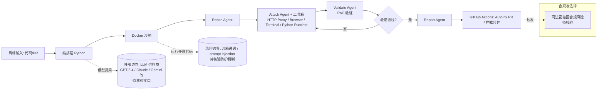

# strix — 开源 AI 渗透测试 Agent

## 一句话定位
自主 AI Agent 在 Docker 沙箱中模拟真实黑客攻击行为，发现漏洞并生成 PoC 验证——让渗透测试从"人工服务"变成"自动化流水线"。

## 它解决的问题
**目标用户：** 开发团队、安全团队、Bug Bounty 猎人
**痛点：** 传统 SAST 误报率高、DAST 配置复杂、人工渗透测试周期长成本高（数周）、CI/CD 中缺少自动化安全验证

## 为什么值得关注（2026-06-29）
GitHub Trending Daily 上榜。在 Agent 安全生态中填补了"自动化攻击验证"的空白——与 no-mistakes（防御）、Anthropic-Cybersecurity-Skills（技能库）形成完整工具链。关键卖点是"真实 PoC 验证而非误报"。

## 热度来源判断
真实需求驱动。DevSecOps 从"安全扫描"到"安全测试"的演进是行业趋势。Docker 沙箱+本地运行降低了使用门槛。GitHub Actions 集成使其可直接进入 CI/CD 流水线。AI Agent 模拟攻击行为是比静态分析更有价值的能力。

## 关键技术亮点亮点
1. **多 Agent 协作架构**：recon（侦察）→ attack（攻击）→ validate（验证）→ report（报告），每个阶段由不同 Agent 角色
2. **完整黑客工具箱**：HTTP Proxy（请求/响应操纵）、Browser Automation（XSS/CSRF/Auth 测试）、Terminal（命令执行）、Python Runtime（exploit 开发）
3. **Docker 沙箱隔离**：所有 Agent 行为在容器内执行，首次运行自动拉取沙箱镜像
4. **20+ 漏洞类别覆盖**：IDOR/权限提升、SQL/NoSQL/命令注入、SSRF/XXE、XSS、业务逻辑/竞态条件
5. **CI/CD 原生集成**：GitHub Actions 自动扫描 PR，阻止不安全代码合并

## 架构师速览

| 决策问题 | 研究判断 | 证据边界 |
|---|---|---|
| 系统边界 | 编排层位于 Python 主体与 Docker 沙箱之间，向下隔离 Agent 行为（Recon/Attack/Validate/Report + HTTP Proxy/Browser/Terminal/Python Runtime），向上对 CI/CD 入口（GitHub Actions PR 拦截）与本地使用者负责 | 沙箱镜像与编排接口未在档案中给出具体协议；模型供应商可插拔性仅为推断 |
| 主路径 | 目标输入 → Docker 沙箱内多 Agent 流水线（recon → attack → validate → report）→ 验证通过的 PoC 触发 Auto-fix PR；任一阶段失败可回退到 attack 重试 | 未给出实际状态机、消息队列与持久化层；"Auto-fix PR"机制细节缺失 |
| 关键权衡 | 攻击覆盖广度（20+ 漏洞类别+完整工具箱）↔ 沙箱逃逸与 prompt injection 风险；CI/CD 原生拦截 ↔ 误报阻断合法合并；多 Agent 自治 ↔ LLM 质量依赖（GPT-5.4/Claude/Gemini 结果不稳） | 沙箱逃逸具体防护措施、误报率/漏报率基准、可观测性能力均未披露 |
| 最小 PoC | 取一个 PR/小型靶场，在最小权限沙箱+审计日志下跑一次端到端扫描，关注 PoC 真实性、沙箱 CPU/内存基线、PR 拦截阈值误报率三项可度量项 | 沙箱资源画像、模型成本、退出路径未提供；结果稳定性只能凭多次重跑观察 |

## 架构启发
strix 的"Agent 团队模拟攻击链"架构值得学习：不是单个 Agent 做所有事，而是按攻击阶段分角色。这种模式可推广到其他"多步骤专家协作"场景（如代码审查、数据分析）。

## 架构图（MMD）

> 证据边界：此图只采用本档案已有可核验描述；“待核验”节点不应视为项目实现事实。

## 定位判断
工具型，有潜力演化为平台型。当前是单点工具（AI 渗透测试），但如果开放自定义 Agent 角色和漏洞规则引擎，可成为安全自动化平台。

## 风险 / 局限 / 泡沫点
1. **安全工具的双刃剑风险**：AI Agent 在沙箱中执行任意代码，沙箱逃逸风险存在
2. **LLM 质量依赖**：不同模型（GPT-5.4 vs Claude vs Gemini）的漏洞发现能力差异大，结果不稳定
3. **攻击面新增**：Agent 可能被恶意输入误导（prompt injection 导致误判）
4. **合规风险**：自动渗透测试在不同司法管辖区可能有法律限制

## 与同类项目的关系
- **vs SAST 工具（SonarQube/Snyk）**：strix 动态运行代码验证，SAST 静态分析。互补而非替代
- **vs DAST 工具（OWASP ZAP/Burp）**：strix 用 AI Agent 自主决策攻击路径，DAST 需要人工配置规则
- **vs claude-bug-bounty**：strix 更全面（多 Agent+完整工具箱），bug-bounty 更轻量（专注 Claude Code 集成）

## 是否值得持续跟踪
**是。** Agent 安全工具是 2026 年确定性增长赛道，strix 是其中架构最完整的开源方案。

## 后续观察点
1. 是否被企业级安全团队真实采纳（非仅个人猎虫者）
2. 是否支持自定义 Agent 角色和攻击策略
3. 误报率/漏报率的实际基准测试数据
4. 沙箱安全性的审计结果

---
## 最近动态（2026-07-14）
- Stars 从 31.9K → 41.2K，周增 4,143，持续 Trending Weekly
- 今日作为 AI 安全赛道"攻方"代表入选，与 Hallmark（守方）形成安全双翼
- Multi-Agent 编排模式（侦察/利用/验证分工）确认可复用到其他领域
- CI/CD 集成已落地，支持 PR 级安全拦截

*首次记录：2026-06-29*
