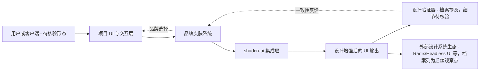

# styleseed

## 一句话定位
AI 设计引擎，让 AI 生成的代码具备专业级 UI/UX 设计质量，支持品牌皮肤选择并与 shadcn-ui 等设计系统深度集成。

## 它解决的问题
开发者普遍缺乏专业设计能力：设计任务耗时、品牌一致性难以保障、AI 生成的代码在视觉质量上参差不齐。现有 AI 编码工具（Copilot、Cursor 等）能生成功能代码，但在设计质量上缺乏专业级的处理。styleseed 通过品牌皮肤系统为 AI 代码注入专业设计能力，解决"功能正确但设计粗糙"的问题。

## 为什么值得关注
- **需求精准**：解决开发者设计能力短板的痛点
- **技术先进**：基于现代化的 TypeScript 技术栈
- **生态友好**：与 shadcn-ui 生态系统深度集成
- **效果显著**：提供专业级的设计输出质量
- **品牌皮肤系统**：支持多种设计风格的品牌皮肤
- **MIT License 开源**

## 热度来源判断
- AI 辅助设计是长期发展趋势
- shadcn-ui 生态的快速增长带来集成红利
- 开发者对"AI 生成代码的设计质量"的持续关注
- 品牌一致性是企业级开发的真实需求

## 关键技术亮点亮点
1. **品牌皮肤系统**：支持多种设计风格的品牌皮肤，确保设计语言一致性
2. **设计-开发一体化**：从设计到代码的无缝衔接
3. **shadcn-ui 深度集成**：与主流设计系统深度集成，降低 adoption 门槛
4. **设计验证器**：确保生成代码的设计一致性
5. **现代化架构**：基于 TypeScript 的可扩展架构

## 架构师速览

| 决策问题 | 研究判断 | 证据边界 |
|---|---|---|
| 系统边界 | styleseed 是一个 TypeScript 实现、面向 UI/UX 设计增强的工具型项目，档案公开强调“品牌皮肤系统”与 shadcn-ui 集成，但其本身是否同时包含设计器、运行时注入、CLI、VS Code 扩展等组件，仅在档案层面未明确分隔。 | 边界划分基于分类标签与一句话定位推断，未做源码审计，不替代实际组件清单。 |
| 主路径 | 主路径是用户选定品牌皮肤 → 经 shadcn-ui 集成层把设计语义应用到 AI 生成或手写代码的组件上 → 输出符合该品牌的设计 UI；其中“设计-开发一体化”是档案明确描述的核心衔接路径。 | 协议、生成管线、是否存在服务端渲染或纯本地处理，档案未给出，需以源码核验。 |
| 关键权衡 | 主要权衡集中在“品牌一致性 vs. 创意自由度”“与 shadcn-ui 生态紧耦合 vs. 多生态扩展”“AI 设计输出 vs. 训练数据/模型能力上限”三组；档案已点名“生态依赖”与“创意局限”为风险。 | 权衡论断以档案风险段为准，不外推性能或 SLO 数字。 |
| 最小 PoC | 用一个真实组件（如表单或仪表盘卡片）接入品牌皮肤切换，验证视觉一致性、设计-代码衔接链路与 shadcn-ui 集成可用性，并把生态锁定、数据来源、退出路径写进验收项。 | PoC 范围未超档案明文能力描述；端到端效果与外部依赖降级策略不在档案证据内。 |

## 架构启发
1. **设计-开发一体化**：打破设计和开发的壁垒，减少协调成本
2. **品牌一致性保障**：自动化设计语言管理
3. **智能化设计流程**：AI 驱动的智能设计决策

## 架构图（MMD）

> 证据边界：此图只采用本档案已有可核验描述；“待核验”节点不应视为项目实现事实。

## 定位判断
**工具型** — 作为实用的开发工具，提升开发效率和设计质量。可能扩展为更完整的设计平台。

## 风险/局限/泡沫点
1. **设计质量依赖**：AI 设计质量依赖训练数据和模型能力
2. **创意局限**：可能缺乏创意突破，主要在现有设计系统内优化
3. **生态依赖**：依赖 shadcn-ui 等特定生态，生态变更风险
4. **领域限制**：主要适用于特定设计系统，高度定制化需求支持有限
5. **学习成本**：需要学习使用新工具

## 与同类项目的关系
| 项目 | 定位 | 关系 |
|------|------|------|
| shadcn-ui | UI 组件库 | 集成目标：styleseed 基于 shadcn-ui |
| v0 (Vercel) | AI UI 生成 | 竞品：不同路径的 AI 设计工具 |
| Figma | 专业设计工具 | 不同层次：设计工具 vs AI 代码设计增强 |

## 是否值得持续跟踪
**是** — AI 辅助设计工具是重要的开发工具演进方向，品牌皮肤系统是有趣的差异化设计。

## 后续观察点
- 与更多设计系统（如 Radix、Headless UI）的集成
- AI 设计质量的实际提升
- 是否从工具扩展为设计平台
- 企业级品牌管理场景的采纳
