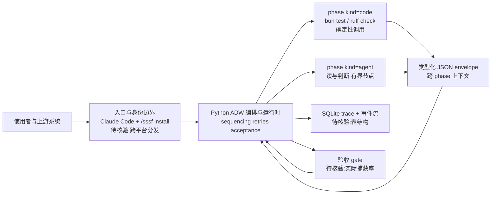

# disler/super-simple-software-factory — 软件工厂 Skill（Python 拥有控制平面）

## 一句话定位
一个把"agents-plus-code 工作流"打包成单个 skill、可 stamp 进任何 repo 的软件工厂——确定性 Python 拥有编排/重试/验收的控制平面，coding agent 是其中有界的节点。

## 它解决的问题
目标用户是需要可复现 agent 驱动软件开发的工程师。痛点：把整个 SDLC 交给一个 agent → 没有接缝、没有阶段边界、没有验收标准、"done"意味着"agent 停止说话"、重试是冷启动（丢失 agent 刚学到的一切）、唯一 trace 是要像小说一样读的 transcript、跑两次得到两个不同系统。super-simple-software-factory 用"代码拥有控制平面，agent 为有界节点"修复这些。

## 为什么值得关注（2026-08-07）

它提出了一个明确且可操作的 agent 工程化范式：**"agent proposes, code disposes"**。核心理念是确定性代码（`bun test`、`ruff check` 这种已知调用）不该交给 agent——agent 重新发现测试运行器会浪费 context window 且每次付费。agent 只做"需要阅读和判断"的环节。110 fork 说明有工程师愿意部署/学习这个范式。它与 sol-advisor（1,694⭐，Codex-native 编排）呼应"agent 编排层工程化"主题。

## 热度来源判断
- **真实需求信号**：110 fork（fork/star 比 24%，偏高）说明有工程师在尝试部署这个范式。README 是认真的工程文档（含架构图、设计哲学论证、example branch），非营销页面。
- **架构主张的吸引力**："Python 拥有控制平面"这个主张击中了 agent 工程化的真实痛点——prompt 即控制平面的不可复现性。
- **话题性成分**：14 watchers 偏低（vs 459⭐），说明关注度高于深度跟踪意愿，但 fork 高说明有人愿意"试用"。

## 关键技术亮点亮点

1. **Python 控制平面 + agent 有界节点**：ADW（AI Developer Workflow）脚本拥有 sequencing、retries、acceptance。agent 工作在命名的 phase 内。代码失败时，failure 作为 envelope 通过与 agent report 相同的通道返回给 builder，修复循环相同。核心理念：**"agent proposes, code disposes"**。
2. **类型化 JSON envelope 跨阶段传递上下文**：每个 phase 有明确边界，envelope 是 context 跨接缝的唯一方式，gate 成为"done"的定义。这让 failure 可定位（哪个 phase 失败），且 correction 比 restart 便宜（session 仍活着）。
3. **SQLite trace + 事件流**：所有事件实时落入 SQLite（"while it is still happening"），UI 轮询 trace db。这让 agent 工作流可回溯、可监控。
4. **`kind="code"` phase vs agent phase**：已知调用（`bun test`、`ruff check`）用 `kind="code"` phase，不需要 agent。只有需要"阅读和判断"的环节才用 agent。这避免了 agent 做"算术"（浪费 token + context window）。
5. **Skill 分发模式**：复制 `.claude/skills/sssf/` 到目标 repo，在 Claude Code 内 `/sssf install`。skill 名为 sssf。

## 架构师速览

| 决策问题 | 研究判断 | 证据边界 |
|---|---|---|
| 系统边界 | Python 控制平面拥有 SDLC 编排/重试/验收；agent 是有界 phase 节点；分发形式为 `.claude/skills/sssf/` skill，绑定 Claude Code 入口 | 仅基于 README 与档案标签，未审计源码；其他模型/平台兼容性"待核验" |
| 主路径 | 入口(Claude Code `/sssf install`) → ADW 脚本(sequencing/retries/acceptance) → `kind="code"` phase（确定性调用）与 agent phase（读与判断） → 类型化 JSON envelope 跨 phase → SQLite trace 持久化 | phase 具体协议、envelope schema、SQLite 表结构"待核验" |
| 关键权衡 | "agent proposes, code disposes"：把已知调用交给确定性代码换取 token/context 节省与可复现性；代价是 phase 划分、envelope 设计、gate 标准的额外工程开销，且当前绑定 Claude Code | README 设计主张；trace 可读性、acceptance gate 实际捕获率"待核验" |
| 最小 PoC | 在单 repo 内复制 `.claude/skills/sssf/`，在 Claude Code 中 `/sssf install`，运行 example branch，对比同一任务两次运行的结果差异与 SQLite trace 中 phase 边界的可读性 | 验收项含：可复现性、phase 失败定位能力、Claude Code 外平台兼容性、退出路径 |

## 架构启发
核心启发是 **"谁拥有循环"** 的重新分配。传统：一个 agent 拥有自己的循环（无 phase 边界、无 acceptance）。super-simple-software-factory：代码拥有循环（sequencing/retries/acceptance），agent 只拥有一个有界 phase 内的工作。这把"prompt 即控制平面"重构为"代码即控制平面"。对架构师的启发：**agent 的价值在"读和判断"，不在"编排自己"**——编排应交给确定性代码，因为代码零成本、光速运行、你完全拥有它。

## 架构图（MMD）

> 证据边界：此图只采用本档案已有可核验描述；“待核验”节点不应视为项目实现事实。

## 定位判断
属于 **agent 编排/工程化层**，是"agent 工作流可复现性"的范式参考。不与应用层（qm/crm）竞争，而是为它们提供"如何工程化 agent 工作流"的方法论。与 skill-recorder（技能提取）、ratchet（执行约束）不在同一层——它是"如何编排 agent 完成完整开发任务"的范式。

## 风险 / 局限 / 泡沫点

1. **14 watchers 偏低**：vs 459⭐，说明关注度高于深度跟踪意愿。可能是"听起来好但还没人深入用"的状态。
2. **trace 质量和验收 gate 的实际效果未独立验证**：SQLite trace 和 acceptance gate 是 README 架构主张，但实际 trace 的可读性、gate 的有效性（是否真能捕获 agent 的错误输出）未独立验证。
3. **Claude Code 绑定**：skill 分发模式（`.claude/skills/sssf/`）绑定 Claude Code，跨 agent 平台兼容性待观察。
4. **"软件工厂"概念需验证 PMF**：这是一个架构范式/demo，而非成熟产品。能否在真实项目中持续产出高质量代码，需更多案例。

## 与同类项目的关系
- **vs DannyMac180/sol-advisor（1,694⭐）**：sol-advisor 是 Codex-native 架构编排（特定模型，强制 fresh Sol review），super-simple-software-factory 是模型无关的 Python 控制平面（更通用）。两者共同信号："agent 编排"从 ad-hoc prompt 进入工程化结构。
- **vs wshobson/agents（38K⭐，agent skill 集合）**：wshobson/agents 是 skill 的集合（"用什么 skill"），super-simple-software-factory 是如何编排 skill/agent 完成完整任务的范式（"如何用 skill"）。
- **vs skill-recorder（2,127⭐）**：skill-recorder 是"如何从人类执行提取 skill"，super-simple-software-factory 是"如何用 skill+agent 编排开发"。不同层。

## 是否值得持续跟踪
**是，作为"agent 编排工程化范式"的代表项目跟踪。** 核心价值在于它提出了一个可操作的范式（"Python 拥有控制平面"），而非具体工具。重点验证 trace 质量、acceptance gate 实际效果，以及是否有真实项目采用案例。

## 后续观察点
1. **真实项目采用案例**：example branch 之外是否有第三方项目实际用 sssf 完成开发，以及产出质量。
2. **跨 agent 平台兼容**：是否扩展到 Claude Code 之外的 agent（Codex/Cursor），还是保持 Claude Code 绑定。
3. **trace 可读性**：SQLite trace 在实际复杂工作流中的可读性——能否真帮助定位"哪个 phase 失败"。

---
*首次记录：2026-08-07* · *数据来源: GitHub API + 仓库 README*
