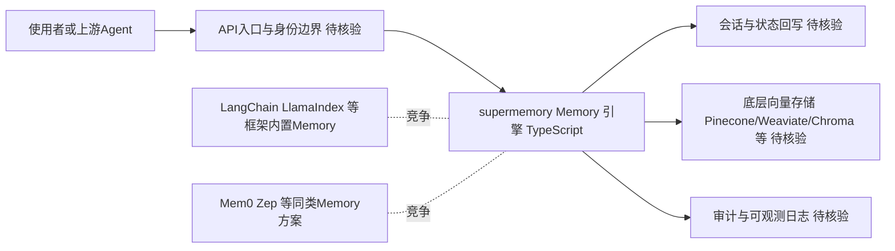

# supermemory

## 一句话定位
AI 时代的 Memory 引擎——为 Agent 提供超快、可扩展的长期记忆 API，尝试定义记忆层的标准接口。

## 它解决的问题
AI Agent 缺乏跨会话的持久记忆能力。每次对话都是全新的，无法记住用户偏好、历史决策、项目上下文。这限制了 Agent 从「工具」到「助手」的进化。

## 为什么值得关注（2026-06-03）
- **24.6K stars** 说明市场对 Memory 标准化有强烈需求
- **+677 stars/day** 持续增长
- Agent Memory 是从「一次性对话」到「持续运行」的关键缺失层
- 如果接口设计足够通用，可能成为 Agent 基础设施标准组件

## 热度来源判断
- Agent Memory 是公认的痛点，需求真实
- 24.6K stars 中部分来自对向量数据库 wrapper 的期待
- 需区分「Memory 需求是真实的」和「这个项目是正确答案」

## 关键技术亮点亮点
- 可扩展的 Memory API 设计
- TypeScript 实现，易集成
- 定位为 AI 时代的 Memory 基础设施

## 架构师速览

| 决策问题 | 研究判断 | 证据边界 |
|---|---|---|
| 系统边界 | 定位为 Agent Memory 中间层，向下屏蔽底层存储、向上暴露标准化 API；项目档案未确认其内部是否自研向量索引或仅封装第三方向量库 | 仅依据标签（memory, ai-memory, agent-infrastructure, api, vector-database）与 TypeScript 语言事实推断，存储实现待核验 |
| 主路径 | 外部请求经 API 入口进入，调用 Memory 引擎完成写入与检索，再回写会话/状态；是否包含模型推理与工具调用环节档案未明示 | 档案自述"Memory API + 可扩展"但未给出请求处理的具体控制流 |
| 关键权衡 | 作为独立层需要在"通用接口覆盖广度"与"独立于 LangChain/LlamaIndex 等框架"之间取舍；同时面临 Mem0/Zep 同类方案与向量数据库自身的双向竞争 | 档案明确点出竞争关系，但未提供性能、协议、权限模型等可量化证据 |
| 最小 PoC | 单渠道接入 + 最小工具权限 + 审计日志开启的小流量验证，重点验证 API 通用性、跨会话持久化效果与退出路径 | 档案给出采用建议方向，但未提供官方 SDK、鉴权方式、部署形态等 PoC 所需的具体接入细节 |

## 架构启发
- Memory 层可能成为 Agent 架构的标准组件，位于 LLM 和工具层之间
- 标准化 Memory 接口可以让不同 Agent 共享记忆上下文

## 架构图（MMD）

> 证据边界：此图只采用本档案已有可核验描述；“待核验”节点不应视为项目实现事实。

## 定位判断
**平台候选。** Memory API 如果设计得当，可以成为 Agent 基础设施层。但标准定义权尚未确立。

## 风险/局限/泡沫点
1. 「Memory API」标准定义权尚未统一，多个竞争方案可能并存
2. 需观察：是否只是向量数据库 wrapper，还是有更深层的架构创新
3. 24.6K stars 的热度可能部分来自 AI Agent 概念炒作
4. 与 LangChain/LlamaIndex 等框架内置 Memory 功能竞争

## 与同类项目的关系
- **Mem0 / Zep**：同类 Memory 方案，竞争关系
- **向量数据库（Pinecone/Weaviate/Chroma）**：底层存储，supermemory 可能构建其上
- **LangChain Memory**：框架内置方案，supermemory 尝试做框架无关的独立层

## 是否值得持续跟踪
**是。** Memory 标准化是中期趋势，具体项目需持续观察技术深度。

## 后续观察点
1. API 设计是否足够通用，能否适配不同 LLM 后端
2. 是否只是向量数据库的简单封装，还是有独特架构
3. 大规模使用场景下的性能和可靠性
4. 与主流 Agent 框架的集成情况

---

*档案创建于 2026-06-03 · 数据截止 2026-06-03 06:00 CST*
