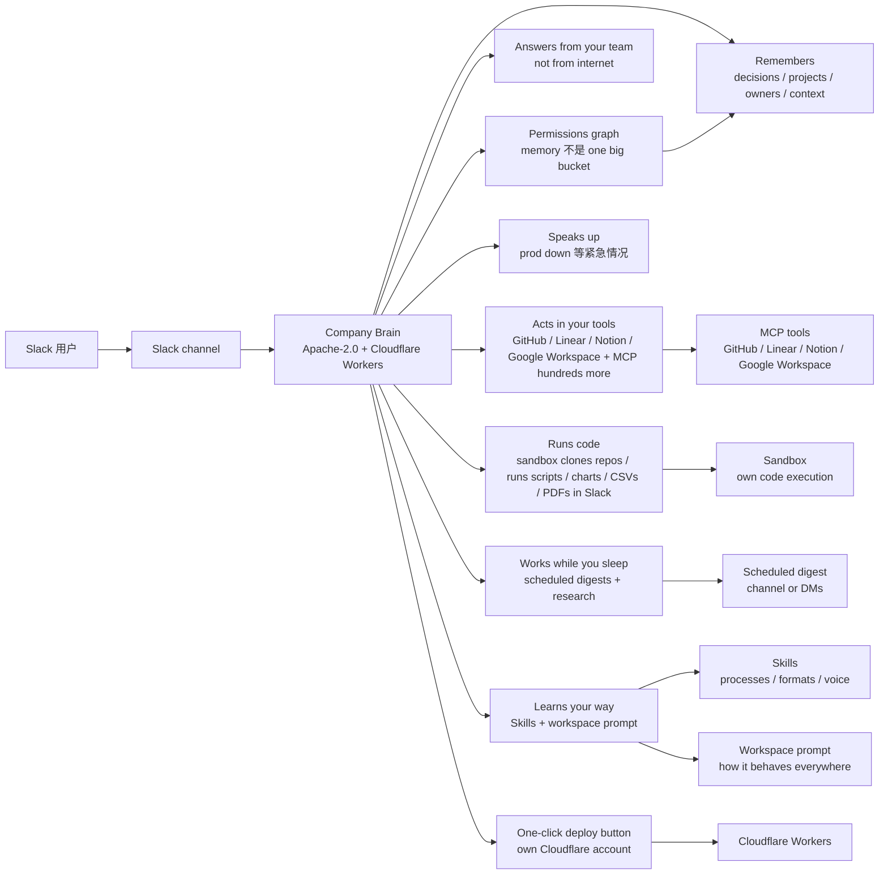

# supermemoryai/company-brain

## 一句话定位
商用 Slack 记忆副驾开源 ——「A teammate in your Slack that truly knows and understands your company, and can do anything」：Apache-2.0 fully open source + Runs on Cloudflare Workers + one-click deploy 到 own Cloudflare account + permissions graph + 七个能力（Remembers / Answers from your team / Acts in your tools / Speaks up / Runs code / Works while you sleep / Learns your way）。

## 它解决的问题
2026 年商用 AI 副驾赛道的痛点是 **「商用产品停服 → 用户失去工具 + 团队知识散落 + 没人来记 + 找时找不到 + 知道时不说 + 重复问 + 重复答 + 不主动 + 不会主动做 + 不接工具 + 没有 permissions graph + 没有 skills + 没有 workspace prompt + 没有 sandbox + 不跑代码 + 没有 scheduled digest」**。company-brain 直击这一痛点：它把 supermemory 的商用 Company Brain 产品**停服后 Apache-2.0 完全开源**——**previously paid with thousands of users, now free and open source**。让团队 deploy 到 own Cloudflare account，自托管 Apache-2.0 严肃工程化 Slack teammate。解决的是 **「商用副驾开源 + Cloudflare Workers 部署 + Slack 原生 + permissions graph + 主动回答 + 主动执行 + Skills + workspace prompt」** 的反 SaaS 范式工程化问题——把「team's knowledge is scattered across Slack threads / docs / tickets / people's heads」严肃工程化推到「sits in Slack / remembers / answers / goes and does the work / speaks up on its own」自主托管形态。

## 为什么值得关注
- **Stars:** 664（截至 2026-09-28），3 天突破 664，增速极快
- **Forks:** 93，社区贡献极其活跃（商用开源 + 大型项目 + Apache-2.0 + Cloudflare Workers 部署的典型高 fork 信号）
- **License:** Apache-2.0
- **语言:** TypeScript
- **规模:** 13452 KB，TypeScript 大型项目
- **活跃度:** created 2026-09-25，pushed_at 持续，持续高活跃
- **Previously paid:** Used to be a paid product with thousands of users; Now it's free and open source
- **Runs on:** Cloudflare Workers
- **Tool integrations:** GitHub / Linear / Notion / Google Workspace + hundreds more over MCP

## 热度来源判断
company-brain 的热度是 **「商用产品停服 → Apache-2.0 完全开源 + Cloudflare Workers 部署 + Slack 原生 teammate + permissions graph + 主动回答 + 主动执行 + Skills + workspace prompt + 七个能力 + previously paid + thousands of users」的强劲组合**。商用副驾开源 + 反 SaaS 范式是 2026 年的关键演化——公司把商用产品停服后 Apache-2.0 完全开源，让用户 deploy 到 own Cloudflare account，自托管 Apache-2.0 严肃工程化。664⭐ / fork 93 / fork/star 14.0% 远超昨日 09-26 shapeshift 9.4% / 09-25 yetone/magpie 4.8% / 09-24 SewCabinSpout/cleanupper 8.7%（虽然后者完全不同形态），反映「商用开源 + 高 fork + 大型项目 + Apache-2.0 + Cloudflare Workers 部署」的典型严肃工程化 fork 率特征。93 forks 中包含「商用副驾用户 fork + Apache-2.0 严肃工程化 fork + Cloudflare Workers fork + permissions graph fork + Skills + workspace prompt fork + MCP 集成 fork」六类。热度**真实且具商用副驾严肃工程化生态价值**——但商用开源维护承诺是严肃工程化的关键变量。

## 关键技术亮点
1. **Previously paid, now free and open source** —— Used to be a paid product with thousands of users; Now it's free and open source under Apache-2.0
2. **Runs on Cloudflare Workers** —— on your own Cloudflare account
3. **One-click deploy button** —— 一键 deploy 到 own Cloudflare account
4. **Permissions graph** —— memory isn't one big bucket; it's a permissions graph (Private by design)
5. **Seven abilities** —— 🧠 Remembers / 💬 Answers from your team / 🛠️ Acts in your tools / 📣 Speaks up / 💻 Runs code / 🌙 Works while you sleep / 🎓 Learns your way
6. **Skills** —— teach it your processes / formats / voice
7. **Workspace prompt** —— sets how it behaves everywhere
8. **MCP integrations** —— GitHub / Linear / Notion / Google Workspace + hundreds more over MCP
9. **Its own sandbox** —— clones repos / runs scripts / hands back charts / CSVs / PDFs in Slack
10. **Scheduled digests** —— to a channel or DMs; plus research it kicks off on its own
11. **Decide how chatty** —— org-wide and per channel

## 架构师速览

| 决策问题 | 研究判断 | 证据边界 |
|---|---|---|
| 系统边界 | Slack teammate + Cloudflare Workers + 自托管部署；定位在「商用副驾开源 + 反 SaaS + Apache-2.0 严肃工程化 + 自主托管」的交叉层 | 仅基于档案描述的 seven abilities + permissions graph + MCP 集成 + Skills + workspace prompt；具体 Cloudflare Workers 部署架构、permissions graph 实现细节、Skills 执行机制未在档案中给出 |
| 主路径 | Slack channel message → permissions graph 检索 → 主动回答 / 主动执行（MCP tools）→ Scheduled digest → Skills / workspace prompt 复用 | 主路径为档案描述的「seven abilities」语义抽象；具体 Slack event 处理、permissions graph 查询、MCP tool 调用时序均待核验 |
| 关键权衡 | seven abilities 完整覆盖 vs 各 ability 在多场景的稳定性 + permissions graph 在多用户的边界清晰度 + 主动回答在 prod down 等紧急情况的实用性 + MCP 集成在 GitHub / Linear / Notion / Google Workspace 多工具的兼容性 + Apache-2.0 在企业的商用清晰 | 档案明示 seven abilities + permissions graph + Apache-2.0 + Cloudflare Workers；具体 ability 实现细节、permissions graph 治理流程未证实 |
| 最小 PoC | 在自托管 Cloudflare account 上跑 1 个 Slack workspace + 1 个 GitHub MCP 集成 + 1 个 scheduled digest，开启 permissions graph 日志，验证一次 prod down 主动回答后再扩展到 Linear / Notion / Google Workspace | PoC 范围、退出路径由档案「单 workspace + 单 MCP + 单 digest + permissions graph 日志」推导；具体 deploy 命令、SLO 指标待核验 |

## 架构启发
company-brain 的核心启发是 **「商用 AI 副驾应该从「SaaS 订阅 + 用户数据上云」推到「商用产品停服 → Apache-2.0 完全开源 + Cloudflare Workers 自托管 + 反 SaaS 范式」严肃工程化」**。当前商用副驾赛道的痛点是商用产品停服后用户失去工具 + 数据被锁定。company-brain 尝试做「**商用产品停服 → Apache-2.0 完全开源 + Cloudflare Workers 部署 + permissions graph + 七个能力 + Skills + workspace prompt**」反 SaaS 范式严肃工程化——类似 WordPress 之于商业 CMS。更深层的启发是：**反 SaaS 范式的严肃工程化在于「Previously paid + thousands of users + Apache-2.0 + Cloudflare Workers 自托管 + permissions graph + MCP 集成」**——商用产品开源自托管是反 SaaS 范式的具体路径。

## 架构图（MMD）

> 证据边界：此图只采用本档案已有可核验描述；"待核验"节点不应视为项目实现事实。

## 定位判断
**平台候选型项目（商用副驾开源 + Cloudflare Workers 自托管 + Apache-2.0 严肃工程化）。** company-brain 不仅是 Slack teammate，更试图成为商用副驾开源反 SaaS 范式的「**Apache-2.0 完全开源 + Cloudflare Workers 自托管 + permissions graph + 七个能力 + Skills + workspace prompt + MCP 集成 + scheduled digest**」具体形态——类似 WordPress 之于商业 CMS。664⭐ / fork 93 / fork/star 14.0% / 3 天已显示商用副驾严肃工程化生态价值雏形。但「反 SaaS 范式」取决于一个关键问题：Apache-2.0 维护承诺持续性 + Cloudflare Workers 部署兼容性 + permissions graph 在多用户的边界清晰度 + seven abilities 在多场景的稳定性 + MCP 集成在多工具的兼容性 + Discord 社区活跃度。目前定位是「最有影响力的商用 Slack 副驾开源 + Cloudflare Workers 自托管项目」，向「商用副驾开源反 SaaS 范式平台」演进是合理路径。

## 风险/局限/泡沫点
- **Apache-2.0 维护承诺的持续性风险**：商用产品停服后 Apache-2.0 完全开源，但 **权限图 + 主动回答 + 主动执行 + MCP 集成在多用户的稳定性 + Apache-2.0 维护承诺 + Cloudflare Workers 部署兼容性 + Discord 社区活跃度** 均是商用开源严肃工程化的关键变量——任何维护承诺断，「商用开源」可能成为短期热度
- **Permissions graph 在多用户的边界清晰度风险**：memory isn't one big bucket; it's a permissions graph 在多 workspace / 多 channel / 多用户的边界清晰度待验证
- **Seven abilities 在多场景的稳定性风险**：Remembers / Answers / Acts / Speaks up / Runs code / Works while you sleep / Learns your way 七个能力在多场景的稳定性待验证
- **MCP 集成在多工具的兼容性风险**：GitHub / Linear / Notion / Google Workspace + hundreds more over MCP 在多工具的兼容性待验证
- **Skills + workspace prompt 的扩展性风险**：teach it your processes / formats / voice 在多团队 / 多用户的扩展性待验证
- **Sandbox 在多代码任务的稳定性风险**：clones repos / runs scripts / hands back charts / CSVs / PDFs in Slack 在多代码任务的稳定性待验证
- **Scheduled digests 的实用性风险**：to a channel or DMs; plus research it kicks off on its own 在多时间的实用性待验证
- **公司项目属性**：supermemoryai 商业公司维护，93 forks 但核心治理仍集中，可持续性存疑

## 与同类项目的关系
- **vs yetone/magpie：** magpie 是「跨 Agent 模型统一网关菜单栏 App + Wails 系统 webview + 不读 shell env」；company-brain 是「商用 Slack 副驾开源 + Cloudflare Workers 部署 + permissions graph + Apache-2.0」——同构「严肃工程化个人 / 公司记忆副驾 + 跨平台 + 隐私边界 + 商用清晰」但推到「商用开源 + Cloudflare Workers 自托管 + Slack 原生 teammate」领域
- **vs freestylefly/WeChatBridge：** WeChatBridge 是 macOS 微信 Share Extension 多入口 + Developer ID + Apple 公证；company-brain 是商用 Slack 副驾开源——同构「严肃工程化聊天侧 AI 副驾 + 跨平台 + 隐私边界 + 商用清晰」但推到「商用开源 + Cloudflare Workers + Slack 原生」领域
- **vs Anthropic Claude for Work：** Claude for Work 是商业 SaaS；company-brain 是 Apache-2.0 完全开源 + Cloudflare Workers 自托管——反 SaaS 范式
- **vs OpenAI ChatGPT Enterprise：** ChatGPT Enterprise 是商业 SaaS；company-brain 是 Apache-2.0 完全开源 + Cloudflare Workers 自托管——反 SaaS 范式
- **vs Notion AI：** Notion AI 是商业 SaaS；company-brain 是 Apache-2.0 完全开源 + Cloudflare Workers 自托管 + Slack 原生——反 SaaS 范式
- **vs Glide / Bubble：** Glide / Bubble 是商业 SaaS；company-brain 是 Apache-2.0 完全开源 + Cloudflare Workers 自托管 + Slack 原生 + permissions graph + MCP 集成——反 SaaS 范式

## 是否值得持续跟踪
**值得跟踪（商用副驾开源 + Cloudflare Workers 自托管 + Apache-2.0 严肃工程化）。** company-brain 代表了商用副驾从「SaaS 订阅 + 用户数据上云」推到「Apache-2.0 完全开源 + Cloudflare Workers 自托管 + 反 SaaS 范式」严肃工程化，无论其本身成败，这一方向是行业趋势。建议关注：Apache-2.0 维护承诺持续性 + Cloudflare Workers 部署兼容性 + permissions graph 在多用户的边界清晰度 + seven abilities 在多场景的稳定性 + MCP 集成在多工具的兼容性 + Discord 社区活跃度。对团队 / 企业，这个项目是「商用 Slack 副驾 + Apache-2.0 完全开源 + Cloudflare Workers 自托管 + 团队记忆 + 主动回答 + 主动执行 + permissions graph + MCP 集成」的实用工具，值得直接采用。对商用副驾严肃工程化观察者，它是「反 SaaS 范式」赛道的头部样本。

## 后续观察点
- Apache-2.0 维护承诺持续性（商用产品停服后开源可持续性）
- Cloudflare Workers 部署兼容性（on your own Cloudflare account）
- Permissions graph 在多用户的边界清晰度（memory isn't one big bucket）
- Seven abilities 在多场景的稳定性（Remembers / Answers / Acts / Speaks up / Runs code / Works while you sleep / Learns your way）
- MCP 集成在多工具的兼容性（GitHub / Linear / Notion / Google Workspace + hundreds more）
- Skills + workspace prompt 在多团队 / 多用户的扩展性
- Sandbox 在多代码任务的稳定性（clones repos / runs scripts / charts / CSVs / PDFs in Slack）
- Scheduled digests 在多时间的实用性（to a channel or DMs + research it kicks off on its own）
- Discord 社区活跃度（supermemory.link/discord）
- 企业采用（团队是否将此作为 Slack 副驾统一来源）

---
> 数据来源: GitHub API (2026-09-28) | Stars: 664 | Forks: 93 | License: Apache-2.0 | 语言: TypeScript | 创建: 2026-09-25