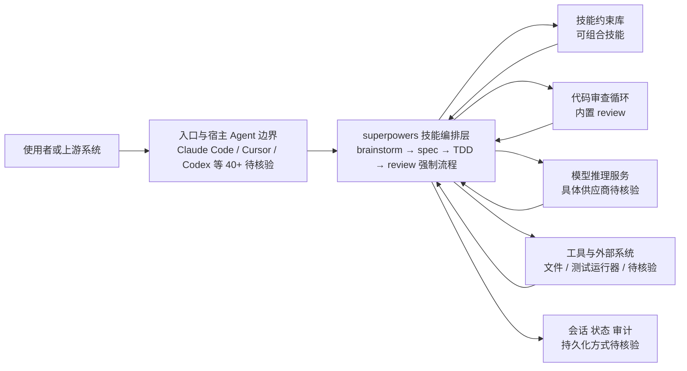

# superpowers

## 一句话定位

AI 编程 Agent 技能框架，强制执行 brainstorm → spec → TDD → review 工作流，让 AI 遵循工程实践而非直接写代码。

## 它解决的问题

AI Coding Agent 的通病是"直接写代码"——缺乏设计思考、缺少测试约束、没有代码审查流程。开发者拿到的是能跑的代码，但质量参差不齐，架构设计更是无从谈起。

superpowers 解决的核心问题：

1. **跳过设计阶段**：Agent 往往直接动手编码，跳过需求分析和方案设计
2. **测试缺失**：AI 生成的代码普遍缺少测试覆盖，质量无法保障
3. **无审查流程**：缺少代码审查环节，错误和坏味道无法被捕获

面向的用户是希望 AI Agent 遵循专业工程实践的开发者和团队，尤其是需要高代码质量的企业级项目。

## 为什么值得关注（2026-04-11）

3 个月内从 0 到 121K stars，增速惊人。被 Anthropic Marketplace 官方收录，生态认可度高。GitHub Trending #2，代表开发者对"结构化 AI 开发"的强烈需求。

这不是又一个 AI 编程工具，而是定义了 AI Agent 应该如何工作的方法论框架。

## 热度来源判断

- **方法论创新**：首次将软件工程实践（TDD、代码审查）强制嵌入 AI Agent 工作流
- **平台兼容性**：支持 Claude Code、Cursor、Codex 等 40+ 编码代理，不绑定单一平台
- **Anthropic 背书**：被 Anthropic Marketplace 官方收录，增加了可信度和可见度
- **承诺明确**：85-95% 测试覆盖率承诺，直击 AI 编码的痛点

## 关键技术亮点亮点

1. **brainstorm → spec → TDD → review 强制工作流**：Agent 必须先思考再编码，先测试再实现，非协商式流程
2. **技能组合化设计**：每个技能独立可复用，支持跨 Agent 平台使用，技能即约束
3. **多平台支持**：兼容 Claude Code、Cursor、Codex 等 40+ 编码代理，一套技能多处使用
4. **内置代码审查循环**：确保代码质量，强制执行 review 环节
5. **行为优先设计**：定义 Agent 的行为模式而非工具集，从根本上约束 Agent 输出质量

## 架构师速览

| 决策问题 | 研究判断 | 证据边界 |
|---|---|---|
| 系统边界 | superpowers 是叠加在 Claude Code / Cursor / Codex 等 40+ 编码 Agent 之上的技能/约束层，不替代宿主 Agent，也不直连模型与工具 | 边界判断基于语言为 Markdown/Config、定位为"技能框架"、与 Cursor Rules/Codex Tasks 的对比表述；具体加载机制、宿主注入点未在档案中说明 |
| 主路径 | 一次编码任务被强制走 brainstorm → spec → TDD → review 四段流程，技能作为可组合约束介入各阶段 | 流程顺序与技能组合化在档案中明确；状态如何持久化、跨会话如何回写未描述，待核验 |
| 关键权衡 | 工作流刚性与创造性 / 原型速度之间的取舍，以及"多平台兼容"声明与 Claude Code 生态最深耦合现实之间的张力 | "适合高质量项目、不适合探索性编程"和"与 Claude Code 绑定最深"均在档案中显式提及；具体耦合深度未量化 |
| 最小 PoC | 在单一宿主 Agent（如 Claude Code）启用 superpowers，跑一个带 TDD 与 review 的小任务，比对覆盖率与返工率 | 85-95% 测试覆盖率承诺、Anthropic Marketplace 收录在档案中明确；实际覆盖率达成度、企业级落地证据待核验 |

## 架构启发

superpowers 的核心设计哲学是 **技能即约束**：

- **行为定义**：不是告诉 Agent 用什么工具，而是定义 Agent 必须遵循的行为流程
- **非协商式约束**：Agent 不能跳过 brainstorm 直接编码，不能跳过 TDD 直接实现
- **技能组合**：不同技能可以组合使用，形成复杂的工作流约束
- **从"让 AI 写代码"到"让 AI 遵循工程实践"的范式转变**

Trade-off：过于刚性的工作流可能限制 Agent 的创造性和灵活性，适合对质量有严格要求的项目，不太适合快速原型和探索性编程。

## 架构图（MMD）

> 证据边界：此图只采用本档案已有可核验描述；“待核验”节点不应视为项目实现事实。

## 定位判断

**方法论层 / 基础设施候选**。superpowers 不是应用，不是平台，而是 AI Agent 的行为规范框架。它的价值在于定义了 Agent 应该如何工作，而非 Agent 能做什么。

## 风险 / 局限 / 泡沫点

- **方法论过度强制**：过于刚性的工作流可能限制创造性，不适合所有场景
- **技能生态不成熟**：技能库仍在建设中，覆盖场景有限
- **121K stars 的泡沫成分**：大量关注来自概念认同而非实际使用
- **平台耦合风险**：虽然声称多平台兼容，但与 Claude Code 生态绑定最深

## 与同类项目的关系

- **Claude Code 原生指令**：superpowers 是其上的结构化技能层，增强而非替代
- **Cursor Rules**：类似概念但更轻量，superpowers 更偏完整方法论
- **Codex Tasks**：OpenAI 的任务编排机制，定位类似但方式不同
- **skill-chain**：技能链管理系统，是 superpowers 技能组合的底层基础设施

## 是否值得持续跟踪

⭐ **必须跟踪。** superpowers 代表了 AI 编程从"代码生成"到"工程实践"的范式转变。无论最终产品形态如何，其方法论将对 AI Agent 生态产生深远影响。

## 后续观察点

1. **企业级应用案例**：85-95% 测试覆盖率承诺在实际项目中的兑现度
2. **技能生态丰富度**：社区贡献的技能数量和质量
3. **与竞品框架的差异化**：Cursor Rules 等竞品的演进方向
4. **方法论泛化**：是否从编程 Agent 扩展到其他 Agent 类型

---

*首次记录：2026-04-11*
