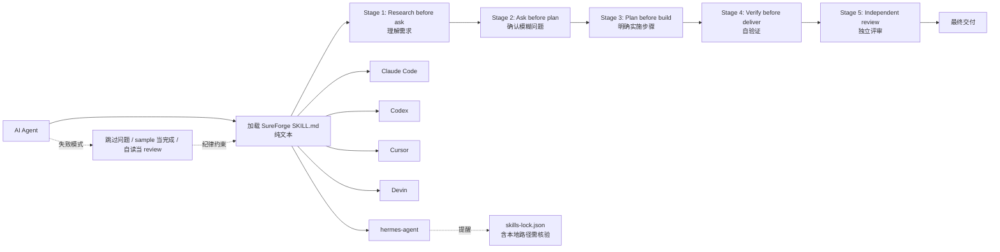

# Da7-Tech/SureForge

## 一句话定位
Agent Skill for complex work——五段工作纪律（research before ask / ask before plan / plan before build / verify before deliver / independent review before done）；纯文本 SKILL.md + references + assets，跨 Claude Code / Codex / Cursor / Devin / hermes-agent。

## 它解决的问题
AI Agent 在复杂任务上的失败模式可预测：(1) 在理解需求前就开始构建；(2) 把跳过的问题当作"是"；(3) 检查一个 sample 就说完成；(4) 重读自己的工作当作 review；(5) review 轮次用完就交差。SureForge 把这些失败模式整理成"五段工作纪律"，作为 SKILL.md 文本让 agent 遵循。**它不增加能力，而是降低失败率**。

## 为什么值得关注（2026-09-11）
- **Stars:** 86（截至 2026-09-11），2 天即达 86⭐
- **Forks:** 9 / 2 天，**10.5% fork/star 偏高**，反映 fork 学习/二次定制活跃
- **License:** MIT
- **语言:** Python（references + templates）
- **活跃度:** created 2026-09-09，pushed_at 2026-09-09，2 天内完成发布 v1.0.0
- **规模:** 121KB（纯文本 SKILL.md + references + assets）

## 热度来源判断
SureForge 的热度是 **"Agent 失败模式可预测 × 文本纪律 Skill 化 × 跨 5 Harness 安装"** 的组合。与一般 Skill 仓库"加能力"不同，SureForge 把"质量纪律"打包成 Skill，让 agent 遵守"研究 → 询问 → 计划 → 构建 → 验证 → 独立评审"的工作流。**9 forks 中可能有团队 fork → 二次定制为自己的纪律**。README 自述"the pattern behind it is simple: the time spent understanding, planning, and checking up front is far less than the time spent redoing work, patching it, and re-checking it by hand afterwards"——这是从团队实战中沉淀的方法论。热度**真实但受众限于工程团队**——agent 用户基数大，但愿意装"质量纪律"的比例需要观察。

## 关键技术亮点
1. **五段工作纪律**——research before ask / ask before plan / plan before build / verify before deliver / independent review before done
2. **纯文本 SKILL.md + references + assets**——无运行时、无 hook、无依赖；agent 像读其他 skill 一样读它
3. **跨 5 Harness 安装**——Claude Code / Codex / Cursor / Devin / hermes-agent；通过 Skills CLI `npx skills add Da7-Tech/SureForge`
4. **skills-lock.json 提醒**——README 明示"CLI may write a skills-lock.json... that file can contain local paths, so look at it before committing it"——这是一个非常成熟的工程实践
5. **失败模式清单**——把 agent 失败模式做成可读文档（"They start building before the request is understood. They treat a skipped question as a yes..."）

## 架构师速览

| 决策问题 | 研究判断 | 证据边界 |
|---|---|---|
| 系统边界 | 纯文本 Agent Skill；无运行时、无 hook、无依赖；agent 像读其他 skill 一样读 SKILL.md | 仅基于 README 明示的"plain text: no runtime, no hook, no dependency"；具体 reference 文件数量与模板细节未在档案中给出 |
| 主路径 | agent 接收任务 → 加载 SureForge SKILL.md → 遵循五段纪律 → 输出经过研究/询问/计划/构建/验证/独立评审的结果 | 主路径为 README "the working procedure" 语义；具体 SKILL.md 内容结构、references 章节以仓库代码为准 |
| 关键权衡 | 纪律明确性 vs 文本长度 vs 跨 Harness 同步 vs 用户自定义 vs 失败模式覆盖度 | 档案明示"五段"结构与跨 5 Harness；用户自定义入口（是否提供修改模板）待核验 |
| 最小 PoC | 在 Claude Code 中安装 SureForge，给 agent 一个复杂任务（如"为某中型项目添加 OAuth2 登录"），观察 agent 是否按"研究 → 询问 → 计划 → 构建 → 验证"流程推进 | PoC 范围由 README "five-stage" 语义推导；具体任务选择、review 轮次配置需自行验证 |
| 风险 | 121KB 仓库 size 偏小、五段纪律可能过于刚性、跨 Harness 同步维护成本 | 档案明示三项风险 |

## 架构启发
SureForge 的核心启发是 **"Skill 不只是'加能力'，也可以是'立规矩'"**。一般 Skill 仓库提供"prompt 模板 / 工具接入 / 知识库"等"加能力"功能；SureForge 反其道，把"质量纪律"打包成 Skill，让 agent 遵守工作流。**更深层的启发是：agent 失败的根源不是"能力不够"，而是"流程缺失"**——把"研究 → 询问 → 计划 → 构建 → 验证 → 独立评审"纪律化，比提升模型本身更直接降低失败率。这种模式可推广到其他质量维度（安全 / 合规 / 性能 / 可观测性）——每个维度都可以做成一个 SureForge-XXX Skill。

## 架构图（MMD）

> 证据边界：此图只采用本档案已有可核验描述；"待核验"节点不应视为项目实现事实。

## 定位判断
**工具型项目（Agent 质量纪律 Skill）。** SureForge 是"Skill 不只加能力，也可立规矩"的代表。它的价值与"agent 工程质量"需求正相关——企业 / 团队级 agent 部署对质量纪律的需求强于个人用户。**值得持续跟踪**工具型定位，但价值依赖跨 Harness 安装的可达性。

## 风险 / 局限 / 泡沫点
- **121KB 仓库 size 偏小**——references + templates 数量未知，可能内容不够丰富
- **五段纪律可能过于刚性**——某些简单任务不需要完整五段，agent 可能"过度流程化"
- **跨 Harness 同步维护成本**——5 个 Harness 格式各异且持续演变
- **"纪律"难以量化效果**——质量提升是软指标，难以做 A/B benchmark
- **个人项目属性**——Da7-Tech 单作者维护
- **受众限于工程团队**——个人 agent 用户的采纳意愿需要观察

## 与同类项目的关系
- **vs mubix/cyber-resume-reviewer-skill（前日上榜）：** 网络安全简历审查 Skill；SureForge 是通用质量纪律
- **vs HammingDev/haiming-app-monetization（同窗上榜）：** App 商业化流程 Skill；SureForge 是通用质量纪律
- **vs wshobson/agents：** 通用 Agent 插件市场；SureForge 是单 Skill（质量纪律）
- **vs Anthropic 官方 Skills：** 官方通用 Skills；SureForge 是垂直质量纪律
- **vs Anthropic Prompt Library：** 提示词模板集合；SureForge 是工作流纪律

## 是否值得持续跟踪
**值得跟踪（Agent 质量纪律 Skill 化）。** SureForge 验证了"Skill 立规矩"的产品形态。建议关注：(1) 五段纪律在实际任务中的效果（用户案例 / case study）；(2) 是否被 Anthropic / OpenAI / Cursor 等官方推荐；(3) 是否扩展到其他质量维度（安全 / 合规 / 性能）。对工程团队，本仓库直接提供可用的质量纪律；对 Skill 生态观察者，它是"立规矩"模式的代表样本。

## 后续观察点
- 五段纪律在实际任务中的效果（用户案例 / case study）
- 是否被 Anthropic / OpenAI / Cursor 等官方推荐
- 是否扩展到其他质量维度（SureForge-Security / SureForge-Compliance）
- references + templates 的实际丰富度
- 跨 5 Harness 同步维护频率
- skills-lock.json 在企业部署中的合规性

---
*首次记录：2026-09-11*
> 数据来源: GitHub API (2026-09-11) | Stars: 86 | Forks: 9 | License: MIT | 语言: Python | 创建: 2026-09-09
