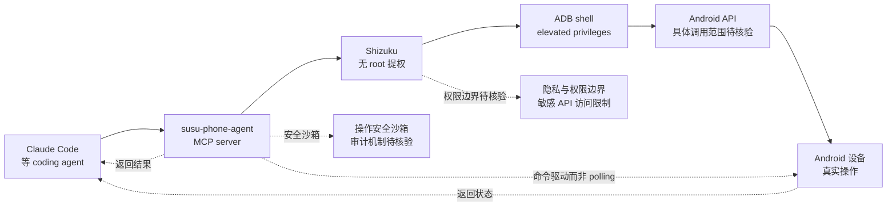

# 2005selene2005-a11y/susu-phone-agent

## 一句话定位
**Android device bridge for Claude Code via MCP + Shizuku** ——No root, no model polling。让 Claude Code 直接控制 Android 设备，无需 root 权限、无需云端 LLM。

## 它解决的问题
Coding agent 控制 Android 设备的三种现有路径都有痛点：(1) **需要 root**——传统 adb-based 方案需要 root 权限，普通用户无法使用；(2) **依赖云端 LLM**——上传屏幕截图到云端有隐私风险；(3) **持续后台监听**——多数方案需要 polling 屏幕状态，耗电且慢。**susu-phone-agent 通过 Shizuku（无 root 的 Android 权限提升方案）+ MCP server 解决前两个问题**：Shizuku 利用系统级 ADB 权限让普通应用获得 elevated privileges（无需 root），MCP server 把 Android 设备控制能力暴露为 Claude Code 可调用的 tools。"No model polling" 暗示是命令驱动而非异步监听——更适合"agent 发起 → 执行 → 返回"模式。

## 为什么值得关注（2026-08-26）
- **4 天 28⭐ / 1 fork / 0 open issues**：早期信号但维护状态良好
- **MIT 许可 / Java**：Android 原生开发语言
- **Shizuku 集成**：避开 root 需求，显著降低用户安装门槛
- **MCP server 形态**：与 Claude Code 等 coding agent 标准接口
- **29KB size**（极小）：暗示是简洁 bridge wrapper，实际 Android 自动化能力来自 ADB / accessibility API
- **"No model polling" 设计**：命令驱动而非异步监听，响应更快

## 热度来源判断
热度来自 **"agent 控制 Android 刚需 × Shizuku 避开 root × MCP 化标准接口"** 的组合：(1) Coding agent 用户大量使用 Android 设备（手机测试 / 移动开发），控制设备是真实刚需；(2) Shizuku 是 Android 生态成熟的"无 root 提权"方案，普通用户可一键启用；(3) MCP server 形态让任何 coding agent 可直接接入。**主要风险：** 28⭐ 仍属早期；Shizuku 用户群相对小众（vs root 用户）；与 macOS / iOS 对照项目是否会同步出现。

## 关键技术亮点
1. **Shizuku 集成避开 root 需求**：普通 Android 用户可一键启用
2. **MCP server 形态**：暴露 Android 控制能力给 Claude Code 等 coding agent
3. **"No model polling" 命令驱动**：响应快、耗电低
4. **29KB 极小 size**：可能是简洁 bridge wrapper，依赖 ADB / accessibility API
5. **MIT 许可**：商用友好
6. **0 open issues**：维护状态良好

## 架构师速览

| 决策问题 | 研究判断 | 证据边界 |
|---|---|---|
| 系统边界 | MCP server 形态；Android 客户端 + Shizuku 集成；命令驱动而非 polling；MIT 许可 Java 实现 | 边界由 README + topic 描述确认；具体 MCP tool 列表、可执行 Android 操作范围需源码核验 |
| 主路径 | Claude Code 发起控制请求 → MCP server 接收 → 通过 Shizuku elevated ADB 调用 Android API → 执行 adb 命令 / accessibility service → 返回结果 | 主路径为档案语义抽象；具体 Shizuku 状态监测、adb 命令子集、安全沙箱机制需源码核验 |
| 关键权衡 | Shizuku 提权 vs root 提权（更安全但功能受限）；命令驱动 vs 异步监听（响应快但感知弱）；MIT vs GPL（商用友好但社区贡献激励弱） | 取舍由 README "No root, no model polling" 描述确认；具体功能边界、Shizuku 权限范围未公开 |
| 最小 PoC | 安装 Shizuku + susu-phone-agent → 配置 Claude Code MCP server → 调 `adb shell input tap` 或类似 → 验证 Android 设备被控制 → 验证 Shizuku 权限链路 | PoC 流程由 README "MCP + Shizuku" 描述推导；具体 MCP tool 名、配置步骤、所需 Android 版本未公开 |
| 证据边界 | README + topic + GitHub API；具体 MCP tool 列表、可执行 Android 操作范围、Shizuku 权限边界、安全沙箱机制均需源码核验 | 已核验事实来自 GitHub API 与 topic；其他来自语义推断 |

## 架构图（MMD）

> 证据边界：此图只采用本档案已有可核验描述；"待核验"节点不应视为项目实现事实。

## 架构启发
susu-phone-agent 的核心启发是 **"agent 控制 Android 不需要 root"** ——传统 ADB-based 方案的最大门槛是 root 需求，**对普通 Android 用户是安装阻碍**；通过 Shizuku（无 root 提权方案）+ MCP server，susu-phone-agent 把安装门槛降到普通用户级别。更深层的启发：**"MCP 化 device bridge" 把 8-24 x64dbg-mcp-server 模式扩展到移动设备** ——MCP 不再只是接 IDE / 接桌面工具，而是接 Android 设备、接移动设备，相当于 "agent 的 USB-C 接口支持移动设备"。再深一层：**"No model polling" 命令驱动是隐私友好设计** ——不依赖云端 LLM、不持续后台监听屏幕，只在 agent 发起时执行命令，响应快 + 耗电低 + 隐私好，12 月内可能成为 device-bridge 模式的事实标准。

## 定位判断
**device-bridge 工具型项目（Android 方向）。** susu-phone-agent 是 **"agent 控制 Android"的最轻量 MCP 实现**——把 8-24 的 x64dbg-mcp-server（反编译）模式移植到 Android 设备控制场景。**核心差异化是 "Shizuku 避开 root + MCP 化标准接口"**：与所有需要 root 的 Android 自动化方案对比，susu-phone-agent 把安装门槛降到普通用户级别。**主要风险：** 28⭐ 仍属早期；Shizuku 用户群相对小众；与 macOS / iOS 对照项目是否会同步出现。

## 风险 / 局限 / 泡沫点
- **早期信号弱**：28⭐ / 1 fork / 0 watchers 表明社区关注度尚未形成
- **Shizuku 用户群局限**：Shizuku 是 Android 玩家群体熟悉，普通用户认知度低
- **29KB size 暗示功能边界**：实际能力可能受限于 ADB / accessibility API 子集
- **Android 版本兼容性**：不同 Android 版本的 API 差异需维护成本
- **安全风险**：elevated ADB 权限被滥用可能造成设备数据泄露
- **与官方 framework 竞争**：Android 官方 automation framework（MacroDroid / Tasker）是成熟方案

## 与同类项目的关系
- **vs 8-24 x64dbg-mcp-server**：x64dbg 是反编译 vertical MCP；susu-phone-agent 是 Android 设备 MCP——同模式不同 vertical
- **vs 8-24 / 8-25 多 agent runtime**：OpenBot / herdrm 等是桌面/跨设备 harness；susu-phone-agent 是单一 device bridge
- **vs ADB-based 自动化框架**：传统方案需 root 或 PC 端控制；susu-phone-agent 是 Shizuku 提权 + MCP server
- **vs MacroDroid / Tasker**：Android 官方 automation；susu-phone-agent 是 MCP 化让 Claude Code 可调用
- **vs iOS 设备桥**：iOS 限制更多，类似项目未见；susu-phone-agent 是 Android-only

## 是否值得持续跟踪
**值得跟踪（Android device bridge 方向）。** susu-phone-agent 是 **"agent 控制 Android"的最轻量 MCP 实现**——把 8-24 的 x64dbg-mcp-server 模式移植到 Android 设备控制场景。**建议关注：** (a) 6-12 月内是否被 Claude Code / Cursor / Codex CLI 默认集成；(b) iOS / Windows Mobile 对照项目是否会出现；(c) Android 官方 automation framework 是否有反向整合。**对 Android 开发者：** 可直接试用。**对关注 device-bridge 的开发者：** 12 月内持续观察是否跑通。

## 后续观察点
- 是否被 Claude Code / Cursor / Codex CLI 官方集成
- iOS / Windows Mobile 对照项目是否会出现
- MCP tool 列表扩展（除 adb tap 外的 swipe / type / screenshot）
- Android 版本兼容性维护
- 商业模式（开源 + SaaS？纯开源？商业版？）
- 安全审计机制（elevated ADB 操作的审计日志）

---
> 数据来源: GitHub API (2026-08-26) | Stars: 28 | Forks: 1 | License: MIT | 语言: Java | 创建: 2026-08-22 | Pushed: 2026-08-22