# santtiago49/system-design-trainer

## 一句话定位
Whiteboard for practicing system design interviews with a live capacity model——React Flow 拖拽 AWS / Azure 组件 + Jev 自动评分 + 15 levels / 4 章 + 容量模型（CDN / cache / queue / SQL / NoSQL 分区）+ localStorage 自动保存 + 进度在浏览器 + Chapter 4 rebuilds reference architectures from Azure Architecture Center。

## 它解决的问题
系统设计面试训练赛道的痛点是 **「纸上画图 + 人工评分 + 容量估算靠经验 + 不能拖拽 AWS / Azure 组件 + 不能 live capacity model + 不能 Jev 自动评分 + 不能 15 levels / 4 章 + 不能 localStorage 自动保存 + 不能链接回 Azure Architecture Center 原文」**。system-design-trainer 用「React Flow (@xyflow/react) + 15 levels / 4 章 + Capacity model (lib/simulate.ts) deterministic code no AI + peak load = DAU × requests/day ÷ 86,400 × peak factor + CDN/cache/queue/SQL/NoSQL + utilization + supports ~N users + availability + cost + SPOFs + missing load balancers + Jev (`@typesafe-ai/sdk`) 自动评分 + `TYPESAFE_API_KEY` for real Jev + 无 key → 清晰 labelled mock + Azure Architecture Center rebuilds + localStorage 自动保存 + Stars give XP + rank」是「系统设计面试训练 + 容量模型 + Jev 自动评分 + 严肃工程化 + 拖拽组件」的具体路径。

## 为什么值得关注（2026-09-30）
- **Stars:** 107（截至 2026-09-30），2 天 107⭐，fork 4，fork/star 3.7%
- **Forks:** 4
- **License:** 待核验（README 未明示 license）
- **语言:** TypeScript
- **活跃度:** created 2026-09-28，持续高活跃
- **规模:** 待核验（README 未明示 size）
- **Topics:** 待核验（README 未明示 topics 数组）

## 热度来源判断
system-design-trainer 的热度是 **「系统设计面试训练刚需 × React Flow 拖拽组件 × Jev 自动评分 × 容量模型 deterministic code × 15 levels / 4 章 × localStorage 自动保存 × Azure Architecture Center rebuilds × 严肃工程化 × Stars give XP + rank」** 的强劲组合。系统设计面试训练 2026 年高热，但绝大多数是「纸上 + 人工评分 + 容量估算靠经验 + 不能拖拽 + 不能 Jev 自动评分」——一个「React Flow + 容量模型 deterministic code + Jev 自动评分 + 15 levels + 4 章 + localStorage + Azure Architecture Center + Stars give XP + rank」的训练严肃工程化方案直击痛点。107 stars + 4 forks + fork/star 3.7% 反映社区高度参与——这正是「系统设计面试训练 + Jev 自动评分」类项目的典型特征。2 天 107⭐ 反映 GitHub Trending 系统设计面试训练严肃工程化持续关注信号。热度**真实且具 Jev 自动评分严肃工程化潜力**——但需警惕：React Flow 拖拽的「真实部署门槛 + 容量模型 deterministic code 准确性 + Jev (`@typesafe-ai/sdk`) 自动评分准确性 + 15 levels / 4 章 覆盖广度 + localStorage 稳定性 + Azure Architecture Center 链接回原文准确性 + `TYPESAFE_API_KEY` for real Jev 的依赖 + 无 key → mock 的边界 + license 未明示商用边界」。

## 关键技术亮点
1. **15 levels / 4 chapters (lib/levels.ts)：** each has a brief, a fixed number of users and objectives checked by the Run——系统化训练路径
2. **Chapter 4 rebuilds reference architectures from Azure Architecture Center + 链接回原文：** 与 Azure Architecture Center 深度整合
3. **React Flow (@xyflow/react) Canvas：** designs are saved per scenario in localStorage
4. **Capacity model (lib/simulate.ts) deterministic code no AI：** peak load = DAU × requests/day ÷ 86,400 × peak factor
5. **CDN/cache/queue/SQL/NoSQL 严肃工程化：** CDNs absorb the scenario's edge-cacheable share; Caches absorb reads by hit rate (cache-aside + inline); Queues take writes off the synchronous path and smooth them to the average rate; Siblings of the same kind split load evenly (e.g. LB → two app groups); SQL writes are capped by one primary; NoSQL writes scale with partitions
6. **utilization + supports ~N users：** each node shows utilization and "supports ~N users" (users ÷ utilization); the system supports what its bottleneck supports
7. **availability + cost + SPOFs + missing load balancers + clients → database direct：** 估计 availability + cost + flag SPOFs + missing load balancers + clients talking straight to databases
8. **Jev (`@typesafe-ai/sdk`) 自动评分：** Evaluate (Score scalability/reliability/data design + written explanation + Choice what to improve next + Noul per scenario checklist item); Custom components (Kafka / MongoDB / NGINX → Choice 分类 architectural role)
9. **`TYPESAFE_API_KEY` for real Jev + 无 key → 清晰 labelled mock：** 双模式
10. **Free play keeps the open whiteboard：** 自由模式保留开放画板
11. **localStorage 自动保存 + Stars give XP + rank：** 严肃工程化进度管理
12. **npm install + cp .env.example .env.local + npm run dev：** 一键起

## 架构师速览

| 决策问题 | 研究判断 | 证据边界 |
|---|---|---|
| 系统边界 | 系统设计面试训练 + 容量模型 + Jev 自动评分——前端 React Flow + 容量模型 deterministic code + Jev 自动评分 + Azure Architecture Center 链接回原文 + localStorage 自动保存 | 仅基于 README 公开描述的 15 levels / 4 章 + React Flow + 容量模型 + Jev 自动评分 + Azure Architecture Center + localStorage；具体 lib/levels.ts / lib/simulate.ts / lib/server/jev.ts 实现细节未在档案中给出 |
| 主路径 | 15 levels / 4 章 → React Flow Canvas 拖拽 AWS / Azure 组件 → 容量模型 (lib/simulate.ts) deterministic code 推算 (peak load = DAU × requests/day ÷ 86,400 × peak factor) → CDN/cache/queue/SQL/NoSQL 严肃工程化 → utilization + supports ~N users → availability + cost + SPOFs + missing load balancers flag → Jev (`@typesafe-ai/sdk`) 自动评分 → localStorage 自动保存 + Stars give XP + rank → Chapter 4 rebuilds reference architectures from Azure Architecture Center + 链接回原文 | 主路径为 README 语义抽象；具体容量模型算法、Jev 评分 API、Azure Architecture Center 链接准确性未在档案中给出 |
| 关键权衡 | 容量模型 deterministic code + Jev 自动评分 + Azure Architecture Center 链接回原文 + 15 levels / 4 章 + localStorage + Stars give XP + rank vs `TYPESAFE_API_KEY` for real Jev 的依赖 + 无 key → mock 的边界 + license 未明示商用边界 + 容量模型准确性 + Jev 自动评分准确性 | 档案明示容量模型 + Jev 自动评分 + Azure Architecture Center + 15 levels vs Jev 依赖 + mock 边界 + license 未明示 |
| 最小 PoC | `npm install` + `cp .env.example .env.local`（可选 `TYPESAFE_API_KEY`）+ `npm run dev` + 浏览器打开 → 完成 1 个 level（拖拽 AWS / Azure 组件 + capacity model 验证 utilization + supports ~N users） → 验证 Jev 自动评分（无 key 时 fallback mock）→ 验证 localStorage 自动保存 + Stars give XP + rank | PoC 范围由 README 「Run」+ `npm run dev` + `TYPESAFE_API_KEY` 推导；具体容量模型准确性、Jev 评分准确性、Azure Architecture Center 链接回原文准确性待核验 |
| 证据边界 | stars / forks / language / created_at 来自 GitHub API 公开元数据；架构细节 / lib/levels.ts / lib/simulate.ts / lib/server/jev.ts 实现 / size / topics / license 均待核验 | GitHub API 元数据可信；架构细节未在 README 中给出 |

## 架构启发
system-design-trainer 的核心启发是 **「系统设计面试训练应该拖拽组件 + 容量模型 + Jev 自动评分 + Azure Architecture Center 链接回原文 + localStorage 自动保存，正如严肃工程化训练工具的标准」**。当前系统设计面试训练多以「纸上 + 人工评分 + 容量估算靠经验 + 不能拖拽 + 不能 Jev 自动评分」为主——这违背严肃工程化训练用户利益——没人想要「纸上 + 人工评分 + 容量估算靠经验」的训练工具。system-design-trainer 尝试做「系统设计面试训练的严肃工程化标准层」，类似 LeetCode 之于严肃工程化训练工具。更深层的启发是：**训练类项目的价值在于「React Flow 拖拽 + 容量模型 deterministic code + Jev 自动评分 + Azure Architecture Center 链接回原文 + 15 levels + localStorage + Stars give XP + rank + 严肃工程化」而非纸上 + 人工评分**。107 stars + 4 forks 的结构，说明它已初步形成系统设计面试训练严肃工程化飞轮。能否持续，取决于「React Flow 拖拽稳定性 + 容量模型 deterministic code 准确性 + Jev 自动评分准确性 + Azure Architecture Center 链接回原文准确性 + 15 levels 覆盖广度 + localStorage 稳定性 + `TYPESAFE_API_KEY` 依赖 + 无 key → mock 边界 + license 商用清晰」。

## 架构图（MMD）

> 证据边界：此图只采用本档案已有可核验描述；"待核验"节点不应视为项目实现事实。

```mermaid
flowchart LR
  Levels[15 levels / 4 chapters<br/>lib/levels.ts] --> Brief[brief + 固定用户数 + objectives checked by Run]
  Brief --> Canvas[React Flow @xyflow/react Canvas]
  Canvas --> DragDrop[拖拽 AWS / Azure 组件]
  DragDrop --> CapacityModel[容量模型<br/>lib/simulate.ts deterministic code no AI]
  CapacityModel --> PeakLoad[peak load = DAU × requests/day ÷ 86,400 × peak factor]
  PeakLoad --> Components[CDN cache queue SQL NoSQL]
  Components --> Utilization[utilization + supports ~N users]
  Components --> Availability[availability + cost]
  Components --> Flag[flag SPOFs + missing load balancers + clients → database direct]
  Utilization --> Eval
  Availability --> Eval
  Flag --> Eval
  Eval[Jev @typesafe-ai/sdk 自动评分<br/>Evaluate + Custom components]
  Eval --> Mock{有 TYPESAFE_API_KEY?}
  Mock -- 否 --> Fallback[清晰 labelled mock]
  Mock -- 是 --> RealJev[真实 Jev 自动评分]
  Fallback --> XP[Stars give XP + rank]
  RealJev --> XP
  Canvas --> LocalStorage[localStorage 自动保存<br/>designs saved per scenario]
  XP --> LocalStorage
  Chapter4[Chapter 4 rebuilds reference architectures<br/>from Azure Architecture Center] --> Original[链接回原文]
  Original --> FreePlay[Free play keeps the open whiteboard]
```

## 定位判断
**工具型项目（系统设计面试训练 + 容量模型 + Jev 自动评分）。** system-design-trainer 不仅是面试训练工具，更试图成为「系统设计面试训练严肃工程化参考」——类似 LeetCode 之于严肃工程化训练工具。若成功，它会成为系统设计面试训练严肃工程化用户的默认入口，具有严肃工程化级价值。107 stars + 4 forks + fork/star 3.7% 已显示系统设计面试训练严肃工程化飞轮雏形。但「工具化」取决于一个关键问题：`TYPESAFE_API_KEY` 依赖——若 Jev API 演进 / 收费政策变化，自动评分边界可能受限（README 明示「Without a key, Jev calls fall back to a clearly labeled mock」）。目前定位是「最有影响力的系统设计面试训练 + Jev 自动评分严肃工程化参考」，向严肃工程化级演进是合理路径。

## 风险 / 局限 / 泡沫点
- **`TYPESAFE_API_KEY` 依赖：** README 明示「Without a key, Jev calls fall back to a clearly labeled mock」——严肃工程化自动评分需付费 Jev API key
- **容量模型 deterministic code 准确性：** README 明示「Capacity model (lib/simulate.ts): deterministic code, no AI」——具体算法准确性需用户自行验证
- **Jev (`@typesafe-ai/sdk`) 自动评分准确性：** README 明示「Evaluate: Score questions for scalability, reliability, data design, and your written explanation; a Choice for what to improve next; one Noul per scenario checklist item」——具体评分准确性需用户自行验证
- **15 levels / 4 章覆盖广度：** README 明示「15 levels in 4 chapters (lib/levels.ts)」——覆盖广度需用户自行验证
- **Azure Architecture Center 链接回原文准确性：** README 明示「Chapter 4 rebuilds reference architectures from the Azure Architecture Center and links to the original once you clear the level」——链接准确性需用户自行验证
- **license 未明示：** README 未明示 license——商用边界需用户自行核验
- **topics 0 个（README 未明示 topics 数组）：** 描述密度低于 projects 标准
- **size 数据未明示：** GitHub API size 数据需核验
- **个人项目属性：** santtiago49 个人维护——长期维护深度需核验

## 与同类项目的关系
- **vs 纸上系统设计训练 + 人工评分：** 纸上 + 人工评分 + 容量估算靠经验；system-design-trainer 是 React Flow + 容量模型 + Jev 自动评分
- **vs LeetCode / AlgoExpert：** 算法训练为主；system-design-trainer 是系统设计训练 + 容量模型 + Jev 自动评分
- **vs Educative / NeetCode：** 课程订阅为主；system-design-trainer 是 React Flow 拖拽 + 容量模型 + Jev 自动评分
- **vs Pragmatic System Design：** 视频 + 文章；system-design-trainer 是 React Flow + 容量模型 + Jev 自动评分
- **vs Jev API 直接使用：** 仅 API；system-design-trainer 是 React Flow 拖拽 + 容量模型 + Jev 自动评分整合

## 是否值得持续跟踪
**值得跟踪（系统设计面试训练 + 容量模型 + Jev 自动评分严肃工程化）。** system-design-trainer 代表了系统设计面试训练严肃工程化的诉求，无论其本身成败，这一方向是行业趋势。建议关注：React Flow 拖拽稳定性、容量模型 deterministic code 准确性、Jev (`@typesafe-ai/sdk`) 自动评分准确性、Azure Architecture Center 链接回原文准确性、15 levels / 4 章覆盖广度、localStorage 稳定性、`TYPESAFE_API_KEY` 依赖、无 key → mock 边界、license 商用清晰。对系统设计面试训练严肃工程化用户，这个工具是获取 React Flow + 容量模型 + Jev 自动评分 + 15 levels / 4 章 + Azure Architecture Center + localStorage + Stars give XP + rank + 严肃工程化的实用来源，值得直接采用。对系统设计面试训练严肃工程化观察者，它是「系统设计面试训练 + 容量模型 + Jev 自动评分」赛道的头部样本。

## 后续观察点
- 是否演化为多云架构训练（从 AWS / Azure 扩展到 GCP / 多云）
- React Flow 拖拽稳定性的演进
- 容量模型 deterministic code 准确性的演进（README 明示「Capacity model (lib/simulate.ts): deterministic code, no AI」）
- Jev (`@typesafe-ai/sdk`) 自动评分准确性的演进（README 明示「Evaluate」）
- Azure Architecture Center 链接回原文准确性的演进（README 明示「links to the original once you clear the level」）
- 15 levels / 4 章覆盖广度的扩展
- localStorage 稳定性的演进
- `TYPESAFE_API_KEY` 依赖的演进（README 明示「Without a key, Jev calls fall back to a clearly labeled mock」）
- license 商用清晰的边界（README 未明示 license）
- topics 覆盖的清晰度（README 未明示 topics 数组）

---
> 数据来源: GitHub API (2026-09-30) | Stars: 107 | Forks: 4 | License: 待核验（README 未明示） | 语言: TypeScript | 创建: 2026-09-28 | 观察窗: 2026-09-28 ~ 2026-09-29
