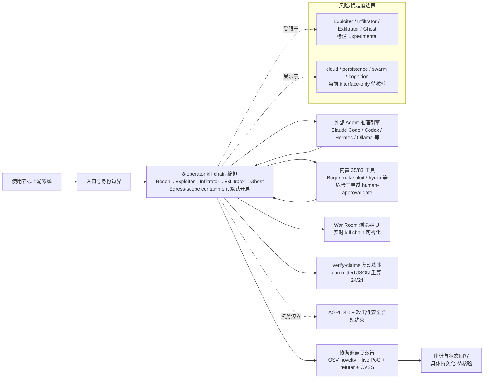

# T3MP3ST

## 一句话定位
多 Agent 攻击性安全元框架——把你已有的编码 Agent（Claude Code/Codex/Hermes/Ollama）变成零日漏洞猎人，kill chain 全自动：recon → exploit → report。

## 它解决的问题
攻击性安全（Offensive Security）通常需要多年专业经验和昂贵工具。T3MP3ST 的赌注是：一个协调的 Agent 集群可以让真正的能力进入从未收到邀请的人手中。它不是又一个安全扫描器，而是让已有 AI 编码 Agent 拥有完整攻击工具链的**元框架**。

## 为什么值得关注（2026-07-10）
- **8 天 4,152 Star + 890 Fork**——增速极快，社区参与度高
- **XBOW 104-challenge 基准 90.1% pass@1**，超过 XBOW 自报的 85%
- **`npm run verify-claims` 复现机制**——README 每个数字可从 committed JSON 重算，24/24 绿
- **Keyless 设计**：不额外收 API key，用你已有的编码 Agent 推理引擎
- **35 个内置工具（全量 83 个）**，危险工具（metasploit/hydra）在 human-approval gate 后
- **Pliny（elder-plinius）出品**——AI 安全圈 KOL + 越狱研究者
- 支持 Web/CTF/Robotics/Source/DeFi/Cloud/Mobile/Binary 8 个攻击领域

## 热度来源判断
- Pliny 个人品牌效应（AI 安全 KOL）贡献约 30% 初期热度
- verify-claims 复现机制建立信任差异——贡献约 25%
- 多 Agent + 安全赛道天然吸引力——贡献约 25%
- 实际基准成绩（90.1%）过硬——贡献约 20%
- 热度有真实工程支撑，非纯营销

## 关键技术亮点亮点
1. **8-operator kill chain 架构**：Recon → Exploiter → Infiltrator → Exfiltrator → Ghost，每个 operator 运行相同的 tool-backed ReAct loop
2. **Egress-scope containment**：目标设定后，网络工具拒绝访问域外主机（含 loopback/private），默认开启
3. **Keyless warfare**：通过本地 Agent 驱动，无需额外 API key 或云租户
4. **协调披露管道**：OSV novelty 检测 + live PoC + refuter panel + CVSS 评分
5. **完全离线运行**：支持 Ollama/LM Studio/vLLM/llama.cpp，tool-calling 通过文本驱动，不依赖原生 function-calling
6. **War Room 浏览器 UI**：实时可视化 kill chain 进展

## 架构师速览

| 决策问题 | 研究判断 | 证据边界 |
|---|---|---|
| 系统边界 | T3MP3ST 是介于"已存在的编码 Agent 推理引擎"与"攻击性安全工具链（35/83 内置，含 metasploit/hydra 等）"之间的元编排层，自身不绑定模型供应商；含 War Room 浏览器 UI 与 verify-claims 复现脚本。 | 基于档案中"meta-harness / keyless / 35 of 83 tools / War Room UI / verify-claims"事实，不含具体协议与部署形态。 |
| 主路径 | 用户 → 入口/身份边界 → 8-operator kill chain 编排（Recon→Exploiter→Infiltrator→Exfiltrator→Ghost，含 Egress-scope containment）→ 调用本地 Agent 引擎 + 工具集 → OSV novelty 检测 + CVSS 报告回写。 | kill chain 名与顺序、scope containment、报告管道均见档案；其中 Exploiter/Infiltrator/Exfiltrator/Ghost 标注 Experimental，证据仅至 README 声明。 |
| 关键权衡 | 安全边界（默认域外网络拒绝 + human-approval gate 隔离危险工具）与攻击能力覆盖（8 攻击领域、83 工具）的平衡；以及 AGPL-3.0 + 攻击性安全双重合规门槛对商业集成的抑制。 | 权衡来自档案明示条款；具体 gate 触发条件、审计日志格式未在档案中描述。 |
| 最小 PoC | 隔离环境单 Agent 模式跑 XBOW 104-challenge 复现（90.1% pass@1，verify-claims 24/24 绿），暂不启用 swarm/cloud/mobile/binary/persistence/cognition 这类仍为 stub 的高级模块。 | PoC 输入指标与脚本名来自档案；具体运行环境配置待核验。 |

## 架构启发
- **Meta-harness 模式**：不绑定特定 Agent，而是作为已有 Agent 的能力扩展层。这与 Omnigent（元编排）理念一致，验证了 Agent 生态从"单工具"向"元层"演进
- **Reproducible claims**：`verify-claims` 模式值得所有有性能声明的开源项目学习——信任不是给的，是验证的
- **Scope containment**：安全 Agent 的默认安全设计是关键工程决策
- **Keyless**：降低采纳门槛的极致——零额外成本试用

## 架构图（MMD）

> 证据边界：此图只采用本档案已有可核验描述；“待核验”节点不应视为项目实现事实。

## 定位判断
**工具型 → 平台候选**。当前是高级安全工具，但 meta-harness 架构（任意 Agent + 可扩展工具集 + 基准验证）有平台化潜力。如果 T3MP3ST 能建立 Agent 驱动安全的基准生态，可能成为攻击性安全 AI 的基础设施层。

## 风险/局限/泡沫点
1. **Swarm 未验证**：Exploiter/Infiltrator/Exfiltrator/Ghost 标注 Experimental，协调 swarm 端到端不可靠——当前基准成绩来自单 Agent
2. **AGPL-3.0 限制**：商业集成门槛高
3. **"零日猎人"营销**：8 个 post-cutoff CVE 规模有限，需要更多真实发现支撑
4. **滥用风险**：攻击性安全工具天然面临监管压力
5. **Pliny 依赖**：高度依赖个人品牌，如果核心维护者退出，项目可持续性存疑
6. **高级模块仍为 stub**：cloud/persistence/swarm/cognition 模块目前仅 interface-only

## 与同类项目的关系
- **vs 传统 Pentest 工具**（Burp/Metasploit）：T3MP3ST 不替代，而是编排它们——35 个内置工具中有对 Burp/metasploit 的适配
- **vs XBOW**：XBOW 是商业 AI 安全平台，T3MP3ST 是开源对标的 meta-harness
- **vs ECC**（228K⭐）：ECC 是通用 Agent 性能优化系统，T3MP3ST 是安全领域特化
- **vs Omnigent**（6.9K⭐）：Omnigent 编排编码 Agent，T3MP3ST 编排安全 Agent——都是 meta-harness 但领域不同

## 是否值得持续跟踪
**是。** 安全 Agent 是独立赛道，T3MP3ST 是该赛道第一个有实质工程深度的开源项目。关注：①真实 CVE 发现能力 ②swarm 协调是否成熟 ③社区贡献者增长 ④是否催生商业产品

## 是否值得企业 PoC
**谨慎评估。** AGPL-3.0 + 攻击性安全属性意味着法务审批门槛高。但内部安全团队可用作授权范围内的自动化渗透测试工具，在隔离环境运行。

## 后续观察点
- [ ] swarm 协调端到端是否进入 Stable
- [ ] 真实 CVE 发现数量是否增长
- [ ] 是否出现 T3MP3ST 基准的社区衍生（如特定行业安全基准）
- [ ] Cloud/Mobile/Binary 模块从 scaffolding 走向 Stable
- [ ] 是否有企业采用案例公开
