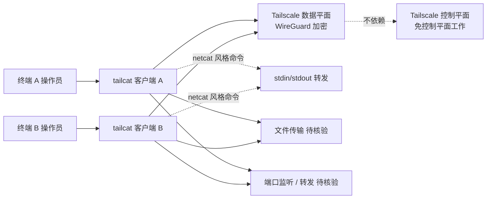

# tailscale/tailcat

## 一句话定位
Tailscale 官方的"netcat 风格"网络工具——但走 Tailscale 数据平面（WireGuard），不依赖 Tailscale 控制平面；免客户端、轻量、可编程的设备间隧道；22 个月老仓库近期爆量。

## 它解决的问题
运维 / SRE 群体长期使用 netcat / SSH / socat 做"两台机器间的网络调试 / 文件传输 / 端口转发"，但面临：(1) **SSH 配置繁琐**——密钥、known_hosts、端口、安全策略；(2) **netcat 无加密 / 需 IP**——公网传输不安全，且需知道目标 IP；(3) **VPN 客户端笨重**——OpenVPN / WireGuard 客户端安装 / 配置门槛高。tailcat 直接把这三类问题工程化：复用 Tailscale 数据平面（WireGuard 加密）+ 免客户端（已在 Tailscale 网络内的设备直接用）+ netcat 风格命令行（熟悉的 netcat 语法），让 ops / SRE 群体可以"在已有 Tailscale 网络内做 netcat"。

## 为什么值得关注（2026-08-30）
- **Stars:** 3,439（截至 2026-08-30），**22 个月老仓库**（created 2024-10-29）——首次进入 GitHub Trending 日榜，说明近期发布引发爆量关注
- **Forks:** 99
- **License:** BSD-3-Clause——下游商业可采用
- **语言:** Go（与 Tailscale 主项目一致）
- **活跃度:** created 2024-10-29，pushed 2026-08-29（近 24 小时活跃）——22 个月老仓库近期持续更新
- **规模:** 32 MB
- **Tailscale 官方出品：** 与 tailscale/tailscale 主项目同仓库组织，权威背书
- **背景：** Tailscale 数据平面基于 WireGuard，tailcat 复用此平面意味着零额外加密配置

## 热度来源判断
tailcat 的热度是 **"Tailscale 生态成熟 + netcat 替代需求 + 官方工具背书 + 近期更新引发 Trending 关注"** 的组合。22 个月老仓库首次进入 Trending 提示近期有重要更新（如新增功能 / 性能优化 / 文档完善）。3,439⭐ 在 Tailscale 生态中是合理规模（与 tailscale 周边工具同一量级）。热度**真实且具 ops/SRE 群体明确价值**——但需警惕：依赖 Tailscale 数据平面意味着用户基础限制在 Tailscale 网络内；22 个月老仓库首次爆量的增长曲线需独立观察。

## 关键技术亮点
1. **复用 Tailscale 数据平面**：基于 WireGuard，加密通信 + 免客户端（已在 Tailscale 网络内的设备直接用）
2. **netcat 风格命令行**：熟悉的 netcat 语法（`tailcat host port`），降低 ops / SRE 学习成本
3. **免控制平面**：不依赖 Tailscale 控制平面，意味着即使控制平面不可用（如网络分区），数据平面通信仍可继续
4. **官方工具**：Tailscale 官方出品（github.com/tailscale/tailcat），与 tailscale 主项目同源，质量有保障
5. **BSD-3-Clause License**：宽松开源许可，下游商业可采用
6. **Go 语言实现**：与 Tailscale 主项目语言一致，便于维护

## 架构师速览

| 决策问题 | 研究判断 | 证据边界 |
|---|---|---|
| 系统边界 | Tailscale 网络内两端的轻量客户端 + Tailscale 数据平面（WireGuard）；不依赖控制平面 | "over Tailscale's data plane, without Tailscale's control plane" 是 README 明示；具体两端是否需要预先在 Tailscale 网络内需独立验证 |
| 主路径 | 用户在终端 A 跑 `tailcat host port` → 通过 Tailscale 数据平面（WireGuard 加密）建立到终端 B 的连接 → 按 netcat 语义（stdin/stdout 转发 / 端口监听 / 文件传输）工作 | netcat 风格是 README 明示；具体子命令清单（listen / connect / file transfer）需独立核验 |
| 关键权衡 | 免客户端轻量 vs 依赖 Tailscale 数据平面 vs 免控制平面可用性 vs netcat 兼容性的取舍 | "netcat 风格" 与 "免控制平面" 是 README 明示；netcat 子命令兼容性边界未公开 |
| 最小 PoC | 两台机器都已在同一 Tailscale 网络内 → 一台跑 `tailcat -l 12345` → 另一台跑 `tailcat host 12345` → 验证 stdin/stdout 双向转发工作 | "netcat 风格" 是 README 明示；具体命令格式需 README 独立核验 |

## 架构启发
tailcat 的核心启发是 **"现有生态的工具衍生是降低使用门槛的高效路径"**。Tailscale 主项目解决"跨设备 VPN"，但日常 ops 任务仍需"两台机器间快速调试 / 文件传输"——SSH / netcat / socat 在 Tailscale 网络内仍繁琐。tailcat 的创新不在于"新网络协议"，而在于"复用现有数据平面 + netcat 风格 CLI + 免控制平面"——这是把"基础设施成熟后的衍生工具"做成产品的范式。更深层的启发是 **"官方衍生工具是生态成熟的关键信号"**——Tailscale 官方下场做 tailcat 说明：(1) Tailscale 网络内 ops / SRE 群体需求明确；(2) netcat / SSH / socat 等经典工具在 Tailscale 生态内有"原生替代品"需求。下一波可能是 tailscale/tailscaled-debug / tailscale/tailscale-cni 等更多官方衍生工具。

## 架构图（MMD）

> 证据边界：此图只采用本档案已有可核验描述；"待核验"节点不应视为项目实现事实。

## 定位判断
**工具型项目（Tailscale 生态的 netcat 衍生工具）。** tailcat 定位明确——"在已有 Tailscale 网络内做 netcat 风格操作"，是 Tailscale 主项目的轻量衍生。3,439⭐ 在 Tailscale 生态中合理规模。但"衍生工具"的护城河在于：(1) 是否被 Tailscale 主项目文档官方推荐（决定用户基础）；(2) netcat 子命令兼容性（决定 ops / SRE 是否愿意迁移）。目前定位是"Tailscale 生态的 netcat 替代"，向"Tailscale 生态的标准 ops 工具集"演进是合理路径。

## 风险/局限/泡沫点
- **依赖 Tailscale 数据平面**：用户基础限制在 Tailscale 网络内，对非 Tailscale 用户无价值
- **22 个月老仓库首次爆量的可持续性**：首次进入 Trending 是好事，但需观察能否持续；Tailscale 主项目更新可能掩盖 tailcat 存在感
- **netcat / socat 等成熟工具的替代风险**：netcat / socat 是 30+ 年成熟工具，tailcat 需明确"为何用 tailcat 而非 netcat"的差异化价值
- **免控制平面工作的边界**：README 明示"without control plane"，但具体边界（哪些操作需要控制平面）需独立验证
- **个人衍生项目属性**：虽然是 Tailscale 官方仓库，但 tailcat 是单一工具，若 Tailscale 主项目调整方向，可能被并入主项目
- **22 个月才进入 Trending 的解释**：可能是 22 个月内持续小众，近期某个特性或文档改进引发传播——具体原因需观察

## 与同类项目的关系
- **vs netcat / socat：** 经典 netcat / socat 工具，tailcat 是 Tailscale 网络内的加密版
- **vs SSH 端口转发：** SSH 配置繁琐，tailcat 是 netcat 风格 + Tailscale 加密
- **vs OpenVPN / WireGuard 客户端：** 客户端笨重，tailcat 是 Tailscale 网络内免客户端
- **vs Tailscale 主项目：** tailcat 是衍生工具，与 tailscale/tailscale 主项目互补
- **vs 8-29 acrylic（agent-agnostic ADE）：** 不同领域，但都说明"中间层"是 2026 下半年的产品方向

## 是否值得持续跟踪
**值得跟踪（Tailscale 生态的 netcat 衍生工具）。** tailcat 代表"Tailscale 生态衍生工具"方向，无论其本身成败，这一方向是行业趋势。建议关注：Tailscale 主项目是否官方推荐 tailcat（决定用户基础）、netcat 子命令兼容性（决定 ops / SRE 是否愿意迁移）、是否被并入 Tailscale 主项目。对 Tailscale 用户，tailcat 是"在 Tailscale 网络内做 netcat" 的实用工具。对网络观察者，它是"Tailscale 生态衍生"路径的代表样本。

## 后续观察点
- Tailscale 主项目是否在官方文档中推荐 tailcat
- netcat 子命令兼容性是否完整（具体支持哪些 netcat 选项）
- 是否被并入 Tailscale 主项目（tailscale/tailscale 仓库）
- 22 个月老仓库首次进入 Trending 后的增长曲线能否持续
- 是否衍生出其他 Tailscale 生态工具（如 tailscale-debug / tailscale-cni）
- BSD-3-Clause License 的商业采用情况

---
*首次记录：2026-08-30*