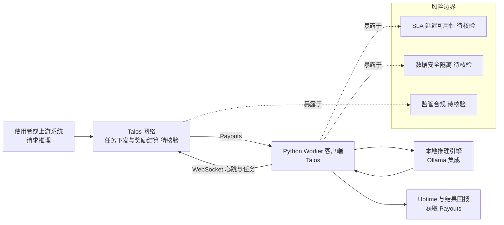

# Talos

## 一句话定位
分布式 GPU 推理网络 worker 客户端——连接 Talos 网络执行开源模型推理任务，通过 WebSocket 报告 uptime 获取奖励。

## 它解决的问题
LLM 推理算力供给高度集中在云厂商（AWS/GCP/Azure）。Talos 的赌注是：全球有大量闲置 GPU 资源（游戏显卡、工作站、矿机），如果能把它们组织成推理网络，可以提供去中心化的算力替代方案。

## 为什么值得关注（2026-07-10）
- 8 天 815 Star，方向新颖——去中心化推理算力市场
- 极简设计：Python worker + WebSocket + uptime 报告
- MIT 开源，门槛低
- 与 Ollama（175K⭐）等本地推理方案形成互补——Ollama 让你本地跑模型，Talos 让你的 GPU 为别人跑模型

## 热度来源判断
- 去中心化 + GPU 概念热度——AI 算力供给端的话题性
- 极简 README 和设计吸引极客社区
- 体量小（815 Star），更多是方向信号而非产品成熟度信号

## 关键技术亮点亮点
- **WebSocket 心跳**：worker 通过 WebSocket 连接 Talos 网络，报告 uptime 和能力
- **Open-model 推理**：执行开放模型推理任务（非闭源 API 代理）
- **奖励机制**：uptime 报告 → 获取 payouts（经济激励）
- **与 Ollama 集成**：worker 可使用 Ollama 作为本地推理引擎

## 架构师速览

| 决策问题 | 研究判断 | 证据边界 |
|---|---|---|
| 系统边界 | 单一 Python worker 客户端，连接外部"Talos 网络"执行开源模型推理，并通过 WebSocket 上报 uptime；本地推理引擎标注为可与 Ollama 集成，未证实其它供应商 | 仅基于 README 与标签（distributed-computing, gpu, inference, decentralized, websocket）的描述；网络侧协议、调度中心、计费/奖励结算方的实现细节未公开 |
| 主路径 | worker 持有闲置 GPU → 经 WebSocket 接入 Talos 网络 → 由网络下发开源模型推理任务 → worker 调用本地推理（如 Ollama）执行 → 通过 WebSocket 回传结果并上报 uptime → 凭 uptime 获取 payouts | 主路径中的"任务下发方、奖励来源、SLA/鉴权机制"在档案中均为推断，源码/协议未核验 |
| 关键权衡 | 极简架构（Python + WebSocket）带来的低门槛 vs 缺少服务质量和安全隔离能力；去中心化弹性供给 vs 无法保证延迟/可用性/数据隐私；经济激励吸引贡献者 vs 商业模式与付费方未明 | 权衡判断仅引用档案中"风险/局限"段；具体加密、签名、沙箱隔离方案档案未提及 |
| 最小 PoC | 单台带 GPU 的机器，安装 worker，按 README 配置 WebSocket 端点，加入网络上报 uptime 并承接一次开源模型推理任务，验证连通性、uptime 报送与 payouts 落账 | 端点地址、注册/鉴权流程、奖励结算单元与最低接入门槛等档案未给出，按 README 实际部署时再核验 |

## 架构启发
- **CDN → GPU-CDN**：如果 CDN 模式可以用于 GPU 推理供给，算力市场可能被重塑
- **矿机转型**：后加密货币挖矿时代，闲置 GPU 的再利用是真实需求
- **推理去中心化**：模型推理（vs 训练）对延迟和带宽的要求更灵活，适合分布式

## 架构图（MMD）

> 证据边界：此图只采用本档案已有可核验描述；“待核验”节点不应视为项目实现事实。

## 定位判断
**学习型**。当前是早期概念验证。去中心化推理网络要成为基础设施，需要解决：①服务质量保证 ②延迟一致性 ③安全隔离 ④经济模型可持续性 ⑤监管合规。这些都不是 MIT + WebSocket 能单独解决的。

## 风险/局限/泡沫点
1. **体量过小**：815 Star、13 Fork——可能只是概念验证阶段
2. **经济模型不明**：奖励从哪来？谁付费购买推理？商业模式不清晰
3. **服务质量保证**：P2P GPU 的延迟、可用性、数据安全如何保证
4. **安全隔离**：在陌生人的 GPU 上跑推理任务，数据隐私如何保障
5. **监管风险**：去中心化算力可能面临出口管制、数据合规等监管问题
6. **与云厂商竞争**：AWS/GCP 的规模效应和 SLA 保证极难被 P2P 网络超越

## 与同类项目的关系
- **vs Ollama**（175K⭐）：Ollama 是本地推理，Talos 是让本地推理能力服务他人
- **vs vLLM/TGI**：vLLM/TGI 是推理引擎，Talos 是推理网络——不同层
- **vs Folding@Home**：理念类似（分布式计算 + 志愿者算力），但面向 LLM 推理

## 是否值得持续跟踪
**谨慎关注。** 方向有启发性，但体量太小，不确定是否能跨过"概念验证 → 可用产品"的鸿沟。如果 6 个月内增长到 5K+ Star 并有清晰的代币/积分经济模型出现，则升级跟踪级别。

## 是否值得企业 PoC
**否。** 当前阶段不适合企业使用。安全、合规、可靠性均未验证。

## 后续观察点
- [ ] 经济模型是否清晰化（谁付费、谁奖励、如何结算）
- [ ] 是否出现真实使用场景和用户
- [ ] 增速是否加速（月增 >1K Star）
- [ ] 是否出现竞品验证赛道
- [ ] 安全隔离方案是否发布
