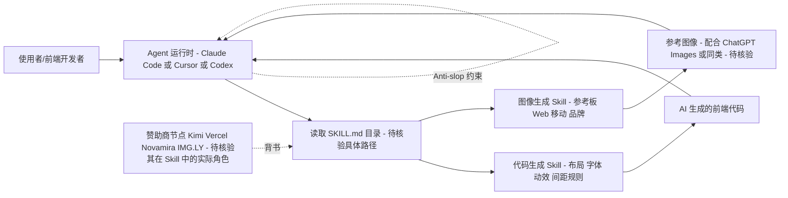

# Leonxlnx/taste-skill

## 一句话定位
给 AI Agent "好品味"的 Skill 集合——阻止 AI 生成无聊、通用的样板前端 UI（slop），提升 AI 生成界面的布局、排版、动效和间距质量，同时包含图像生成 Skill 用于参考板设计。

## 它解决的问题
当开发者使用 AI Agent（Claude Code、Cursor、Codex）生成前端界面时，AI 倾向于产出千篇一律的"AI 味"UI——居中布局、默认间距、没有层次感的配色、缺乏动效。这些界面虽然功能上能用，但视觉上缺乏"设计品味"。taste-skill 通过一套结构化的 Skill 文件，约束 AI 在生成前端时遵循更好的设计原则——更强的布局、更好的字体选择、更精致的动效、更合理的间距。

## 为什么值得关注（2026-05-24）
- 73,530 stars，5,042 forks——创建于 2026-02-19，半年内爆发式增长到 73K+ stars，极为罕见
- MIT 许可证，官方站 tasteskill.dev，获得 Novamira、Kimi、IMG.LY、Vercel 等赞助商支持
- 兼容 vercel-labs/agent-skills 标准，通过 `npx skills add` 一键安装到 Claude Code、Cursor、Codex 等 Agent
- topics 包含 `vibecoding`、`lowcode`、`nocode`——定位于让非设计师也能通过 AI 生成高质量前端
- 包含代码生成 Skill 和图像生成 Skill 两大类

## 热度来源判断
**多重趋势叠加 + 社交传播驱动**。taste-skill 的爆发（半年 73K stars）由多重因素驱动：(1) vibecoding 浪潮——大量非专业开发者使用 AI 生成应用，他们迫切需要"设计品味"的帮助；(2) Skills 生态红利——作为 agent-skills 标准的明星项目，被广泛推荐；(3) 社交媒体传播——tasteskill.dev 的精美展示和前后对比图在 Twitter/X 上引发病毒式传播；(4) 赞助商背书——Kimi、Vercel 等知名品牌的赞助增加了可信度。但也需要注意：73K stars 对于一个 Skill 文件集来说可能有泡沫——需要区分"收藏 stars"和"实际安装使用"。

## 关键技术亮点亮点
1. **代码生成 Skill + 图像生成 Skill 双轨设计**：代码 Skill 用于约束 AI Agent 生成更高质量的前端代码（布局、排版、动效、间距规则）；图像 Skill 用于生成参考板（reference boards），覆盖 Web、移动端和品牌设计包。两者配合——先用图像 Skill 生成视觉参考，再用代码 Skill 指导实现。
2. **Anti-slop 哲学**：明确反对 AI 默认的"slop"输出——千篇一律的布局、缺乏设计感的配色和排版。通过具体的规则约束（如间距比例、字体搭配、动效曲线等）替代模糊的"做得好看"指令。
3. **跨 Agent 兼容**：通过 `npx skills add` CLI 一键安装到 Claude Code、Cursor、Codex 或任何读取 SKILL.md 目录的 Agent。不绑定特定平台，最大化覆盖面。
4. **与 ChatGPT Images / 参考生成器配合**：图像生成 Skill 可以配合 ChatGPT Images 或类似生成器使用，生成参考帧后交给 Codex/Cursor/Claude Code 实现，形成完整的"AI 设计 → AI 编码"工作流。

## 架构师速览

| 决策问题 | 研究判断 | 证据边界 |
|---|---|---|
| 系统边界 | taste-skill 是一个面向 Claude Code / Cursor / Codex 等 Agent 的 Skill 文件集合（JavaScript，MIT），通过 `npx skills add` 安装到兼容 agent-skills 标准的 Agent 运行环境中；不内置模型推理或前端运行时，只约束 Agent 行为 | 具体安装路径、SKILL.md 目录结构与 agent-skills 标准的字段映射未在档案中给出 |
| 主路径 | 用户 → Agent（Claude Code / Cursor / Codex）→ 加载 taste-skill 的代码 Skill 与图像 Skill → 在生成前端代码或参考板时套用 Anti-slop 规则 → 输出 UI 代码 / 参考图 | Agent 实际如何注入 Skill、提示词组装顺序未在档案中描述 |
| 关键权衡 | Skill 规则代表的“现代极简”审美与项目实际设计需求的匹配度 vs. 强制约束带来的灵活性损失；以及 LLM 前端原生能力提升后 Skill 边际价值的衰减 | 规则条目、覆盖的设计语言范围、是否支持定制化均未在档案中证实 |
| 最小 PoC | 在 Claude Code 或 Cursor 中以 `npx skills add Leonxlnx/taste-skill` 安装后，给出同一前端需求分别开启/关闭 Skill 生成两版界面，对比布局、字体、动效、间距差异 | 安装命令完整语法、Skill 子集选择方式、是否需额外配置 token 或赞助商凭证未在档案中确认 |

## 架构启发
taste-skill 代表了 Agent Skills 的一个重要进化方向——从"教 AI 做事"到"教 AI 有品味地做事"。它的设计哲学是：AI 的默认输出反映了训练数据中的"平均水平"，要超越平均水平需要显式的品味约束。Skills 作为这种约束的载体，比在每次对话中重复指令更高效。其代码 Skill + 图像 Skill 的双轨设计也很有启发——视觉设计问题既需要代码层面的约束，也需要参考图像层面的引导。

## 架构图（MMD）

> 证据边界：此图只采用本档案已有可核验描述；“待核验”节点不应视为项目实现事实。

## 定位判断
taste-skill 定位为 **vibecoding/低代码时代的 AI 设计品味基础设施**。它填补了一个关键空白——AI 生成代码的能力已经很强，但生成"好看的"代码的能力很弱。在 Skills 生态中，taste-skill 是前端设计质量的标杆项目，与 stop-slop（文本质量）形成互补。73K stars 使其成为 2026 年最具影响力的 Agent Skill 项目之一。

## 风险 / 局限 / 泡沫点
1. **73K stars 的泡沫评估**：作为 Skill 文件集（非代码框架），73K stars 的含金量需要审慎评估。Skill 的效果高度依赖底层 LLM 的能力——如果 LLM 本身的设计感提升，Skill 的边际价值会下降。
2. **"品味"的主观性**：设计品味本质上是主观的。taste-skill 的规则代表了一种特定的设计审美（可能是现代极简风），不一定适合所有场景（如复古风、品牌定制风）。
3. **LLM 前端能力的快速进化**：随着 Claude 4.x、GPT-5 等模型在前端生成方面的原生能力提升，taste-skill 的某些规则可能变得不必要。
4. **README 明确否认有官方代币/加密项目**：这说明有人冒用 taste-skill 名义发行代币，存在品牌风险。

## 与同类项目的关系
- **stop-slop**：15K stars，文本写作版的"去 AI 味"Skill。taste-skill 是前端设计版。两者共同定义了"AI 输出质量控制"微赛道。
- **vercel-labs/json-render**：15K stars，Generative UI 框架。json-render 从架构层面约束 AI 生成安全的 UI，taste-skill 从审美层面约束 AI 生成好看的 UI。互补关系。
- **shadcn/ui**：taste-skill 可能使用或推荐 shadcn/ui 组件作为设计基础（其规则可能与 shadcn/ui 的设计语言一致）。

## 是否值得持续跟踪
**高度值得关注，Skills 生态的旗舰项目**。taste-skill 73K stars 的爆发性增长说明"AI 输出质量控制"是巨大的未满足需求。它的走向预示着 Skills 生态的发展方向——从"功能扩展"到"质量优化"。建议持续关注其 Skill 更新和社区反馈。

## 后续观察点
1. **效果验证**：是否有系统性的 A/B 测试或用户调研数据，证明 taste-skill 确实能提升 AI 生成 UI 的质量（而非只是心理安慰）
2. **与设计系统的融合**：是否会与 Material Design、Apple HIG 等设计系统集成，提供特定设计语言的专业 Skill
3. **商业化路径**：tasteskill.dev 网站是否会推出 Pro 版 Skill 或 AI 设计 SaaS 产品，验证"Skill 即产品"的商业可行性

---
*首次记录：2026-05-24*
