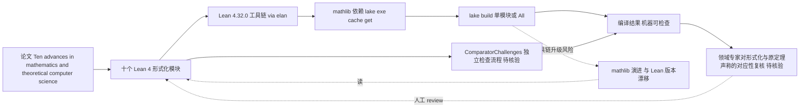

# openai/ten-proofs — 十项数学/理论计算机科学成果的 Lean 4 形式化

## 一句话定位
OpenAI 官方仓库，用 Lean 4 形式化了其论文《Ten advances in mathematics and theoretical computer science》中的十个结果，使这些 AI 辅助发现可被独立机器验证。

## 它解决的问题
AI 推理模型产出的数学"发现"面临一个根本信任问题：**怎么知道它是对的？** 传统数学证明靠同行评审，但前沿组合数学/几何的证明极长且易错。Lean 等 proof assistant 能把证明编码为机器可检查的形式，但把 AI 生成的非形式证明翻译为 Lean 本身是难题。这个仓库把 OpenAI 宣称的十项成果（球填充、二进码界、非 sofic 群、Connes 刚性猜想反例等）以 Lean 4.32.0 + mathlib 形式化并提供构建命令，使结论可被任何人用 `lake build` 独立验证。

## 为什么值得关注（2026-08-04）

这是 **AI 推理能力 ↔ 形式化验证** 交叉点的一个高公信力信号，且来自 OpenAI 官方（非第三方复现）。在近期 GitHub 趋势被应用层 agent（qm/crm）和本地推理（K3 系列）主导时，ten-proofs 代表了另一条线：**AI 不只是写代码，而是在推进数学前沿，并用可验证的形式呈现**。432⭐ / 39 fork 对于一个纯数学 Lean 仓库已是高热度（Lean 仓库通常 star 远低于应用项目）。

## 热度来源判断
- **真实学术信号为主**：Lean/mathlib 社区 + 形式化方法社区 + AI 推理研究者的交叉关注。open_issues=0（非讨论驱动型热度）。
- **OpenAI 品牌效应**：官方仓库本身带来基线关注度，但内容（十个 Lean 文件 + 论文 PDF + reasoning walkthroughs）是实质性的，非空壳。
- **无刷星特征**：39 fork / 5 watchers，fork 数合理，无 fork=0 的诈骗特征。

## 关键技术亮点亮点
1. **十个独立形式化模块**：SpherePacking.lean、MetricCodes.lean、NonSoficGroup.lean、ConnesRigidity.lean、Permanent.lean、QuantumParallelRepetition.lean、GapCVP.lean、EhrhartVolumeInequality.lean、MulticolorTriangleRamsey.lean、CompactnessAndDegeneracy.lean——每个对应论文一个定理，可单独 `lake build <Module>`。
2. **独立证明检查**：仓库含 `ComparatorChallenges/`，README 指向独立检查流程，声明这些形式化可被外部 Comparator 验证（这是可核验性的关键——任何人可复现）。
3. **依赖 Lean 4.32.0 + mathlib + Lake**：用 elan 管理工具链，`lake exe cache get` 拉 mathlib 缓存后 `lake build All`。

## 架构师速览

| 决策问题 | 研究判断 | 证据边界 |
|---|---|---|
| 系统边界 | Lean 4.32.0 + mathlib 单仓编译的十个独立形式化模块（SpherePacking / MetricCodes / NonSoficGroup / ConnesRigidity / Permanent / QuantumParallelRepetition / GapCVP / EhrhartVolumeInequality / MulticolorTriangleRamsey / CompactnessAndDegeneracy），通过 `lake build All` 产出可复现的机器可检查证据 | 模块职责与依赖见"关键技术亮点"；是否含辅助背景文件、commit 粒度等未在档案核实 |
| 主路径 | 论文中的非形式证明 → 翻译为 Lean 4 形式化 → `lake exe cache get` 拉 mathlib 缓存 → `lake build <Module>` 独立检查 → `ComparatorChallenges/` 提供外部 Comparator 二次校验 | `ComparatorChallenges` 实际可执行性、formalization.yaml 是否承担 claim-mapping 仅在档案中"提及但未深入验证" |
| 关键权衡 | 形式化编译通过 ≠ 原始数学结论正确——Lean 内部自洽与"形式化对象是否真为论文所宣称的定理"是两件事，前者机器可验，后者仍需领域专家复核 | 风险点 1 明确指出此落差；社区独立审查信号尚未在档案中出现 |
| 最小 PoC | `elan` 配置 Lean 4.32.0 工具链 → `lake exe cache get` 取 mathlib 缓存 → 选取单一模块（如 SpherePacking.lean）执行 `lake build <Module>` 验证编译与声明一致性，再扩展到 All | 构建命令与依赖在档案中可证；makepath、CI 配置、失败回滚策略未在档案中描述 |

## 架构启发
这个仓库的哲学是 **"claim → formalize → independently check"** 的闭环。AI 推理产出一个非形式断言，形式化层把它翻译成 Lean，验证层确认 Lean 编译通过。这与"AI 写代码跑测试"同构，但处在更高的抽象层（数学真理而非程序正确性）。对架构师的启发是：**当 AI 系统的输出需要高可信度时，形式化验证层是比人工 review 更强的保证机制**——前提是领域有可用的 proof assistant。

## 架构图（MMD）

> 证据边界：此图只采用本档案已有可核验描述；“待核验”节点不应视为项目实现事实。

## 定位判断
这属于 **L0 基础研究/范式信号**，不在应用产品分层内。它的价值不是作为可集成的工具，而是作为 **AI 能力边界的一个可核验坐标点**：证明 AI 推理已能在前沿数学产生可验证贡献。在趋势跟踪中，它标志"AI + 形式化"交叉品类的出现。

## 风险 / 局限 / 泡沫点
1. **形式化正确性 ≠ 原始数学结论正确**：Lean 文件能编译只证明"这个 Lean 证明内部自洽"，不证明"它形式化的就是论文宣称的定理"——formalization 与 informal claim 的对应仍需人工对照（README 的 formalization.yaml 可能承担此职责，但未深入验证）。
2. **极高专业门槛**：受众限于 Lean/mathlib 用户 + 对应数学领域专家，传播天花板远低于应用项目。432⭐ 已是该品类的高位。
3. **维护承诺未知**：mathlib 持续演进，Lean 工具链更新可能破坏构建；OpenAI 是否长期维护此仓库未声明。
4. **单一时间点发布**：commits 显示 08-02 后无更新，目前是"发布即冻结"状态，非活跃开发。

## 与同类项目的关系
- **vs leanprover/mathlib4**：mathlib 是 Lean 数学库本体（基础设施），ten-proofs 是建立在它之上的具体形式化成果（应用层）。ten-proofs 依赖 mathlib 缓存。
- **vs 其他 AI 数学成果仓库**：多数 AI 数学发现以论文 + 非形式证明发布，不提供 Lean。ten-proofs 的差异化正是**形式化 + 可独立检查**。目前 GitHub 上 AI+Lean 形式化的同类生产级仓库仍稀少。

## 是否值得持续跟踪
**是，作为"AI + 形式化验证"交叉品类的标杆信号跟踪。** 但跟踪频率可低于应用层项目——此类仓库更新稀疏，重点关注：(a) OpenAI 是否发布更多此类形式化；(b) 社区是否出现对 ten-proofs 具体定理的复现/质疑；(c) formalization.yaml 的 claim-mapping 完整性是否被独立审查。

## 后续观察点
1. **star/fork 比的演化**：若 fork 持续增长（当前 39），说明有人真正在 `lake build` 验证；若仅 star 涨，则偏展示型关注。
2. **社区审查信号**：关注是否有 Lean/mathlib 核心贡献者公开 review 这些形式化的 claim 对应准确性。
3. **ComparatorChallenges 的可用性**：README 提及独立检查流程，验证其是否真能被外部工具运行。

## 最近动态（2026-08-05）

- **+38（432→470），fork 39→43**：增速平缓（+8.8%），符合研究类仓库的预期——此类项目更新稀疏，受众限于 Lean/mathlib 专家。open_issues 0，pushed_at 停在 08-02（"发布即冻结"状态延续）。
- **判断**：score 维持 82。作为 L0 基础研究/范式信号持续跟踪，重点观察 OpenAI 是否发布更多形式化、社区是否出现复现/质疑，而非日增速。

---
*首次记录：2026-08-04* · *最近更新：2026-08-05（432→470，+38，平缓符合预期）*
