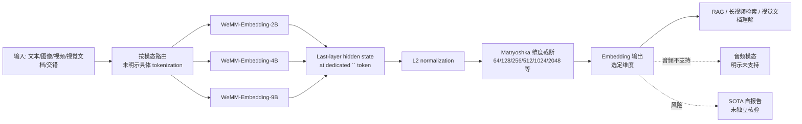

# Tencent/WeMM-Embedding

## 一句话定位
**腾讯微信视觉团队的通用多模态 Embedding 模型族（2B/4B/9B 三档）**——统一表征文本、图像、视频、视觉文档与交错多模态输入，Apache-2.0 许可 + Matryoshka Representation Learning（多档可选维度）。

## 它解决的问题
2026 年下半年多模态 RAG / 长视频检索 / 视觉文档理解赛道仍面临三类痛点：(1) **多模态割裂**——文本 embedding（Jina / BGE-M3）与图像 embedding（CLIP / SigLIP）来自不同家族，统一表征能力弱；(2) **大模型缺乏大厂背书**——开源多模态 embedding 主要是学术机构或创业公司（Jina AI / OpenCLIP 等），缺少大厂长期支持的可信度；(3) **维度固定**——传统 embedding 维度固定，下游无法在精度 / 成本 / 延迟间权衡。WeMM-Embedding 直击这三点：**大厂背书 + 多模态统一 + Matryoshka 可选维度**。

## 为什么值得关注（2026-08-28）
- **3 天 476⭐ + 21 forks**：大厂正式下场（Tencent 微信视觉团队），意味着多模态 embedding 进入"大厂卷开源"阶段
- **2B / 4B / 9B 三档 + Matryoshka**：可选维度 `64, 128, 256, 512, 1024, 2048/2560/4096`，下游可在精度 / 成本 / 延迟间权衡
- **统一表征**：文本 + 图像 + 视频 + 视觉文档 + 交错模态，**单一模型族覆盖五种模态**
- **技术报告挂 arXiv 2608.24053 + Hugging Face 同步发布**：tencent/WeMM-Embedding-{2B,4B,9B} 三模型
- **Apache-2.0 许可**：商用友好
- **README 引用 SOTA 自报告**：声称在多 benchmark 上 SOTA，具体清单需技术报告核验

## 热度来源判断
热度来自 **"大厂背书 × 多模态统一 × Matryoshka 维度灵活 × Hugging Face 同步发布"** 的组合：(1) 多模态 RAG / 长视频检索是 2026 年下半年的高需求场景（agent memory / 视觉文档理解）；(2) 现有开源基线（Jina-clip-v2 / BGE-VL / SigLIP2）主要来自学术机构或创业公司，缺少大厂长期支持的可信度；(3) Matryoshka 维度灵活对边缘 / 云端混合部署极有价值。**主要风险：** SOTA 自报告未独立核验；音频不支持；与现有 RAG 框架（LangChain / LlamaIndex / Milvus / Qdrant）的官方适配速度未明示；arXiv preprint 未经同行评审。

## 关键技术亮点
1. **多模态统一表征**：文本 + 图像 + 视频 + 视觉文档 + 交错模态单一模型族
2. **Matryoshka Representation Learning**：可选维度 `64, 128, 256, 512, 1024, 2048/2560/4096`，无需重新训练即可灵活切换
3. **三档模型**：2B / 4B / 9B，覆盖边缘 / 云端不同部署场景
4. **Last-layer hidden state at `<embedding>` token + L2 normalization**：标准 embedding 抽取方式
5. **Hugging Face 同步发布**：tencent/WeMM-Embedding-{2B,4B,9B} 三模型卡
6. **技术报告挂 arXiv**：2608.24053

## 架构师速览

| 决策问题 | 研究判断 | 证据边界 |
|---|---|---|
| 系统边界 | 一族多模态 embedding 模型 + Hugging Face 发布 + 训练/推理代码 + benchmark 评测脚本 | 仅基于 README 的 "WeMM-Embedding is a family of universal multimodal embedding models" + arXiv 报告 + Hugging Face 链接；具体训练数据、训练硬件、推理框架（PyTorch / JAX / TensorRT）、是否提供 ONNX 权重未在 README 中量化 |
| 主路径 | 输入（文本/图像/视频/视觉文档/交错）→ 前向推理 → last-layer `<embedding>` token hidden state → L2 normalize → 输出 embedding（按选定维度截断） | 主路径来自 README 的"last-layer hidden state at the dedicated `<embedding>` token position, followed by L2 normalization"；具体 Matryoshka 截断机制（训练时是否学习多粒度 / 推理时直接截断）需技术报告核验 |
| 关键权衡 | 多模态统一 vs 各模态精度上限 vs 模型尺寸 vs 推理成本 vs Matryoshka 灵活度 vs 不支持音频 | 档案明示三档 + Matryoshka + 音频不支持；具体推理延迟 / GPU 显存需求 / 与 Jina-clip-v2 / BGE-VL / SigLIP2 的精度对比需技术报告与独立 benchmark 核验 |
| 最小 PoC | 用 2B + 64 dim 在 Hugging Face 下载权重 → 拿 100 个真实业务样本（混合文本/图像）做 embedding → 对比 BGE-VL / SigLIP2 的检索 top-5 accuracy | PoC 范围由"先小模型、小维度、可对照"原则推导；具体业务场景、自家数据集、对比基线需独立准备 |

## 架构启发
WeMM-Embedding 的核心启发是 **"多模态 embedding 进入大厂卷开源阶段"**——继 BGE-VL（智源）/ Jina-clip-v2（Jina AI）/ SigLIP2（Google）之后，腾讯微信视觉首次把"文本+图像+视频+视觉文档+交错模态"的统一开源 embedding 模型族整套发布。**这意味着 agent memory / 视觉文档 RAG / 长视频检索等下游场景有了大厂背书的开源基线**——降低了对商业 embedding API（OpenAI text-embedding-3-large / Voyage AI）的依赖。**更深层的启发是：** Matryoshka Representation Learning 已从"研究 trick"变成"生产级 embedding 模型的标准能力"——下游可在不增加模型数量的情况下灵活调整维度，对边缘部署和成本优化意义重大。

## 架构图（MMD）

> 证据边界：此图只采用本档案已有可核验描述；"待核验"节点不应视为项目实现事实。

## 定位判断
**基础设施候选项目（multimodal embedding model family）。** WeMM-Embedding 不做 agent，不做 RAG 框架，只做"多模态统一 embedding 模型族"——这是基础设施型定位。**核心竞争壁垒：** 大厂背书（腾讯微信视觉）+ 三档模型 + Matryoshka 维度灵活 + Apache-2.0 商用友好 + Hugging Face 同步发布。**主要风险：** SOTA 自报告未独立核验；音频不支持；与现有 RAG 框架的官方适配速度；arXiv preprint 未经同行评审。若持续维护 + 被 RAG 框架接纳，**6-12 月内有潜力成为"中文多模态 RAG 的默认 embedding 基线"**。

## 风险 / 局限 / 泡沫点
- **SOTA 自报告未独立核验**：README 声称 "SOTA across multiple benchmarks" 但具体清单与对比基线需技术报告独立验证
- **音频不支持**：README 明示 "Audio input is not currently supported"
- **GitHub API license 返回 NOASSERTION**：与 README 的 Apache-2.0 不一致，需以 LICENSE 文件实际内容为准
- **arXiv preprint 未经同行评审**：技术报告 2608.24053 是 preprint，非正式发表
- **大模型部署门槛**：9B 模型在边缘 GPU 的部署成本（决定是否能下沉到端侧）未明示
- **与现有基线的兼容性**：BGE-VL / Jina-clip-v2 / SigLIP2 已有成熟 RAG 框架适配，WeMM-Embedding 的官方适配速度是采用关键
- **Matryoshka 训练机制**：是否需要在训练时学习多粒度，还是推理时直接截断，未明示

## 与同类项目的关系
- **vs BGE-VL（智源）**：同样是大厂 + 多模态 embedding，BGE-VL 主要中英文文本 + 图像，WeMM-Embedding 增加视频/视觉文档/交错模态
- **vs Jina-clip-v2（Jina AI）**：创业公司 + 双语种 + 文本/图像，WeMM-Embedding 来自大厂 + 5 模态
- **vs SigLIP2（Google）**：学术机构 + 文本/图像，WeMM-Embedding 增加视频/视觉文档/交错模态
- **vs OpenAI text-embedding-3-large / Voyage AI**：商业 API，WeMM-Embedding 是开源替代品
- **vs CLIP / OpenCLIP**：开源 + 学术 + 文本/图像，WeMM-Embedding 是更新一代 + 多模态

## 是否值得持续跟踪
**值得跟踪（中文多模态 RAG 的默认基线候选）。** WeMM-Embedding 3 天 476⭐ 体现大厂下场的影响力，**完整模型族 + Apache-2.0 + Hugging Face 同步发布 + Matryoshka** 是显著加分项。**对 RAG 框架维护者：** 12 月内应优先接入 WeMM-Embedding 到 LangChain / LlamaIndex / Milvus / Qdrant 的 embedding model 注册。**对独立开发者：** 12 月内评估自家 RAG pipeline 是否能切到 WeMM-Embedding，重点评估中文 + 长视频 + Matryoshka 维度三点的实际收益。建议关注：(1) SOTA 自报告是否被独立 benchmark 复现；(2) 是否被 RAG 框架原生适配；(3) 9B 模型在边缘 GPU 的部署门槛；(4) 音频模态是否会补齐。

## 后续观察点
- SOTA 自报告是否被 Hugging Face mteb leaderboard 等独立基准复现
- 是否被 LangChain / LlamaIndex / Milvus / Qdrant 等 RAG 框架原生适配
- 9B 模型的边缘 GPU 部署门槛（决定是否能下沉到端侧）
- 音频模态是否会补齐（实现真正"全模态"）
- Matryoshka 训练机制（是否需要重新训练 vs 直接截断）
- 与 BGE-VL / Jina-clip-v2 / SigLIP2 的真实场景对比数据

---
> 数据来源: GitHub API (2026-08-28) | Stars: 476 | Forks: 21 | License: Apache-2.0 (README badge) | 语言: Python | 创建: 2026-08-25 | 数据截至 2026-08-28 06:00 UTC