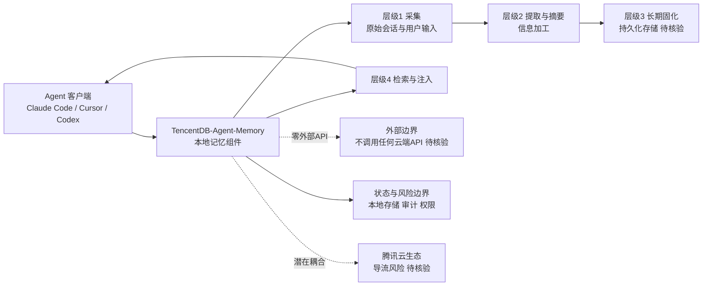

# TencentDB-Agent-Memory

## 一句话定位
腾讯云出品的 AI Agent 长期记忆解决方案——全本地 4 层渐进式管线，零外部 API 依赖，为 Agent 提供跨会话的持久记忆能力。

## 它解决的问题
AI Agent（Claude Code、Cursor、Codex 等）的上下文窗口有限，会话结束后记忆丢失。现有方案要么依赖云端 API（隐私风险）、要么只是简单的向量检索（语义不精确）、要么无法处理复杂的时间衰减和优先级。

目标用户：需要 Agent 长期运行且保持记忆的开发者和企业。

## 为什么值得关注（2026-06-26）
- 腾讯云官方出品，TypeScript 实现，6,157⭐ 稳步增长
- "全本地"和"零外部 API 依赖"是核心差异化——在隐私敏感场景下有优势
- 4 层渐进式管线设计不常见，暗示比简单的向量检索更精细
- Agent 记忆层是 2026 H1 的热门赛道——codebase-memory-mcp 14.7K⭐ 也在这个方向

## 热度来源判断
**企业级需求 + 腾讯品牌背书。** Agent 记忆是真实痛点，"全本地"标签吸引隐私敏感用户。日增 67 stars 不算爆发，但稳健。需要更多技术细节公开后判断是否是真实工程创新还是腾讯云导流项目。

## 关键技术亮点亮点

### 1. 4 层渐进式记忆管线
从 README 推断，管线包含多层处理（具体架构尚未完全公开）：
- 层级 1：原始信息采集（会话记录、用户输入）
- 层级 2：信息提取与摘要
- 层级 3：长期记忆固化
- 层级 4：记忆检索与注入

### 2. 全本地执行
- 零外部 API 调用——所有处理在本地完成
- 适合隐私敏感场景（企业内部 Agent、个人助手）
- 无网络延迟和 API 费用

### 3. TypeScript 原生
- 与 Claude Code、Cursor 等 TS 生态 Agent 无缝集成
- npm 安装即可使用

## 架构师速览

| 决策问题 | 研究判断 | 证据边界 |
|---|---|---|
| 系统边界 | 定位为 Agent 框架侧的本地长期记忆组件，运行于 Agent 运行时进程内，对外不依赖任何云端 API；与 Claude Code、Cursor、Codex 等 Agent 客户端同级集成。 | 基于 "零外部 API 依赖""全本地""npm 安装即可使用"等 README 表述；4 层管线的具体持久化介质（文件/SQLite/向量库）档案未给出。 |
| 主路径 | 采集 → 提取/摘要 → 长期固化 → 检索注入，记忆全生命周期保持在本地；不存在云端回写或外部模型调用环节。 | 档案仅以"层级 1–4"概述了职责分层，未公开各层使用的算法、存储格式或协议。 |
| 关键权衡 | 隐私与零网络依赖 vs. 检索精度、可观测性与生态扩展能力；本地化路线意味着无法借助云端模型增强摘要质量，也无法使用托管向量服务。 | 档案明确"零外部 API 依赖"是核心差异化，但未提供基准测试、错误率、token 消耗等量化数据。 |
| 最小 PoC | 在单一 Agent（如 Claude Code）中以最小工具权限接入，仅记录会话级记忆，验证跨会话持久性与检索准确性；将腾讯云账号绑定、二次依赖引入、性能基准作为准入门槛。 | 档案提示存在"腾讯云导流风险"与"生态封闭风险"，但未披露当前是否已强制或可选接入腾讯云。 |

## 架构启发
**Agent 记忆层的品类分化：**
- 通用会话记忆（TencentDB-Agent-Memory）：对话上下文、用户偏好、决策历史
- 代码结构记忆（codebase-memory-mcp）：函数调用链、类继承、路由、依赖

这两个方向的技术路径完全不同：
- 会话记忆 → 信息检索 + 摘要 + 时间衰减
- 结构记忆 → 静态分析 + 图数据库 + 符号查询

Agent 框架需要同时支持两种记忆类型。

## 架构图（MMD）

> 证据边界：此图只采用本档案已有可核验描述；“待核验”节点不应视为项目实现事实。

## 定位判断
**Agent 记忆基础设施的早期竞争者。** 与 codebase-memory-mcp 形成互补关系，但技术细节公开度不足，需要持续观察。

## 风险 / 局限 / 泡沫点
1. **技术细节不足**：4 层管线的具体架构未完全公开，无法深度评估工程创新
2. **腾讯云导流风险**：可能是 TencentDB 云服务的入口产品，未来可能需要腾讯云账号
3. **社区活跃度待验证**：contributors 数量少，主要是内部团队
4. **生态封闭风险**：如果深度绑定腾讯云生态，可能限制开源社区 adoption

## 与同类项目的关系
| 项目 | 记忆类型 | 技术路径 | 定位 |
|------|----------|----------|------|
| codebase-memory-mcp 14.7K⭐ | 代码结构 | tree-sitter + 图数据库 | Coding Agent 基础设施 |
| TencentDB-Agent-Memory 6.2K⭐ | 通用会话 | 4 层渐进式管线 | 通用 Agent 记忆 |
| Mem0 | 通用会话 | 向量检索 + LLM 摘要 | Agent 记忆 SaaS |
| Letta (前 MemGPT) | 通用会话 | 分层记忆（core/archival/recall） | Agent 记忆框架 |

## 是否值得持续跟踪
**✅ 建议跟踪，但需更多信息。** 等 4 层管线架构详情公开后重新评估。

## 后续观察点
1. 4 层管线的具体技术架构是否公开
2. 是否真正保持"零外部依赖"还是后续接入腾讯云服务
3. benchmark 数据：记忆检索精度、延迟、token 消耗
4. 社区 adoption：非腾讯系项目是否使用
5. 与 codebase-memory-mcp 是否出现功能重叠

---
*首次记录：2026-06-26*
