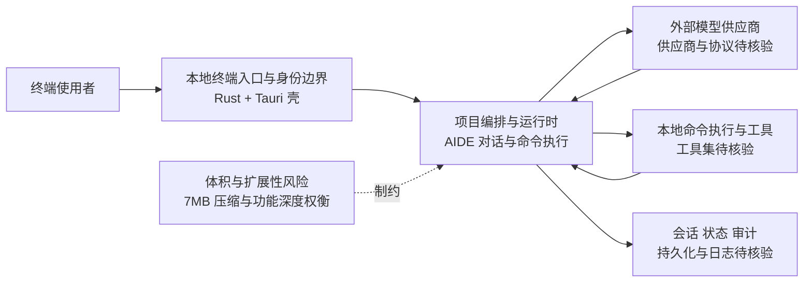

# Terax AI

## 一句话定位
7MB 轻量 AI 终端模拟器，Rust + Tauri + React 构建，在终端中直接获得 AI 能力。

## 它解决的问题
当前 AI 终端工具（Warp、OpenCode）要么重量级、要么需要完整 Agent Runtime。Terax AI 走极端轻量路线：7MB 二进制，即装即用，在终端中直接与 AI 对话并执行命令。

目标用户：偏好终端环境的开发者、需要快速 AI 辅助但不想要重量级 Agent 的用户。

## 为什么值得关注（2026-05-13）
1. **7MB 极致轻量**——在 Rust + Tauri 已经很轻的基础上进一步压缩
2. 代表本地推理赛道中的"轻量终端"方向（vs ds4.c 的"原生高性能"方向）
3. Rust + Tauri + React 技术栈在桌面应用中的实践案例

## 热度来源判断
**50% 真实需求 + 30% Rust/Tauri 生态关注 + 20% "7MB" 标题效应**。
轻量 AI 终端是真实需求，但 2.6K 的增速说明市场还没有爆发。

## 关键技术亮点亮点
1. **7MB 极致体积**：Rust 后端 + Tauri 框架 + React 前端的极致压缩
2. **AIDE（AI Development Environment）**：不只是终端，是 AI 原生开发环境
3. **跨平台**：Rust + Tauri 天然支持 Windows/macOS/Linux

## 架构师速览

| 决策问题 | 研究判断 | 证据边界 |
|---|---|---|
| 系统边界 | 终端使用者 ↔ Terax AI 本地编排层 ↔ 外部模型供应商与工具/数据源，编排层由 Rust 后端 + Tauri 壳承担，前端 React 仅作 UI | 模型供应商、工具调用协议与凭证存储位置档案未描述，仅按"轻量 AI 终端"定位做边界抽象 |
| 主路径 | 终端输入 → 本地 Tauri/Rust 编排 → 调用外部 AI 模型与命令执行 → 会话与命令结果回写到终端 | "AI 对话 + 命令执行"为档案描述；具体传输协议、上下文管理与持久化策略未证实 |
| 关键权衡 | 极致压缩（7MB 二进制） vs 功能深度与可扩展性；本地轻量 vs 外部模型供应商耦合与凭证管理 | 7MB 来自档案自述；与 Warp/OpenCode 的功能差距仅作横向对比，未做基准验证 |
| 最小 PoC | 在单台桌面环境装 7MB 二进制，接入一个模型供应商，限定工具权限并启用命令执行审计日志，再评估是否扩展到 CI/团队场景 | 安装包体积、跨平台可用性与审计能力仅以项目自述为依据，尚未源码核验 |

## 架构启发
终端模拟器正在从"显示命令输出"进化为"AI 协作界面"。Terax AI 代表了这条路线的极简实现——不做 Agent Runtime，只做 AI 对话 + 命令执行。

## 架构图（MMD）

> 证据边界：此图只采用本档案已有可核验描述；“待核验”节点不应视为项目实现事实。

## 定位判断
**工具型**。轻量 AI 终端工具，适合个人开发者，不太可能发展为企业级基础设施。

## 风险 / 局限 / 泡沫点
1. **功能有限**：7MB 意味着功能有限，难以与重量级 Agent 竞争
2. **竞品多**：Warp、OpenCode 等已有成熟的 AI 终端方案
3. **可持续性**：小团队项目，长期维护不确定

## 与同类项目的关系
- **Warp**（57.9K stars）：重量级 agentic 终端，功能丰富但体积大
- **OpenCode**（159K stars）：开源 coding agent，终端集成
- **Terax AI** 走差异化路线：极轻量、即装即用

## 是否值得持续跟踪
**有限跟踪**。技术路线有趣但市场竞争力存疑。

## 后续观察点
1. 用户增长是否持续
2. 是否出现社区贡献的扩展功能
3. 与 Warp/OpenCode 的功能差距是否会缩小

---
*首次记录：2026-05-13*
