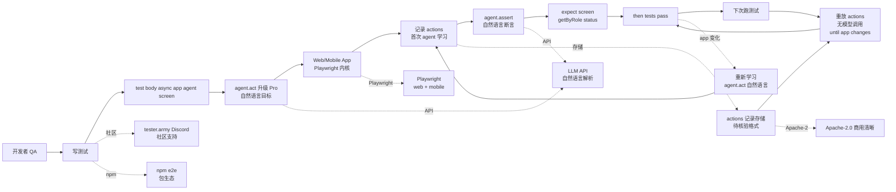

# tester-army/e2e

## 一句话定位
e2e——Next generation e2e testing framework for web and mobile apps，由 TesterArmy 出品。用自然语言描述目标，agent 驱动 app 完成；同一测试中用 locators + assertions 验证结果；agent step 在断言验证后被记录，下次重放无需模型调用直到 app 变化。

## 它解决的问题
2026 年端到端测试的两个长期痛点：(1) Playwright / Cypress 等传统 e2e 框架需要手写脚本，每次 UI 微调就要改脚本；(2) 用 AI 写 e2e 测试成本太高（每次跑都调用 LLM）。TesterArmy e2e 直击这两个痛点：它提供 **`agent.act('自然语言目标')` + `agent.assert('自然语言断言')` 自然语言驱动**，首次跑时 agent 学习并记录 actions，后续重放 **无模型调用**（no model calls）直到 app 变化。解决的是 **「e2e 测试维护成本高 + AI 测试成本高」** 的双重痛点。

## 为什么值得关注（2026-10-05）
- **Stars:** 2,997（截至 2026-10-05），2.5 个月突破近 3000
- **Forks:** 114（fork/star 3.8%）
- **License:** Apache-2.0，商用清晰
- **语言:** TypeScript
- **规模:** 14,055 KB
- **活跃度:** created 2026-07-22，pushed_at 2026-10-04，持续高活跃
- **覆盖:** Web + Mobile 全平台
- **背书:** TesterArmy（tester.army）+ tester.army Discord 社区
- **Topics:** 7 个覆盖（e2e / e2e-testing / end-to-end-testing / mobile / mobile-testing / playwright / web）

## 热度来源判断
e2e 的热度是 **「端到端测试维护成本高 × AI 测试成本高 × 自然语言驱动 × 重放无模型调用 × Playwright 兼容 × Web + Mobile 全平台」** 的强劲组合。端到端测试是软件工程的「老大难」——传统 Playwright / Cypress 测试脚本极易碎，UI 微调就需改脚本；用 AI 写 e2e 测试又太贵（每次跑都调用 LLM）。e2e 把这两个问题同时解决：**首次跑 agent 学习并记录 actions，后续重放 no model calls until the app changes**——这是把 AI 测试的成本优势（自然语言驱动）与传统脚本的成本优势（无 LLM 调用）结合的优雅方案。tester.army Discord 社区 + 7 个 topics 覆盖（e2e / e2e-testing / end-to-end-testing / mobile / mobile-testing / playwright / web）显示社区活跃度。热度 **真实且具端到端测试标准潜力**——但需警惕：`agent.act` 自然语言解析准确性、`agent.assert` 验证准确性决定其能否取代 Playwright / Cypress。

## 关键技术亮点
1. **自然语言 agent step:** `agent.act('upgrade the workspace to the Pro plan')` 自然语言描述目标，agent 驱动 app 完成
2. **自然语言 assertion:** `agent.assert('the invoice preview shows a prorated amount')` 自然语言描述验证条件
3. **重放无模型调用:** An agent step that a later assertion verifies records its actions + the next run replays them with no model calls until the app changes——大幅降低 AI 测试成本
4. **Playwright 兼容:** locators + expect + Playwright 内核支持（topics 覆盖 playwright）
5. **Web + Mobile 全平台:** topics 覆盖 mobile + mobile-testing + web，单一框架跨平台
6. **npm `e2e` 生态:** 标准 npm 包发布
7. **Apache-2.0 商用清晰:** tester.army 主页 + Discord 社区支持

## 架构师速览

| 决策问题 | 研究判断 | 证据边界 |
|---|---|---|
| 系统边界 | Web + Mobile 端到端测试框架；自然语言 agent step + 自然语言 assertion + 重放无模型调用 + Playwright 内核 | 仅基于 README 描述的 end-to-end testing framework for web and mobile apps + `agent.act` + `agent.assert` + expect + locators + next run replays them with no model calls until the app changes；具体 `agent.act` 在多 goal 的解析算法、`agent.assert` 在多 assertion 的验证算法、no-model-call 重放的实现机制未在档案中给出 |
| 主路径 | 开发者写 `test('a member upgrades to Pro', async ({ app, agent, screen }) => {...})` → `agent.act('升级 Pro')` 首次 agent 学习 → 记录 actions → `agent.assert('发票预览显示按比例金额')` 验证 → expect 硬断言 → 下次跑重放 actions 无模型调用直到 app 变化 → app 变化后重新学习 | 主路径为档案语义抽象；具体 actions 记录格式（DOM events / visual diffs / network logs）、重放机制（deterministic replay vs re-execute）、app 变化检测机制未在档案中明示 |
| 关键权衡 | 自然语言驱动 vs Playwright 脚本精度 + 重放无模型调用 vs LLM 准确性 + Web + Mobile 全平台 vs 单一平台深度 + Apache-2.0 商用清晰 vs Playwright 内核依赖 + tester.army 社区 vs 个人项目；具体 `agent.act` 在多 goal 的解析准确性、`agent.assert` 在多 assertion 的验证准确性、CLI 与浏览器扩展在多 device 的稳定性未在档案中明示 | 档案明示「Next generation e2e testing framework for web and mobile apps + Describe a goal in natural language and an agent drives the app to reach it + Check the result with locators and assertions in the same test + An agent step that a later assertion verifies records its actions + the next run replays them with no model calls until the app changes」+ tester.army Discord + npm `e2e` + Apache-2.0 + 14 MB TypeScript |
| 最小 PoC | 在一个新项目上装 e2e（`npm install -D e2e`），写 1 个测试：`test('a member upgrades to Pro', async ({ app, agent, screen }) => { await app.open('/settings/billing') + await agent.act('upgrade the workspace to the Pro plan') + await agent.assert('the invoice preview shows a prorated amount') + await expect(screen.getByRole('status')).toContainText('Pro') })`；首次跑验证 agent 学习 + 记录；二次跑验证重放无模型调用；UI 微调后验证重新学习 | PoC 范围由档案「natural language testing + replay no model calls until app changes」建议推导；具体 actions 记录格式、重放机制、app 变化检测未在档案中讨论 |

## 架构图（MMD）

> 证据边界：此图只采用本档案已有可核验描述；"待核验"节点不应视为项目实现事实。

## 架构启发
e2e 的核心启发是 **"端到端测试应该自然语言驱动 + 重放无模型调用，正如数据库 prepared statement + execute 模式"**。传统 Playwright / Cypress 写测试脚本需要繁琐细节（selectors + actions），AI 写测试又太贵（每次跑调用 LLM）。e2e 把这两个范式结合：**首次跑 agent 学习（自然语言 → actions 序列），记录到 prepared statement，后续跑直接 execute 无模型调用，app 变化后重新 prepared**。这是把 AI 测试的成本优势（自然语言）与传统脚本的成本优势（无 LLM）结合的优雅方案，类似数据库的 prepared statement 机制。更深层的启发是：**AI 工具的关键不是「永远调用 LLM」，而是「智能地决定何时调用、何时不调用」**。e2e 的「replay until app changes」机制是这一哲学的具体实现。

## 定位判断
**端到端测试候选标准项目。** e2e 不仅是一个测试框架，更试图成为「端到端测试领域的下一代标准」——取代 Playwright / Cypress 的「手写脚本」传统范式，把 AI 引入端到端测试但保持成本可控。2.5 个月 2997⭐ + Apache-2.0 + Playwright 内核 + npm `e2e` 显示真实严肃工程化信号。但"标准"取决于一个关键问题：`agent.act` 自然语言解析准确性 + `agent.assert` 验证准确性 + replay 机制稳定性——若任一环节出错，用户体验远不如手写脚本。目前定位是"端到端测试领域的下一代候选"，向 standard 演进是合理路径。

## 风险 / 局限 / 泡沫点
- **自然语言解析准确性:** `agent.act('自然语言目标')` 在多 goal 的解析准确性是开放问题（模糊语言 vs 精确 selector）
- **重放机制稳定性:** no-model-call 重放在 UI 微调后的失效检测（`until the app changes` 阈值）未明示
- **Playwright 内核依赖:** 底层依赖 Playwright，若 Playwright 大版本变更需适配
- **Web + Mobile 全平台深度:** 单一框架跨平台，但移动测试深度（iOS / Android 原生 + React Native + Flutter）可能不如专用工具
- **个人项目属性:** TesterArmy 团队维护，114 forks 贡献者较少，可持续性存疑
- **AI 测试成本控制深度:** 「no model calls until app changes」是粗粒度阈值，细粒度控制（如「只重放 5 个 step，新 step 重新学习」）未明示

## 与同类项目的关系
- **vs Playwright:** 传统 e2e 框架，手写脚本；e2e 自然语言驱动 + 重放无模型调用
- **vs Cypress:** 传统 e2e 框架，仅 Web；e2e Web + Mobile 全平台
- **vs Maestro:** 移动测试框架，自然语言 YAML；e2e TypeScript API
- **vs Detox:** React Native 测试框架；e2e Web + Mobile 全平台
- **vs Stagehand (Anthropic):** AI 驱动浏览器测试，每次跑都调用 LLM；e2e 重放无模型调用
- **vs Browserbase / Steel:** 云端浏览器平台，基础设施；e2e 测试框架

## 是否值得持续跟踪
**值得跟踪（端到端测试候选标准）。** e2e 代表了端到端测试「自然语言驱动 + 重放无模型调用」的优雅方案，无论其本身成败，这一方向是行业趋势。建议关注：`agent.act` 自然语言解析准确性的演进（决定其标准地位）、重放机制稳定性（决定其实用价值）、Playwright 内核兼容性。对 Web + Mobile 全平台测试开发者，e2e 是获取「自然语言 + 重放无 LLM」的实用框架，值得直接试用。对测试生态观察者，它是"AI 端到端测试"赛道的头部样本。

## 后续观察点
- `agent.act` 自然语言在多 goal 的解析准确性
- `agent.assert` 在多 assertion 的验证准确性
- 重放机制稳定性（UI 微调后的失效检测）
- 是否演化为独立云测试服务（tester.army SaaS 化）
- 与 Playwright 1.x / 2.x 内核兼容
- 移动测试深度（iOS / Android 原生 + React Native + Flutter）
- 企业采用（团队是否将此作为端到端测试统一框架）

---
*首次记录：2026-10-05*