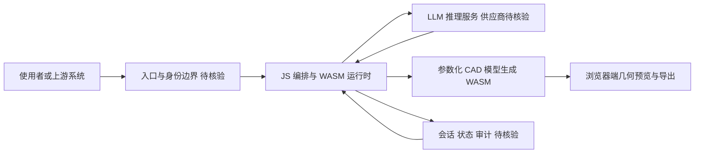

# text-to-cad

## 一句话定位
开源 Text-to-CAD 引擎 — 用自然语言描述生成 CAD 模型，支持 WebAssembly，MIT 许可。

## 它解决的问题
CAD 工具学习曲线陡峭，专业工程师才能高效使用。text-to-cad 让非专业用户通过自然语言描述来生成 CAD 模型，降低了 CAD 的使用门槛。

解决的核心痛点：
1. **CAD 学习成本高** — 需要掌握复杂的建模工具和操作流程
2. **快速原型需求** — 产品设计早期需要快速验证几何概念
3. **AI + 工程工具的融合** — 将 LLM 的自然语言理解能力与 CAD 建模结合

## 为什么值得关注（2026-05-04）
- "AI + 专业工具"赛道的代表性项目 — 不是替代工程师，而是降低门槛
- MIT 许可，WebAssembly 支持，技术路线现代
- 1.4K stars / 215 forks，关注度稳定
- 3 个 open issues，代码质量较高

## 热度来源判断
真实需求 + 技术新颖性双重驱动。Text-to-CAD 概念在工业界已经验证（如 Zoo/KittyCAD），开源方案的出现满足了社区对开放替代品的需求。

## 关键技术亮点亮点

1. **自然语言 → CAD** — LLM 解析自然语言描述，生成参数化 CAD 模型
2. **WebAssembly** — 支持浏览器端运行，不需要本地安装 CAD 软件
3. **Agent 集成** — 标记了 ai-agents topic，说明设计上考虑了与 Agent 的集成
4. **MIT 许可** — 完全开放，适合二次开发

## 架构师速览

| 决策问题 | 研究判断 | 证据边界 |
|---|---|---|
| 系统边界 | text-to-cad 是浏览器端 WASM 路径下的 Text-to-CAD 编排层，JS 运行时负责把自然语言映射为参数化几何，边界落在“入口 → JS/WASM 运行时 → LLM 推理 → 几何/会话回写”。 | 基于 language=JavaScript、tags 含 wasm/ai-agents 与“WebAssembly 支持”描述；未含 LLM 供应商、API Key、模型协议等具体声明。 |
| 主路径 | 自然语言输入 → 前端解析/UI → JS+ WASM 编排 → LLM 参数提取 → 参数化 CAD 模型生成 → 预览/导出；可观测性与持久化在档案中未给出。 | 主路径中“LLM 解析”“参数化 CAD 生成”来自档案描述；“会话 状态 审计”节点按档案“架构启发”表述存在，但具体实现未核验。 |
| 关键权衡 | 在“降低 CAD 门槛（MIT + WASM）”与“生成精度有限、复杂装配能力不足”之间取舍；风险点是供应商耦合与可观测性缺位的代理判断，无项目级证据。 | 权衡结论综合档案“风险/局限”“MIT 许可”两项；未引用任何 benchmark、性能数字、SLO。 |
| 最小 PoC | 在浏览器内跑通：单条自然语言 → JS/WASM 生成 → 预览简单几何；验收项限于“能生成、可预览、可导出”，将精度、装配、API 成本列为退出条件。 | PoC 形态贴合“WASM 浏览器端”“自然语言 → CAD”档案表述；精度/成本等数字在档案中未提供。 |

## 架构启发

text-to-cad 代表了"AI 增强专业工具"的架构模式：
- **前端层**：自然语言输入 + 可视化预览
- **中间层**：LLM 理解 + 参数提取 + 模型生成
- **后端层**：CAD 引擎 + WASM 编译

这种三层架构在"AI + X"领域有普遍参考价值。

## 架构图（MMD）

> 证据边界：此图只采用本档案已有可核验描述；“待核验”节点不应视为项目实现事实。

## 定位判断
工具型项目，但有可能演变为"AI + 工程设计"赛道的平台入口。如果与 Agent 生态（Claude Code Skills 等）结合，潜力更大。

## 风险 / 局限 / 泡沫点

1. **生成精度有限** — 自然语言描述 → CAD 模型的转换精度不如专业建模
2. **复杂模型能力不足** — 适合简单几何体，复杂装配体可能力不从心
3. **商业模式不明确** — MIT 开源如何持续发展

## 与同类项目的关系

| 项目 | 定位 | 优势 | 劣势 |
|------|------|------|------|
| text-to-cad | 开源 Text-to-CAD | 开源、WASM、MIT | 功能深度有限 |
| Zoo/KittyCAD | 商业 Text-to-CAD API | 功能完整、API 成熟 | 商业服务 |
| OpenSCAD | 开源参数化 CAD | 成熟、社区大 | 无 AI 集成 |

## 是否值得持续跟踪
**是。** "AI + 工程设计"是中期趋势，text-to-cad 的开源路线值得观察。

## 后续观察点

1. Agent Skills 集成 — 是否成为 Claude Code / Codex 的设计工具
2. 生成能力边界 — 复杂度上限在哪里
3. 工程社区反馈 — 专业 CAD 工程师如何评价

---
*首次记录：2026-05-04*
