# lhlGitHub/threejs-architecture-effects

## 一句话定位
Portable Agent Skill by Hailey —— Three.js 古建程序化动态组装 + 一个 0-1 时间轴 play / pause / scrub backward + 程序化砖 / 木 / 抹灰 / 瓦 / 石 / 青铜 PBR + Codex / Claude Code / Cursor 三平台 skills 安装 + Vite + React + Three.js starter + scaffold.mjs 拷 starter 不覆盖 + 中文 / 英文 README。

## 它解决的问题
古建 / 复杂建筑程序化动态组装难 + 不靠视频贴图 + 时间轴可 scrub 倒退 + 程序化 PBR 材质 + 三平台 Agent Skill 安装 + scaffold 不覆盖 + 中文 / 英文双语 README + Vite + React starter 可直接 `npm ci` 起跑。它解决的是「Agent Skill 严肃工程化 + Three.js 3D 严肃工程化 + 跨 Harness + 程序化动态组装 + 时间轴 scrub」五件事一次解决的真痛点。

## 为什么值得关注
- **Stars:** 172（截至 2026-09-24），2 天突破 172，增速较快
- **Forks:** 35，社区贡献活跃（fork/star 20.3% 较高 Agent Skill 信号）
- **Watchers/Subscribers:** 0（公开 API 字段）
- **Open Issues:** 0，维护良好
- **License:** MIT（Copyright (c) 2026 Hailey）
- **语言:** TypeScript
- **活跃度:** created 2026-09-22，pushed_at 2026-09-23，持续高活跃
- **规模:** 66.3MB，大型 TypeScript + Three.js 项目（含 assets/starter/ Vite + React + Three.js 完整 starter）
- **Topics:** 无（未填写 GitHub topics）

## 热度来源判断
lhlGitHub/threejs-architecture-effects 的热度是 **「Agent Skill 严肃工程化 × Three.js 古建程序化动态组装 × 一个 0-1 时间轴 play / pause / scrub backward × 程序化 PBR 砖 / 木 / 抹灰 / 瓦 / 石 / 青铜 × Codex / Claude Code / Cursor 三平台 skills 安装 × Vite + React + Three.js starter × scaffold.mjs 拷 starter 不覆盖 × 中文 / 英文 README」** 的强劲组合。Agent Skill 跨 Harness 是 2026 年最热赛道，但缺乏「3D 古建程序化动态组装 + 时间轴 scrub」严肃工程化具体实现。一个 Portable Agent Skill by Hailey + Codex / Claude Code / Cursor 三平台 skills 安装 + 程序化几何 + 时间轴 scrub + Vite + React + Three.js starter 直击痛点。**fork/star 20.3% 较高 Agent Skill 信号** ——35 forks 中包含「Agent Skill 严肃工程化 fork + Three.js 古建 / 程序化动态组装爱好者 fork + 中文古建文化 fork + 跨 Harness 跨平台 fork」四类。热度**真实且具 Agent Skill 跨 Harness + Three.js 程序化动态组装潜力**——但需警惕：Codex / Claude Code / Cursor 三平台 skills 安装的兼容性 + Three.js 古建程序化动态组装在多模型的稳定性 + 0-1 时间轴 play / pause / scrub backward 的确定性 + 程序化 PBR 砖 / 木 / 抹灰 / 瓦 / 石 / 青铜的材质质量 + Orbit / zoom / detail cameras 飞檐细赏 / 石狮近观 的镜头质量 + Vite + React + Three.js starter 的可启动性 + scaffold.mjs 拷 starter 不覆盖的保护性 + 中文 / 英文双语 README 在多语言用户的接受度。

## 关键技术亮点
1. **一个 0-1 时间轴** —— play / pause / scrub backward / replay
2. **程序化 PBR 砖 / 木 / 抹灰 / 瓦 / 石 / 青铜** —— 无付费模型
3. **Orbit / zoom / detail cameras** —— 飞檐细赏 / 石狮近观 镜头
4. **Vite + React + Three.js starter** —— `npm ci && npm run dev` 直接起
5. **三平台 skills 安装** —— Codex `~/.codex/skills/threejs-architecture-effects`（或 `$CODEX_HOME/skills/`）+ Claude Code `~/.claude/skills/threejs-architecture-effects` + Cursor `~/.cursor/skills/threejs-architecture-effects`
6. **`scaffold.mjs` 拷 starter 不覆盖** —— 保护已有项目
7. **构造原理** —— 1）写 assembly plan 2）先建模完成 silhouette 让 parts 共享 dimensions 不浮空 3）每个 solid piece 都有 start / duration / travel 4）材质分离不靠 fog 或 bloom 掩盖粗糙接缝
8. **Layout** —— `SKILL.md` agent 入口 + `LICENSE` MIT Copyright (c) 2026 Hailey + `agents/openai.yaml` Codex UI metadata + `scripts/scaffold.mjs` + `references/` + `assets/` + `assets/starter/`
9. **Limits 诚实表态** —— Procedural geometry only / 视频导出不在 / 桌面向 / 不主张博物馆质量 / 历史准确性 / 一台机器上 universal 60 FPS
10. **中文 / 英文 README** —— 双语 README
11. **Node.js 22.13+ npm WebGL2 浏览器** —— 需求
12. **agents/openai.yaml Codex UI metadata** —— Codex UI 元数据
13. **references/ construction / template map / verification** —— agent 详细构造 / 模板地图 / 验证

## 架构师速览

| 决策问题 | 研究判断 | 证据边界 |
|---|---|---|
| 系统边界 | Node.js 22.13+ npm WebGL2 浏览器 + Vite + React + Three.js + Codex / Claude Code / Cursor 三平台 skills 安装 + 程序化几何 + 一个 0-1 时间轴 + 飞檐细赏 / 石狮近观 镜头 + 中文 / 英文 README + MIT License | 仅基于 README 公开摘录 + GitHub Search API 元数据；具体三平台 skills 兼容性、scaffold.mjs 实现、assets/starter/ Vite + React + Three.js starter 内部结构、references/ 具体文档未在档案中给出 |
| 主路径 | 用户在 Codex / Claude Code / Cursor 装好 skill → prompt `Use $threejs-architecture-effects to make a Chinese pavilion like the starter...` → LLM 调 skill → 写 assembly plan → 建模完成 silhouette → 每个 solid piece 给 start / duration / travel → 材质分离 → 渲染 PBR + 0-1 时间轴 → 用户在浏览器拖 / 缩放 / scrub | 主路径为 README 语义抽象；assembly plan 具体生成方式、silhouette 共享 dimensions 机制、scrub 的 deterministic 实现、PBR 材质具体参数、agents/openai.yaml Codex UI metadata 内容均待核验 |
| 关键权衡 | Codex / Claude Code / Cursor 三平台 skills 安装兼容性 vs Three.js 古建程序化动态组装多模型稳定性 vs 0-1 时间轴 deterministic vs 程序化 PBR 砖 / 木 / 抹灰 / 瓦 / 石 / 青铜材质质量 vs Orbit / zoom / detail cameras 镜头质量 vs Vite + React + Three.js starter 可启动性 vs scaffold.mjs 拷 starter 不覆盖保护性 vs 中文 / 英文 README 接受度 vs Limits 诚实表态实际边界 vs MIT License 商业可用度 | 档案明示三平台 skills + 程序化几何 + 时间轴 scrub + Vite + React + Three.js starter + 中文 / 英文 README + Limits 诚实表态七点权衡；具体三平台兼容性、scrub deterministic、PBR 材质参数、starter 可启动性、跨 Harness acceptance-test 进度未证实 |
| 最小 PoC | 在 Codex / Claude Code / Cursor 任一平台装好 skill → prompt `Use $threejs-architecture-effects to make a Chinese pavilion like the starter: red walls, dark-green tiles, built storey by storey, orbitable, with eave close-ups.` → 验证 scaffold.mjs 拷 starter 不覆盖 → `npm ci && npm run dev` 验证 starter 启动 → 验证 0-1 时间轴 play / pause / scrub backward 确定性 → 验证飞檐细赏 / 石狮近观 镜头 → 验证中文 / 英文 README 双语 | PoC 范围、退出路径由档案「先单平台、最小可验证、scaffold 保护、starter 启动、时间轴 deterministic、镜头质量、双语接受度」建议推导；具体三平台兼容性、scrub 确定性、PBR 材质参数、SLA 指标待核验 |

## 架构启发
lhlGitHub/threejs-architecture-effects 的核心启发是 **「Agent Skill 严肃工程化 + Three.js 古建程序化动态组装 + 一个 0-1 时间轴 play / pause / scrub backward + 程序化 PBR 砖 / 木 / 抹灰 / 瓦 / 石 / 青铜」是 Agent Skill 跨 Harness + Three.js 严肃工程化的具体路径**。当前所有 Agent Skill 要么简单 markdown 指令要么单平台（Codex 或 Claude Code 或 Cursor），缺乏「3D 古建程序化动态组装 + 时间轴 scrub + 三平台安装」严肃工程化具体实现。threejs-architecture-effects 尝试做「Agent Skill 跨 Harness + Three.js 程序化动态组装的最佳实践」，Portable Agent Skill by Hailey + Codex / Claude Code / Cursor 三平台 skills + 程序化几何 + 时间轴 scrub + Vite + React + Three.js starter + 中文 / 英文 README。更深层的启发是：**「构造原理 1）写 assembly plan 2）先建模完成 silhouette 让 parts 共享 dimensions 不浮空 3）每个 solid piece 都有 start / duration / travel 4）材质分离不靠 fog 或 bloom 掩盖粗糙接缝」是 3D 严肃工程化的关键设计哲学** ——严格分层（plan / silhouette / piece / material）+ 共享 dimensions 防浮空 + start / duration / travel 时间轴确定性 + 材质分离不靠特效掩盖是「3D 严肃工程化 → 视觉质量的转化层」。再深一层：**「Limits 诚实表态 Procedural geometry only / 视频导出不在 / 桌面向 / 不主张博物馆质量 / 历史准确性 / 一台机器上 universal 60 FPS」是严肃工程化 README 的关键标志** ——明确告知用户工具的实际边界，不夸大能力，是「用户期望 → 工具边界的转化层」。

## 架构图（MMD）

> 证据边界：此图只采用本档案已有可核验描述；"待核验"节点不应视为项目实现事实。

```mermaid
flowchart LR
  User[用户在 Codex / Claude Code / Cursor 上<br/>装好 threejs-architecture-effects skill] --> Prompt["prompt<br/>Use $threejs-architecture-effects to make a Chinese pavilion like the starter:<br/>red walls, dark-green tiles, built storey by storey, orbitable,<br/>with eave close-ups."]
  Prompt --> LLM[LLM 调 skill]
  LLM --> AssemblyPlan["1) 写 assembly plan<br/>foundations → frame → masonry → decks →<br/>upper walls → brackets / eaves / tiles → ornament"]
  AssemblyPlan --> Silhouette["2) 先建模完成 silhouette<br/>让 parts 共享 dimensions 不浮空"]
  Silhouette --> Piece["3) 每个 solid piece<br/>都有 start / duration / travel<br/>color 和 shadow shaders 共享一个 progress value<br/>scrubbing deterministic"]
  Piece --> Material["4) 材质分离<br/>color / roughness / micro-height<br/>不靠 fog 或 bloom 掩盖粗糙接缝"]
  Material --> Render["PBR 砖 / 木 / 抹灰 / 瓦 / 石 / 青铜<br/>+ Orbit / zoom / detail cameras<br/>飞檐细赏 / 石狮近观 镜头"]
  Render --> Timeline["一个 0-1 时间轴<br/>play / pause / scrub backward / replay"]
  Timeline --> Vite["Vite + React + Three.js starter<br/>npm ci && npm run dev"]
  Vite --> Browser["WebGL2 浏览器<br/>drag orbit / scroll zoom / timeline scrub /<br/>飞檐细赏 / 石狮近观 镜头"]
  User --> Scaffold["scripts/scaffold.mjs ./my-building<br/>拷 starter 到新项目 不覆盖现有目录<br/>不装包不起服务"]
  Scaffold --> MyBuilding[cd my-building && npm ci && npm run dev]
  Browser --> Limits["Limits 诚实表态<br/>Procedural geometry only<br/>视频导出不在<br/>桌面向<br/>不主张博物馆质量<br/>历史准确性<br/>一台机器上 universal 60 FPS"]

  classDef external stroke:#888,stroke-dasharray: 4 4
  class LLM,Browser external
```

## 定位判断
**工具型项目（Agent Skill 跨 Harness + Three.js 程序化动态组装）。** lhlGitHub/threejs-architecture-effects 不仅是一个 Agent Skill，更试图成为 **Agent Skill 跨 Harness + Three.js 程序化动态组装的最佳实践** ——Portable Agent Skill by Hailey + Codex / Claude Code / Cursor 三平台 skills + 程序化几何 + 一个 0-1 时间轴 + 程序化 PBR 砖 / 木 / 抹灰 / 瓦 / 石 / 青铜 + Vite + React + Three.js starter + scaffold.mjs + 中文 / 英文 README + Limits 诚实表态。172⭐ + 35 forks 已显示「Agent Skill + Three.js 严肃工程化」的早期形态。能否持续，取决于一个关键问题：**Codex / Claude Code / Cursor 三平台 skills 安装的兼容性 + Three.js 古建程序化动态组装在多模型的稳定性 + 0-1 时间轴 play / pause / scrub backward 的确定性**。目前定位是「Agent Skill 跨 Harness + Three.js 程序化动态组装的严肃工程化实现」，向更多古建类型（亭台楼阁 / 宫殿 / 园林 / 桥梁等）和其他 3D 严肃工程化领域扩展是合理路径。

## 风险 / 局限 / 泡沫点
- **三平台兼容性**：Codex / Claude Code / Cursor 三平台 skills 安装的兼容性依赖各 Harness 的 Skills 格式演进
- **Three.js 程序化动态组装稳定性**：在多模型（Codex / Claude / Cursor 等）的稳定性依赖 LLM 输出质量
- **0-1 时间轴 deterministic**：scrub 的确定性依赖 color 和 shadow shaders 共享一个 progress value 的实现细节
- **PBR 材质质量**：程序化砖 / 木 / 抹灰 / 瓦 / 石 / 青铜的材质质量受 LLM 输出限制
- **Vite + React + Three.js starter 启动**：Node.js 22.13+ 在多环境的兼容性
- **scaffold.mjs 保护性**：保护已有项目但破坏性删除需谨慎
- **中文 / 英文 README 接受度**：在多语言用户的接受度
- **Limits 诚实表态实际边界**：Procedural geometry only / 视频导出不在 / 桌面向 / 不主张博物馆质量 / 历史准确性 / 一台机器上 universal 60 FPS
- **个人开发者属性**：lhlGitHub（Hailey）个人维护，35 forks 但核心治理仍集中，可持续性存疑
- **大型 TypeScript 项目**：66.3MB 规模较大，维护成本高

## 与同类项目的关系
- **vs wuyoscar/jev-skill**（09-19）：后者是「Awesome Jev Skills 9 技能 + 90 场景」；threejs-architecture-effects 是「Codex / Claude Code / Cursor 三平台 skills + Three.js 古建程序化动态组装」，互补
- **vs sutro-sh/jev-align**（09-20）：后者是「GEPA 对齐 Jev」；threejs-architecture-effects 是「Three.js 程序化动态组装 + 时间轴 scrub」，互补
- **vs fstandhartinger/chat-seek-vscode**（09-21）：后者是「跨 CLI 聊天本地检索 + Laya reranking」；threejs-architecture-effects 是「Agent Skill 跨 Harness + Three.js」，互补
- **vs unreallabsai/unreal-agent**（09-23）：后者是「async-first Go harness 八组件」；threejs-architecture-effects 是「Agent Skill 跨 Harness + Three.js」，互补
- **vs anishfn/shapeshift**（09-24）：后者是「Jev 应用层 UI 端具身形态」；threejs-architecture-effects 是「Three.js 3D 程序化动态组装」，互补

## 是否值得持续跟踪
**值得跟踪（Agent Skill 跨 Harness + Three.js 程序化动态组装）。** lhlGitHub/threejs-architecture-effects 代表了 Agent Skill 跨 Harness + Three.js 程序化动态组装的诉求，无论其本身成败，这一方向是行业趋势。建议关注：Codex / Claude Code / Cursor 三平台 skills 安装兼容性 + Three.js 古建程序化动态组装稳定性 + 0-1 时间轴 deterministic + PBR 材质质量 + Orbit / zoom / detail cameras 镜头质量 + Vite + React + Three.js starter 可启动性 + scaffold.mjs 保护性 + 中文 / 英文 README 接受度 + 是否扩展到更多古建类型（亭台楼阁 / 宫殿 / 园林 / 桥梁等）。对 Three.js 严肃工程化开发者，这个项目是「程序化动态组装 + 0-1 时间轴 + PBR 材质 + Vite + React + Three.js starter」的具体实现路径，值得直接采用。对 Agent Skill 跨 Harness 开发者，它是「三平台 skills + SKILL.md + agents/openai.yaml + scaffold.mjs + 中文 / 英文 README」严肃工程化路径的头部样本。

## 后续观察点
- Codex / Claude Code / Cursor 三平台 skills 安装的兼容性
- Three.js 古建程序化动态组装在多模型的稳定性
- 0-1 时间轴 play / pause / scrub backward 的确定性
- 程序化 PBR 砖 / 木 / 抹灰 / 瓦 / 石 / 青铜的材质质量
- Orbit / zoom / detail cameras 飞檐细赏 / 石狮近观 的镜头质量
- Vite + React + Three.js starter 的可启动性（Node.js 22.13+ 兼容性）
- scaffold.mjs 拷 starter 不覆盖的保护性
- 中文 / 英文双语 README 在多语言用户的接受度
- Limits 诚实表态（Procedural geometry only / 视频导出不在 / 桌面向 / 不主张博物馆质量 / 历史准确性 / 一台机器上 universal 60 FPS）的实际边界
- 是否扩展到更多古建类型（亭台楼阁 / 宫殿 / 园林 / 桥梁等）和其他 3D 严肃工程化领域
- MIT License 在商业使用的可用度

---
> 数据来源: GitHub API (2026-09-24) | Stars: 172 | Forks: 35 | License: MIT | 语言: TypeScript | 创建: 2026-09-22 | Copyright: 2026 Hailey