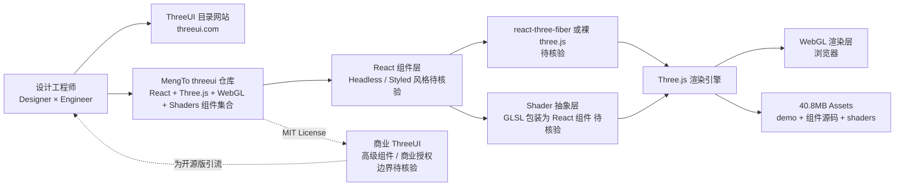

# MengTo/threeui

## 一句话定位
MengTo 把自家商业版 ThreeUI 工具的"Community 目录"开源——一组可在浏览器内 live 交互的 Three.js UI 组件，附带完整组件源码，主题围绕 react / shaders / threejs / webgl，是"商业设计工具 + 开源社区版"分发模式的 2026 最新样本。

## 它解决的问题
Three.js 是 WebGL / 3D / 沉浸式视觉的事实标准，但其 UI 组件生态远不及 React / Vue 成熟——做 shader 背景、3D 旋转卡片、轨迹动画时，工程师常常从零写 glTF 加载器 + uniforms + 材质着色器，效率极低。ThreeUI 的商业版本已经把这套工作流打包好，但闭源 + 收费 + 不能改。threeui（Community 版）把"live 交互组件 + 完整源码"开放，把商业产品的"设计参考价值"和开源版的"可 fork / 可改"价值合并——10 天 4,775⭐ / 473 forks 是对该路径的强信号。

## 为什么值得关注（2026-09-01）
- **10 天 4,775⭐**：处于"早期爆发"阶段，是 9-01 当日 Trending / 高星段中的代表样本
- **473 forks / 4,775⭐ ≈ 9.9% fork/star 比**：明显高于个人项目 5-8% 水平，说明有大量"试用 + fork 自己改"用户
- **Topics 完整覆盖三大技术栈**：react / shaders / threejs / webgl / ui-components——把定位直接写在 metadata 上
- **40.8MB** 含完整 assets（demo + 组件源码 + shaders），不是"空骨架"仓库
- **MIT License**：可商用、可二次发布
- **MengTo 个人品牌背书**：avocode 创始人 / sketch.systems 创始人——设计工具行业有真实号召力
- **pushed 2026-08-31**：活跃度高，仍在持续维护

## 热度来源判断
**真实热度（商业设计工具 × 开源社区版 × 设计工程师群体刚需）。** Three.js 在 2026 下半年是 Web 3D / 沉浸式 UI / Generative UI 的基础设施，但 UI 组件生态分散（react-three-fiber 仅底层封装，shaders 需要手写 GLSL）。threeui 把"常用 UI 模式 + 完整 shader 代码 + live demo"打包给设计工程师群体，是被低估的"中间层"刚需。473 forks 的高 fork/star 比（≈10%）是"试用 + 改"模式的明确证据——这与个人开发者项目 5-8% 水平差异显著。

## 关键技术亮点
1. **Three.js + React + WebGL + Shaders 四栈整合**——topics 明示，与 ThreeUI 商业版同技术栈
2. **Live 交互组件 + 完整源码**——README 明示"complete Community source"，非 mock/demo
3. **ThreeUI 商业版"开源镜像"模式**——商业版本提供高级组件 / 商业授权；Community 版覆盖 80% 通用场景
4. **Shaders 抽象层**——把 GLSL shader 用 React 组件形态包装，降低 WebGL 入门门槛
5. **WebGL 性能基线**——通过统一组件抽象避免每个项目重写性能优化代码
6. **配套目录网站（homepage https://threeui.com）**——live 预览 + 组件索引

## 架构师速览

| 决策问题 | 研究判断 | 证据边界 |
|---|---|---|
| 系统边界 | React 组件库 + Three.js 引擎 + Shaders 抽象层 + WebGL 渲染层 + 目录网站 | 五大要素是 topics + description 明示；具体组件 API 风格（headless vs styled）、shaders 抽象层细节需源码核验 |
| 主路径 | 用户访问目录网站 → 预览 live 组件 → fork 仓库或 npm install → 改源码 → 集成到自有 React 项目 | 主路径是 README 描述；具体 npm 包名、安装命令、目录导航 UX 需 README 独立核验 |
| 关键权衡 | 开源组件覆盖度 vs 商业版独家组件 vs 资产大小（40.8MB）vs 浏览器渲染性能 vs React 锁定 vs 商业版授权边界 | 40.8MB 来自 API；商业版 vs Community 版边界、独家组件列表、商业授权条款需读 LICENSE 与官网 |
| 最小 PoC | 准备一个 React 项目 → npm install threeui（假设包名，需核验）→ 集成 1 个 threejs 组件（如旋转立方体 / shader 背景）→ 验证浏览器渲染性能 → 对比纯 threejs 自己写的代码量减少 | 最小 PoC 范围由"先单组件 + 最小集成 + 性能基线"推导；具体包名、安装命令、组件列表需 README 独立核验 |

## 架构启发
threeui 的核心启发是 **"商业设计工具 + 开源社区版"是新分发策略**。2026 下半年这一模式在多个项目同时出现（Plasmic / Builder.io / animate-ui / threeui 等），背后逻辑一致：商业产品需要流量与社区，开源版本提供"参考实现 + 80% 通用功能 + fork + 改"，高级功能 / 企业授权 / SLA 留给商业版。这是"开源 + 商业双轨"在 AI 工具时代的现代演绎。三个延伸启发：(1) 设计工程师群体（design engineers）成为关键受众——他们既懂代码又懂设计，是商业工具 + 开源版本的主要消费者；(2) Web 3D / 沉浸式 UI / Generative UI 在 2026 下半年进入"UI 组件标准化"窗口——threejs / WebGPU / ShaderToy 等底层成熟后必然出现 UI 组件库；(3) 40.8MB 资产包分发需要 CDN 友好——threeUI 通过官网目录 + GitHub Releases 解决下载体验。

## 架构图（MMD）

> 证据边界：此图只采用本档案已有可核验描述；"待核验"节点不应视为项目实现事实。

## 定位判断
**设计工程师群体的 Three.js UI 中间件候选。** threeui 不是"另起炉灶"的 UI 库，而是把商业 threeUI 的 80% 通用场景开源化——其定位类似 Tailwind CSS 之于传统 CSS、shadcn/ui 之于传统组件库。在 Three.js 生态中，react-three-fiber 解决了"用 React 思维写 three.js"的问题，但 UI 组件级抽象仍空白——threeui 恰好填补这一空白。10 天 4,775⭐ / 473 forks 的 fork/star 比（≈10%）说明它不仅是关注热度，更有真实"试用 + 改"用户。能否长期稳态，取决于：(1) 商业版 vs Community 版边界是否清晰；(2) 组件更新频率是否持续；(3) 是否被 Three.js 主流教程 / 文档收录。

## 风险 / 局限 / 泡沫点
- **商业版 vs Community 版边界模糊**：商业 ThreeUI 的"独家组件 / 商业授权 / 高级功能"边界需读 LICENSE 与官网核验；开发者 fork 后可能发现关键功能在闭源版
- **40.8MB 资产自托管网络成本**：完整 fork 后自托管需考虑 CDN / 带宽成本
- **React 锁定**：组件基于 React，Vue / Svelte / Solid 用户需自己包装
- **设计组件评价高度主观**：UI 美学没有客观基准，"质量"难以量化评估
- **依赖 Three.js / WebGL 生态演进**：若 WebGPU 全面替代 WebGL，需要底层重写
- **MengTo 个人维护风险**：核心维护仍集中在创始人个人，长期治理结构未公开
- **License 风险**：MIT 友好，但商业版 vs Community 版的具体边界（如"不能包含商业版独家组件"等条款）需读 LICENSE 确认

## 与同类项目的关系
- **vs react-three-fiber（pmndrs）**：r3f 是"用 React 写 three.js 的底层封装"；threeui 是"在 r3f 之上的 UI 组件库"——互补而非竞争
- **vs shadertoy / glsl-canvas**：那些是"shader playground"；threeui 是"集成到 React 项目中的 UI 组件"
- **vs drei（@react-three/drei）**：drei 是"three.js 通用 helpers（控制器 / loader / 环境）"；threeui 是"UI 组件库"
- **vs ThreeUI 商业版**：threeui Community = 商业版开源镜像；高级组件 / 商业授权 / SLA 在商业版
- **vs plasmic / builder.io / animate-ui**：都是"商业设计工具 + 开源版本"模式，threeui 是 3D / WebGL 领域的同类样本

## 是否值得持续跟踪
**值得跟踪（商业设计工具 + 开源社区版分发模式 + 设计工程师群体）。** 10 天 4,775⭐ / 473 forks 的数据点证明该路径在 2026 下半年有强需求。建议关注：① 商业版 vs Community 版边界是否清晰；② 组件更新频率与社区贡献活跃度；③ Three.js 主流教程 / 文档是否收录 threeui；④ 设计工程师群体采用规模变化（fork/star 比是核心信号）。对 Web 3D / 沉浸式 UI / Generative UI 开发者，这是"必备工具箱"——直接试用即可；对设计工具行业观察者，这是"商业 + 开源双轨"在 3D 领域的最新样本，值得持续观察。

## 后续观察点
- 商业版 vs Community 版的边界文档化（具体哪些组件仅商业版、商业授权条款）
- 组件更新频率与社区贡献者结构（是否出现除 MengTo 外的活跃贡献者）
- Three.js 主流教程 / 文档（three.js docs / Bruno Simon portfolio / Codrops 等）是否收录 threeui
- npm 包下载量与设计工程师群体采用规模（npm trends / GitHub forks 增量）
- WebGPU 替代 WebGL 时 threeui 的迁移策略
- 是否出现"threeui for Vue / Svelte / Solid"的 fork（验证设计工程师群体规模）

---
*首次记录：2026-09-01*
