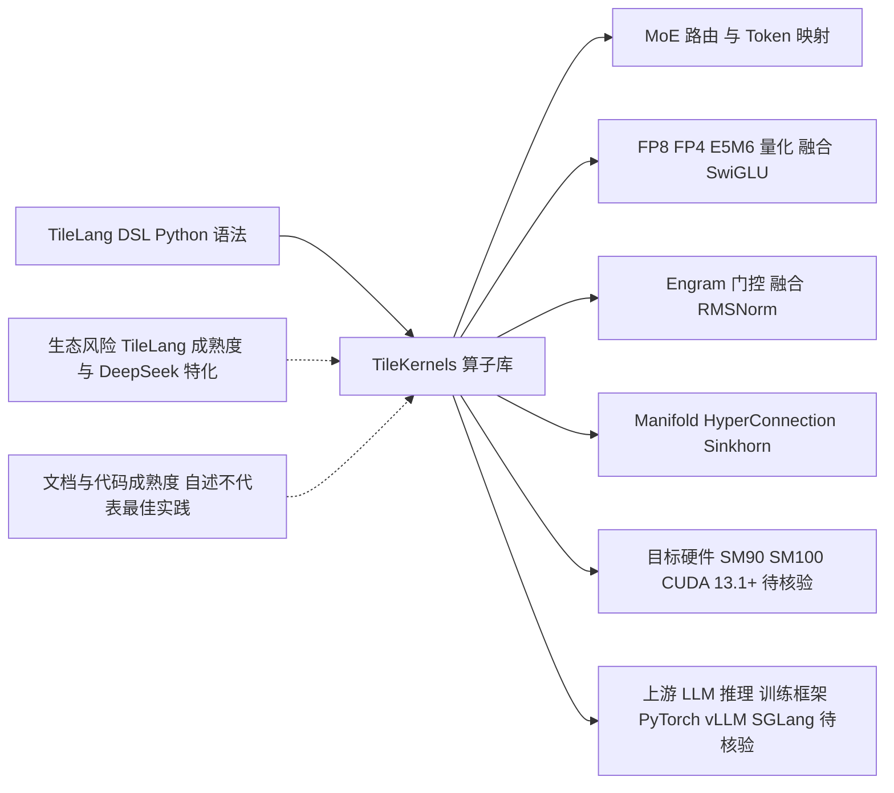

# TileKernels

## 一句话定位
DeepSeek 开源的 LLM 底层 GPU 算子库，用 TileLang DSL 构建，覆盖 MoE 路由、量化、Engram 门控和 Manifold HyperConnection。

## 它解决的问题
LLM 训练和推理中的 GPU 算子优化一直是黑箱 — 要么用 cuBLAS/cuDNN 等通用库（性能未针对性优化），要么手写 CUDA kernel（门槛极高）。TileKernels 提供了第三个选择：用 Python 级别的 TileLang DSL 表达算子逻辑，自动优化到接近硬件极限。

目标用户：LLM 推理/训练框架开发者、GPU 算子工程师、AI 基础设施团队。

## 为什么值得关注（2026-05-04）
- DeepSeek 出品，代码已在内部训练和推理场景中验证
- 暴露了 DeepSeek 在 MoE 架构上的底层优化方向
- TileLang 本身是一个值得关注的新 DSL — 用 Python 写 GPU kernel
- 涵盖了当前 LLM 最热门的底层优化方向（MoE、量化、Engram、MHC）

## 热度来源判断
真实技术价值驱动。DeepSeek 品牌效应 + 实际有用的算子 + TileLang 新范式 = 三重吸引力。1.4K stars / 117 forks 的比例健康。

## 关键技术亮点亮点

1. **TileLang DSL** — 用 Python 语法写 GPU kernel，自动优化，降低算子开发门槛
2. **MoE 全栈算子** — 从 Top-k 专家选择到 Token-to-expert 映射到融合扩展/约减，覆盖 MoE 推理全链路
3. **多精度量化** — FP8/FP4/E5M6 量化 + 融合 SwiGLU+量化，面向下一代硬件
4. **Engram 门控** — 融合 RMSNorm 的门控内核，前向/后向传播全覆盖
5. **Manifold HyperConnection** — Sinkhorn 归一化 + 混合拆分/应用，暗示新架构探索

## 架构师速览

| 决策问题 | 研究判断 | 证据边界 |
|---|---|---|
| 系统边界 | TileKernels 是 DeepSeek 维护的 LLM 底层 GPU 算子库，基于 TileLang DSL，定位在框架开发者与硬件之间，目标硬件为 SM90/SM100（CUDA 13.1+）。 | 项目自述、tags（gpu-kernels、tilelang）、风险段；具体入口 API 与构建产物未在档案中给出。 |
| 主路径 | TileLang DSL（Python 语法）→ 编译生成 GPU kernel → 覆盖 MoE 路由、FP8/FP4/E5M6 量化、Engram 门控（含 RMSNorm 融合）、Manifold HyperConnection（Sinkhorn 归一化）等算子，供 LLM 训练/推理框架调用。 | 项目"关键技术亮点"与"架构启发"段；运行时调用关系、调度与持久化细节档案未证。 |
| 关键权衡 | 三组权衡：在 TileLang 表达力 vs. 成熟 CUDA 生态之间；在 DeepSeek 内部特化（MoE/Engram/MHC）vs. 通用算子覆盖之间；在 SM90/SM100 高门槛 vs. 下一代硬件前置优化之间。 | 自述硬件要求、DeepSeek 特化、DSL 依赖；性能数据档案未提供。 |
| 最小 PoC | 在 SM90/SM100 + CUDA 13.1+ 环境下，编译 TileLang DSL 子集，验证单类算子（建议优先量化或 MoE 路由），确认可被 PyTorch/推理框架调用并产出与参考实现一致的数值。 | 档案未提供 benchmark 数字或示例代码，"待核验"具体接口与版本。 |

## 架构启发

TileKernels 揭示了一个重要趋势：LLM 底层算子正在从"通用库 + 手写 kernel"的两极分化，走向"DSL 表达 + 自动优化"的中间路线。TileLang 就是这个中间路线的载体。

对架构师的启发：
- **算子即架构** — 从 TileKernels 提供的算子类型（Engram、MHC）可以反推 DeepSeek 的模型架构方向
- **DSL > CUDA** — 用 Python 级别的表达力写 GPU kernel，开发效率远超手写 CUDA
- **硬件约束前置** — SM90/SM100 要求说明这些算子是为下一代 GPU 设计的

## 架构图（MMD）

> 证据边界：此图只采用本档案已有可核验描述；“待核验”节点不应视为项目实现事实。

## 定位判断
LLM 底层算子生态的基础设施层。如果 TileLang 生态成熟，TileKernels 可以成为类似 cuDNN 之于深度学习的角色 — 不是面向最终用户的，而是面向框架开发者的。

## 风险 / 局限 / 泡沫点

1. **硬件门槛高** — SM90（H100）/ SM100（B200）+ CUDA 13.1+，绝大多数开发者无法直接使用
2. **生态锁定** — 依赖 TileLang DSL，如果 TileLang 生态不成熟则价值受限
3. **DeepSeek 特化** — 算子设计可能偏向 DeepSeek 自家模型架构（MoE/Engram），通用性存疑
4. **文档质量** — 自述"不代表最佳实践"，文档和代码质量仍在改进中

## 与同类项目的关系

| 项目 | 定位 | 优势 | 劣势 |
|------|------|------|------|
| TileKernels | DeepSeek LLM 算子库 | 内部验证、MoE 全栈、TileLang DSL | 硬件门槛高、DeepSeek 特化 |
| Triton (OpenAI) | 通用 GPU 编程语言 | 生态成熟、PyTorch 集成 | 不专注 LLM 算子 |
| CUTLASS (NVIDIA) | CUDA 模板库 | NVIDIA 官方、极致性能 | 开发门槛高、非 LLM 专用 |
| FlashAttention | 注意力算子 | 专注注意力、广泛集成 | 范围窄 |

## 是否值得持续跟踪
**是，高优先级。** TileKernels 和 TileLang 代表了 LLM 底层算子开发的新范式。关注它不仅能了解 DeepSeek 的技术方向，还能把握 GPU 算子生态的演进。

## 后续观察点

1. TileLang 生态发展 — 是否有更多项目基于 TileLang 构建
2. 社区贡献 — 是否有第三方为非 DeepSeek 模型贡献算子
3. 推理框架集成 — vLLM/SGLang 是否会集成 TileKernels
4. 下一版本算子 — DeepSeek 新模型架构会引入哪些新算子

---
*首次记录：2026-05-04*
