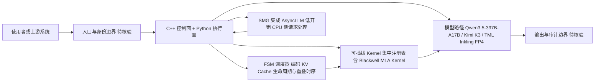

# TokenSpeed

## 一句话定位

LightSeek Foundation 维护的 "speed-of-light" LLM 推理引擎，专为 Agent 工作负载优化，目标性能对标 TensorRT-LLM，易用性对标 vLLM。

## 它解决的问题

当前 LLM 推理引擎要么性能强但难用（TensorRT-LLM），要么易用但性能不够（vLLM）。TokenSpeed 试图在两者之间找到平衡，特别针对 Agent 工作负载（多轮、长上下文、高并发）进行优化。已在 Qwen3.5-397B-A17B 上实现 580 TPS。

## 为什么值得关注

- **已加入 PyTorch Ecosystem**（2026/08），说明得到官方认可
- **Day 0 支持 Kimi K3 和 TML Inkling**（FP4 推理，NVIDIA + AMD），与前沿模型团队有合作
- 公开架构包含静态编译建模层、C++ 控制面 + Python 执行面、有限状态机调度器、可插拔 Kernel
- 拥有 Blackwell 上最快的 MLA（Multi-head Latent Attention）实现之一
- 580 TPS on Qwen3.5-397B-A17B for agentic workloads（2026/05 公布）

## 热度来源判断

- **技术实力驱动。** 1,823 stars 不算高，但 PyTorch Ecosystem 认可 + 前沿模型 Day 0 支持说明技术实力
- 热度来自推理基础设施社区和 Agent 工作负载优化的实际需求
- LightSeek Foundation 的运营模式（开源 + 模型合作）带来持续关注

## 关键技术亮点亮点

1. **静态编译建模层**：local-SPMD 设计，从模块边界放置标注自动生成集合通信，用户无需手写并行逻辑
2. **FSM 调度器**：C++ 控制面 + Python 执行面，请求生命周期/KV Cache 所有权/重叠时序编码为有限状态机，编译时类型系统保证 KV 资源安全复用
3. **可插拔 Kernel 系统**：分层 Kernel 架构 + 集中注册表 + 可移植公共 API
4. **Blackwell 最快 MLA 实现之一**：针对 Agent 工作负载优化
5. **SMG 集成 AsyncLLM**：低开销 CPU 侧请求处理

## 架构师速览

| 决策问题 | 研究判断 | 证据边界 |
|---|---|---|
| 系统边界 | LightSeek 维护的 LLM 推理引擎（Python），公开组件含 C++ 控制面、Python 执行面、FSM 调度器、可插拔 Kernel、Blackwell MLA 路径；外部边界涉及上游模型（Qwen3.5-397B-A17B、Kimi K3、TML Inkling）与硬件（NVIDIA Blackwell、AMD FP4）。Preview 阶段，不建议用于生产。 | 组件名取自档案"关键技术亮点"与定位描述；具体接口与部署形态未由本档案证实。 |
| 主路径 | 请求进入 → C++ 控制面/FSM 调度器（管理请求生命周期与 KV Cache 所有权）→ Python 执行面调用可插拔 Kernel（含 Blackwell MLA Kernel）→ 通过 SMG 集成 AsyncLLM 做低开销 CPU 侧处理 → 输出结果；静态编译建模层（local-SPMD）从标注自动生成集合通信。 | 主路径基于"FSM 调度器 + 可插拔 Kernel + 静态编译建模层"叙述重组；时序与协议细节须源码核验。 |
| 关键权衡 | 在 vLLM 式易用性与 TensorRT-LLM 式性能之间取舍，并选择以 Agent 工作负载（多轮、长上下文、高并发）为一阶约束；代价是 Preview 阶段风险、模型/GPU 覆盖仍在合并、580 TPS 等性能数字未独立验证。 | 权衡取自档案"它解决的问题""风险/局限"两节；具体 SLO 与成本数据未提供。 |
| 最小 PoC | 限定单模型（优先 Qwen3.5-397B-A17B，单卡 Blackwell）、单 Agent 多轮会话、固定工具集；验收项：可复现 580 TPS 量级（待第三方复现对比 vLLM/TensorRT-LLM/SGLang）、KV Cache 复用正确性、FP4 路径在 AMD/NVIDIA 行为差异、退出路径与稳定性观察。 | PoC 范围受"Preview 不建议生产""性能未独立验证""Hopper/Blackwell/AMD 行为差异待观察"约束；具体基准方法未在档案中给出。 |

## 架构启发

TokenSpeed 的架构对推理基础设施研究有参考价值：**FSM 化的调度器设计**（将 KV Cache 生命周期管理编码为类型安全的有限状态机）和**静态编译的并行策略**（从标注自动生成集合通信）是两个值得借鉴的工程模式。对 Agent 推理基础设施而言，多轮长上下文场景下的 KV Cache 管理是核心瓶颈。

## 架构图（MMD）

> 证据边界：此图只采用本档案已有可核验描述；“待核验”节点不应视为项目实现事实。

## 定位判断

**基础设施候选。** README 明确标注当前版本为 Preview，不建议用于生产。但技术方向正确，已获 PyTorch Ecosystem 认可。

## 风险 / 局限 / 泡沫点

1. **Preview 阶段** — README 明确提示不要用于生产部署
2. **性能声明未独立验证** — 580 TPS 等数据来自项目自身，需第三方复现
3. **模型覆盖和 GPU 平台优化仍在持续合并**
4. **竞争激烈** — vLLM、TensorRT-LLM、SGLang 都在快速演进
5. 1,823 stars 相对较低，社区规模待增长

## 与同类项目的关系

- **vLLM**：易用性标杆，TokenSpeed 以同等易用性 + 更高性能为目标
- **TensorRT-LLM**：性能标杆，TokenSpeed 以同等性能 + 更好易用性为目标
- **SGLang**：同为 Agent 工作负载优化的推理引擎，直接竞争
- **PyTorch Ecosystem**：TokenSpeed 已加入，获得生态背书

## 是否值得持续跟踪

**是。** Agent 工作负载专用推理引擎是确定性需求，TokenSpeed 技术方向和生态合作（PyTorch、Kimi、TML）都值得关注。

## 后续观察点

1. 是否发布稳定版本与兼容性承诺
2. 是否出现可复现的第三方端到端基准（对比 vLLM / TensorRT-LLM / SGLang）
3. 调度器、KV Cache 和 MLA Kernel 在多轮 Agent 负载中的实际收益
4. Hopper、Blackwell 与 AMD 平台之间的行为差异
5. 更多前沿模型的 Day 0 支持
