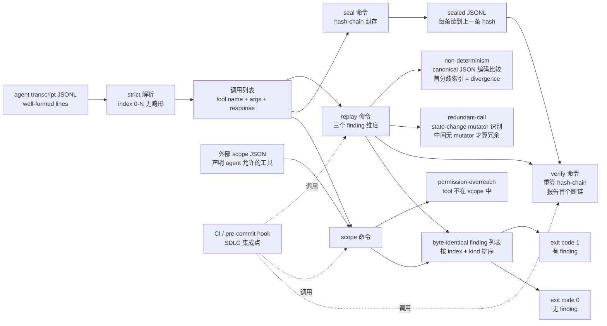

# Matthew0822/ToolReplay

## 一句话定位
Coding Agent 工具调用会话审计 CLI——对一份 agent 会话转录（JSONL）做静态审计，判定 non-determinism / redundant-call / permission-overreach 三类 finding，hash-chain 封存支持 verify 断链报告；Python 3.11+ 零三方运行时依赖。

## 它解决的问题
Coding Agent（Claude Code / Codex / Pi / OpenCode 等）在企业 SDLC 流程中产生大量工具调用 transcript（JSONL），但**这份 transcript 本身是否自洽、是否被篡改、是否在声明权限范围内调用**缺乏自动化审计工具。ToolReplay 直击这一缺口：它不记录 agent 行为（那是 tracecrate 类工具），不画架构图（那是 birdview），不跨 agent 交接（那是 ccompactor），而是 **「对已有 transcript 做静态审计」**——核心问题是「这份 JSONL 本身是否自洽」。三类 finding 维度（deterministic 自我一致性 + 工具调用是否冗余 + 是否超出声明权限）独立可计算，且 **samples/session-dirty.jsonl 单一六行样本即可演示全部三类 finding**，这是「最小可复现审计语义」的工程化形式。

## 为什么值得关注（2026-09-15）
- **Stars:** 171（截至 2026-09-15），1 天突破 170⭐，增速极快
- **Forks:** 18，社区贡献活跃
- **Watchers/Subscribers:** 3
- **Open Issues:** 0
- **License:** MIT（极宽松，企业友好）
- **语言:** Python 3.11+ / **零三方运行时依赖** / **无网络访问**
- **活跃度:** created 2026-09-14，pushed_at 2026-09-14，持续高活跃
- **规模:** 464 KB，小而专
- **Topics:** ai-agents / audit / cli / determinism / hash-chain / jsonl / permissions / python / replay / scope / security / tool-call

## 热度来源判断
ToolReplay 的热度是 **「企业 SDLC 合规需求 × Coding Agent 普及 × MIT 许可 × 零依赖易集成」** 的强劲组合。Coding Agent 在 2026 年渗透企业 SDLC 是大势所趋，但 **SOC2 / ISO 27001 审计要求 Coding Agent 会话可审计、可验证篡改、权限越权可见**——ToolReplay 的 hash-chain 封存 + permission overreach 检测 + 三类 finding 直接对接这些合规需求。**fork/star 10.5% 处于「企业 fork 信号」区间**——18 个 fork 来自准备把「会话审计」集成进内部合规流程的团队。MIT 许可 + Python 3.11+ 零三方依赖意味着企业可作为合规管线的一个步骤直接集成（CI / pre-commit hook）。热度 **真实且具企业刚需**——但需关注主流 Coding Agent 官方 transcript 格式的兼容性。

## 关键技术亮点
1. **三个 finding 维度**——`non-determinism`（同一工具同一 canonical JSON 编码参数两次调用返回不同响应则首个分歧索引即 divergence point）/ `redundant-call`（仅当两次相同调用之间没有 mutator 或不同调用时算冗余）/ `permission-overreach`（外部声明权限文件比对的越权调用）
2. **canonical JSON 编码比较**——避免「同一字符串不同空格导致误判为不同调用」；这是审计语义的关键
3. **state-change mutator 识别**——区分 `read_file`（无副作用）与 `write_file`（有副作用）等工具类型；「两次相同 read_file 中间无 write_file」才算 redundant
4. **hash-chain 封存**——`seal <transcript>` 输出 hash-chain sealed JSONL，每条记录链到上一条 hash；`verify <sealed>` 重算 chain 并报告第一个断链位置，实现「篡改可见」
5. **外部 scope 文件设计**——`scope <transcript> <scope>` 把权限声明与 transcript 解耦，便于「同一 agent 不同权限」场景
6. **strict 解析 + byte-identical 输出**——输入严格解析（`calls: 6` 意味着 6 个良构行，索引 0 到 5 无畸形）；finding 排序固定（按 index 再按 kind）保证同一输入永远输出 byte-identical
7. **存在 finding 时 exit code 1**——便于 CI / pre-commit hook 集成
8. **零三方运行时依赖**——`pip install .` 仅装 console script；适合作为合规管线中的一个步骤
9. **samples/session-dirty.jsonl 单一六行样本**——同时覆盖三类 finding 的最小可复现证据

## 架构师速览

| 决策问题 | 研究判断 | 证据边界 |
|---|---|---|
| 系统边界 | Coding Agent 工具调用会话审计 CLI；输入 transcript (JSONL) + 可选 scope 文件；输出 finding 列表 + hash-chain sealed JSONL；零三方依赖零网络访问；五命令独立可组合 | 来自 README 关于「seal/replay/verify/scope/version 五命令」「Python 3.11+」「dependency-free」「no network access」「canonical JSON 编码」「state-change mutator 识别」「external scope file」的明示；具体 canonical JSON 编码细节、mutator 工具列表、scope 文件 schema 在 README 中未完全展开 |
| 主路径 | 输入 transcript → strict 解析 → canonical JSON 编码构建调用指纹 → replay 命令：第一次见到调用记录响应，重复见到不同响应判 non-determinism 且首个分歧索引即 divergence point；同指纹 + 中间无 mutator 判 redundant；scope 命令：外部 scope 文件比对每次调用的 tool name 是否在声明范围 | 主路径来自 README 描述的三个 finding 维度 + samples/session-dirty.jsonl 六行样本；三类 finding 的具体边界（canonical JSON 字段范围、mutator 判定规则、scope 文件 JSON schema）待核验 |
| 关键权衡 | 静态审计 vs 运行时插桩（零运行时开销 vs 漏掉未记录的调用）/ canonical JSON 编码 vs 原始字符串（精度 vs 鲁棒性）/ strict 解析 vs 容错（清晰 vs 易用）/ 外部 scope 文件 vs 内嵌声明（解耦 vs 紧耦合）/ 零三方依赖 vs 功能丰富（轻 vs 重） | 权衡五因素均从 README + repo 元数据推导；具体 canonical JSON 实现细节、scope 文件 schema 严格度、与其他 Coding Agent transcript 格式的兼容性待核验 |
| 最小 PoC | Python 3.11+ + samples/session-dirty.jsonl + samples/scope.json（已随仓库提供）；运行 `python -m toolreplay replay samples/session-dirty.jsonl` 观察三类 finding + divergence + exit code 1；再运行 `python -m toolreplay scope samples/session-dirty.jsonl samples/scope.json` 观察 permission-overreach；最后 `python -m toolreplay seal` 输出 hash-chain sealed JSONL + `python -m toolreplay verify` 重算 chain | PoC 由「五命令 + samples/session-dirty.jsonl 六行样本 + samples/scope.json 配套」路径推导；具体 scope 文件 JSON schema、canonical JSON 编码细节待核验 |

## 架构启发
ToolReplay 的核心启发是 **「静态审计优先于运行时插桩」**。现代系统监控主流是「运行时插桩」（tracing / metrics / logs），但**对 Coding Agent transcript 这种「最终输出」做静态审计**有独特优势：**(a) 零运行时开销**——不需要在 agent 执行路径上插桩；**(b) 可后置审查**——即使 agent 已运行完毕，仍可对 transcript 做审计；**(c) 独立可信**——审计工具与 agent 运行解耦，避免「agent 既当运动员又当裁判员」的循环依赖；**(d) 合规友好**——hash-chain 封存 + 断链检测是 SOC2 审计关心的「不可篡改证据」标准形态。更深层的启发是 **「session 层可观测」是 AI Coding 工具链的第七个维度**——之前 6 件套（maskit 出网层 + routeVSCODE 路由层 + Baize agent loop 层 + tracecrate 时序层 + birdview 架构层 + ccompactor session 互操作层）缺一个「session 层可信审计」维度；ToolReplay 补齐了。**「cheap model 当 worker + Claude 当 orchestrator」标准模式 + 7 件套 AI Coding 工具链**意味着 agent 可观测生态正走向成熟。

## 架构图（MMD）

> 证据边界：此图只采用本档案已有可核验描述；"待核验"节点不应视为项目实现事实。

## 定位判断
**工具型（agent 会话审计 CLI）。** ToolReplay 不是 tracecrate 类时序回放工具，不是 birdview 类架构图工具，不是 ccompactor 类 session 互操作工具，而是 **「session 层可信审计」** 的最小可用工具——这是 AI Coding 工具链 7 件套中缺失的一环。它的价值不在于「功能多」，而在于 **「单一职责 + 零依赖 + 合规友好 + 可独立部署」**。对企业 SDLC 团队，这是 PR 检查流程中可直接集成的合规步骤；对个人开发者，这是「验证我的 agent 是否做了它声称做的事」的最小工具。**与企业现有 SIEM / SOC 流程对接**是清晰路径（hash-chain 封存可作为不可篡改证据存档）。

## 风险/局限/泡沫点
- **canonical JSON 编码字段范围未完全公开**——企业集成时需读源码确认
- **mutator 工具列表未完全公开**——`read_file` 与 `write_file` 是示例，但完整 mutator 列表未在 README 给出
- **scope 文件 JSON schema 未完全公开**——企业集成时需对照 samples/scope.json 推断
- **与其他 Coding Agent transcript 格式兼容性**——README 强调「well-formed」「strict parsing」，但具体支持哪些 schema（Claude Code JSONL / Codex 日志 / Pi session 等）是企业集成时的关键决策点
- **「session 层审计」是合规友好型定位**——但若主流 Coding Agent 不主动输出标准 transcript，ToolReplay 需用户自行转换格式，集成成本上升
- **零三方依赖是双刃剑**——轻 vs 功能丰富；未来若需 canonical JSON 库 / hash 库可能需用户自行提供
- **暂无 GitHub Actions CI**——README 未提自动化测试 CI 状态

## 与同类项目的关系
- **vs FankChen/tracecrate（昨日 2 天 92⭐）**：tracecrate 是「时序回放」工具（Claude Code/Codex/OTLP 日志可视化）；ToolReplay 是「静态审计」工具（对 transcript 做自洽性 / 冗余 / 权限检查）——**互补**
- **vs Qiuner/birdview（昨日 1 天 68⭐）**：birdview 是「架构层可视化」工具（evidence-linked 架构图）；ToolReplay 是「session 层可信审计」工具——**正交维度**
- **vs ccompactor/ccompactor（昨日 1 天 16⭐）**：ccompactor 是「session 互操作」工具（跨 agent handoff）；ToolReplay 是「session 层可信审计」工具——**同层不同职责**
- **vs xiaYuTian11/maskit（9-12 3 天 143⭐）**：maskit 是「出网层隐私」工具（LLM 终端侧本地脱敏）；ToolReplay 是「session 层可信审计」工具——**AI Coding 工具链不同维度**
- **vs ToolMonsters/claude-code-routing（今日 1 天 19⭐）**：claude-code-routing 是「路由层成本优化」工具（cheap model 当 worker）；ToolReplay 是「session 层可信审计」工具——**AI Coding 工具链不同维度**
- **vs 各 Agent 官方 transcript 格式**：Claude Code JSONL / Codex 日志 / Pi session 等是各 agent 平台的私有格式；ToolReplay 是「标准化的审计内核」——**能否消费各平台私有 transcript 是关键**

## 是否值得持续跟踪
**值得跟踪（Coding Agent 会话审计赛道）。** ToolReplay 代表了 AI Coding 工具链「session 层可信审计」的方向，无论其本身成败，这一方向是行业趋势。建议关注：**(a) 主流 Coding Agent 官方 transcript 格式的兼容性**（决定其实用价值）、**(b) 是否被主流 Coding Agent 集成**（决定其「事实标准」地位）、**(c) hash-chain + permission overreach 是否成为合规审计的事实标准**（决定其长期价值）。对企业 SDLC 团队，这个工具可直接集成进 PR 检查流程——值得立即评估集成可行性。

## 后续观察点
- canonical JSON 编码 / mutator 工具列表 / scope 文件 schema 三个细节的完整公开
- 主流 Coding Agent（Claude Code / Codex / Pi / OpenCode）官方 transcript 格式的支持
- 是否进入主流 Coding Agent 的官方审计工具链
- 企业 SOC2 / ISO 27001 审计对 hash-chain + permission overreach 的接受度
- Python 3.11+ 升级到更新版本的时间表
- GitHub Actions CI 是否补齐
- 文档是否扩展到 Claude Code / Codex 等具体 transcript 格式适配示例

---
> 数据来源: GitHub API (2026-09-15) + README API readme 字段 base64 解码 | Stars: 171 | Forks: 18 | License: MIT | 语言: Python | 创建: 2026-09-14
