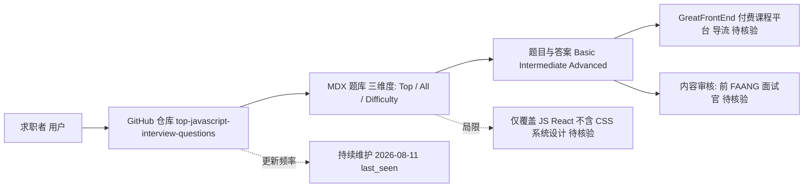

# greatfrontend/top-javascript-interview-questions — 前端面试题权威题库

## 一句话定位
由 GreatFrontEnd 团队维护的高质量 JavaScript 前端面试题题库，收录数百道精选题目及高质量答案，2026 年持续更新，被前端社区广泛视为面试准备的权威参考资源。

## 它解决的问题
前端面试题散落在 LeetCode、牛客网、各种博客和个人 GitHub 仓库中，质量参差不齐，答案常过时或不准确。开发者准备面试时面临"信息碎片化、答案不可靠、覆盖面不全"三大痛点。更关键的是，前端技术栈快速演进（ES2024+ 特性、React 19、Server Components），旧题库很快失效。top-javascript-interview-questions 解决的是：**提供一套由前 FAANG 面试官审核、结构化组织、持续更新的面试知识库**。题目按重要性（Top Questions）、全面性（All Questions）和难度（Basic/Intermediate/Advanced）三维度组织，兼顾"快速复习"和"系统学习"两种场景。

## 为什么值得关注（2026-08-11）
- **Stars:** 9,905，接近万星，前端领域头部资源库
- **Forks:** 517，社区贡献和二次整理活跃
- **活跃度:** created 2024-06-10，pushed 2026-08-11（今天仍在更新），维护极其活跃
- **规模:** 3,294 KB 仓库大小，内容体量大
- **Topics:** front-end-development, interviews, javascript, javascript-interview-questions, react, reactjs, web-development
- **Open Issues:** 0，维护质量高
- **背书:** GreatFrontEnd 是知名前端教育平台，内容由前 FAANG 面试官审核

## 热度来源判断
热度来自 **"刚需 × 高质量 × SEO 流量 × 品牌信任"** 的经典组合。面试准备是前端开发者的绝对刚需——每年数百万开发者求职，JavaScript 面试题搜索量巨大。GreatFrontEnd 作为品牌方提供的内容，天然比个人仓库更有信任度。MDX 格式使其在 GitHub 上展示美观，同时利于 SEO（搜索"JavaScript interview questions"时排名靠前）。热度**真实且持续**——面试是年复一年的刚需，不像热点工具会冷却。517 forks 反映用户将其作为个人复习笔记的基础。

## 关键技术亮点
1. **三维度组织体系:** Top Questions（最高频）→ All Questions（全面覆盖）→ By Difficulty（难度分层），适配不同学习阶段
2. **答案分级展示:** 每题提供精简答案 + 链接到详细版答案，兼顾快速浏览和深度学习
3. **MDX 内容格式:** Markdown + 组件能力，支持交互式代码示例和富文本展示
4. **持续 2026 更新:** 跟踪 ES2024+ 新特性、React 19 等最新面试趋势
5. **涵盖 React 生态:** 除纯 JS 外覆盖 React 相关面试题，适应前端岗位实际需求
6. **难度标注:** 每题标注 Basic/Intermediate/Advanced，帮助候选人评估自身水平

## 架构师速览

| 决策问题 | 研究判断 | 证据边界 |
|---|---|---|
| 系统边界 | 作为 MDX 内容仓库，本项目边界即"GitHub 静态内容托管层"，无独立运行时服务、后端或数据库；外部边界仅有 GitHub 平台与 GreatFrontEnd 付费平台导流。 | 档案仅声明语言 MDX、Stars 9.9K、Forks 517、未声明 License；未提供源码模块划分、构建工具链或部署形态。 |
| 主路径 | 主路径为"求职者访问仓库 → 阅读 MDX 题库（按 Top/All/Difficulty 三维度）→ 跳转 GreatFrontEnd 付费课程"，无用户态、交易态或领域状态机。 | "三维度组织"与"免费引流→付费订阅"闭环见档案"架构启发"段；具体跳转链路、UTM 与转化漏斗未披露。 |
| 关键权衡 | 内容质量/审核深度 vs 更新频率/覆盖广度的权衡；JavaScript/React 纵深 vs 多维度（CSS/系统设计/行为面）广度的权衡。 | 权衡结论来自档案"风险/局限"段中"答案主观性""覆盖范围有限""时效性挑战"三项；无量化数据。 |
| 最小 PoC | 最小验证为"抽取 5 道 Basic/Advanced 题目，用 ES2024+/React 19 现行规范人工核对答案准确性"，而非 PoC 服务或部署。 | 档案无构建/运行命令、无 CI 配置；PoC 仅能在内容质量维度定义，架构 PoC 待核验。 |

## 架构启发
作为一个资源型项目，其核心架构价值不在代码而在**内容组织策略**。三维度分类（重要性 × 全面性 × 难度）是一种高效的知识管理范式，可迁移到任何"知识库"类项目。更深层的是，它展示了**开源内容项目的商业模式**：高质量免费内容获取流量和信任 → 引导到 GreatFrontEnd 付费平台（premium 订阅）→ 形成商业闭环。这是 GitHub 开源 + SaaS 商业化的经典路径。

## 架构图（MMD）

> 证据边界：此图只采用本档案已有可核验描述；“待核验”节点不应视为项目实现事实。

## 定位判断
**资源型项目。** 作为前端面试准备的参考知识库，定位清晰且有价值。不具平台化或基础设施潜力，但在其垂直领域（前端面试教育）是头部资源。商业价值在于为 GreatFrontEnd 平台导流。对个人开发者而言是实用工具，对前端教育市场而言是竞争性内容资产。

## 风险 / 局限 / 泡沫点
- **商业引流属性:** 本质是 GreatFrontEnd 付费产品的引流内容，免费部分可能是有意截断的"钩子"
- **答案主观性:** 面试题答案无唯一正确解，"高质量"取决于审核者个人判断
- **覆盖范围有限:** 聚焦 JavaScript/React，不覆盖 CSS、系统设计、行为面试等其他维度
- **时效性挑战:** 前端技术迭代快，题库需持续更新否则过时（目前维护良好）
- **可替代性高:** 类似题库众多（Yangshun 的 tech-interview-handbook 等），差异化主要靠品牌

## 与同类项目的关系
- **vs Yangshun/tech-interview-handbook:** 更全面（覆盖算法、系统设计），但 JS 深度不如本项目
- **vs yangshun/front-end-interview-handbook:** 同作者的姊妹项目，本项目是其 JavaScript 部分的升级版
- **vs LeetCode:** LeetCode 聚焦算法编码，本项目聚焦概念问答
- **vs 牛客/掘金面经:** 中文社区面经更贴近国内市场，本项目更偏国际/FAANG 视角
- **vs GreatFrontEnd 付费课程:** 本仓库是免费引流内容，付费课程提供更系统的视频+练习

## 是否值得持续跟踪
**中等优先级。** 作为实用资源值得收藏使用，但作为研究对象其技术含量有限。值得关注的是其内容运营策略——如何通过 GitHub 开源内容构建品牌和引流。对前端教育创业者，这是值得研究的开源内容营销样本。

## 后续观察点
1. Star 数是否突破 10K 里程碑（即将达成）
2. 是否扩展到 CSS、系统设计、算法等其他面试维度
3. GreatFrontEnd 平台的商业转化效果（付费用户增长）
4. 是否推出多语言版本（中文、日文等国际化内容）
5. AI 辅助面试准备工具是否会冲击传统题库模式

---
> 数据来源: GitHub API (2026-08-11) | Stars: 9,905 | Forks: 517 | License: 未声明 | 语言: MDX | 创建: 2024-06-10
